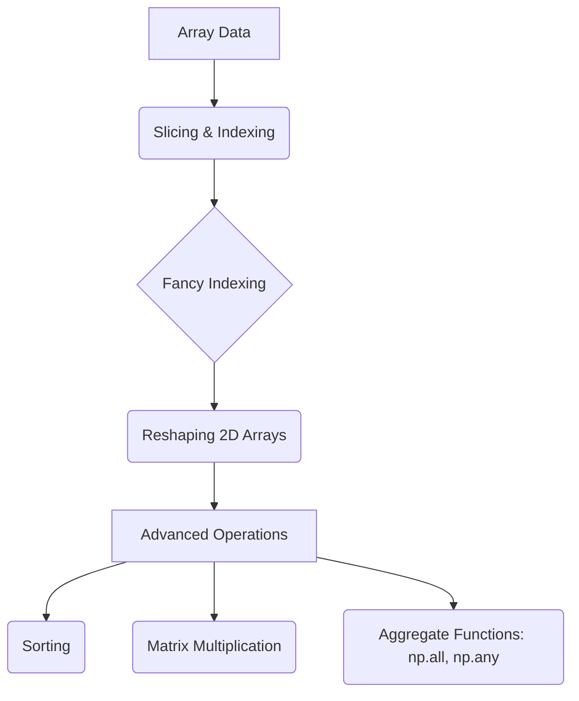
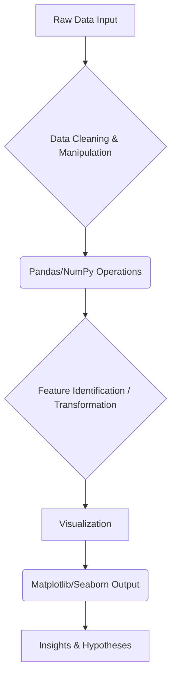
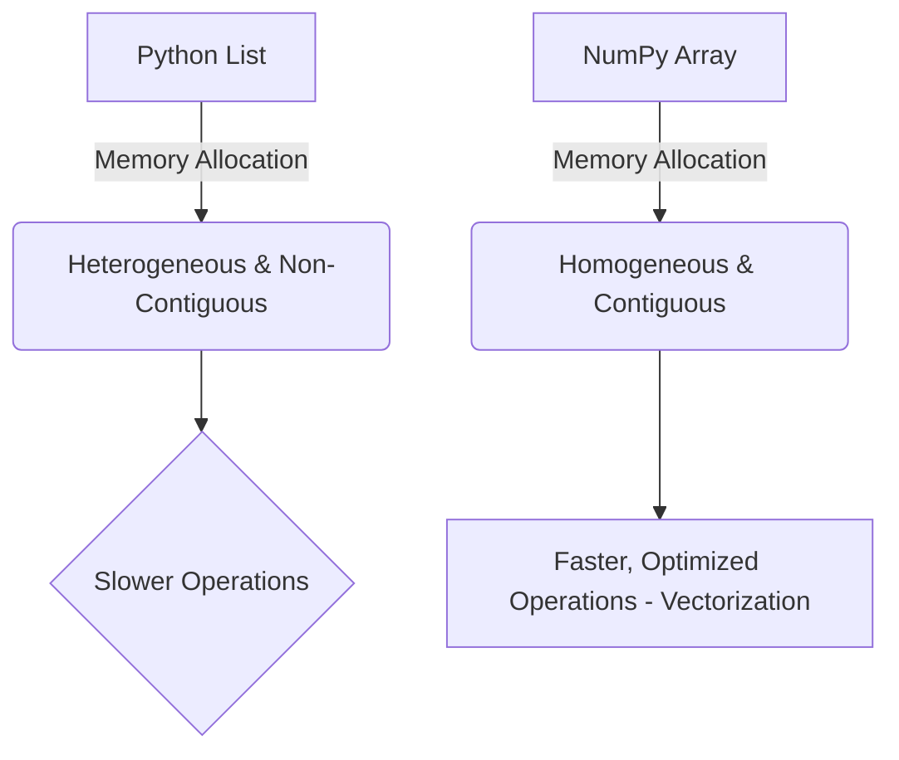

# live captions 20260611 214747


## Data Operations: Finding Array Indices using NumPy

*   To determine the index position of a specific value within a NumPy array, use the `np.where()` function.
*   The syntax involves comparing the entire array to the target value and passing this boolean condition into `np.where()`.
*   This method is fundamental for data filtering and positional analysis in scientific computing.

```python
import numpy as np

```
# Example: Finding indices where the array equals 6
array = np.array([1, 5, 6, 2, 6])
value_to_find = 6

indices = np.where(array == value_to_find)
print(indices) # Output will contain the coordinates of the matches
```

```

## Large Language Models (LLMs): Open-Source Landscape

*   **Definition:** An open-source LLM is a large language model whose underlying code and weights are publicly available for download and local execution.
*   **Competition:** These models aim to compete with proprietary, highly advanced models like OpenAI's Codex or Google's Claude.
*   **Deployment Requirements:** Running these powerful models locally requires significant computational resources (e.g., a high-RAM system, potentially 20 GB of RAM).

## Effective Study Techniques and Note-Taking

*   **Focus on Information, Not Scribbles:** Handwritten notes are often described as "scribbling." The goal of effective studying is to capture the underlying *information* and concepts, not just the visual representation.
*   **Use Collaborative Notebooks:** Digital tools like Colab notebooks are highly recommended because they allow for detailed descriptions, structured information flow, and easy sharing/collaboration.
*   **Conceptual Understanding:** The most valuable takeaway from a lecture is the conceptual framework—the "information around it"—which can be passed into organized digital formats.

## Numpy Operations and Array Manipulation

*   **Module Focus:** The second lecture of the module is dedicated to covering NumPy operations and array manipulation techniques.
*   **Lecture Structure:** Each session includes a quick recap (5-6 minutes) to ensure all students are "in sync" with the material covered in the previous class.
*   **Core Concept:** The primary goal is mastering efficient data handling and mathematical operations using NumPy arrays.

## Multithreading in Python Concepts

*   **Implementation Approach:** When covering concurrency, the focus will not be on the theoretical concept of multithreading within Python itself.
*   **Practical Bypass:** Instead, the module emphasizes utilizing specialized libraries to effectively "bypass" limitations and achieve desired concurrent functionality in Python code.

## NumPy Array Operations and Advanced Indexing

*   The lecture focuses on advanced techniques for manipulating NumPy arrays, covering operations beyond basic arithmetic.
*   Key topics include **Indexing** (especially Fancy Indexing), **Slicing**, and **Reshaping** 2D arrays to manage data structure efficiently.
*   Array manipulation includes learning about sorting methods and performing complex mathematical operations like matrix multiplication.
*   The module will cover aggregate functions, such as `np.all()` and `np.any()`, which perform checks across entire array dimensions.

The relationship between these core concepts can be visualized as a progression of data access and transformation:



## Exploratory Data Analysis (EDA) Fundamentals

*   **Definition:** EDA stands for Exploratory Data Analysis. It is a crucial initial step in data analysis performed when the objectives are unknown, and the goal is simply to understand the underlying structure and potential patterns within the dataset.
*   **Purpose:** The primary objective of EDA is to identify important features, hidden relationships, or anomalies in the data *before* applying formal predictive models (e.g., using the bank manager loan approval example).
*   **Core Libraries:** Performing comprehensive EDA requires leveraging specialized Python libraries that handle different stages of the analysis:
    *   `Pandas`: For general data manipulation and structure handling.
    *   `NumPy`: Essential for efficient numerical operations (working with arrays/numbers only).
    *   `Matplotlib`/`Seaborn`: Used for visualization, allowing users to interpret patterns visually (leveraging the high memory capacity of the visual cortex).

### EDA Workflow Diagram

The process of performing EDA is a cyclical flow from raw data understanding to visualization.



## Introduction to NumPy

*   NumPy is a core library in Python, standing for "Numerical Python." It provides powerful tools specifically designed for efficient numerical operations on large datasets.
*   The primary advantage of using NumPy arrays over standard Python lists is **speed** and efficiency. This speed is achieved through underlying memory optimizations.
*   **Underlying Mechanism:** NumPy utilizes homogeneous memory allocation and contiguous memory blocks. This structure allows the system to perform fast retrieval and optimized, vectorized operations that are not possible with general-purpose Python lists.
*   Once data is converted into a NumPy array, it enables multiple complex mathematical and statistical operations efficiently (vectorization).

### Python List vs. NumPy Array Efficiency



### Conversion Example

To leverage NumPy's performance benefits, standard Python lists must be explicitly converted into a NumPy array using the `np.array()` function:

```python
import numpy as np

```
# Assuming 'data_list' is a standard Python list
data_list = [1, 2, 3]

# Conversion to NumPy array
numpy_array = np.array(data_list)
print(numpy_array)
```
```

---

## Backlinks
- [[live_captions_20260623_204143_20260625_153129]] → Data Operations: Finding Array Indices using NumPy
