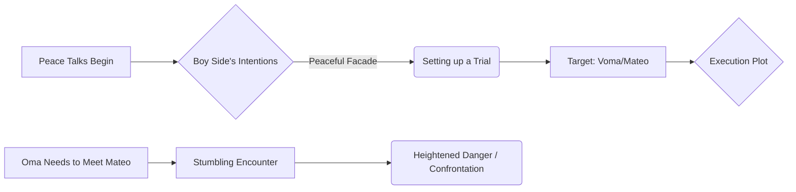

# Live Captions Synthesis Report (2026/06/16)

## 🛡️ Conflict Dynamics, Strategic Preparation, and Alliance Building

The foundational understanding presented is that peace is inherently unstable and fragile—the "verge of peace" is an immediate target. Therefore, the preparation for potential strife and conflict is not optional but a strategic necessity. Successful efforts toward lasting stability require coordinated collective action on both infrastructure and human resources.

### The Necessity of Networked Defense
Security cannot rely on isolated fortifications; true safety is achieved through complex networks of mutual defense mechanisms. Alliances naturally form among small, diverse groups that must pool varied resources (e.g., building underground tunnels and traps) to protect against larger, more volatile external threats. This networked approach allows groups to maintain cooperation toward shared goals while remaining secure.

**Strategic Infrastructure Development:**
To build resilience, efforts focus on collective physical labor and coordinated infrastructure development:
1.  **The Bridge of Peace:** Establishing visible connections for stability.
2.  **Self-Sustained Settlements:** Creating autonomous communities (like raft cities) to reduce external dependencies.

This preparatory phase can be visualized as a journey toward collective security:

```mermaid
flowchart TD
    A[Recognize Peace Fragility] --> B{Goal: Lasting Stability};
    B --> C[Gather Workers & Resources];
    C --> D[Construct Infrastructure (Bridge of Peace)];
    D --> E[Establish Self-Sustaining Settlements (Raft City)];
    E --> F[Achieve Collective Security / Alliance];
```
## ⚡️ Escalation of Conflict and Crisis Points

The tension inherent in the group dynamic means that even when diplomatic efforts begin, underlying conflicts rapidly escalate. The conflict plot centers on the critical divergence between public peace talks and secret, violent intent.

**The Dual Front:** While high-level negotiations (peace talks) proceed under a peaceful facade, significant tensions exist regarding who is trustworthy and what true motives lie beneath the surface. Suspicion mounts, leading to questions about privacy, security breaches, or potential betrayal of critical locations/coordinates (e.g., concerning Dennis).

**The Convergence:** A major narrative tension point arises when characters are driven by personal necessity despite ongoing peace efforts. In one instance, Oma must meet with Mateo, leading to a dramatic and dangerous chance encounter near the supposed center of conflict (a planned trial). This forces the confrontation into the open.


## Key Takeaways

*   **Peace is Fragile:** Stability is not a given state; it requires continuous, proactive preparation against inherent instability.
*   **Resilience through Networks:** True security relies on interconnected systems and alliances (networked defense), rather than single points of failure or isolated fortifications.
*   **Preparation is Collective Labor:** Achieving lasting stability necessitates coordinated effort in infrastructure building (e.g., bridges) and creating self-sufficient communities.
*   **The Conflict Dichotomy:** Tensions often exist simultaneously on multiple levels: formal diplomatic talks can mask secret, violent plotlines that escalate the danger.
*   **Trust is the Highest Risk:** The primary source of immediate conflict escalation is suspicion regarding privacy, security breaches, and internal betrayal.