# live captions 20260623 204143


TOPICS: data_analytics/visualization, python/numpy/arrays

## Module Overview and Course Agenda

*   The module aims to teach Data Analytics and Visualization (DAV), covering fundamental concepts in data processing and visualization techniques.
*   The curriculum is structured into two main parts: general data analysis methods and specific technical details using Python lists and NumPy arrays.
*   Key topics covered include calculating dimensions, determining array shapes, and implementing advanced indexing within NumPy.
*   Basic knowledge of Python programming is sufficient to begin the module; no prior expertise is required.

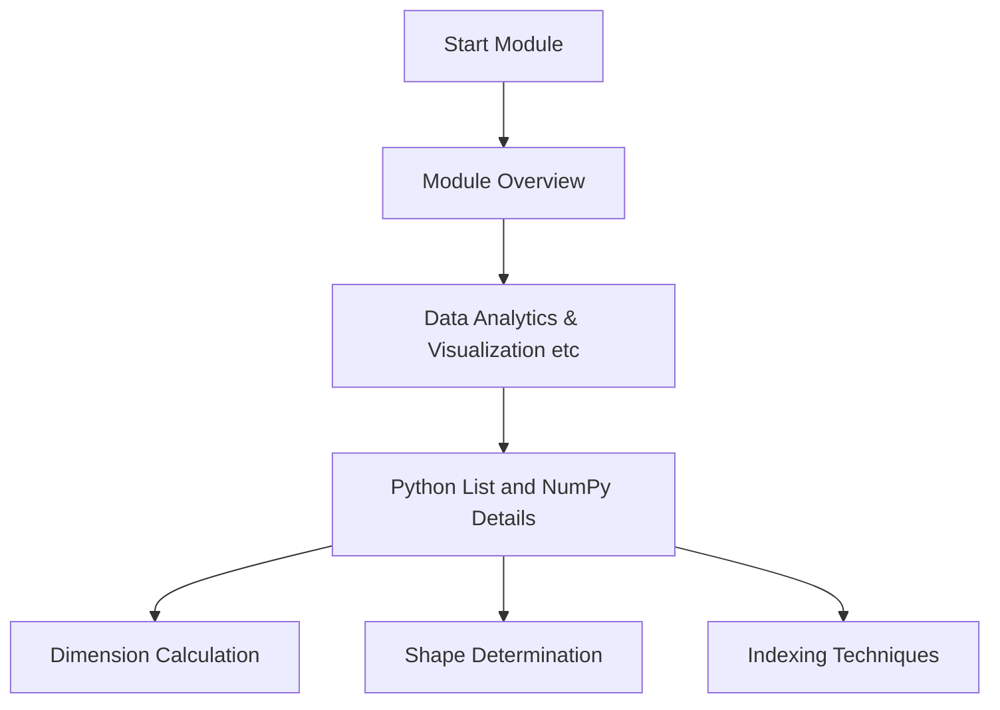

TOPICS: python/foundations, data_science/numerical_operations, data_science/data_processing, data_science/visualization

## Module Overview: Foundational Topics for AI/ML

*   **Prerequisites:** Basic programming knowledge is sufficient to begin, making the course accessible even if you are new to development.
*   **Core Language:** The module exclusively uses Python, as it is recognized as the most popular and essential language in the fields of Artificial Intelligence (AI) and Machine Learning (ML).
*   **Module Structure:** The curriculum is spread across eight lectures, focusing on foundational pillars required for a career in Data Science or ML Engineering.
*   **Foundational Pillars:** Success requires mastering three core areas: Numerical Operations, Data Processing/Preprocessing, and Data Visualization.

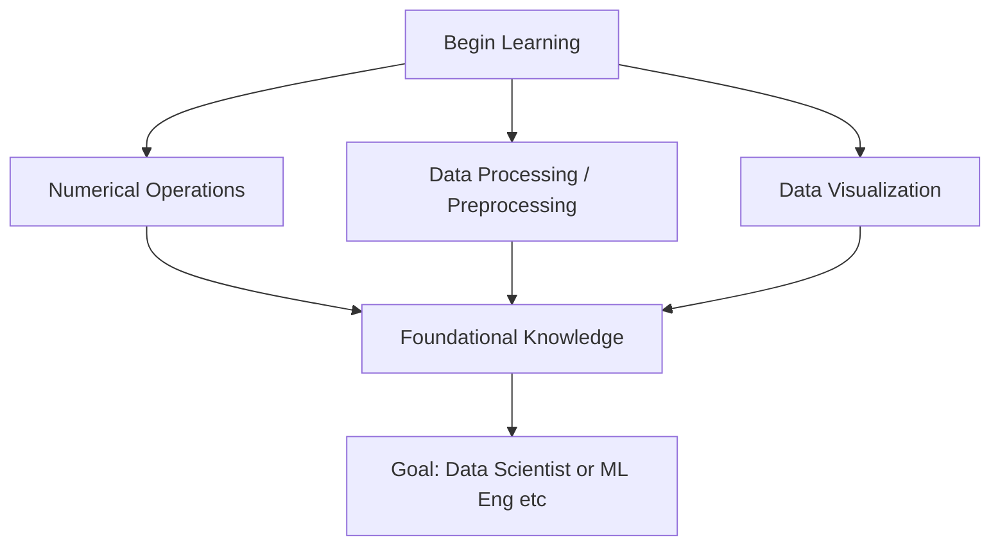

TOPICS: data_science/fundamentals, python/libraries

## Python for ML & Data Science Fundamentals

*   The course focuses on practical aspects of Machine Learning (ML) and Data Science using Python, emphasizing industry-relevant skills.
*   While many languages exist (C, Java, JavaScript), Python is highlighted as the preferred language specifically for AI/ML applications.
*   The power of Python in this domain comes not just from the language itself, but primarily from its vast ecosystem of specialized **libraries** (e.g., Pandas, NumPy).
*   A library is defined as a collection of pre-written code that can be imported and used directly in a program, eliminating the need to write complex functions from scratch.

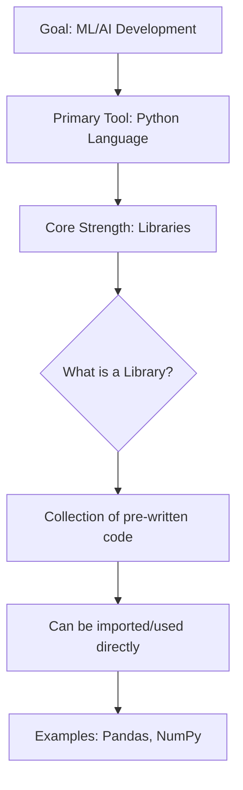

TOPICS: data_science/libraries, decision_making/risk_assessment

## Programming Libraries and Contextual Decision Making

*   **Definition of a Library:** A library is a collection of pre-written code that developers can import or download to use in their programs, preventing the need to write complex functions from scratch.
*   **Specialization:** Each library serves a very specific task (e.g., NumPy for numerical operations, Pandas for data manipulation).
*   **Purpose of Study:** Understanding Python and its libraries is crucial because they provide tools to model and automate complex real-world decision processes (like risk assessment).
*   **Decision Criteria:** Effective analysis requires considering multiple contextual factors beyond simple metrics (e.g., assessing dependency or existing commitments vs. raw salary).

```mermaid
flowchart TD
    A["Start: Loan Application"] --> B["Collect Data"]
    B --> C1["C1: High Salary, 3 Loans"]
    B --> C2["C2: Low Salary, 0 Loans"]
    C1 --> D{Check Debt Load}
    C2 --> D
    D -->|"High Loan etc| E["Potential Default Risk"]
    E --> F{Is Stability Key?}
    F -->|Yes (Depen etc| G["Prioritize Low Risk/Stable Can etc"]
    G --> H["Select C2"]
    H --> I["Loan Approved: YES"]
```

TOPICS: data-driven_automation/process, machine_learning/concepts, feature_engineering

## Transitioning from Human Judgment to Data-Driven Automation

*   **Limitations of Experience:** Manual judgment calls (e.g., a bank manager assessing a customer) are highly dependent on individual experience and can be biased or incomplete, especially when dealing with complex variables like dependency status.
*   **The Primacy of Data:** The core principle emphasized is that **data never lies**. Data provides the ideal ground truth, making it superior to subjective human experience for objective decision-making.
*   **Need for Automation:** When scaling decisions from a few customers to millions, manual judgment becomes impossible; an automated process is required.
*   **Deep Dive Analysis (Feature Engineering):** Before any automation can occur, a crucial "deep dive analysis" of the data must be performed. This step aims to identify hidden patterns and determine which features (columns) are most important for making accurate predictions.
*   In Machine Learning context, the terms **'column'** and **'feature'** are interchangeable; 'Feature' is the preferred term going forward.

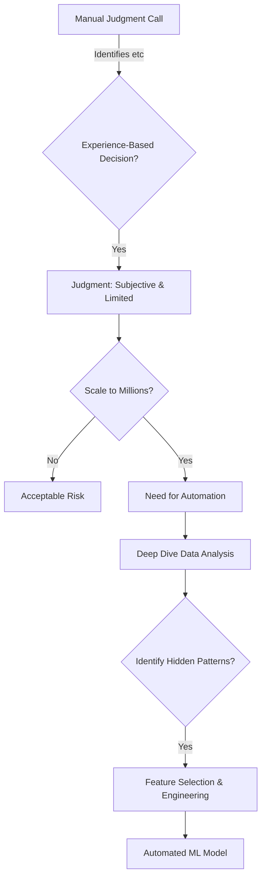

TOPICS: data_analysis/eda, data_analysis/machine_learning

## Data Analysis and Exploratory Data Analysis (EDA)

*   **Data Analysis Goal:** The primary goal is to identify underlying patterns or relationships from historical data, allowing for predictions (e.g., calculating future salary based on years of experience).
*   **Human Limitations:** Humans are limited in their ability to manually analyze massive datasets ("big Excel sheet"); this task is computationally infeasible for manual review.
*   **The Role of AI/ML:** Machine learning and Artificial Intelligence are necessary tools to process and find patterns within very large, complex datasets that exceed human analytical capacity.
*   **EDA Definition:** EDA (Exploratory Data Analysis) is the industry standard process of thoroughly exploring every feature in a dataset *before* making any definitive decision or model selection.
*   **Terminology Clarification:** While "DAV" may be terminology used by specific frameworks for data analytics and visualization, **EDA** remains the universally accepted term for this exploratory phase.

```mermaid
flowchart TD
    A["Start: Data Set"] --> B{Is Dataset Size Large?}
    B -->|Yes (Milli etc| C["Human Analysis"]
    C -->|Cannot Process| D["Requires Machine/AI"]
    B -->|No (Small etc| E["Human Can Analyze"]
    E --> F["Pattern Identified"]
    D --> G["Advanced Pattern Recognition"]
```

TOPICS: data_analysis/eda, data_analysis/exploration

## Exploratory Data Analysis (EDA)

*   **Definition:** EDA is the process of systematically exploring every feature within a dataset *before* making any definitive conclusions or decisions.
*   **Purpose:** The primary goal is to uncover hidden patterns, relationships, and insights that were not known or hypothesized at the outset of the analysis.
*   **Approach:** Since we often do not know what pattern exists (like getting lost in an unknown city), the approach requires exploring all possible options rather than focusing only on a specific search query.
*   **Objective:** The job of data analysis, when performing EDA, is to "explore by ourselves" and find anything relevant to the given context.

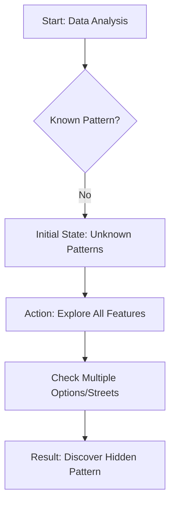

TOPICS: data_analysis/eda, pandas/data_manipulation, numpy/numerical_operations

## Exploratory Data Analysis (EDA) with Python Libraries

*   **Pandas:** This library is essential for data manipulation and data transformation, allowing users to structure and clean raw datasets efficiently.
*   **NumPy:** Used primarily for numerical operations, handling complex mathematical tasks such as addition, subtraction, multiplication, and matrix calculations.
*   **Visualization Tools (Matplotlib/Seaborn):** These libraries are crucial for visualizing data. Visual charts (like pie charts) convey significantly more information than raw data sheets because the visual cortex memory retention is much higher.

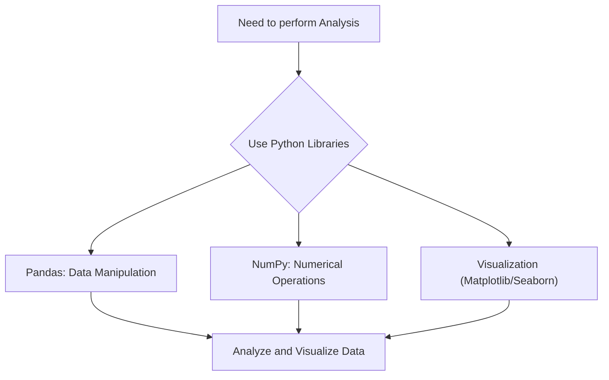

TOPICS: data_visualization/principles, eda/feature_selection

## The Importance of Visual Data Representation and Feature Selection

*   **Visual Superiority:** Visual representations (like pie charts) are significantly more effective at conveying information than raw data presented in spreadsheets because human visual memory is highly developed.
*   **Cognitive Basis:** Our visual cortex has a much higher capacity for memory and retention, allowing us to remember visually presented concepts for longer periods compared to reading text or tables.
*   **Pattern Recognition:** Visuals are extremely helpful tools for interpreting patterns; they enable users to immediately detect anomalies or differences that might be difficult to spot in raw data.
*   **Presentation Best Practice:** In any professional presentation, the visual aspect must play a primary role as it captures attention and facilitates easier understanding of complex data sets.
*   **Feature Selection Principle:** During exploratory data analysis (EDA), features or columns that lack inherent meaning—such as simple row numbers or indices—are often redundant and should be removed to improve model efficiency.

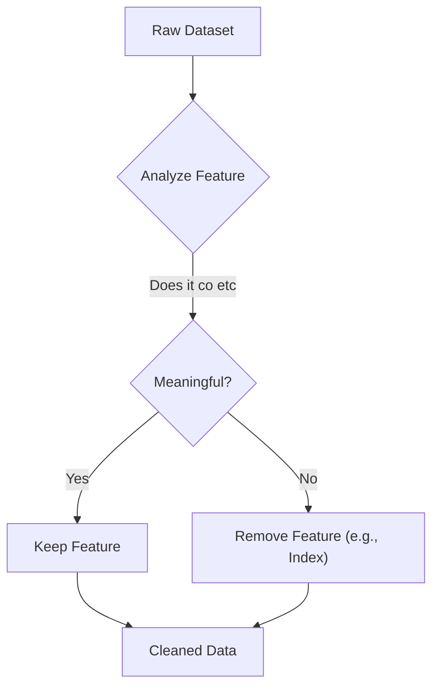

TOPICS: eda/exploratory_data_analysis, data_cleaning/feature_selection

## Feature Selection and Data Cleaning with EDA

*   **Identifying Redundancy:** A primary goal of data cleaning is to identify and remove unnecessary features or columns (e.g., simple row numbers) that do not contain unique informational value.
*   **The Role of EDA:** Exploratory Data Analysis (EDA) is crucial for understanding the dataset's structure, allowing practitioners to determine which variables are core to the problem and which are merely "junk."
*   **Focusing on Core Variables:** The process involves iteratively removing unnecessary columns to ensure that the final scope focuses only on the most relevant features required for accurate modeling.
*   **Goal of Modeling:** Feature selection is a prerequisite step for building an overall Machine Learning (ML) model, ensuring that the training data contains only important and non-redundant information.

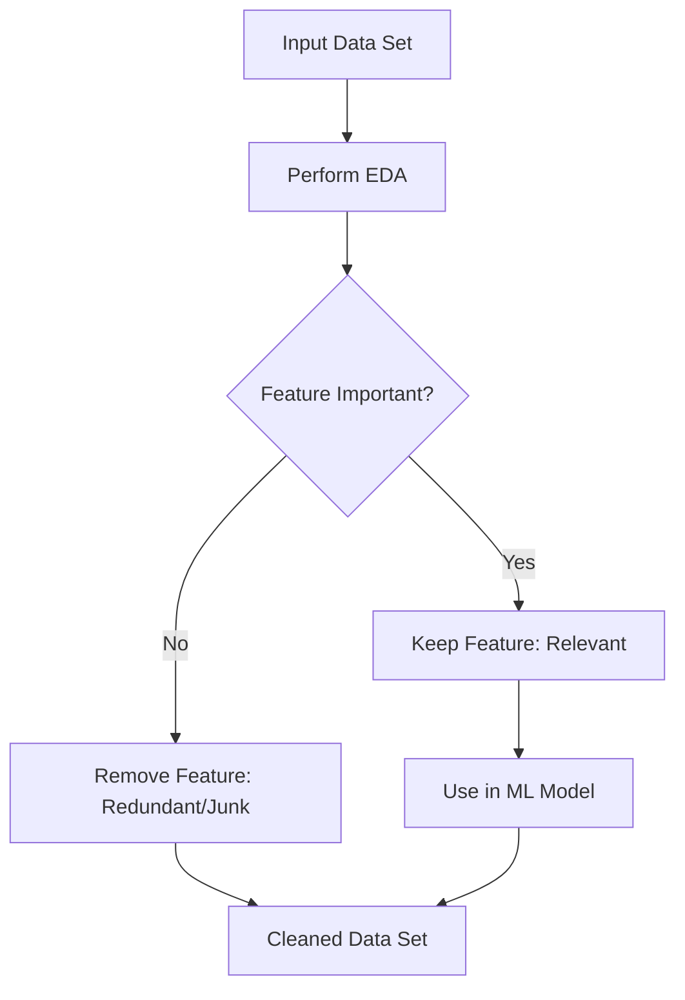

TOPICS: data_science/data_preparation/eda, data_science/data_preparation/cleaning

## ML Model Pipeline & Data Preparation

*   **Purpose of EDA:** Exploratory Data Analysis (EDA) is crucial for feature selection—identifying which features are important, useful, or should be removed to improve model performance (e.g., in a loan approval process).
*   **Data Transformation Necessity:** Computers only understand numerical data (like binary 0s and 1s). Any non-numeric data (such as text like English words) must undergo transformation into a quantifiable format before the model can use it.
*   **The Data Cleaning Process:** The entire process of converting raw, messy, or categorical data into a suitable numerical format is collectively called "data cleaning" or "data transforming."

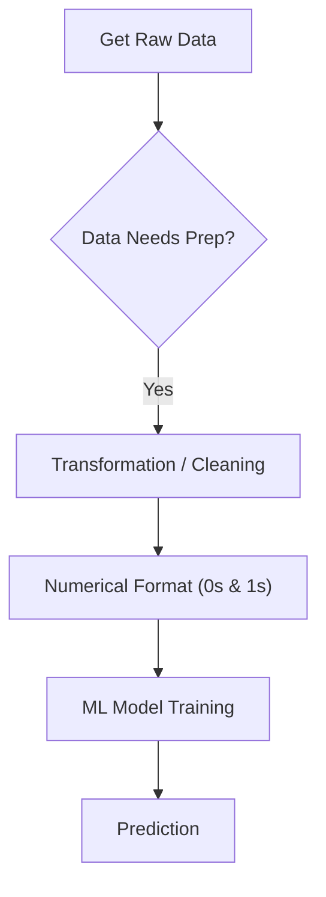

TOPICS: data_preprocessing/data_cleaning, ml_workflow, coding_environment

## Data Preprocessing and ML Workflow Fundamentals

*   **Data Cleaning:** This is a crucial initial step in any machine learning project where raw data must be prepared because computers cannot process natural language (like English).
*   **Transformation Scope:** The process involves transforming data by removing non-useful features, converting data types, handling missing values (interpolation), and generally structuring the information for model consumption.
*   **Terminology:** "Data cleaning" and "data transforming" are often used interchangeably in the field of ML/AI jargon.

```mermaid
flowchart TD
A["Raw Data Input"] --> B{Is Data Usable?}
B -->|No (English)| C["Data Cleaning & Transformation"]
C --> D1["Remove non-useful features"]
C --> D2["Interpolation / Imputation"]
D1 --> E["Structured, Clean Data"]
D2 --> E
E --> F["ML Model Input Ready"]
```

## Practical Coding Environment Setup

*   **Practical Focus:** The course emphasizes practical application and coding rather than purely theoretical concepts.
*   **IDE Necessity:** To perform the necessary coding tasks, a dedicated Integrated Development Environment (IDE) is required.
*   **What is an IDE?** An IDE is specialized software designed as a place where developers typically write and manage code efficiently.
*   **Common Examples:** Popular IDEs include VS Code, Spyder, Jupyter Notebook, and Charm.

TOPICS: development_environments/colab, python/basics

## Introduction to Development Environments and Colab Notebooks

*   **Integrated Development Environment (IDE):** An IDE is a comprehensive software application used for writing, testing, and debugging code. Examples include VS Code, PyCharm, Spyder, and Jupyter Notebook.
*   **Google Colaboratory (Colab):** We will use Google Colab, a service provided by Google, which functions as an online environment to run Python code cell-by-cell and view immediate output.
*   **Notebook Structure:** A notebook is composed of "cells." Each individual cell can contain two distinct types of content: **Code** (executable instructions) or **Text** (formatted documentation/notes).
*   **Coding Best Practice:** When writing Python code, it must always be placed within a Code block. Simple descriptive text should be kept in the Text block.

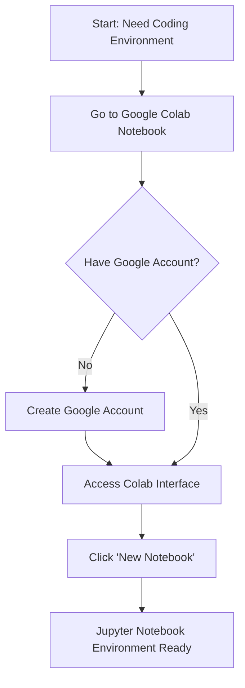

The basic syntax for printing output in Python is:

```python
print("Hello world")
```

TOPICS: numpy/introduction, python/libraries/numerical_computing

## Introduction to NumPy and Numerical Operations

*   NumPy (Numerical Python) is a fundamental library in Python designed specifically for efficient numerical computing.
*   It addresses the fact that machines fundamentally understand numbers, meaning any complex task or system build requires underlying mathematical/numerical operations.
*   The primary function of NumPy is to provide tools for performing these necessary numerical operations efficiently.
*   To utilize the library, it must be imported into the Python environment using a standard alias:

```python
import numpy as np
```

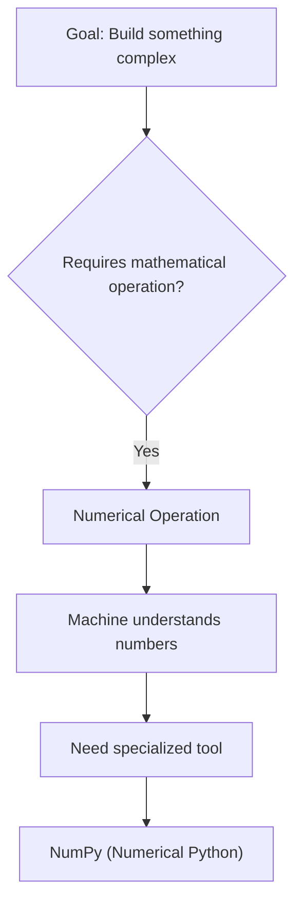

TOPICS: numpy/basics, numpy/arrays

## NumPy Fundamentals and Array Creation

*   **Library Importation:** To use external libraries like NumPy in Python, you must explicitly import them. The command `import numpy as np` imports the full library (`numpy`) but assigns it a shorter nickname or alias (`np`), making subsequent code cleaner (e.g., using `np.array()` instead of `numpy.array()`).
*   **Environment Setup:** If NumPy is not installed in your system, you must run the installation command via pip: `!pip install numpy`. The exclamation mark (`!`) signals that the command should be executed as a shell command within the notebook environment.
*   **Array Creation:** A NumPy array is a fundamental data structure used to store collections of elements efficiently. Arrays are created using the syntax `np.array([element1, element2, ...])`.
*   **Output and Usage:** Once arrays (like `votes` or `cost`) are created, they can be printed directly using Python's built-in `print()` function to view their contents.

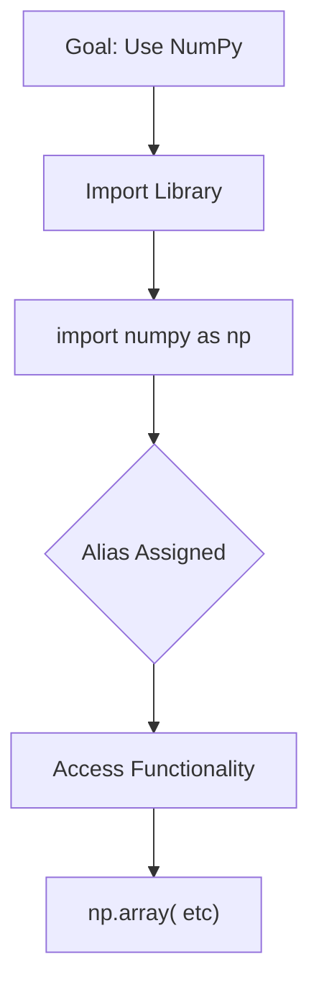

**Code Examples:**

*   **Importing and Aliasing:**
    ```python
import numpy as np
```
*   **Installing (if needed):**
    ```bash
!pip install numpy
```
*   **Creating an Array:**
    ```python
*   **Goal:** Fix the empty code block based on surrounding context which discusses NumPy fundamentals, importing, and creating arrays.
*   **Context Clues:**
    1.  Must import numpy as np. (`import numpy as np`)
    2.  The next lines show array creation: `my_array = np.array([7, 7, 5])` and `print(my_array)`.
*   **Inference:** The missing code block should contain the necessary imports to make the subsequent code runnable and demonstrate the concept of array creation as described in the notes.

*   **Plan:** Write the standard NumPy import statement at the beginning of the fixed block, followed by the example code provided just after the placeholder (which is contextually correct).import numpy as np
```
# Example: Creating a simple array of numbers
my_array = np.array([7, 7, 5])
print(my_array)
```
```
# lint: syntax error: unexpected indent
    # Example: Creating a simple array of numbers
    my_array = np.array([7, 7, 5])
    print(my_array)
    
```
TOPICS: notebooks/execution_flow, notebooks/state_management
```
## Notebook Execution Flow and Data Printing

*   **Data Visualization:** Arrays (e.g., `votes`, `cost`) can be printed directly using built-in functions or by simply executing the variable name in a cell, which displays the array's contents.
*   **Cellular Execution Model:** Code execution is sequential; each "cell" must be run independently to compile and execute its logic. The output of one cell becomes available for use in subsequent cells.
*   **State Management:** When running code in separate cells, results are compiled and stored sequentially, allowing later cells to reference variables or data generated earlier in the notebook session.
*   **Syntax Context:** Code syntax (e.g., commas) can be context-dependent; certain elements may be automatically removed or ignored by the interpreter because the function call completes the statement successfully.

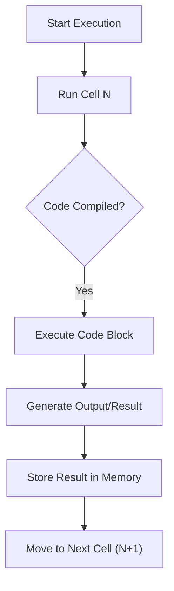

TOPICS: python/data-types, numpy/arrays, data_structures/comparison

## Understanding Data Types and NumPy Arrays

*   Python supports various fundamental data types, including integers (`int`) and floating-point numbers (`float`).
*   The `type()` function is used to determine the specific data type of a variable (e.g., `type(cost)` confirms it's a NumPy array).
*   NumPy introduces the concept of N-Dimensional Arrays (ND), where 'N' stands for the number of dimensions, allowing complex data structures beyond simple vectors or matrices.
*   A critical difference exists between Python lists and NumPy arrays: Python lists are *heterogeneous*, meaning they can store elements of different data types within the same sequence.

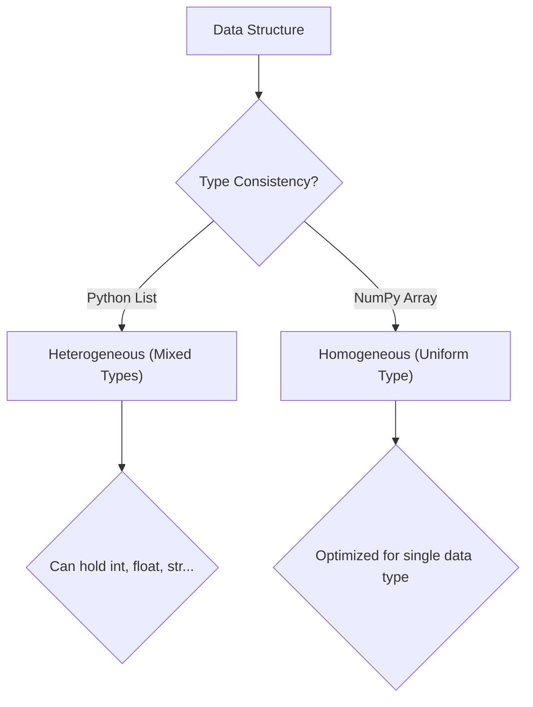

TOPICS: python/data_structures, list, numpy/arrays

## Python Data Types: Lists vs. NumPy Arrays

*   **Python List (`list`):** Highly flexible container that supports **heterogeneous values**, meaning it can store elements of different data types simultaneously (e.g., strings, integers, floats, booleans).
*   **NumPy Array (`np.array`):** Designed for numerical computation and requires **homogeneous values**. All elements within a NumPy array must be of the same data type.
*   **Type Coercion:** When converting mixed data into a NumPy array (e.g., using `np.array()` on a list containing different types), NumPy will coerce all elements into a single, common data type (often strings) to maintain uniformity.

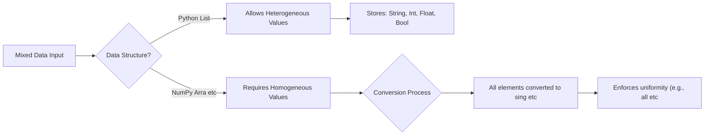

TOPICS: numpy/data_types, python/typing

## Data Type Coercion and NumPy Array Promotion

*   **Type Coercion:** Python automatically converts data types when necessary. For example, a boolean `True` can be coerced into an integer (`1`) or a float (`1.0`), demonstrating its underlying numerical value.
*   **NumPy Data Type Priority:** When creating a NumPy array with mixed data types, the resulting array's data type (dtype) is determined by a high-priority promotion rule. This ensures all elements conform to the single most general type.
*   **String Handling and Unicode:** Strings are handled using Unicode encoding. The common format discussed is `U32` (Unicode 32-bit), which defines how characters are stored as a string format, regardless of the underlying data type rules for numbers.
*   **Array Consistency:** For any given array, all elements must share the same data type. This concept means that even if input elements vary in type, NumPy forces them into a single consistent dtype based on the promotion hierarchy.

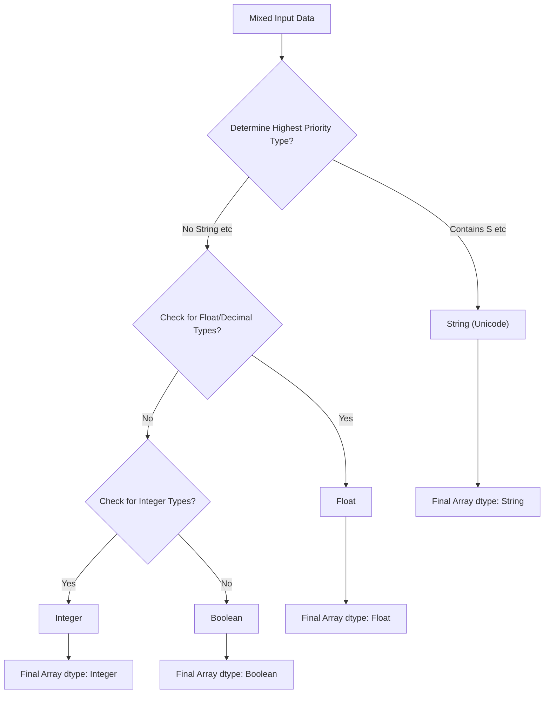

TOPICS: data_structures/memory_allocation, python/numpy

## Memory Allocation and Data Structure Differences

*   **Data Type Encoding:** Character encoding uses various bit definitions, such as U-32 or U-16, to define the number of bits used for characters in strings.
*   **Python Lists (Heterogeneous):** Python lists can store mixed data types (heterogeneous) and typically allocate memory non-contiguously in RAM. Accessing elements requires looking up individual addresses throughout memory, which is time-consuming for large datasets.
*   **NumPy Arrays (Homogeneous):** NumPy arrays enforce a single, uniform data type (homogeneous). This constraint allows the array to be allocated *contiguously* in memory—all elements are stored right next to each other.
*   **Performance Benefit:** Contiguous allocation is highly efficient because accessing any element involves simple pointer arithmetic rather than complex address lookups, leading to significantly faster processing times for large datasets.

```mermaid
flowchart TD
    A["Data Structure"] --> B{Homogeneous Data Type?}
    B -->|Yes (Same etc| C["NumPy Array"]
    C --> D["Contiguous Memory Allocation"]
    D --> E["Fast Access / High Performance"]
    B -->|No (Mixed etc| F["Python List"]
    F --> G["Non-Contiguous Memory Allocation"]
    G --> H["Slow Access (Address Lookup)"]
```

TOPICS: python/data_structures/numpy, python/performance/memory_allocation

## Data Structures and Performance in Python (Lists vs. NumPy)

*   **Contiguous Memory Allocation (NumPy):** NumPy arrays benefit from contiguous memory allocation because all elements are of the same data type. This allows data to be stored right next to each other, enabling "fast fetching" and super-fast retrieval of information.
*   **List Limitations:** Python lists are suitable for general programming tasks but are inefficient for large-scale numerical operations due to their underlying structure (they can store mixed data types in different memory locations).
*   **NumPy's Advantage:** NumPy arrays solve the performance problem by converting input data into a uniform, contiguous byte format. This design makes them significantly faster than standard Python lists for mathematical and scientific computations.
*   **Implementation Detail:** Although used in Python, NumPy is fundamentally written in C language. It functions as a "Python wrapper" over this highly optimized C code, which is the primary reason for its superior speed compared to pure Python implementations.

```mermaid
flowchart TD
    A["Need Numerical Operation on Hu etc"] --> B{Data Type?}
    B -->|General Use| C["Use Python List"]
    C -->|Operation| D["Slower Performance"]
    B -->|Numerical/ etc| E["Convert List to NumPy Array"]
    E --> F["Contiguous Memory Allocation ( etc"]
    F --> G["Fast Fetching / Super Fast Ope etc"]
```

TOPICS: data_analysis/fundamentals, numpy/performance, python/optimization

## Python, NumPy, and Data Analysis Fundamentals

*   **NumPy's Performance:** NumPy achieves high speed because while the code is written in Python, the underlying interpretation and heavy lifting are performed by optimized C implementations.
*   **Historical Context:** When Python was initially developed (in the 80s/90s), concepts like "big data analysis" or structured data processing were non-existent.
*   **The Need for Optimization:** As requirements shifted toward faster, large-scale data processing, it became clear that standard Python lists are not suitable for these tasks due to performance bottlenecks.
*   **Python's Advantage:** Although Python might be slower than compiled languages like C or Java, its primary advantage is its extremely easy syntax and negligible learning curve, making implementation rapid and accessible.

```mermaid
flowchart TD
    A["Python: General Purpose Language"] --> B{Data Analysis Requirement?}
    B -->|Yes| C["Standard Python List"]
    C -->|Not suitab etc| D["Need for Optimized Arrays"]
    D --> E["NumPy was created"]
```

TOPICS: notebook/workflow/execution_methods, python/jupyter/automatic_printing

## Code Execution and Notebook Workflow

*   **Block Execution:** Python code does not need to be executed line by line; entire blocks of code can be run at once within a single cell, significantly improving workflow efficiency.
*   **Multi-line Input:** To write multi-line code in a notebook cell, simply press `Enter` repeatedly and expand the content before running the block.
*   **Execution Methods:** Code blocks can be executed either by pressing `Shift + Enter` (running the entire block) or by using standard execution methods provided by the environment.
*   **Automatic Printing (Jupyter):** In a Jupyter Notebook environment, when you run code, the last variable defined in that cell will automatically be printed as its value, even if an explicit `print()` statement is not used.

```mermaid
flowchart TD
    A["Start: Write multi-line code"] --> B{How to execute?}
    B -->|Method 1 ( etc| C["Press Shift + Enter"]
    C --> D["Execute all lines in one go"]
    B -->|Method 2 ( etc| E["Write line by line, using Enter"]
    E --> F["Execute sequentially (line-by- etc"]
```

TOPICS: numpy/arrays/dimensionality, python/data_structures/lists

## Data Structures and Array Dimensionality

*   **Jupyter Notebook Behavior:** When running code in a Jupyter environment, simply writing and executing a variable assignment automatically prints the value of that last variable, even without an explicit `print()` statement.
*   **Python Lists for Heterogeneous Data:** Python lists are highly recommended when dealing with data records where attributes contain different types (e.g., Name [string], Age [integer], Role [string]). This structure handles varied data types within a single collection.
*   **Dimensional Arrays (D-Arrays):** NumPy arrays can exist in various dimensions:
    *   1D Array: A simple vector or list of values.
    *   2D Array: Specifically called a **Matrix**, representing rows and columns.
    *   3D Array: Represents multiple matrices, requiring three axes (axis 0, axis 1, axis 2).
*   **Universal Principle in ML:** In machine learning and data science, *all* forms of data—whether it's a simple table, a complex dataset, or model computations—are fundamentally treated as array computations. Dimensionality is not limited to three axes.

```mermaid
flowchart TD
    A["Data Point"] --> B["1D Array (Vector)"]
    B --> C["2D Array (Matrix)"]
    C --> D["3D Array"]
    D --> E["N-Dimensional Array"]
    subgraph Dimensionality Progression
        A -->|"Adds a di etc| B
        B -->|"Adds anot etc| C
        C -->|"Adds thir etc| D
        D -->|"Can conti etc| E
    end
    style A fill:#f9f,stroke:#333
    style E fill:#ccf,stroke:#333
```

TOPICS: data_structures/arrays, n-dimensional/arrays, numpy/array_fundamentals

## N-Dimensional Arrays and Array Fundamentals

*   **Fundamental Nature of Data:** All data structures—whether they are raw datasets, tables, or complex machine learning models—are fundamentally treated as array computations in programming environments.
*   **Beyond 3D Limitations:** While humans can visualize up to three dimensions (3D), arrays are not limited by this physical constraint. They can exist in $N$ dimensions ($N$-dimensional arrays).
*   **Definition of ND Array:** The term "ND array" is used because, mathematically, these structures can be represented and manipulated even if human visualization fails beyond 4D or 5D.
*   **Practical Implementation (NumPy):** In practice, libraries like NumPy provide functions to manage dimensionality:
    *   `array.ndim`: Returns the number of dimensions (the rank) of the array.
    *   `array.shape`: Returns a tuple indicating the size along each dimension.

```mermaid
flowchart TD
    A["Data Structure (Table, ML Model)"] --> B["Represented as Array Computation"]
    B --> C{Dimensionality Limit?}
    C -->|Limited to 3D| D["Standard 3D Array"]
    C -->|No| E["N-Dimensional Array (ND)"]
    E --> F["Mathematically Representable"]
```

TOPICS: numpy/arrays/dimensions, numpy/basics/attributes

## NumPy Array Dimensions and Shape

*   **`numpy.ndim()`:** This function is used to determine the number of dimensions (axes) an array possesses.
*   **Dimensionality Check:** If `ndim` returns 1, the array is one-dimensional (a vector).
*   **`.shape` Attribute:** To find out the size or count of elements along each dimension, use the `.shape` attribute. This returns a tuple representing the dimensions.
*   **Syntax Rule:** The standard way to check the shape of any array in NumPy is `array_name.shape`.

```mermaid
flowchart TD
    A["Start with Array"] --> B{Goal?}
    B -->|Need Dimen etc| C["Use .ndim"]
    C --> D["Result: Number of Axes"]
    B -->|Need Size/ etc| E["Use .shape"]
    E --> F["Result: Tuple of Sizes"]
```

<!-- LINT_FAILED: block 19 (python) syntax error: invalid syntax -->


---

## Backlinks
- [[pipeline_smoke2_20260708_203432]] → Module Overview and Course Agenda
