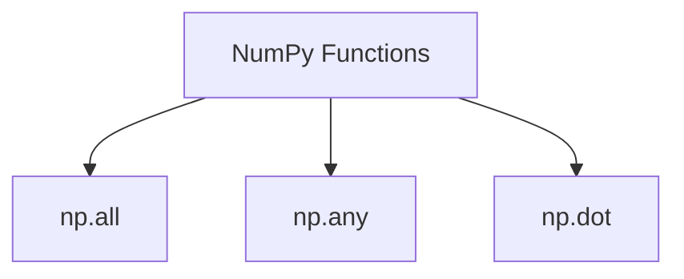
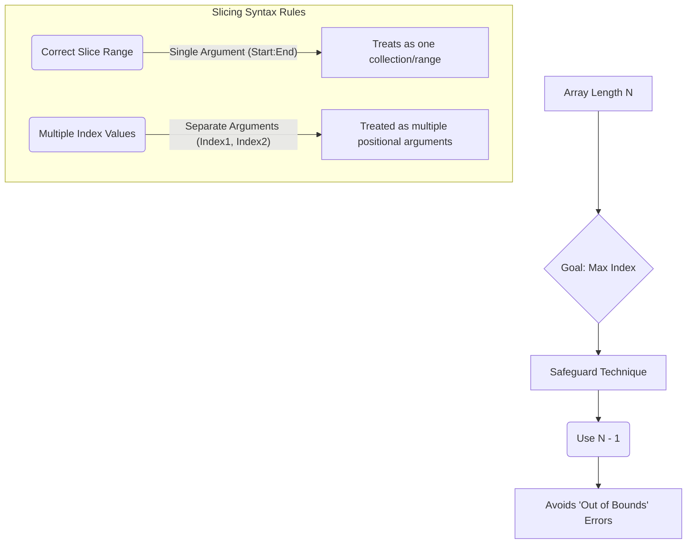
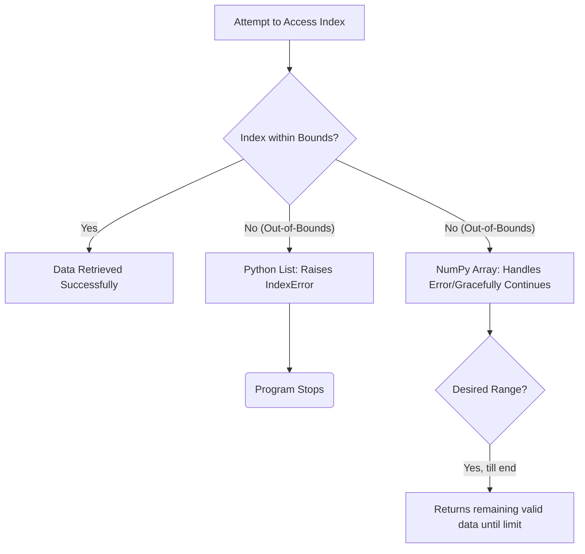
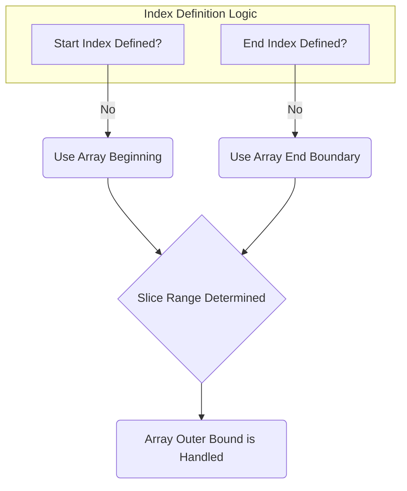
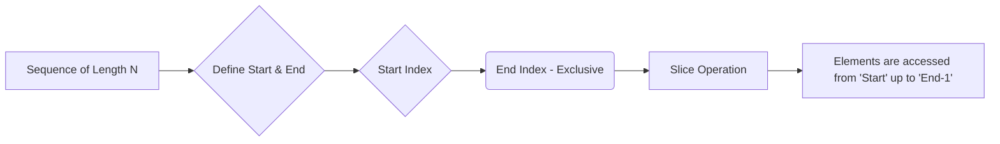
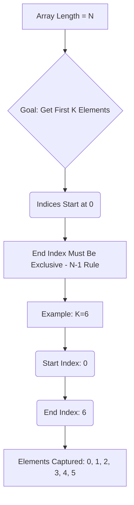
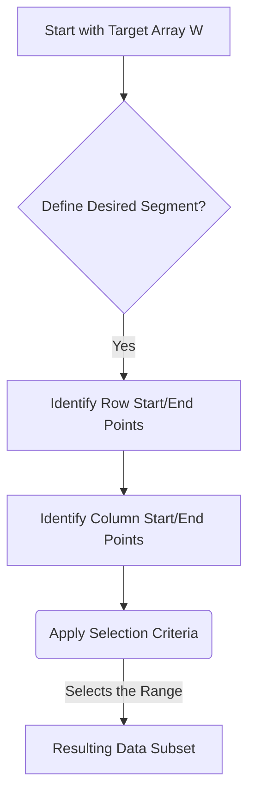
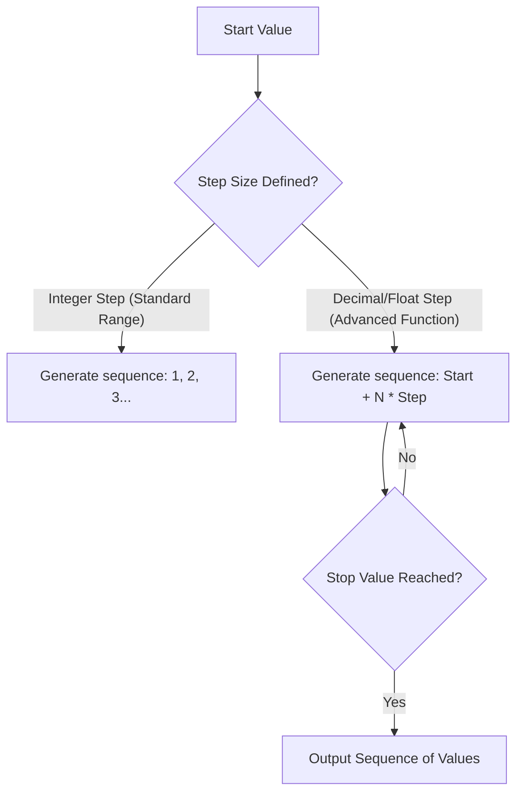
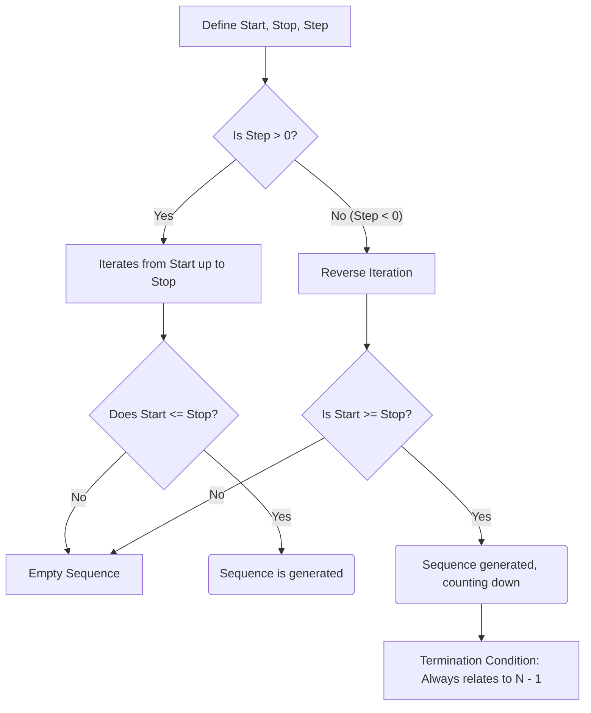

# Data foundations Lecture 2 

## Introduction to NumPy Operations and Array Manipulation

*   The module will focus on advanced NumPy operations and array manipulation techniques.
*   Topics covered include:
    *   Core **NumPy operations** (e.g., element-wise arithmetic).
    *   Understanding and manipulating multi-dimensional arrays (**2D arrays**).
    *   Advanced data selection using **Indexing** and **Fancy Indexing**.
    *   Restructuring array dimensions via **Reshaping**.
*   The lecture will introduce several aggregate functions crucial for analysis:


Constraints check:
1.  Start with `
```
Constraints check:
1.  Start with `
```
Constraints review indicates several rules must be followed:
1. Start with `
```
Constraints review:
1. Start with `
```

*   **Key Concepts/Functions:**
    *   `np.all()`: Checks if *all* elements in a specified array (or dimension) satisfy a condition.
    *   `np.any()`: Checks if *at least one* element in a specified array (or dimension) satisfies a condition.
    *   `np.dot()`: Performs the dot product of arrays, essential for linear algebra operations.

```
```
```
```
## Array Operations in NumPy

*   **Core Functionality:** This lecture unit focuses on comprehensive NumPy array operations, covering diverse use cases and functionality required for data manipulation.
*   **Essential Techniques Covered:** Key topics include advanced indexing, array slicing, sorting algorithms (including techniques for 2D arrays), and matrix multiplication.
*   **Relationship between Concepts:** Indexing and Slicing are presented as highly coherent concepts that work together to access specific elements within multi-dimensional arrays.
*   **Scope of Operations:** The module will cover foundational array manipulations beyond basic arithmetic, such as using functions like `np.any` or similar logical checks (`np.all`).

## Exploratory Data Analysis (EDA) Fundamentals

*   **Definition:** EDA stands for Exploratory Data Analysis. It is a data analysis process used when the objectives are unclear or unknown, requiring initial exploration to uncover patterns, features, and underlying structures within the data.
*   **Purpose:** The primary goal of EDA is to understand the dataset thoroughly by identifying important features and hidden patterns *before* applying formal statistical models or machine learning techniques (e.g., using the bank manager example).
*   **Core Libraries in Python:** Data analysis requires leveraging specific Python libraries, which include:
    *   `pandas`: For data manipulation and handling structured data.
    *   `numpy`: Essential for efficient numerical operations (working purely with numbers/arrays).
    *   `matplotlib` & `seaborn`: Used for data visualization (graphing patterns and distributions).

### EDA Process Flow

The process of using EDA to understand data can be visualized as follows:

```mermaid
flowchart TD
    A[Start with Data] --> B{Goal: Understand Hidden Patterns?}
    B -- Yes, Unknown Goal --> C[Perform Exploratory Data Analysis (EDA)]
    C --> D(Identify Key Features & Relationships)
    D --> E{Need to Transform Data?}
    E -- Yes --> F[Data Manipulation/Cleaning]
    F --> G[Visualize Results using Libraries (Seaborn, Matplotlib)]
    G --> H[Understand Patterns & Formulate Hypothesis]
```

## Data Processing Libraries (NumPy & Visualization)

*   **Purpose of Libraries:** When performing numerical operations (working solely with numbers/data, no text), libraries like NumPy are essential tools.
*   **Visualization Importance:** Because human visual cortex memory is high, understanding and interpreting data through visualization is highly effective. These libraries work together to facilitate comprehensive analysis (e.g., "EDM" - likely referring to a specific process discussed in the full lecture).

## Python Lists vs. NumPy Arrays

The primary advantage of using NumPy arrays over standard Python lists lies in **speed**.

*   **Performance Advantage:** NumPy is significantly faster than Python lists for numerical operations, especially when dealing with large datasets.
*   **Technical Reason (Deep Dive):** This speed comes from two main factors:
    1.  **Homogeneous Memory Allocation:** NumPy arrays store elements of the same data type, allowing optimized memory handling.
    2.  **Contiguous Memory Allocation:** The elements are stored contiguously in memory, enabling fast and efficient retrieval processes.

The relationship between list vs. array efficiency can be modeled conceptually:


## NumPy Arrays vs. Python Lists: Efficiency and Fundamentals

*   **Performance Advantage:** The primary benefit of using NumPy arrays over native Python lists is **speed**. NumPy's efficiency stems from its optimized memory handling, specifically utilizing **homogeneous memory allocation** and **contiguous memory allocation**, which allows for faster data retrieval and operation execution.
*   **NumPy Usage Flow:** To utilize NumPy, the library must first be imported into the session using a standard alias: `import numpy as np`. This step is mandatory before any NumPy function can be called.
*   **Array Creation:** Converting standard Python data structures (like lists) into efficient NumPy arrays requires the use of the dedicated constructor function, such as `np.array()`. Once an array is established this way, it enables advanced, vectorized operations.
*   **Fundamental Concept:** After mastering creation and basic usage, the next crucial concept to focus on for effective data manipulation within NumPy is **indexing**.

### Code Examples (Initialization)

```python
```
# Step 1: Import the library
import numpy as np

# Step 2: Define a simple array using the constructor
W = np.array([1, 2, 3])

print(W)
```
```

## NumPy Arrays and Indexing Fundamentals

*   **Array Definition:** An array is fundamentally defined as a simple "collection of elements." There is no complex technical definition required to understand this basic concept.
*   **NumPy Array Creation & Type:**
    *   Arrays are typically created using the `numpy` library (e.g., `W = np.array([...])`).
    *   A variable holding a NumPy array (`W`) will have the type `<class 'numpy.ndarray'>`.
    *   NumPy arrays are inherently **homogeneous**, meaning all elements must be of the same data type.
*   **The Concept of Indexing:** Indexing is the method used to fetch specific values from an established NumPy array. It allows you to access data by its position rather than iterating through it manually.

### Code Examples: Array Creation and Access

```python
import numpy as np

```
# 1. Creating a homogeneous NumPy array (W)
W = np.array([9, 5, 4, 3, 2])

print(f"Type of W: {type(W)}")
# Output confirms W is an ndarray
```

```
### Key Rules of Indexing

*   **Zero-Based Indexing:** This is the most critical rule. Unlike human counting (which starts at 1), array indexing always begins at **zero (0)** for the first element.
    *   The first value (`9`) is found at index `W[0]`.
    *   The second value (`5`) is found at index `W[1]`.
    *   The third value (`4`) is found at index `W[2]`, and so on.

*   **Accessing Elements:** To retrieve a value, use the syntax `ArrayName[Index]`.

```python
```
# Accessing specific elements:
print(f"Element at index 0 (the first element): {W[0]}") # Output: 9
print(f"Element at index 2 (the third element): {W[2]}") # Output: 4
```
```

## Pattern Recognition and Dynamic Array Indexing

*   **Programming Fundamentals:** Programming success hinges on recognizing underlying patterns in data and logic, rather than memorizing specific code structures or indices.
*   **Limitations of Fixed Indices:** Manually writing a function like `W(4)` assumes the array size is always 4. This approach is not dynamic and fails when the input array size changes.
*   **Dynamic Indexing Principle:** To reliably access the last element of an array (or list), you must use a formula that calculates the length of the collection minus one, regardless of its actual size.

```mermaid
graph TD
    A[Start with Array W] --> B(Calculate Length: len(W))
    B --> C{Subtract One}
    C --> D[Result: Index of Last Element (len(W) - 1)]
```

*   **Implementation in Python:** The formula must be implemented using the language's built-in functions. To find the index of the last element, use `len()` followed by subtraction.

```python
flowchart TD
["Start with Data"] --> B{Goal: Understand Hidden Patterns?}
B -->|Yes, Unkno etc| C["Perform Exploratory Data Analy etc"]
C --> D["Identify Key Features & Relati etc"]
D --> E{Need to Transform Data?}
E -->|Yes| ["Data Manipulation/Cleaning"]
F --> G["Visualize Results using Librar etc"]
G --> H["Understand Patterns & Formulat etc"]
Review against rules:
1. Start with `
```
# Assuming 'W' is an array/list
array_name = W 

# Calculate the dynamic index for the last element
last_index = len(array_name) - 1

print(f"The length of the array is: {len(array_name)}")
print(f"The index of the last element is: {last_index}")
```
```

## Indexing in Python: Bounds, Errors, and Negative Addressing

*   **Handling Array Boundaries:** When accessing list elements, it is crucial to ensure the requested index exists within the array's bounds. Attempting to access a non-existent index will result in an `IndexError: Value out of range`.
    *   *Example:* If an array has only 5 elements (indices 0 through 4), attempting to retrieve element at index 5 will trigger this error.

*   **Understanding Positive Indexing:** Standard indexing counts positions starting from the left-most element, beginning with zero (0, 1, 2, ...). This is the most common form of sequential access.

*   **Introducing Negative Indexing (Python Feature):** Python offers a powerful alternative called negative indexing. Instead of counting from the start (left), this method counts from the end (right).
    *   The last element is accessed using index `-1`.
    *   The second to last element is accessed using index `-2`, and so on.

*   **Indexing Relationship Flow:** The following diagram illustrates the conceptual relationship between positive (forward) and negative (backward) indexing for a fixed-size list:

```mermaid
graph TD
    A[Element 1] --> B[Element N]
    subgraph Indices
        P[Positive Indexing]: Start Left -> Right
        N[Negative Indexing]: Start Right <- Left
    end

    P --> i_0(Index 0)
    P --> i_1(Index 1)
    P --> i_k(Index k-1)

    N --> n_{-1}(Index -1)
    N --> n_{-2}(Index -2)
    N --> n_{-k}(Index -k)
```

## Array Indexing and Introduction to Slicing

*   **Indexing Methods:** Arrays can be indexed from two primary directions:
    *   **Left-to-Right:** Using positive integers starting at 0 (e.g., `arr[0]`, `arr[1]`).
    *   **Right-to-Left:** Using negative integers, where `-1` represents the last element, `-2` represents the second-to-last, and so on.
*   **Efficiency of Negative Indexing:** For accessing elements near the end (e.g., the last or second-to-last), using negative indexing (like `arr[-1]` for the last) is conceptually simpler and more efficient than calculating indices from the total length minus one.
*   **The Limitation of Single Retrieval:** Standard indexing allows retrieving only *one element at a time*. If the goal is to get a group or "a set of elements," this process becomes inefficient and cumbersome.
*   **Slicing (Solution for Bulk Data):** To overcome the limitation of single retrieval, the concept of **slicing** is introduced. Slicing allows users to extract a *collection* or *set* of elements from an array using a defined range, much like physically chopping a segment of cheese or bread.

```mermaid
graph TD
    A[Single Index Retrieval] --> B{Goal: Get one value}
    B --> C[Process: arr[i]]
    D[Conceptual Need: Get multiple values] --> E{Issue: Slow/Cumbersome loops?}
    E --> F[Solution: Slicing]
    F --> G["Output: A collection of elements - subset"]

```

## Array Indexing, Dimensionality, and Slicing

*   **Concept of Slicing:** The idea of "slicing" is used as an analogy for extracting a continuous segment or subset of data from a larger structure (e.g., cutting a piece of cheese).
*   **Index Error Demonstration:** Attempting to access multiple elements simultaneously using direct, multi-indexed brackets on a one-dimensional array results in a common `IndexError`. This error signals that the requested indices exceed the actual dimensionality of the array.
    ```python
    # Example of incorrect indexing causing an IndexError
    array = [...] # Assume this is 1D
    try:
        print(array[3][4]) # Attempting to use a second dimension (the [4])
    except IndexError as e:
        # The resulting error message indicates the dimensional mismatch.
        pass
    ```
*   **Understanding Dimensionality:** When an array is confirmed to be one-dimensional, it can only accept single index positions (`array[i]`). Attempts to use multiple indices (e.g., `array[three][four]`) violate this structure and cause the runtime error: `IndexError: array is one dimensional but you have given three index positions.`
*   **Range Selection (Slicing):** To select a contiguous group of elements without knowing specific indices, the concept of **slicing** must be used. This approach allows defining a range (start:stop) rather than accessing discrete, individual points.

***
*(Self-Correction Note: A flow diagram is best suited to illustrate the conceptual transition from direct indexing failure to successful slicing.)*

```mermaid
graph TD
    A[Goal: Get a segment of data] --> B{What is the array's dimensionality?}
    B -- 1D Array (e.g., [a, b, c]) --> C(Attempting Direct Indexing)
    C -- Indices > Available Dimensions --> D{IndexError Raised}
    D --> E[Problem: Cannot use multiple brackets]
    E --> F(Solution: Use Slicing/Range Notation)
    F --> G[Syntax Example: array[start:stop]]
```

## Python Slicing and Range Indexing

*   **Range Perspective over Manual Indexing:** When selecting a subset or range of elements in a sequence, it is more efficient and concise to think using a "range perspective" rather than manually listing all required indices (e.g., instead of `[9, 18, 88, ...]`, use a slice).
*   **Slicing Syntax Fundamentals:** Python slicing uses the format `start:end`. The crucial concept is that the specified `end` index is **exclusive**. This means the element at the `end` index itself will *not* be included in the resulting slice.

```python
```
# General slicing syntax
my_list[start:end] 
```

*   **Handling Inclusive Endpoints:** If you want to include an element up to and including a specific index (making it feel inclusive), you must manually add `+1` to the end index in your slice.
    *   If you want indices from 2 through 8 (inclusive):
```
        ```python
import numpy as np

```
# Define a sample 2D array for demonstration
A = np.array([[1, 2], [3, 4]])
B = np.array([[5, 6], [7, 8]])

print("Array A:")
print(A)

print("\nArray B:")
print(B)

# Calculate the dot product (matrix multiplication)
dot_product = np.dot(A, B)
print("\nDot Product (np.dot(A, B)):")
print(dot_product)

# Example of checking if all elements are positive
mask = A > 0
all_positive = np.all(mask)
print(f"\nAre all elements in A greater than zero? {all_positive}")
```

*   **Illustrating the Exclusive Nature of `end`:** The diagram below demonstrates why manual adjustment (`+1`) is necessary to include the final desired element.

```
```mermaid
graph TD
    A[Start Index] -->|: Start:| B(Element at 'start')
    B --> C{Next Element}
    C -- Include? --> D["End Index - Exclusive"]
    D --> E[Slice Ends Before This Point]
    subgraph Desired Range (Indices 2 through 8)
        F(Index 2) --> G(Index 3) --> H(Index 4) --> I(Index 5) --> J(Index 6)
        J --> K(Index 7) --> L(Index 8)
    end
    M[Goal: Include Index 8]
    N[Incorrect Slice: list[2:8]] -- Excludes 8 --> O(Result stops at Index 7)
    P[Correct Slice: list[2:9]] -- Includes 8 --> Q(Result includes up to Index 8)

```
```

```
## Array Indexing and Slicing Techniques

*   **Exclusive End Indices:** When defining ranges or slicing arrays/lists in many programming contexts, the end index (`end`) is **exclusive**. To include an item at position $N$, you must use $N+1$ as the upper bound.
    *   Example: If a list has 8 elements (indices 0-7), accessing up to element 8 requires specifying `[start:9]`.

*   **Preventing Index Out-of-Bounds Errors:** To safely manage array boundaries and prevent errors, it is common practice to use the length of the array minus one (`N - 1`) when calculating maximum index values.
    *   This technique safeguards against attempting to access non-existent memory locations or indices that fall outside the defined range of data.

*   **Indexing Syntax Rules (Single vs. Multiple Arguments):** Python treats list indexing based on the number of arguments provided inside the brackets:
    *   **Single Value/Range:** `my_list[start:end]` accepts a single argument defining a range (or slice), which is interpreted correctly as an index collection.
    *   **Multiple Values Misinterpretation:** If you pass multiple indices or values separated by commas, but attempt to treat them as one list of indices without proper syntax, the interpreter may mistakenly interpret them as **separate positional arguments**, leading to errors like "array is one dimensional but you have given three indices."



## Advanced Array Manipulation and Function Control

### Data Indexing Syntax
*   When passing multiple specific locations (indices) for retrieval or manipulation, ensure that the entire set of indices is enclosed within a single bracketed collection (e.g., `[i1, i2, i3]`).
*   Treating multiple arguments as separate inputs when they should be a single list/collection is a common syntax error.

### Customizing Output Order (The "First Option")
*   A specialized function option can override the default sequential processing of data elements.
*   This option is specifically designed to **shuffle, reorder, or customize** the sequence in which output values are generated or processed.
*   Using this custom ordering capability allows for highly efficient manipulation, enabling the user to select specific indices non-sequentially (e.g., customizing a pattern like 3, 3, 3).

### Runtime Error Handling and Data Lengths
*   **Scenario:** A common programming confusion involves passing more input data points than the existing structure can handle without generating an explicit error.
*   **Observation:** The system may not raise an immediate or obvious error when supplying excess values (e.g., attempting to process 11 items when the base list has only 10).
*   Understanding the underlying mechanism of how the function processes input size vs. available memory/structure limits is crucial for predicting runtime behavior.

## NumPy and Handling Index Boundary Errors

*   **Error Tolerance in NumPy:** NumPy arrays are designed with robust exception handling that allows them to manage or gracefully handle "small type of errors" related to indexing, distinguishing its behavior from standard Python lists.
*   **Boundary Safety:** When generating ranges or slicing arrays, even if an index is put far beyond the actual allocated scope (out-of-bounds), NumPy often continues processing or returns data up until its limits without triggering a hard error (`IndexError`).
*   **Flexible Range Definition:** The library allows users to define ranges from arbitrary starting points (e.g., 1918) until the end of the dataset, maintaining continuity even if the explicit ending point is not defined or reached.
*   **Syntax Variations for Slicing:** NumPy supports several "cute" and efficient ways to write array slicing syntax, making code cleaner and more readable:
    *   `arr[start:stop]` (Standard format)
    *   `arr[:end]` (Slicing from the start up to an end point)
    *   `arr[start:]` (Slicing from a starting point until the end)

**Boundary Handling Concept:**
The core concept is that NumPy abstracts away simple indexing errors, making operations safer than pure Python list usage.



## Advanced NumPy Array Slicing and Boundary Handling

*   **Understanding Empty Indices:** Using an empty placeholder (`blank`) in slice syntax is equivalent to letting NumPy automatically determine the boundary. This means the slice will proceed until the end of the array dimension, handling the "outer bound" implicitly.
*   **Redundancy of Syntax:** Various syntaxes for slicing (e.g., `Both is too blank and` vs. alternative methods) can be functionally identical; they all achieve the same result when defining a range using omitted boundaries.
*   **Default Slicing Behavior:** If no start index or end index are explicitly provided in an array slice, NumPy defaults to selecting *all* elements of that dimension.



*   **Slicing Syntax:** The general format for slicing an array `arr` along a dimension is `arr[start:end]`.
    *   If **Start** is specified, it defines the starting index.
    *   If **End** is specified, it defines the stopping index (exclusive).
    *   If *either* start or end are omitted, NumPy assumes the default boundary for that side of the slice.

*   **Best Practice:** While multiple syntaxes exist to achieve slicing, using explicit and standard syntax is recommended for clarity: `arr[start_index : end_index]` (or simply omitting indices if all elements are desired).

## Understanding Indexing Boundaries (Start and End Parameters)

*   **Defining "End":** When defining a range using start/end indices, if $N$ represents the length of the sequence, the standard end index needs careful definition.
*   **The Non-Inclusive Nature:** Programmatically, when using `start` and `end` parameters for slicing (e.g., in Python), the specified `end` value is typically non-inclusive, meaning it points to the element *after* the desired last element.
*   **Correct Indexing Logic:** To include an element at index $N-1$ (the last valid element), you must use a range that extends up to or includes this position. If a method relies on standard slicing conventions, using `end` usually results in accessing indices up to $\text{length} - 1$.
*   **Internal Computation:** Understanding the language's internal mechanism is crucial; when calculating ranges, the system often computes the length of the array rather than simply stopping at $N-1$ if the parameters are omitted or incorrectly defined.

***

### Indexing Range Logic

The discussion centers on how slicing works: starting from a specific index and going up to (but not including) an end index.



## Array Indexing and Slicing Fundamentals

*   **Exclusive End Boundary (`N-1` Rule):** When calculating indices or defining slices, the upper bound is always exclusive. If you have $N$ elements, the highest valid index is $N-1$. This is why a slice defined from start to end will not include the element at position `end`.
*   **Selecting Elements by Count:** To retrieve the first six elements of an array (assuming 0-based indexing), the indices must range from $0$ up to $5$. The syntax for this would generally be equivalent to accessing items from index `start` up until, but not including, index `end`.
*   **Error Handling in Slicing:** A common point of error when using slice notation (indicated by a colon `:`), especially when calling functions like `votes`, is attempting to specify a starting index that does not exist or is invalid. The system will throw an error if the starting index falls out of bounds.



**Slicing Logic Example (Pseudocode):**

When retrieving the first $K$ elements without providing a starting index:

```python
```
# If array length is N
elements = my_array[0:K]
# Result indices: 0 through K-1
```
```

## Advanced NumPy Array Indexing, Dimensionality, and Slicing

*   **Index Validation:** When accessing array elements using indexing (e.g., `array[i]`), the requested index must exist within the bounds of the defined dimension. Attempting to access non-existent indices will result in a runtime error.
*   **2D Array Syntax:** Unlike 1D arrays, 2D arrays require nested square brackets for proper initialization and definition, creating a matrix structure (list of lists).

    ```python
    # Correct syntax for a 2D array (e.g., 3 rows, 3 columns)
    my_array = [
        [1, 2, 3],
        [4, 5, 6],
        [7, 8, 9]
    ]

    # Accessing a specific element: Row 1, Column 2 (0-indexed)
    element = my_array[1][2] # Should output 6
    ```

*   **Checking Dimensionality:** To programmatically verify if an array object is one-dimensional or multi-dimensional, use the `.ndim` attribute. This returns the number of axes/dimensions the array possesses (e.g., `my_array.ndim`).

*   **Advanced Slicing for Subsetting (2D Arrays):** The core functionality of indexing extends to selecting specific rectangular subsets from 2D arrays. To achieve this, you must provide index ranges for both the row dimension and the column dimension simultaneously. This is a highly flexible operation enabling powerful data extraction.

    ```python
    # Example: Selecting a range of rows (1 to 3) and columns (0 up to 2)
    subset = my_array[1:3, :2] # Slices rows 1 and 2; all columns from the beginning
    ```

## Array Indexing and Subsetting

*   **Dimensionality is Key:** When dealing with structured data ("rows and columns format"), selecting subsets requires defining ranges for *both* rows and columns, treating the data structure as an array (e.g., `[range_of_rows, range_of_columns]`).
*   **Subsetting via Slicing:** Python/NumPy arrays utilize slicing notation (`start:stop`) to extract contiguous subsets of data within a given dimension. This capability is essential for efficiently isolating specific regions of a multi-dimensional array.
*   **Checking Array Shape:** Before complex subsetting, it is necessary to confirm the array's dimensionality (1D vs 2D). Tools like `np.ndim` are used in programming to verify how many indices must be applied to access data elements correctly.

### Process: Checking and Slicing Dimensions

The process of verifying if an array has multiple dimensions before attempting advanced slicing is critical for avoiding errors.

```mermaid
flowchart TD
    A[Start with NumPy Array] --> B["Check Dimensionality - e.g., np.ndim"]
    B -- Is it 1D? --> C[Use single index: arr[i]]
    B -- Is it >1D (2D+) ? --> D[Must use multi-dimensional indexing/slicing]
    D --> E{Define Index Ranges}
    E --> F[Execute Slice Operation: arr[row_range, col_range]]
    F --> G(Result is the desired subset)
```

### Code Example: 2D Array Slicing

To select a specific range of rows and columns in a 2D array (`arr`), slicing syntax must be used simultaneously for both axes.

```python
import numpy as np

```
# Create a sample 3x4 2D array (Rows x Columns)
arr = np.array([
    [1, 2, 3, 4],  # Row 0
    [5, 6, 7, 8],  # Row 1
    [9, 10, 11, 12] # Row 2
])

# Objective: Select the second row (index 1) and the first two columns (indices 0 to 1).
# Syntax: arr[row_slice, column_slice]
subset = arr[1:2, 0:2]

print(subset)
# Expected Output:
# [[5 6]]
```
```

## Array Indexing and Slicing Techniques

*   **Indexing Purpose:** The goal of array slicing is defined by the required objective—whether you need a single specific element, a limited range of data, or an entire contiguous block/structure.
*   **Dimensionality Awareness (1D vs 2D):** It is crucial to distinguish between asking for a single row (which results in a 1D array) and defining a full rectangular range (which results in a 2D array). Incorrect syntax can lead to a misunderstanding of the resulting structure.
*   **Syntax Syntax:** When specifying ranges, coordinate systems utilize colons (`:`) to denote "through all elements." For example, `First Row :` means retrieving that row and everything after it within the given columns.
*   **Comma Usage:** While technically optional in some cases, placing a comma (`,`) when transitioning between rows and columns is highly recommended as good practice, improving readability and flexibility for defining complex ranges.

***

The following diagram illustrates how the syntax determines the dimensionality of the retrieved data:

```mermaid
graph TD
    A[Objective 1: Get Only One Specific Row] --> B{Syntax Example: R_start, :?}
    B --> C(Result: 1D Array - Data is constrained to a single plane/row.)

    D[Objective 2: Get an Entire Block (Range)] --> E{Syntax Example: R_start:, :, C_end}
    E --> F(Result: 2D Array - The full rectangular structure defined by the ranges is returned, requiring double brackets [[]].)
```

## Array Indexing and Shape Preservation in 2D Arrays

*   **Understanding 2D Array Indexing:** Accessing an element requires two index positions, typically `[row_index, column_index]`. The indexing system follows a grid structure, where rows are traversed first, followed by columns.
    *   *Example:* To find the element at the second row and third column, you would use the indices `[1, 2]` (assuming zero-based indexing).

*   **Basic Array Slicing Behavior:** When using basic slicing, Python/NumPy often collapses dimensions or fetches data inefficiently if the desired output shape is not explicitly specified.
    *   A simple slice like `Y[i]` on a 2D array `Y` will only return a single dimension (e.g., just the middle row), potentially losing the original structural information about the dataset's dimensions.

*   **Preserving Structure (Dimensionality):** To select specific parts of an array while guaranteeing that the output retains its original dimensionality and shape, colon notation (`:`) must be used comprehensively across all axes being sliced.
    *   If you want to slice only the middle row but keep it represented as a 2D object, using full slicing syntax is necessary.

```python
```
# Incorrect (loses dimension)
Y[2]

# Correct (preserves original shape/dimensionality)
Y[:2, :] 
```

*   **Comparing Shapes:** Using the `.shape` attribute demonstrates the critical difference between these methods:
    *   If you slice using basic indexing (`Y[2]`), the resulting shape will be lower-dimensional.
    *   By contrast, using full slicing notation (e.g., `Y[:, 1:3]`) ensures that the `.shape` attribute accurately reflects the preserved original structure of the data object.
```

## Data Slicing and Structural Preservation

*   **Slicing is Range Selection:** The fundamental concept of "slicing" data refers not merely to cutting a piece, but accurately defining and extracting a continuous **range of elements** from a structured array or dataset.
*   **Dual Boundary Definition:** To correctly isolate a particular segment (portion) within an array, you must specify both the starting and ending boundaries for *both* the row index and the column index simultaneously.
*   **Structural Integrity (DRA):** When performing operations, preserving the original structure is crucial; this ensures that the resulting data maintains the dimensionality and relational shape of the input object (often related to concepts like Data Row Assignment or DRA).

***

### Range Selection Process (Slicing)

The process for extracting a specific segment requires defining both dimensions:



**Conceptual Syntax:**

To select a range defined by starting points (e.g., '1' onwards), the syntax follows the pattern:

```python
W[['Row Start Label', 'Column Start Label']]
```

*   The selection process treats row and column ranges independently but requires them to be applied together to define the final, rectangular subset.
*   Crucially, specifying "from X onwards" in both dimensions ensures that the resulting segment correctly captures all elements within that defined boundary without skipping or including extraneous data points.

## NumPy Array Generation with `np.arange`

*   **Purpose:** The `numpy.arange()` function is essential for creating NumPy arrays filled with evenly spaced numerical elements, providing a powerful alternative to native Python list comprehensions or `range()`.
*   **Parameter Structure:** The primary syntax dictates the range and spacing of values: `np.arange(start, stop, step)`.
    *   `start`: The beginning value (inclusive).
    *   `stop`: The ending boundary (always **exclusive**, meaning the sequence stops *before* this number).
    *   `step`: The increment or gap between consecutive elements (optional, defaults to 1).
*   **Functionality Flow:**
    ```mermaid
    flowchart TD
        A[Start np.arange(start, stop, step)] --> B{Check if start >= stop}
        B -- Yes --> C[Output: Empty Array]
        B -- No --> D[Initialize Element = Start]
        D --> E{Element < Stop?}
        E -- Yes --> F[Add Element to Array]
        F --> G[Increment Element by Step Size]
        G --> E
        E -- No --> H[Return Final Array]

```
*   **Usage Examples (Code):**
    ```python
    import numpy as np

    # Basic sequence: 1, 2, 3, ..., 9
    arr_basic = np.arange(1, 10)
    print(arr_basic) # Output stops before 10

    # Custom step size (jumping): 1, 4, 7, ...
    # Example: Start at 2, Stop before 20, Step of 3
    arr_step = np.arange(2, 20, 3)
    print(arr_step) # Output: [2 5 8 11 14 17]

    # Comparison to Python's native range():
    list_from_range = list(range(1, 10))
    numpy_array = np.arange(1, 10)

    print("Range:", list_from_range) # Both produce the same sequence of integers
    ```
*   **Conceptual Note:** Although both `np.arange()` and Python's built-in `range()` can achieve similar results when cast to a list, NumPy is designed for high-performance numerical operations on large datasets (vectorization), making its dedicated array functions necessary for efficient scientific computing in Python.

## Advanced Sequence Generation using Decimal Steps

*   **Need for Specialized Function:** While standard sequence generators may seem sufficient, dedicated functions are required to handle specific data types and behaviors that basic list transformations cannot replicate efficiently (e.g., generating floating-point steps).
*   **Float Step Capability:** A key "powerful property" is the ability to define step sizes using decimals (e.g., `0.2`). This allows for precise generation of non-integer sequences, such as creating values between 1 and 9 in increments of 0.2 (1.2, 1.4, 1.6...).
*   **Limitations of Standard Range:** Traditional integer range functions are often incapable or behave incorrectly when provided with floating-point step sizes, necessitating a specialized utility for accurate sequence generation.
*   **Core Use Case: Index Labeling:** The primary application is generating index positions or sequential elements in very large ranges (e.g., "For 1 to 10,000"). This function creates the required labeling structure without requiring manual array creation or explicit looping over massive integer counts.



## NumPy Array Creation and Advanced Indexing

*   **Index Generation:** Use specialized functions (like `range`-based concepts) to automatically create index positions (e.g., 1 through 10,000), avoiding manual entry.
*   **Python `range` vs. NumPy:** The Python `range` function is a dedicated number function suitable for generating sequential integer indices. Its output type structure explains why it handles whole numbers accurately, even if displayed differently than continuous floats.
*   **Alternative Number Generation:** When sequences are not needed, random numbers can be generated using the `np.random` module.
*   **Core Purpose of NumPy:** The fundamental benefit of learning NumPy is its enhanced speed and efficiency for array operations compared to standard Python loops/lists.

```mermaid
flowchart TD
    A[Start: Need Numerical Sequence] --> B{Sequential Indices?}
    B -- Yes (Range) --> C(Use np.arange(start, stop, step))
    B -- No (Random Data) --> D(Use np.random functions)
    C --> E[Output: Array of integers/floats]
    D --> E
```

*   **Syntax for Structured Range:** NumPy allows precise control over array generation using the `np.arange()` function, which takes start, stop, and step arguments:
    ```python
    # Basic sequential generation (Start to Stop-1)
    np.arange(start_value, end_value)

    # Specifying a step size (e.g., counting by 2s)
    np.arange(start_value, end_value, step_size)
    ```
*   **Key Concept: `np.arange` Behavior:** The function generates values up to, but not including, the specified `stop` value, while accurately incorporating the defined `step_size`.

## NumPy np.arange() Functionality

*   **Syntax and Parameters:** The function requires three key components, though `step` is optional:
    ```python
    np.arange(start, stop, step)
    ```
    *   `start`: The beginning value of the sequence (inclusive).
    *   `stop`: The ending boundary (exclusive—the range stops just before this number).
    *   `step`: The increment or decrement between values (defaults to 1 if omitted).

*   **Handling Direction and Steps:** The sign of the `step` parameter determines the direction of the sequence:
    *   A positive step size moves the sequence **upwards/left-to-right**.
    *   A negative step size moves the sequence **downwards/right-to-left**.

*   **Edge Case Behavior (Crucial):** Unlike typical programming errors, `np.arange()` will *not* throw an exception if the range is impossible (e.g., attempting to go from 10 to 1 with a positive step). Instead, it silently returns a **complete blank array** (`[]`).

```mermaid
flowchart TD
    A[Start np.arange(start, stop, step)] --> B{Check Step Sign}
    B -- Positive Step (>0) --> C[Sequence Increments]
    C --> D{Is Value < Stop?}
    D -- Yes --> E[Add Step to Value]
    E --> D
    D -- No --> F(Return Array)

    B -- Negative Step (<0) --> G[Sequence Decrements]
    G --> H{Is Value > Stop?}
    H -- Yes --> I[Subtract Step from Value]
    I --> H
    H -- No --> F
```

*   **Default Behavior:** If only `start` and `stop` are provided, the function assumes a default step size of 1.

## Array Indexing and Range Function Mechanics

*   **Range Definition (Start, Stop, Step):** Iterating through a sequence requires defining three parameters: `start` (inclusive), `stop` (exclusive, or termination condition), and `step` (the increment/decrement between indices).
*   **Directionality is Key:** The validity of the range depends entirely on whether the `step` size aligns with the movement from `start` to `stop`. If stepping left-to-right (positive step) but `start > stop`, or vice versa, no sequence will be generated.
*   **The N-1 Boundary Rule (Termination):** When determining the effective end of a range—even when using negative indexing—the underlying mathematical termination limit often resolves to $N-1$, where $N$ is the total length of the array/sequence being considered.

***

### Range Behavior Flow



### Example Implementation (NumPy)

When using libraries like NumPy for defined ranges, the syntax must correctly reflect the desired direction and boundaries.

```python
```
# Standard ascending range (Start=7, Stop=1, Step=-1 is impossible)
# If we want 7 down to 1:
np.arange(start=7, stop=0, step=-1) 
# Note: The 'stop' must be one unit *past* the desired end point (1), thus using 0.

# Demonstrating Negative Indexing Impact on Bounds
# If N is length and we use negative indexing for boundaries, 
# the system resolves the termination condition based on array size (N-1).
```
```

## Python Indexing, Range Control, and Defaults

*   **Understanding Bounds (`N-1` Logic):** When calculating upper bounds or step values in indexing, always consider the $N-1$ adjustment. If you are working with negative indexing, understanding how the starting point shifts is critical to ensuring the range correctly covers all desired elements (e.g., going up till index 2).
*   **Controlling Iteration:** Advanced looping and slicing require precise control over three parameters:
    *   `start`: The beginning index.
    *   `stop` (End): The non-inclusive end point of the range.
    *   `step`: The increment between values.
    *   When implementing negative indexing or iterating backward, use a negative `step` value to count down the sequence.

```mermaid
graph TD
    A[Range/Slice Operation] --> B{Define Parameters}
    B --> C[start: Start Index]
    B --> D[stop: End Index (Exclusive)]
    B --> E[step: Increment Value]
    C -- Example --> S1(Start = 7)
    D -- Example --> S2(End = 2)
    E -- Negative Step --> S3(Step = -2)
```

*   **NumPy/Python Default Behavior (The "Zero-to-N" Rule):** When using functions like `np.arange` or performing slicing, if the explicit start and end values are omitted:
    1.  The range automatically defaults to starting at **0**.
    2.  The range automatically defaults to ending at $N$ (the size of the array), meaning the last index used is $N-1$.

*   **Demonstrating Defaults:** The default behavior allows for simplified code when full parameters are unnecessary:
    ```python
    # Example showing that explicit start/end values are often redundant.
    np.arange(10)  # Equivalent to np.arange(start=0, stop=10)
    arr[::]       # Slice covering the entire array (zero to N-1)
    ```

*   **Conceptual Summary:** The ability to manipulate negative indices and step sizes allows for flexible traversal of data structures. Recognizing that Python/NumPy defaults handle zero start and $N$-end simplifies writing robust range logic.

## Advanced Python Sequence Slicing and Indexing

*   **Zero-Based Indexing:** Python sequences (like lists or arrays) are zero-indexed. Basic slicing follows the structure `sequence[start:stop]`, where the starting index is inclusive, and the stopping index is exclusive.
*   **The Power of Negative Steps (`[::-1]`):** This specific slice notation is a common "neat trick" to easily reverse any sequence (e.g., an array or list) without needing explicit loops.
    *   Example: `my_list[::-1]` reverses the entire sequence.
*   **Controlling Direction and Jump Size:** The third parameter in slicing (`step`) dictates both the increment size and the traversal direction.
    *   A positive step (e.g., `[::2]`) moves left-to-right, selecting every second element.
    *   A negative step (e.g., `[::-2]`) moves **right-to-left**, selecting every second element while reversing the order of traversal.

```mermaid
graph TD
    A[Sequence Indexing: arr[start:stop:step]] --> B{Step Value}
    B --> C1[Positive Step (e.g., 2)]
    C1 --> D1(Direction: Left to Right)
    D1 --> E1[Result: Elements are selected sequentially from left to right]

    B --> C2[Negative Step (e.g., -2)]
    C2 --> D2(Direction: Right to Left)
    D2 --> E2[Result: The traversal starts at the end and moves backward]
```

*   **General Python Concept:** Slicing syntax is a foundational feature of the Python language when handling sequences (like lists or tuples) and does not solely belong to NumPy arrays, making it universally applicable for sequence manipulation.
*   **Syntax Demonstrations:**

```python
```
# Standard slicing: Get elements 0 through 9
arr[0:10]

# Reversing a sequence
my_array[::-1]

# Step-wise selection (positive step)
my_array[::2]  # Selects every second element, left to right

# Reverse and select elements with a jump size (negative step)
my_array[::-2] # Moves backward through the array, selecting every second element
```
```

## Python Array Slicing Syntax (The Double Colon Operator)

*   **Core Concept:** The double colon (`::`) syntax is a fundamental **Python concept** used for array slicing (especially common in NumPy) to extract subsets of data from an array-like object.
*   **Syntax Structure:** Slicing generally follows the pattern `[start:stop:step]`. Omitting indices defaults them based on standard Python rules (e.g., omitting `start` defaults to 0).
*   **Behavior with `-1` and Full Range:**
    *   `array[: -1]` or `array[:: -1]` is used to exclude the last element while maintaining the direction, or specifically to get a reversed view/copy of the array.
    *   Slicing from the start up until `-1` (e.g., `0:-1`) means accessing all elements *except* the very last one.
*   **Advanced Slicing (`::-1`):** Using `[:: -1]` is a common technique to efficiently reverse an entire array or view without explicit loops, resulting in a reversed copy of the data.

***

### Slicing Behavior Flow Diagram

The following diagram illustrates how the parameters of slicing determine the resulting subset of the array:

```mermaid
flowchart TD
    A[Python Array 'arr'] --> B{Slice Syntax [start:stop:step]}
    B -- Missing start/stop/step --> C[Defaults to full range]
    C --> D(Example: arr[:])
    D --> E[Returns elements from index 0 up to stop-1]

    B -- Including negative indices --> F[Negative Indexing Rules Applied]
    F --> G{Start/Stop = -1}
    G --> H[Excludes last element]
    H --> I(Example: arr[: -1])

    B -- Using Step (::-1) --> J[Reverses the order of elements]
    J --> K(Result is a reversed copy)
```

## Advanced Array Indexing and Fancy Indexing Concepts

*   **Negative Indexing:** When accessing elements (e.g., using `[: -1]` or similar logic), indices can count backward from the end of an array/list. For an array of length $N$, index $-1$ refers to the last element, and generally, these values are always excluded when defining boundaries that include a full range start-to-end.
*   **Python Slicing Syntax (`start:stop:step`):** This comprehensive syntax governs how subsets of data can be extracted from sequences (like lists or arrays). Each component is optional and controls the slicing behavior:
    *   `start`: The beginning index (default is 0).
    *   `stop`: The ending index (exclusive; default is the length of the list).
    *   `step`: The interval size (e.g., a step of 2 skips every other element).
    *   The colon `:` acts as a *segregator*, separating these three values. For example, `start:stop:step`.
*   **Fancy Indexing:** This is an advanced concept that refers to using complex indexing methods—beyond simple linear slicing—to select data points in real-world datasets.
    *   **Example Application (Zomato):** If you have a dataset containing items (rows), price, and votes, fancy indexing allows analysts to retrieve specific groups of information simultaneously, such as selecting the `price` column *only for* the items that received over 100 votes.

***
***Note:** The core concept relies on Python syntax structure, not a physical process flow.*

## Data Filtering and Boolean Indexing in NumPy

*   **Data Context:** Dataset analysis often involves tracking multiple metrics for items, such as price, ratings, or voter count, using real-world examples like Zomato analytics data.
*   **NumPy Vectorization vs. Python Logic:** When performing comparisons (e.g., `data >= 500`) on a NumPy array/Series, the operation is *vectorized*. This means it compares every element individually and returns an entire boolean output array, rather than evaluating to a single True or False value.
*   **Boolean Output Mechanism:** The core principle of filtering in NumPy is that a comparison operation (like checking if values are greater than or equal to 500) produces an array where each position corresponds to `True` or `False`, indicating whether the original element met the condition.
*   **Fancy Indexing:** These resulting boolean arrays are essential for **fancy indexing**. They act as masks, allowing users to select only those positions (rows/columns) in a dataset that correspond to `True` values in the mask.

### Illustrative Code Example:

The following demonstrates how NumPy interprets element-wise comparison and uses the result for filtering.

```python
import numpy as np

```
# Assume 'data' is a numpy array of ratings
data = np.array([775, 787, 918, 88])

# 1. Comparison results in a boolean array (mask)
boolean_mask = data >= 500
print(boolean_mask)

# Expected Output: [ True  True  True False]

# 2. Fancy Indexing using the mask
filtered_data = data[boolean_mask]
print(filtered_data)

# Expected Output: [775 787 918]
```
```

## Data Filtering using Boolean Masking and Indexing

*   **Purpose of Filtering:** To subset a dataset by selecting only rows that meet specific logical criteria, such as finding votes greater than 500.
*   **Boolean Indexing Concept:** Applying a mask (a Series containing `True`/`False` values) to a DataFrame/Series allows selection; `True` indicates retention, and `False` indicates exclusion.
*   **Combining Conditions:** When filtering requires multiple criteria (e.g., "votes > 500" AND "some other condition"), these conditions must be combined using bitwise logical operators (`&` for AND, `|` for OR) to ensure proper element-wise comparison across the entire dataset.
*   **Efficiency Tip:** Instead of writing complex nested filtering logic, it is often more concise and readable (and sometimes faster) to use clear combination statements like `df[condition_A & condition_B]`.

### Data Filtering Process Flow

The following flow demonstrates how multiple criteria are combined into a single mask for effective data subsetting.

```mermaid
flowchart TD
    A[Start: Dataset D] --> B(Define Condition 1: e.g., votes >= 500)
    B --> C(Define Condition 2: e.g., category == 'X')
    C --> D{Combine Conditions}
    D --> E[Use Logical Operator (e.g., & for AND)]
    E --> F(Generate Boolean Mask M)
    F --> G(Apply Mask to Dataset D)
    G --> H[Result: Filtered Subset Data]
```

### Pseudocode Example of Multi-Criteria Filtering

The goal is to return all data points where both the vote count meets a minimum threshold and another criteria is also met.

```python
```
# Assume 'df' is the dataset containing votes and other data
# The '&' operator combines two boolean masks (conditions) element-wise.

condition_votes = df['votes'] >= 500
condition_status = df['status'] == 'Active'

filtered_data = df[condition_votes & condition_status]

# This method is equivalent to:
# filtered_data = df[(df['votes'] >= 500) & (df['status'] == 'Active')]
```
```

## Data Filtering and Selection using Masking / Fancy Indexing

*   **Masking/Fancy Indexing:** This powerful technique is used to filter datasets by selecting only values that meet a specific condition (i.e., masking out all "false data"). Instead of complex manual filtering, it efficiently extracts only the corresponding values for `True` results in a boolean mask.
*   **Boolean Masking Principle:** To filter a dataset (like calculating costs), you first create a Boolean mask using conditions (e.g., `vote >= 500`). You then apply this mask to the desired column (`cost`) to retrieve only the values that satisfy the condition simultaneously.
*   The process allows for efficient selection of related data points based on criteria across multiple columns, ensuring logical consistency in the retrieved subset.

**Conceptual Filtering Flow:**

```mermaid
graph TD
    A[Dataset Columns: Vote, Cost, ...] --> B["Define Condition - e.g., Vote >= 500"]
    B --> C[Generate Boolean Mask]
    C -- True/False Series --> D[Apply Mask to Target Column (Cost)]
    D --> E[Filtered Results]
```

## Data Visualization and Indexed Arrays in Filtering

*   **Intermediate Boolean Outputs:** Complex filtering operations often generate intermediate boolean outputs (`true`/`false`). These results are critical because they determine which data points proceed through subsequent steps or conditions (e.g., checking if `votes > 5`).
*   **The Relationship Between Arrays:** While datasets like 'Cost' and 'Votes' may exist as physically independent arrays, when they relate to the same record index position, they must be conceptually treated as columns in a single structure (a table).
*   **Conceptual Visualization is Key:** The core idea is that even if data sets are stored separately, visualization and analysis require viewing them *as a unified table* where each index represents an observation (e.g., Index 0 = Cost A, Vote A; Index 1 = Cost B, Vote B).
*   **Indexed Filtering Logic:** This combined view allows for highly specific filtering: finding the position ($i$) where a condition is met across multiple arrays simultaneously. For example, selecting records only where `Votes[i]` is greater than 5 AND another criteria applies to `Cost[i]`.

The conceptual process of unifying independent data sources into an indexed structure can be visualized as follows:

```mermaid
flowchart TD
    A[Independent Array A (e.g., Costs)] -->|Index i| T
    B[Independent Array B (e.g., Votes)] -->|Index i| T
    T(Conceptual Table Structure) --> C{Filtering Condition Applied}
    C --> D["Output: Records where all conditions are true at Index i"]

```

*   **Fancy Indexing:** The ability to efficiently locate and filter based on multiple, related criteria across independent arrays at specific index positions is referred to as "fancy indexing."

## Fancy Indexing and Dimensional Compatibility in Array Manipulation

*   **Concept of Fancy Indexing:** Fancy indexing is an advanced method used to select elements from an array using another array (or sequence) that contains indices. This allows access to non-contiguous or specific positions within the data structure.
*   **Dimensionality Requirement (Shape Matching):** When performing operations between multiple arrays (e.g., correlating `Should votes` and `Cost`), it is mandatory for these input variables to have identical dimensions (the same shape). If the shapes do not match, the operation will fail or produce an error because NumPy/Pandas cannot align the data points correctly.
*   **Strict Indexing Rules:** When performing advanced slicing or indexing, you must provide a complete set of required indices. You cannot provide arbitrary subsets of the indices; the system requires passing the entire index space (e.g., if accessing up to position 5, you must account for all necessary positions).

```mermaid
graph TD
    A[Operation Input A] -->|Shape Required| B(Dimensional Match)
    C[Operation Input B] -->|Shape Required| B
    B -- Dimensions Must Be Equal (e.g., shape (N,)) --> D[Successful Calculation]
    B -- Dimensions Are Unequal (e.g., shape (M,) != shape (N,)) --> E[Error/Failure]
```

*   **Illustrative Indexing Constraint:** The system cannot accept a partial list of indices; the full range or intended index set must be provided to prevent errors.
    *   **Incorrect approach:** Attempting to specify only a subset of desired indices when the array structure requires the whole sequence.
    *   **Correct concept:** Always passing the entire index scope needed for the calculation (the "full thing").

## Data Masking and Array Manipulation in Analytics

*   **Data Integrity Requirement:** When performing array operations, it is crucial to pass or consider the entire original dataset ("the whole thing"). Attempting to provide only a subset of data will lead to incorrect results because the full positional context is required for accurate computation.
*   **Concept of Masking:** Data masking involves filtering an array or dataset to extract only those elements (indices/values) that satisfy a specific boolean condition (`position is true`). All other elements are effectively "masked" and discarded from the resulting calculation.
*   **Practical Application in Analytics:** Masking has significant use cases, particularly in analytics (e.g., Zomato data analysis). A common scenario is calculating statistics like:
    1.  Counting items that meet a specific criterion (e.g., "Vote > 500").
    2.  Calculating the percentage of the total dataset that meets this criteria.
*   **Transitioning to Advanced Data Structures:** After covering fundamental array manipulation, the lecture shifts focus to more complex data structures, specifically working with Two-Dimensional (2D) arrays, which allow for structured grid-like data analysis.

## Working with Multi-Dimensional Arrays (2D)

*   **Combining Related Data:** To work with two related one-dimensional arrays (e.g., `sample goals` and `sample cost`), they must be combined into a single 2D array structure.
*   **Using NumPy Stacking:** The standard method for combining multiple columns of data into a single matrix is using `np.column_stack`. This function takes the individual arrays as arguments (e.g., `np.column_stack((array1, array2))`).
*   **Data Structure Assumption:** In typical real-world business problems, it is generally assumed that the arrays representing different variables will have the same number of observations and thus should maintain a consistent shape. If they do not match, the data must be adjusted to ensure consistency for modeling purposes.

### Process: Creating a 2D Array from Multiple Columns
```mermaid
flowchart TD
    A[Start with N independent 1D Arrays] --> B{Are all arrays related by observations?}
    B -- Yes --> C[Use np.column_stack(Array1, Array2, ..., ArrayN)]
    C --> D{Resulting Data Structure}
    D --> E[2D Array (Matrix) of shape (N_samples, N_features)]
```

## Data Structuring and Array Shape Consistency

*   **Data Structure Requirement:** In most real-world business applications, it is a critical requirement that arrays (data structures) maintain a consistent shape or dimensions for successful processing and analysis.
*   **Concept of Structured Data:** This consistency leads to the concept of **Structured Data**, which typically refers to data organized in a fixed format, such as rows and columns (tabular form).
*   **Data Types Classification:** All data is broadly categorized into two types:
    1.  **Structured Data:** Highly organized, easily searchable, and fitting well into rigid formats (e.g., SQL tables, spreadsheets).
    2.  **Unstructured Data:** Lacks a predefined format or organization (e.g., text documents, images, raw audio).
*   When working with tabular data—the kind that mimics database records (like restaurant sales)—it is inherently treated as structured data because the shape consistency (same number of columns/fields) must be maintained across all records.

## Working with Structured Data and Indexing

*   **Structured Data Definition:** Data organized in a fixed format, such as tables or spreadsheets (e.g., the "my restaurant data" example). When working with raw or unstructured inputs, the goal is often to convert them into this structured format.
*   **Data Retrieval Methods:** Accessing specific information within the structure can be done either by querying unique identifiers (to fetch a single row) or by specifying a range of rows.
*   **Understanding Zero-Based Indexing:** This is the most critical concept: programming and indexing in computer science start counting positions at zero (`0`).
    *   To get the first five rows, you must specify indices starting from `0` up to (but not including) `5`, resulting in the range `[0, 4]`.
    *   If a range is specified as `start:end`, it means selecting data points at those specific index positions.

```mermaid
graph TD
    A[Start with Structured Data Source] --> B(Define Retrieval Goal)
    B --> C{Select Specific Row?}
    C -- Yes (Targeted Query) --> D[Use unique IDs or exact indices to locate the row]
    C -- No (Range Query) --> E[Determine Start Index and End Index]
    E --> F[Remember: Indexing starts at 0]
    F --> G(Query Data Range [Start, End])
    G --> H[Data Successfully Retrieved]
```

## Array Manipulation using Reshape

*   **Purpose of Reshaping:** The `reshape` function is a fundamental array operation that changes the dimensions (shape) of an existing array without changing the underlying data or the total number of elements.
*   **Application in ML:** This concept is vital across advanced topics, including Natural Language Processing (NLP), Computer Vision, and Deep Neural Networks, as input data often needs specific dimensionality before processing.
*   **Syntax and Procedure:** To reshape an array `Y` into a new 2D structure with specified rows and columns (e.g., $R \times C$), the syntax is generally:
    ```python
    Y.reshape(rows, columns)
    ```
*   **Dimensional Constraint:** The critical rule for successful reshaping is that the product of the new dimensions (Rows $\times$ Columns) *must* equal the original total number of elements in the array. If this constraint is violated, an error will occur.

**Example Demonstration (Reshaping a 1D vector to 2x5):**
If an array `Y` has enough elements to form $2 \text{ rows} \times 5 \text{ columns}$, the operation would be:
```python
```
# Assuming Y is a 1D array of sufficient size (10 elements)
reshaped_array = Y.reshape(2, 5)
```

**Failure Condition:** Attempting to reshape an array into dimensions whose product does not match the original size will result in a runtime error.
```

## Array Reshaping and Dimension Management

*   **Dimensional Constraint:** When reshaping an array, the product of the new dimensions must exactly match the total number of elements in the original array. If this constraint is violated, the system will generate an error.
    *   *(Example: An array of size 10 cannot be reshaped into $6 \times 2$, as $6 \times 2 = 12$.)*
*   **The Reshape Concept:** The `reshape` function allows converting a linear (1D) structure into higher dimensions (2D, 3D, etc.) while maintaining the total element count. Dimension consistency is *not* required for the reshaping process itself.
*   **Flexible Dimensionality:** Arrays can be reshaped across multiple dimensions. For instance, an array can be transformed from a 1D array to a 2D array, or even into a 3D array without needing fixed dimension sizes.

```mermaid
graph LR
    A[Original Array Size N] -->|Must satisfy| B{Product of New Dimensions = N}
    B --> C(Reshaped Array)
    C -- Example: 1D to 2D, or 2D to 3D --> D[Total Elements Maintained]
```

*   **Syntax and Automatic Sizing (`-1`):** To handle unknown dimensions or simplify reshaping, use the placeholder `-1`. This tells the function to automatically calculate the necessary size for that dimension based on the total array size.

```python
```
# Example of mandatory check (Failure)
# V.reshape(6, 2) # Will fail if V has a size of 14

# Example using fixed dimensions (Success)
V_14 = np.random.rand(14)
V_reshaped = V_14.reshape(7, 2) # Success because 7 * 2 = 14

# Example using -1 for automatic dimension calculation (Flexible)
V_auto_1 = np.random.rand(15)
V_auto_2 = V_auto_1.reshape(-1, 3) # Calculates the number of rows automatically
```
```

## NumPy Array Manipulation: Reshaping and Vectorization

*   **3D Arrays:** While 3D data structures can be conceptually challenging to visualize on a standard notebook, they are necessary for complex modeling (e.g., image volumes or time-series spatial data).
*   **The Role of `v.dot` and `v.reshape`:** These functions are vital tools for manipulating array dimensions and performing vector/matrix multiplication. Understanding their interaction is key to efficient numerical computation in NumPy.
*   **Reshape Size Constraint:** When using methods like `v.reshape`, the total number of elements (the product of all dimensions) must remain constant, regardless of how many axes are specified. For example, if an array has a total size of 14, reshaping it to $(2, -1, Z)$ requires that $2 \times (-1) \times Z = 14$.
*   **Automatic Vectorization:** NumPy intelligently handles mathematical operations, automatically recognizing patterns like scalar multiplication ($2 * \pi$) or implied matrix/vector products.

```python
```
# Example: Reshaping with size constraint
# Assume total elements = 14
original_array = np.arange(14)
reshaped_array = original_array.reshape(2, -1, Z) 
# The value of 'Z' must ensure (2 * -1 * Z) == 14

# Example: Automatic mathematical calculation
import numpy as np
pi_calculation = 2 * np.pi
print(pi_calculation) # NumPy automatically calculates the required result
```
```

## NumPy Array Manipulation: Dimensions, Reshaping, and Performance

*   **Automatic Dimension Inference:** NumPy often automatically interprets mathematical expressions or array inputs to perform expected calculations (e.g., interpreting `[2, -1]` as a cross-product calculation involving two variables).
*   **Handling Ambiguity (Dimensionality Errors):** If the input lacks sufficient dimension information (such as providing multiple unknown variables), NumPy cannot determine a single result because the possibility space is infinite. This triggers errors requiring explicit dimensions (e.g., "Please specify at least one dimension").
*   **Array Reshaping (`reshape`):** When an array has a fixed number of elements, but needs to be interpreted in a different structure (e.g., changing size 14 into $2 \times 7$), the `reshape()` function is used to maintain data integrity while defining new dimensions.

    ```mermaid
    flowchart TD
        A[Initial Array: Size N] --> B(Need New Shape R x C)
        B --> C{Check if N = R * C?}
        C -- Yes --> D[Use .reshape(R, C)]
        D --> E[Array successfully re-dimensioned]
        C -- No --> F[Error: Dimensions incompatible]

```

*   **Performance Considerations of `len()`:** Calculating the length of an array using Python's built-in `len()` operator can be computationally expensive (costly) on extremely large datasets, as it forces the calculation of every element. For optimal performance with huge arrays, methods like explicit reshaping are often preferred over simple length operations.

## Array Reshaping and Mathematical Constraints

*   **Efficiency of Dimensionality:** While calculating the length (`len` operation) of very large arrays can be computationally costly, NumPy offers methods to reshape data to specify dimensions manually, improving efficiency for subsequent calculations.
*   **Reshaping Mechanics (Using -1):** When reshaping an array with a known total size (e.g., 14), you can specify one dimension and use `-1` for the other. NumPy automatically calculates the required value for the missing dimension to maintain the original total size.
    *   Example: Reshaping an array of size 14 into 2 rows uses `(2, -1)` to automatically calculate that the resulting shape must be $2 \times 7$.
*   **Parameter Constraints (Negative Values):** In certain mathematical or algorithmic contexts (especially those involving multiplication logic), parameters are constrained to be negative numbers. Zero often fails these logical checks.
*   **Placeholders:** When a parameter *must* take a specific sign (e.g., negative) but its actual value is unknown, it functions as a conceptual placeholder within the model or function call.

```mermaid
flowchart TD
    A[Start with Array Size N] --> B{Desired Dimension D1}
    B --> C(Use Reshape Function)
    C --> D[Input: (D1, -1)]
    D --> E{NumPy calculates D2 = N / D1}
    E --> F[Resulting Shape: D1 x D2]

subgraph Example Calculation
    G[N = 14] --> H[Desired Rows = 2]
    H --> I(Input: (2, -1))
    I --> J{Calculates Columns = 14 / 2}
    J --> K[Result: 2 x 7]
end
```

## Data Transformation and Matrix Manipulation

*   **Data Structure Constraint:** Direct conversion of non-structured data (e.g., variable sequence length like 13) into a fixed matrix format is impossible. Pre-processing steps, such as padding or feature transformation, must be applied to ensure the input has consistent dimensionality.
*   **Purpose of Transformation:** When converting unstructured data for matrix operations, the primary goal is often to add extra value or standardize the dimensions (e.g., ensuring a specific number of features per sample).
*   **`transpose` Operation ($A^T$):** Transpose is a fundamental matrix operation that converts rows into columns and columns into rows. If a matrix has shape $M \times N$, its transpose will have the shape $N \times M$.
*   **Syntax Equivalence:** In common libraries (like NumPy), using `.T` and `np.transpose()` are equivalent methods for performing transposition.

### Transpose Operation Flow

```mermaid
graph TD
    A[Original Matrix A: M rows x N columns] -->|Transpose operation (A^T)| B(Transposed Matrix A^T: N rows x M columns)
    B --> C{Effect: Swaps dimensions}
```

*   **Distinction between `transpose` and `reshape`:** While both modify array shape, they serve different purposes. Transpose mathematically swaps the dimensions (M vs N), whereas `reshape` changes the dimensionality while attempting to maintain the same total number of elements.
    *   Example: $A_{2 \times 7}$ becomes $A^T_{7 \times 2}$.

```python
```
# Code demonstrating common syntax for transposition
import numpy as np

A = np.random.rand(2, 7) # Shape (2, 7)

# Methods are equivalent:
A_transposed_1 = A.T         # Short-hand method
A_transposed_2 = np.transpose(A) # Function call method

print(A_transposed_1.shape) # Output: (7, 2)
```
```

## Array Transposition in NumPy

*   **Purpose of Transpose:** The primary function of `np.transpose` is to swap the axes (rows become columns, and vice versa) of an array.
*   **Methods for Transposing:** NumPy offers multiple methods: `.T`, `.transpose()`, and sometimes specific calls like `numpy @ np.transpose`.
    *   In most common cases, these methods are functionally equivalent regarding performance.
*   **Dimensionality Considerations (2D vs. Higher):**
    *   For basic 2D arrays, the standard transpose operation is used.
    *   When dealing with higher dimensional or sparse data, specific considerations apply:
        *   While `.T` and `.transpose()` work for transposing higher-dimensional structures, using `np.transpose` explicitly is often preferred in complex mathematical or optimization routines.
        *   For very high dimensional data, advanced structures like **tensors** are required, moving beyond simple array transposition rules.
*   **Key Takeaway on Equivalence:** The lecture emphasizes that while various methods exist (`.T`, `.transpose()`), they maintain "absolutely no difference" in performance for transposing sparse or higher-dimensional data when used correctly.

## Advanced Dimensionality Operations: Transpose and Tensors

*   **Function Scope Comparison:**
    *   The `dot transpose` function can be used for sparse or higher dimensional data, but specialized methods are preferred.
    *   When dealing with high-dimensional data (beyond 2D), the concept of **tensors** is crucial, as these functions handle arbitrary dimensions effectively.
    *   In performance terms, standard implementations often show "absolutely no difference" between methods in simplified contexts, though conceptual understanding dictates using tensors for robust handling.

*   **Dimensionality Progression and Tooling:**
    *   **2D Data:** Standard `dot T` and `dot transpose` operations work reliably.
    *   **Higher Dimensions (>3D):** While standard transposes *can* sometimes function, dedicated tensor transposition functions are required for robust and reliable data handling (e.g., moving beyond 3D arrays).

*   **Specialized Transpose Use Cases:**
    *   A common scenario requiring specific transposition logic is **Image Transformation**. Frameworks must account for spatial dimensions (Height, Width) when performing operations like rotation.

```mermaid
graph TD
    A[Input Data] --> B{Dimensionality Check}
    B -- 2D Data (Matrix) --> C(Standard Transpose: dot T)
    B -- >2D Data (Tensor) --> D{Specialized Tensor Operation}
    C --> E[Output]
    D --> F[Using Tensors/Tensor Transpose]
    F --> G[High Dimensional Output]

style A fill:#e9e,stroke:#333
style B fill:#fcc,stroke:#333
```

## Image Transformations and Data Representation Concepts

*   **Image Transformation Techniques:** When performing image transformations, especially in three dimensions (3D), rotation is generally the most common technique utilized.
*   **Dimensionality Constraints:** In 3D image contexts, advanced techniques like the matrix transpose operation are often not required or used heavily for standard transformations.
*   **Handling Output Data Types (NumPy):** When using NumPy functions (e.g., `np.dot(..., dtype=np.int64)`), a representation of zeros (like `0, 0`) simply indicates the data type conversion and is not necessarily reflective of the actual stored value.
*   **Value vs. Data Type:** It is crucial to distinguish between the displayed data type/representation (e.g., an array showing `0, 0`) and the actual underlying numerical value that might be stored or derived when calculating relationships between variables Y and O.

## Index Retrieval from Values in Arrays or Data Structures

*   **Understanding Data Representation (`NP.int64`):** The use of specific data types (like `NP.int64`) requires understanding how values are represented and stored, particularly concerning zero-values (e.g., storing zero versus a non-zero representation).
*   **Concept: Indexing by Value:** There is a possibility to determine the index position of a value when working with arrays or data columns. This process relies on querying conditions rather than sequential access.
*   **Process for Finding Index Position:** To find the index (position) corresponding to a specific known value within an array structure, you can employ a conditional query mechanism (`NP WHERE`).

```mermaid
graph TD
    A[Input: Array/Column] --> B{Define Target Value}
    B --> C[Query Condition: NP WHERE Array = Value]
    C --> D(Result: Index Position)
```

*   **Syntax Example (Finding Index):** When targeting a specific value, the index position can be retrieved using a syntax similar to:

```sql
NP where array_name = target_value
```

*   **Practical Demonstration:** If you have an array and want to find the index of a randomly chosen value (e.g., 6), executing the query structure will return that specific index position. This technique is crucial for mapping data points back to their original positional indices.

## Index Retrieval and Array Searching in NumPy

*   **Finding Indices using `np.where()`:** The primary method for finding all index positions (`NP`) where an array equals a specific value is using `numpy.where()`. This function efficiently returns the indices, allowing you to retrieve both the index position and the corresponding value.
*   **NumPy vs. Python Lists (Efficiency):** When dealing with large datasets, NumPy arrays are generally preferred over native Python lists for operations like searching or indexing because they offer superior computational efficiency and memory management.
*   **Handling Repeated Values (Critical Concept):** This is the most significant difference between standard Python methods (e.g., `list.index()`) and NumPy. Standard methods typically only return the index of the *first* occurrence of a value. In contrast, NumPy's mechanisms are designed to identify all instances of the specified value, making them robust for repeated data.
*   **Indexing Comparison:** Direct indexing can be achieved using specialized syntax (e.g., `arr[index]`). However, if finding an index based on content is required, relying on vectorized functions like `np.where()` is the recommended NumPy approach.

```mermaid
graph TD
    A[Input Array: arr] --> B{Find Index where arr == Value}
    B --> C[Using np.where(arr == Value)]
    C --> D["Returns all matching index tuples - scalable"]
    D --> E[Resulting Index Position]

    F[Input List: list_arr] --> G["Use .index -"]
    G --> H{Returns only the first matching index position}
```

**Code Example Comparison:**

The following pseudo-code demonstrates how `np.where` handles duplicates, which standard Python methods often fail to do without manual iteration.

```python
import numpy as np

```
# Array with repeated values
arr = np.array([1, 2, 4, 2])
target_value = 2

# NumPy way: Finds all indices where the value matches
indices_np = np.where(arr == target_value)
print("NumPy Indices:", indices_np[0]) # Output: [1 3] (All occurrences)

# Standard Python list method limitation (Illustrative, assumes a list):
try:
    first_index_list = arr_list.index(target_value)
except ValueError:
    pass
print("List .index(): Finds only the first occurrence.")
```
```

## NumPy Indexing and Array Handling Concepts

*   **`np.where` vs. Standard Indexing:** When performing searches or indexing operations, `np.where` is generally much faster than standard dot-notation indexing because it leverages optimizations built on C and benefits from contiguous memory allocation.
*   **Scalability Goal:** The design of advanced NumPy functions like `np.where` emphasizes scalability to ensure efficient performance as datasets grow larger.

## Behavior of NumPy Arrays (vs. Python Lists)

*   **Type Consistency:** Unlike standard Python lists, when working with NumPy arrays, the data type is treated more uniformly. For example, even if an operation results in an empty set or a single value, the result often retains the structure of an array.
*   **Indexing Syntax:** Be aware that accessing elements via indexing (e.g., `array[3]`) behaves differently from calling functions like `votes(3)`. Both can return a simple value or an array depending on how the function is implemented and what was passed to it.
*   **Dimensionality Handling:** NumPy robustly handles dimensionality. If you run operations with insufficient input elements (e.g., passing nothing when expecting multiple indices), NumPy will often still interpret the result as retaining array characteristics, not simply falling back to a single scalar value.

***

## Advanced Topics Covered

*   **Negative Indexing:** The concept of negative indexing is discussed in relation to `np.arange()`, allowing users to count backward from the end of an axis or range.

## NumPy Array Generation: Using `np.arange()`

*   **Core Syntax:** The primary function for creating evenly spaced numbers is `numpy.arange(start, stop, step)`.
    *   The three arguments control the sequence generation:
        1.  `start`: The beginning value of the array (inclusive).
        2.  `stop`: The end value of the array (exclusive).
        3.  `step`: The spacing between values (defaults to 1).

*   **Positive Indexing (Ascending Order):** When generating a sequence from left to right, the `start` value must be less than the `stop` value (`start < stop`), and the `step` size is positive.
    ```python
    # Example of ascending range: start=1, stop=6, step=1
    np.arange(1, 6, 1) # Output: [1, 2, 3, 4, 5]
    ```

*   **Negative Indexing (Descending Order):** To generate a sequence in reverse order (right to left), the `start` value must be greater than the `stop` value (`start > stop`), and the `step` size must be negative.
    ```python
    # Example of descending range: start=6, stop=1, step=-1
    np.arange(6, 1, -1) # Output: [6, 5, 4, 3, 2]
    ```

*   **Sequence Flow Determination:** The relationship between `start`, `stop`, and `step` dictates the sequence direction and flow.

```mermaid
graph TD
    A[Determine Start vs Stop] --> B{Is start < stop?}
    B -- Yes (Positive Range) --> C{Is step > 0?}
    C -- Yes --> D[Sequence increases: Left to Right]
    D --> E(Output)
    B -- No (Negative Range) --> F{Is step < 0?}
    F -- Yes --> G[Sequence decreases: Right to Left]
    G --> E
```

## Advanced Range Function and Negative Indexing in Python

*   **Defining Boundaries:** When using functions like `range()`, it is crucial to explicitly define both the starting point (`start`) and the ending point (`end`). Omitting or misdefining these parameters can lead to unexpected results, such as an empty array.
*   **Negative Steps/Indexing:** To traverse a sequence backward (negative indexing), you must ensure three parameters are correctly set:
    1.  A large enough starting value.
    2.  The desired end point (which must be smaller than the start).
    3.  A negative `step` size (e.g., `-1`).
*   **Common Pitfall:** A frequent error is attempting negative indexing while treating an index as if it were a standard ascending range, which results in the function being unable to find any valid values and returning an empty array.

```mermaid
flowchart TD
    A[Define Start Value] --> B{Desired Traversal Direction?}
    B -- Ascending --> C[Stop must be > Start]
    C --> D(Use positive Step Size)
    B -- Descending (Negative Indexing) --> E[Start must be > End]
    E --> F(Use negative Step Size, e.g., -1)
    F --> G{Check for Validity}
```

## Understanding Python's `range()` Function Behavior

*   **`range(start, end, step)` Syntax:** The function defines a sequence of numbers using three parameters: `start` (the inclusive starting number), `end` (the exclusive stopping number), and `step` (the increment or decrement).
*   **Positive Step (`step > 0`) Behavior:** When the step is positive, the range increases. For example, `range(10, -1, 1)` will not produce values because the start (10) is already less than the end (-1), and the step only increases it further away from the target.
*   **Negative Step (`step < 0`) Behavior:** To generate a sequence by counting down or dealing with negative indices, both the `start` value and the `end` value must be correctly positioned relative to each other. The range continues as long as the start remains greater than the end (when stepping negatively).
    *   *Example:* To go from 10 down to -1: `range(10, -1, -1)` is required. This ensures that when using a negative step size, both endpoints are properly set for decrementing.

*Conceptual Flow of Range Execution*
The range function generates numbers by comparing the start value, end value, and direction (step).

```mermaid
flowchart TD
    A[Define: range(start, end, step)] --> B{Step Sign?}
    B -- Positive Step (+1) --> C["Check if Start < End"]
    C -- Yes --> D[Generate numbers: Incrementing]
    D --> E[Stop when Current >= End]

    B -- Negative Step (-1) --> F["Check if Start > End"]
    F -- Yes --> G[Generate numbers: Decrementing]
    G --> H[Stop when Current <= End]

    C -- No (Start > End) --> Z(Empty Sequence)
    F -- No (Start < End) --> Z
```

## Advanced Array and Range Indexing Techniques

*   **Fundamental Range Structure:** When defining a range (e.g., `range(start, stop)`), the sequence includes the `start` value but excludes the `stop` value.
*   **Negative Indexing Application:** Negative indexing allows referencing elements from the end of an array/list (e.g., `-1` refers to the last element, `-2` refers to the second-to-last). These indices can be used as start or stop points within range generation.
*   **Reverse Iteration with Boundaries:** To iterate backward through a sequence, the `range()` function requires three parameters: `start`, `stop` (exclusive), and `step`. The `start` should be greater than the desired `stop`, and the `step` must be negative.

```mermaid
flowchart TD
    A[Start Range] --> B{Determine Direction}
    B -- Increasing/Forward --> C[Range(start, stop, step=1)]
    C --> D{Stop is Exclusive}
    B -- Decreasing/Backward --> E[Range(start > stop, stop-1, step=-1)]
    E --> F{Negative Indices Define Boundaries}
    F --> G[Use -N for indices from end]

```

*   **Index Consistency:** The behavior of specifying a boundary using an absolute index (e.g., `4`) remains consistent when that same position is referenced using its negative equivalent (e.g., `-1` if the array has 5 elements).
*   **Boundary Caution:** When setting up reverse ranges, ensuring the relationship between `start`, `stop`, and a negative `step` is correct is critical to prevent "No element in return" errors. The calculation of the effective `stop` point must account for the step size and direction.

## Array Indexing and Boundary Condition Checks

*   **Index Position is Crucial:** Understanding the exact index position (e.g., 4 vs. 1) is fundamental, especially when manipulating arrays or sequences of data.
*   **Reverse Traversal Safety Check:** When implementing a loop that traverses an array in reverse order (decrementing the index), careful boundary checks are mandatory to avoid runtime errors or unexpected empty outputs.
*   **Condition for Reverse Indexing:** For successful backward traversal, the current starting index must be demonstrably *higher* than the intended next index/boundary limit. Failing this check causes errors.

```mermaid
graph TD
    A[Start Traversal] --> B{Check Direction}
    B -- Forward (Increasing) --> C[Standard Index Increment]
    B -- Reverse (Decreasing) --> D{Is Start Index > Next Boundary?}
    D -- No --> E[Error / Empty Value]
    D -- Yes --> F[Safe Index Decrement & Continue]
```

*   **Common Pitfall:** Attempting to access an element using `index - 1` when the index is already at the minimal bound (or boundary condition) often results in an error, indicating a failure to manage sequence boundaries.

## Array Slicing and Indexing Concepts

*   **Slicing Preconditions:** Before attempting array slicing, two crucial checks must be performed:
    1. What data range are you trying to slice?
    2. If the desired direction is opposite of standard indexing (e.g., counting backward), ensure the starting index is numerically higher than the stopping index.

*   **Understanding Direction and Indices:** When slicing in a reverse direction, the start index must be greater than or equal to the stop index for the slice operation to execute correctly.
    *Example:* If you are going from index 4 down to stop at index 2, the sequence is determined by the step size (e.g., `[4, 3, 2]`).

*   **Special Cases in Slicing Syntax:** The discussion highlights several ways to achieve full or reversed array traversal:
    *   To get all elements of an array (`arr`), it can be achieved using `arr[::1]` (or simply `arr[:]`).
    *   Reversing the array often involves negative indexing or explicit slicing with a step size of -1.

```mermaid
graph TD
    A[Start Slicing Operation] --> B{Check 1: What are you slicing?}
    B --> C{Check 2: Direction/Indices Check}
    C -- Opposite Direction? --> D[Ensure Start Index > Stop Index]
    D --> E(Slice is Valid)
    C -- Same Direction? --> F(Standard Slice)
    E --> G[Output Array Segment]
    F --> G
```

## Array Indexing and Boundary Notation

*   **Length vs. Max Index:** In programming contexts, an array of length $N$ has indices ranging from $0$ to $N-1$. The expression `length(arr) - 1` is frequently used as a concise way to denote the highest valid index in an array.
*   **Shorthand Notation:** Using notation like `[start:stop]` provides a compact method for defining ranges within arrays or sequences, making code more readable when specifying bounds.
*   **Negative Indexing:** Many languages support negative indexing. Applying `-1` to an array (or index) does not reverse the entire structure; rather, it refers to the last element of the sequence. For example, `arr[-1]` accesses the final item in the array.

The relationship between array length and valid indices:
```mermaid
graph TD
    A[Array 'arr'] -->|Length N| B(Index Range)
    B --> C[Start Index: 0]
    B --> D[End Index: N - 1 (or Length - 1)]
    D --> E{Negative Indexing}
    E --> F[-1 references the last element]

```

## Array Indexing and Iteration Concepts

*   **Array Length Calculation:** When executing certain array operations, the resulting size is not simply `length of your array`, but rather `length of your array + 1`. This understanding is critical for predicting program output and handling boundary conditions correctly.
*   **Abstracted Internal Logic (Start/Stop):** Programmatic iteration boundaries (like 'start' and 'stop' pointers) are generally abstracted by the system framework. Developers do not need to manually manage these internal changes, allowing them to focus on the logic rather than pointer arithmetic.
*   **Indexing Conventions:** It is crucial to clarify whether an array size (e.g., 5 elements) is being counted starting from index zero or one, as this fundamental convention affects all subsequent indexing operations and boundary checks.

## Array Traversal Direction (Reverse Indexing)

When performing reverse iteration over an array of size $N$:

*   The process must start at the highest valid index ($N-1$) and proceed downwards until reaching a defined stopping point (e.g., 0, or 1 if required).
*   If iterating from $L$ to $H$, the steps taken are: $i = L, i = L-1, \dots, H$.

```mermaid
graph TD
    A[Start Index: N-1] --> B(Next Index: N-2)
    B --> C{Continue while index >= Stop Limit}
    C -- Yes --> D(Decrement Index)
    D --> E[Stop at Target/Limit]
```

## Future Topics Announcement

*   The topic of **New Access and Broadcasting** is slated for future coverage, representing a detailed area that will be covered in upcoming lectures.

## Boolean Masking and Advanced Data Filtering

*   **Multiple Masking Confirmation:** Multiple masking is confirmed as entirely possible. For a deeper, more intuitive understanding of advanced masking techniques, exploring libraries like `pandas` is recommended.
*   **Filtering Ranges with Logic:** To filter data within a specific continuous range (e.g., 100 to 500), you must combine two separate conditions:
    *   The lower bound condition (`Column >= LowerLimit`).
    *   The upper bound condition (`Column <= UpperLimit`).
*   **Intersection Operator:** The logical AND operator, represented by `&`, is used to perform the intersection of these multiple conditions. This operation functions as a bitwise AND operator within data filtering contexts.

```mermaid
flowchart TD
    A[Data Column (e.g., 'Votes')] --> B(Condition 1: >= Lower Limit)
    A --> C(Condition 2: <= Upper Limit)
    B -- Intersection/AND (&) --> D{Result Mask}
    C -- Intersection/AND (&) --> D
    D --> E[Filtered Dataset (Range)]
```

*   **Syntax Example for Range Filtering:** The filtering logic combines the comparison operators and the intersection operator (`&`) to select data points that satisfy *both* conditions simultaneously.

```python
```
# To filter rows where 'Votes' are between 100 and 500:
mask = (df['Votes'] >= 100) & (df['Votes'] <= 500)
filtered_data = df[mask]
```
```

## Data Type Preservation in Numerical Libraries (NumPy/Pandas)

*   **Understanding Automatic Conversion:** Operations within numerical libraries (like Pandas or NumPy, e.g., `np.dot()`) can automatically promote data types. When mixed operations occur, integers (`int`) are often unintentionally converted to floating-point numbers (`float`), which may lose precision if the original data was strictly integer-based.
*   **Preventing Type Promotion:** To retain an integer type, developers must explicitly manage data casting. Instead of relying on automatic type promotion, dedicated methods or explicit casting functions must be used to ensure the final array retains the desired datatype (e.g., converting a whole column/array as `type` or using `.astype(int)`).
*   **Data Type Precedence Rule:** When performing arithmetic operations involving multiple data types, Python and related libraries follow established type precedence rules:
    *   Float has higher precedence than Integer (`float > int`).
    *   String concatenation/operations treat all elements as strings (e.g., `str("...")` applies the operation to the whole sequence).
*   **Reference Documentation:** Mastering these library functions requires constant reference to official documentation, rather than attempting to memorize every specific function or parameter detail.

### Type Conversion Process Flow

The following diagram illustrates the problem of unintended type promotion and the necessary corrective step:

```mermaid
flowchart TD
    A[Source Data (e.g., Integers)] -->|Operation like np.dot()| B{Potential Automatic Promotion}
    B --> C[Resulting Float Type]
    C -- Problem --> D(Loss of Integer Precision)
    D --> E{Solution: Explicit Casting/Conversion}
    E --> F[Desired Output (e.g., Integers)]

```

### Example of Type Casting Concept

When an operation fails or results in the wrong type, explicit casting forces the required data structure:

```python
```
# Scenario: Initial integer array
data = np.array([10, 20, 30], dtype=np.int64)

# Problematic Operation (can trigger float conversion):
# result_float = complex_operation(data) 

# Solution: Explicitly converting the entire structure back to integer type
result_integer = data.astype(dtype_desired)
```
```

## Session Wrap-up and Next Steps

*   **Question Submission:** If students have any questions or topics, they should post them in the designated WhatsApp group rather than waiting until the next live session.
*   **Next Class Details:** The subsequent class is scheduled for "day after tomorrow" (February 25th at 9:00 PM sharp).
*   **Agenda Preparation:** The instructor will share the agenda for the upcoming session by the following day, ensuring students are prepared to cover the material.


---

## Backlinks
- [[live_captions_20260623_204143_20260625_153129]] → Introduction to NumPy Operations and Array Manipulation
