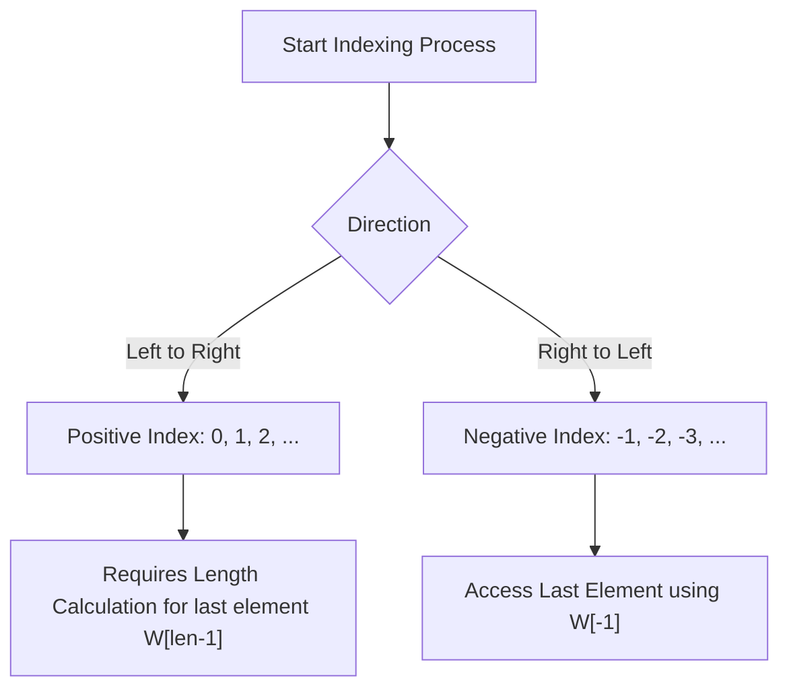
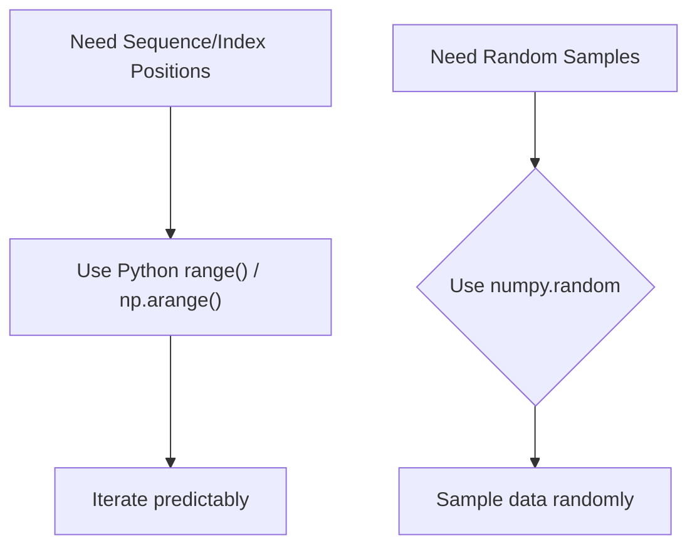
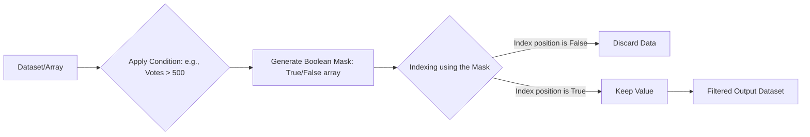

# live captions 20260623 204143


## Array Indexing with NumPy
Finding the index position of elements that meet a specific criteria within a NumPy array is achieved using the `np.where()` function.

*   The primary function for locating indices is `np.where()`.
*   The syntax involves comparing the array to the target value: `np.where(array == some_value)`.
*   This operation returns the coordinates (indices) where the condition (`== some_value`) evaluates to true across the entire array structure.


## Open Source Large Language Models (LLMs)
High-level discussion on open-source LLMs suggests a powerful trend in AI, aiming to compete with proprietary services like Codex and Google Cloud's offerings.

*   **Open Source Nature:** These models can be downloaded and run locally, providing greater autonomy and transparency compared to cloud-only solutions.
*   **Local Deployment:** Running the model locally requires significant hardware resources.
*   **Hardware Requirements:** Initial estimates indicate high resource needs, such as a minimum of 20 gigabytes (GB) of RAM, demonstrating that implementation specifications are crucial for deployment feasibility.

## Effective Study Note Strategies
The focus for effective learning should be on conceptual understanding rather than physical documentation methods.

*   **Prioritize Information Over Format:** The core need is acquiring the underlying *information* and concepts surrounding a topic, not necessarily detailed handwritten notes.
*   **Utilize Digital Notebooks:** Structured digital formats like Colab notebooks are highly recommended as they allow for passing on comprehensive, well-organized information and details.
*   **Conceptual Clarity:** When reviewing theory (especially high-level, theoretical subjects), the goal is to capture the *relationship* between concepts, which can then be structured into a notebook format.

## Python Indexing: Out-of-Bounds Errors and Negative Indexing

*   **IndexError Handling:** Attempting to access an index that does not exist within a sequence (like a list) will result in an `IndexError: value out of range`. This is a common error that programmers must handle with careful boundary checking.
*   **Standard vs. Negative Indexing:** Python supports two types of indexing:
    *   **Positive Indexing:** Counts elements from the left, starting at 0 (e.g., `W[0]`, `W[1]`).
    *   **Negative Indexing:** Counts elements from the right, providing a cleaner way to access end-of-list items (e.g., `W[-1]` refers to the last element).
*   **Efficiency of Negative Indexing:** Negative indexing provides highly efficient syntax for common tasks:
    *   The last element can be retrieved using `W[-1]`.
    *   The second-to-last element is accessed via `W[-2]`, and so on.

***

*Conceptual flow comparing positive vs. negative index counting:*



## Range and Array Indexing Logic (Start/End Parameters)

*   **Understanding the `end` Parameter:** A critical point in defining a range or slice is determining if the supplied `end` index value is inclusive or exclusive. The lecture highlights that the end boundary often represents one position *past* the desired final element, making it non-inclusive.
*   **Defining Boundaries:** When specifying both `start` and `end`, the system calculates the range up to (but not including) the value provided for `end`. If a specific index $k$ is desired as the end point, you must use $k+1$.
*   **Automatic Indexing with Blank Values:** When default or blank values are supplied for `start` or `end`, the internal logic automatically computes the full length of the array/data structure to correctly define the boundaries. This ensures that the slice captures all elements without explicit boundary input (e.g., reading "the first six elements").
*   **Index Calculation Flow:** The system processes the defined parameters sequentially:

```mermaid
flowchart TD
    A[Start Defining Range] --> B{Is Start Parameter Provided?}
    B -->|Yes| C["Set Beginning Index"]
    B -->|No (Blank)| D["Default to Array Index 0"]
    D --> E{Is End Parameter Provided?}
    C --> E
    E -->|Yes| F["Use Value - 1 for Last Included Index"]
    E -->|No (Blank)| G["Default to Array Length"]
    F --> H["Slice is defined: Start index up to End index - 1"]
    G --> H
```

***Example:*** If an array has 6 elements and you want the first six, supplying blank values for `start` and `end` allows the system to correctly infer indices $[0, 5]$ (length $N$), rather than requiring $(0, 6)$.

## Python Range and Advanced Indexing Concepts

### Understanding the `range()` Function
*   The primary use of `range()` is efficiently creating sequences of numbers or index positions without manually generating an array for large counts (e.g., iterating from 1 up to 10,000).
*   `range()` generates a sequence based on defined start, stop, and step values. It stops *before* reaching the `stop` value.
*   **Step Size Limitation:** The function does not guarantee reaching an arbitrary target number if the initial range limits or subsequent steps do not divide evenly (e.g., using a step size of 2 will never reach 10, even if the stop value is 10).
*   A key understanding is that `range()` is a Python *function*, and the resulting object is typically viewed as an integer sequence rather than a floating-point representation.

### Advanced Array Operations (NumPy Context)
*   **Random Number Generation:** For situations where random data, rather than a predictable sequence, is needed, NumPy provides functions like `np.random` to generate numbers randomly. This addresses the limitations of using sequential ranges.
*   **Negative Indexing and Steps:** When working with array-like structures (common in NumPy), negative indexing allows access elements from the end of the array (e.g., `-1` refers to the last element).
*   Advanced slicing can combine this with a negative step size for traversing arrays backward or skipping elements in reverse order.

### Conceptual Flow: Range vs. Random Generation
This diagram illustrates when to use sequential ranges versus random sampling within data processing.



## Data Masking and Boolean Indexing

*   **Boolean Data Type:** This fundamental data type consists of only two values, `True` or `False`. These values are crucial because they determine which elements in a dataset should be included during filtering.
*   **The Concept of Masking (Fancy Indexing):** Masking is the process of using boolean conditions to filter a dataset. Instead of iterating through every value, you create a 'mask'—an array of `True`/`False` values—that identifies which positions meet the required criteria.
*   When applying a mask, only data points corresponding to a `True` value in the mask are returned; all data points corresponding to `False` are effectively discarded (masked out).

**Process Flow: Data Filtering via Masking**



*   **Index Position:** When filtering, the system determines which index positions are kept. If a condition is met at index 5 (True) and not met at index 6 (False), only the data from index 5 will be included in the final result. This ensures precise selection of relevant records.
*   **Implementation Example:** To filter values, you apply a logical comparison (e.g., `both >= 500`). The resulting mask is then used to select all values that satisfy this condition simultaneously.

## Array Reshaping (`reshape`)

*   The `reshape` function is a fundamental concept in data science, particularly crucial for working with arrays in fields like NLP, Computer Vision, and Deep Neural Networks.
*   Reshape modifies the dimensions of an array (its structure) without altering the underlying data elements themselves.
*   **Constraint:** When reshaping, the total number of elements must remain constant. If the original array has $N$ elements, any resulting dimension configuration ($R \times C$) must satisfy $R \cdot C = N$.
*   If a proposed reshape violates this element count (e.g., trying to turn 10 elements into a $6 \times 2$ matrix), an error will occur.

### Usage Example

The syntax requires specifying the desired new dimensions:

```python
```
# Assuming Y is a vector/array with enough elements, e.g., size 10
Y = np.arange(10) 

# Reshaping into a 2D array of 2 rows and 5 columns (Total elements: 10)
reshaped_y = Y.reshape(2, 5) 
```

```
### Conceptual Flow: Reshaping Validation

The process ensures the dimensional transformation is mathematically possible based on element count.

```mermaid
graph TD
    A["Original Array (N Elements)"] --> B["Determine Target Shape - R x C"]
    B -->|R * C = N?| |Yes| C[Reshape Successful: New 2D Array]
    B -->|R * C != N?| D[Error: Cannot reshape array. Dimensions mismatch.]
```

## Technical Q&A and Data Representation Concepts

*   **Project Scope/EDA Business Cases:** The number of business cases for EDA projects needs confirmation from the team; this information will be updated in the group chat.
*   **Understanding Data Types (NumPy/Python):**
    *   The discussion highlighted that data type outputs, such as `np.int64` showing `0, 0`, are often just a representation of the value, not necessarily reflective of how the value is stored or computed when placed in a variable (`Y` or `O`).
    *   A single instance (e.g., `O`) will correctly resolve to `1`, regardless of its initial type representation (e.g., `O3`), confirming that Python/NumPy handles fundamental numeric operations consistently.

### Data Retrieval Concepts

The following questions were raised regarding data manipulation in notebooks:

*   **Retrieving Index from Values:** It is confirmed that there is a possibility to get the index based on values, and vice versa (`index from values of the array`).
    *   **Note:** This advanced topic requires a deeper understanding (and may be covered in a subsequent lecture).

### Key Takeaway: Code Representation

The core principle discussed regarding data representation was:

If you initialize a variable `O` as a zero-padded representation (`O3`), but perform a simple arithmetic operation that resolves to one, the system handles it correctly, proving that the output is merely a *representation* of the underlying value.

## Array Indexing, Slicing, and Range Behavior

### Core Principles of Indexing and Slicing
*   **Index Position Matters:** When accessing or slicing arrays/lists, the index position determines validity. Key checks must be performed:
    1.  Determine what part of the array you intend to slice (start point).
    2.  Confirm the direction of traversal relative to the current index and intended end point.
*   **Direction Check:** If the desired traversal direction is opposite, ensure that the starting index (`start`) is mathematically higher than the ending index (`stop`) when stepping backward, or vice versa.

### Default Range Behavior (Using `range()`)
When calling `range(start, stop, step)`, the default behavior governs how indices are generated:
*   `start`: Defaults to 0 (if omitted).
*   `stop`: Defaults to `len(arr)` (if omitted).
*   `step`: Defaults to 1 (if omitted).

### Advanced Slicing Cases and Equivalences
Specific scenarios demonstrate how list slicing can be used to manipulate the array in complex ways:

*   **Case 1: Getting All Elements:** Obtaining all elements of an array `arr` is equivalent to using a range function that starts at index 0 and continues through the length, stepping by 1.
    *   Representation: `range(len(arr), step=1)`
*   **Case 2: Reversing an Array (Negative Indexing):** To reverse the order of elements in an array (`arr`), negative indexing is used.
    *   Slicing Syntax: `arr[::-1]`

### Procedural Flow: Slicing and Index Calculation

The process for determining if a slice is valid or what its output will be follows a conceptual flow:

```mermaid
graph TD
    A[Start Slice Operation] --> B{Check 1: Start/End Indices Defined?}
    B -->|Yes| C{Check 2: Is Direction Valid?}
    C -->|Opposite?| D["Ensure start index is > end index (for reverse step)"]
    D --> E["Determine Final Index Sequence"]
    C -->|Same Direction| F[Generate sequence from start to stop]
    E --> G{Slice
    F --> G{Slice Output Generated}
```

---

## Backlinks
- [[live_captions_20260623_204143_20260625_135247]] → Array Indexing with NumPy
- [[live_captions_20260623_204143_20260625_153129]] → Array Indexing with NumPy
