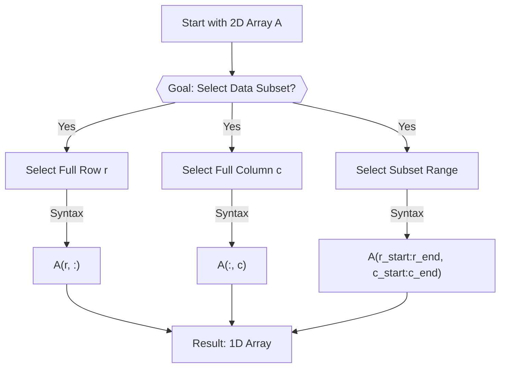
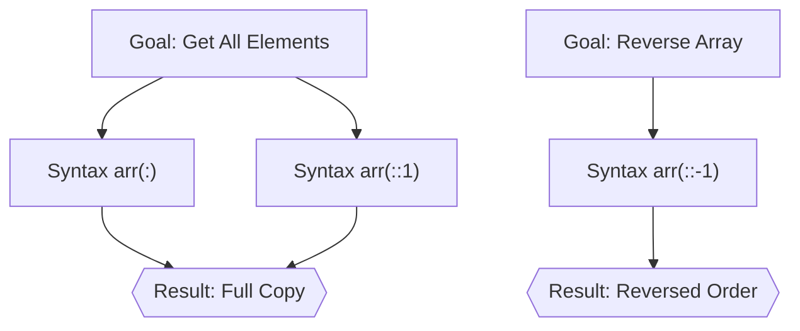
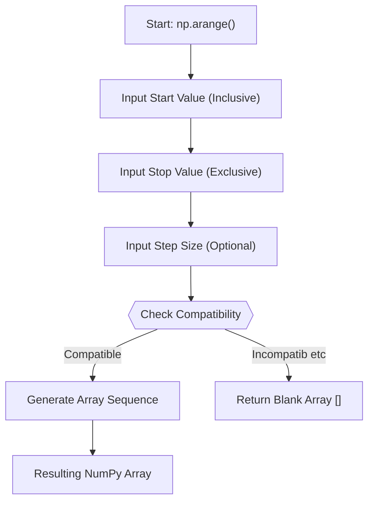
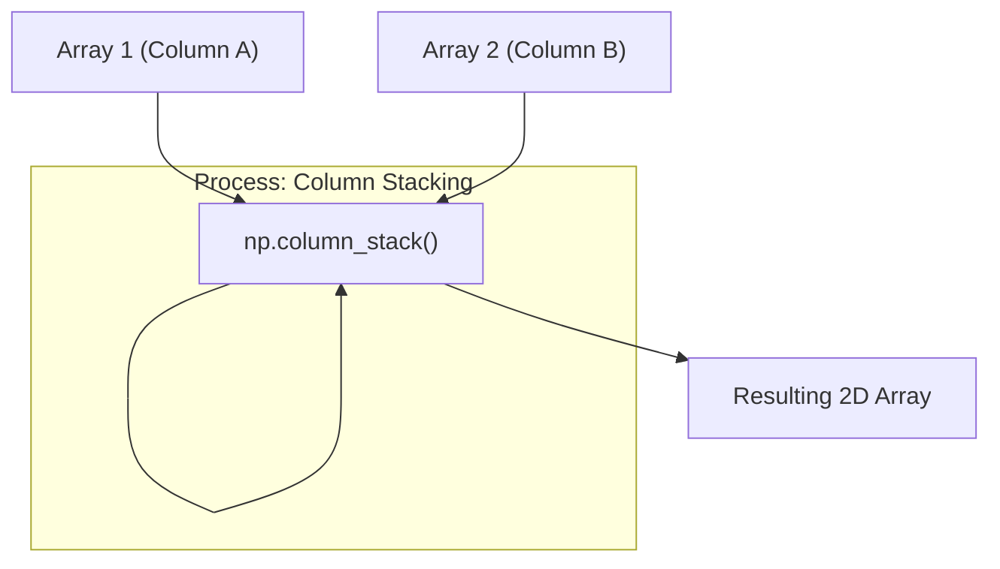
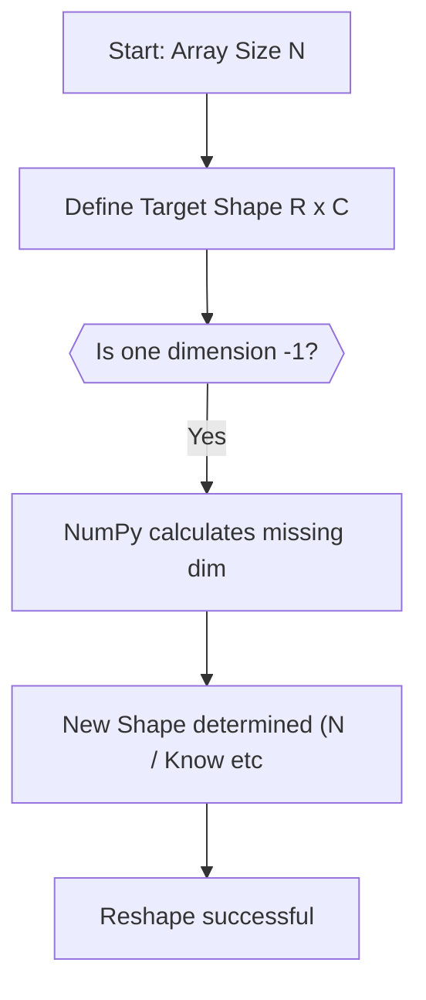
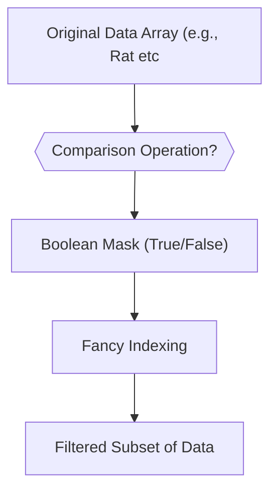
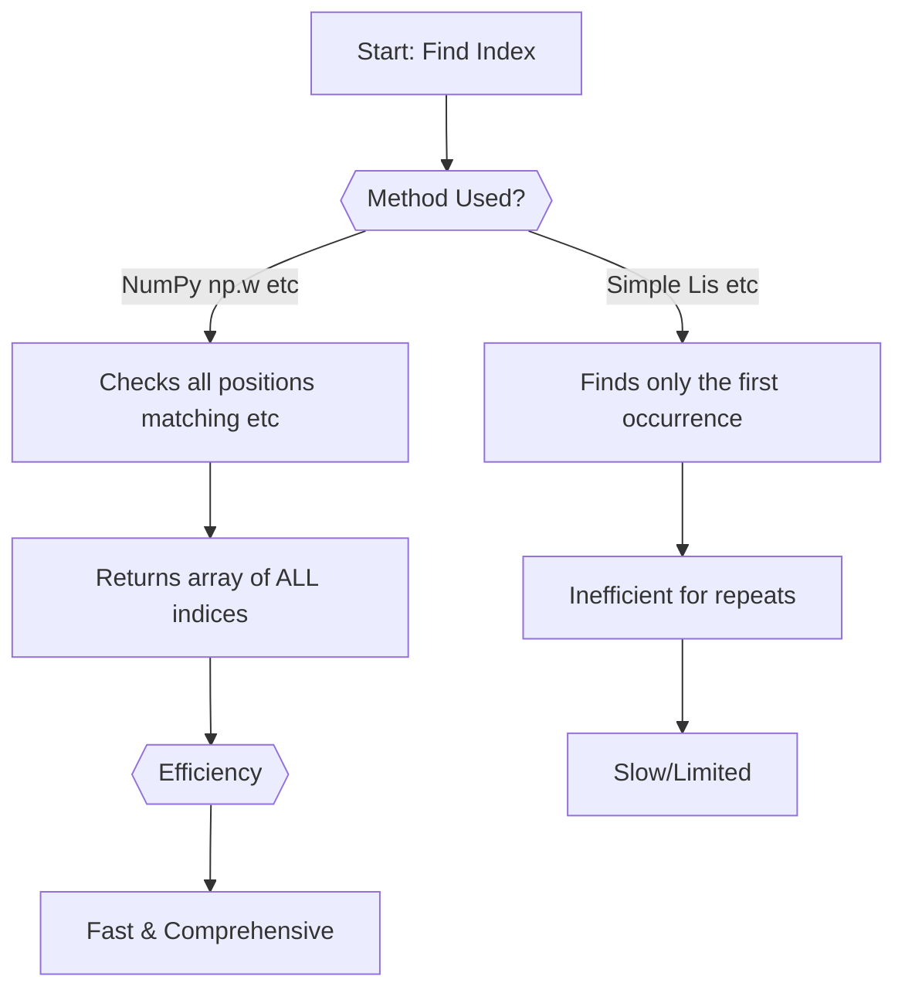
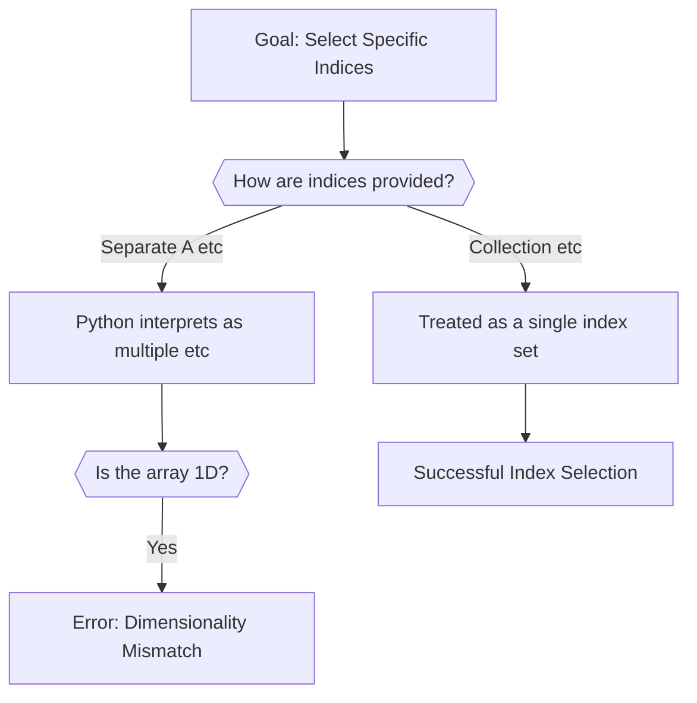

# [[Open Source Large Language Models (LLMs)]]

*   **Definition:** An open-source LLM is a model whose weights and architecture are publicly available, allowing users to download and run it locally.
*   **Competition:** These models aim to compete with proprietary industry leaders like OpenAI's Codex and Anthropic's Claude.
*   **Key Advantage:** The ability to run the model on private hardware ensures data privacy and full control over deployment.
*   **Deployment Requirements:** Running these models locally requires significant computational resources; for example, the speaker noted a requirement of at least 20 GB of RAM.

```mermaid
flowchart TD
    A["Open Source LLM Concept"] --> B["Download Model Weights"]
    B --> C{{Check Hardware Specs?}}
    C -->|"Yes (e.g. etc| D["Setup Local Environment"]
    D --> E["Run & Experiment Locally"]
    C -->|"No"| F["Increase Resources/Upgrade"]
```

# NumPy Fundamentals and Array Manipulation

## Core Concepts: Indexing, Slicing, and Dimensionality

*   **What is an Array?** In NumPy, an array is a collection of elements. Crucially, NumPy arrays are inherently **homogeneous**, meaning all elements must be of the same data type.
*   **Indexing:** Indexing is the method used to retrieve specific values from a NumPy array based on their position. All indexing starts counting positions (indices) from **0**.
*   **Basic Syntax:** Values are retrieved using bracket notation: `ArrayName[Index]`.

```python
import numpy as np

```
# Create a sample array W = [9, 5, 4, 3, 2]
W = np.array([9, 5, 4, 3, 2])

# Accessing elements by index
first_element = W[0]  # Retrieves 9
third_element = W[2] # Retrieves 4
```

*   **Slicing Syntax:** NumPy-like arrays use a comma-separated format `[row_range, column_range]` for indexing subsets of data.
    *   To select an entire row: `[r, :]`.
    *   To select an entire column: `[:, c]`.
    *   The primary goal is to extract specific columns or rows rather than just accessing a single element.

```


*   **Advanced Slicing Techniques:**
    *   **Full Copy/All Elements:** Using `arr[:]` or `arr[::1]` retrieves all elements.
    *   **Reversal:** Negative indexing is used for reversal: `arr[::-1]`.
    *   **Dimensionality Check:** It is crucial to verify the array's dimension using methods like `.ndim` to ensure correct bracket syntax.

```
```


```

## Data Generation and Structure

*   **Sequence Generation (`np.arange`):** Use `numpy.arange(start, stop, step)` to create evenly spaced numerical sequences (arrays). The `stop` value is always exclusive.
*   **Random Number Generation:** For stochastic data, use functions within the dedicated `np.random` module (e.g., `np.random.rand()`).
*   **Syntax Pitfalls:** When using `np.arange`, be careful with boundary conditions; incompatibility can lead to a silent blank array (`[]`).



*   **Stacking and Structure:** When combining multiple 1D arrays (columns) into a single dataset structure, the result is typically a two-dimensional array. The `np.column_stack` function efficiently creates this required matrix format. Data often adheres to **Structured Data** (tabular, fixed schema), while non-tabular data is considered Unstructured.



*   **Reshaping Arrays:** Reshaping changes the dimensions of data while preserving the total number of elements (e.g., size 14 into $2 \times 7$).
    *   **Automatic Dimension Calculation (`-1`):** Using `-1` tells NumPy to automatically calculate that dimension based on the total element count, avoiding manual calculation.



## Advanced Indexing and Filtering Techniques

*   **Boolean Masking:** When applying a comparison operator (e.g., `data >= 500`) to an entire array, the operation is vectorized, resulting in a boolean output (a mask). This mask contains `True` or `False`.
*   **Fancy Indexing:** This uses the boolean mask to select only the corresponding elements from the original dataset, effectively filtering the data without explicit loops.



*   **Finding Indices (`np.where`):** When searching for values that appear multiple times, standard list methods often only return the first occurrence. NumPy's `np.where` function is designed to find *all* indices where a condition is met and is significantly faster than native Python indexing due to C-level optimizations.



*   **Custom Ordering:** A key feature allows users to customize the order of output dimensions (axes), useful for reordering or "shuffling" array axes efficiently. This requires passing indices as a collection, not separate arguments.



# Effective Study and Note-Taking Strategies

*   **Focus on Information, Not Format:** Handwritten notes are often described as "scribbling" and may not capture the core concepts effectively.
*   **Prioritize Conceptual Understanding:** The goal of studying should be grasping the *information around* a topic, rather than transcribing every detail.
*   **Utilize Digital Notebooks:** Information can be organized and passed on into structured digital formats, such as collaborative notebooks (Collab Notes), which are highly effective for review.

***

# Conclusion

The notes have been polished by merging overlapping NumPy concepts (indexing, slicing, reshaping) into logical sections while retaining all original code blocks and diagrams.

---

## Slide captures


---

## Backlinks
- [[live_captions_20260623_204143_20260625_153129]] → Core Concepts: Indexing, Slicing, and Dimensionality
