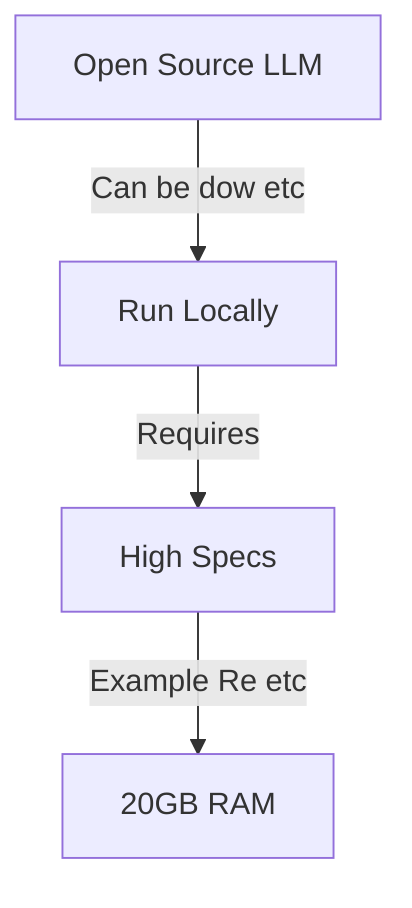
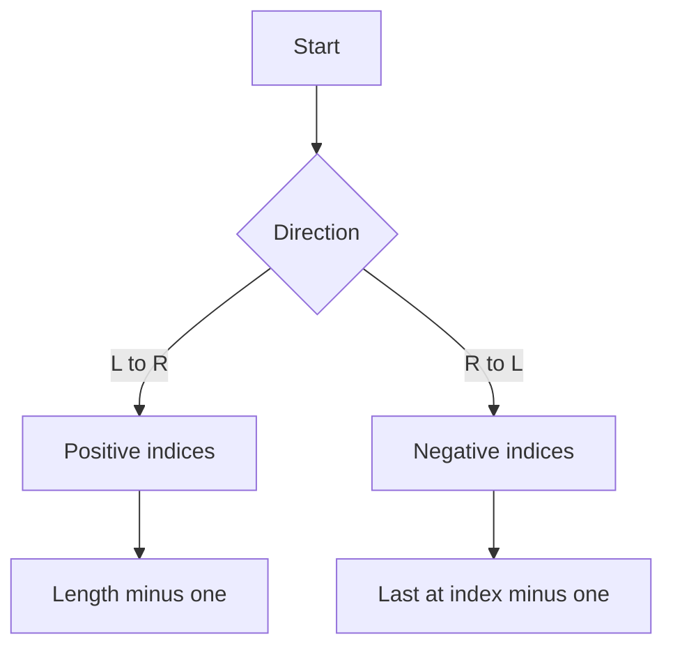
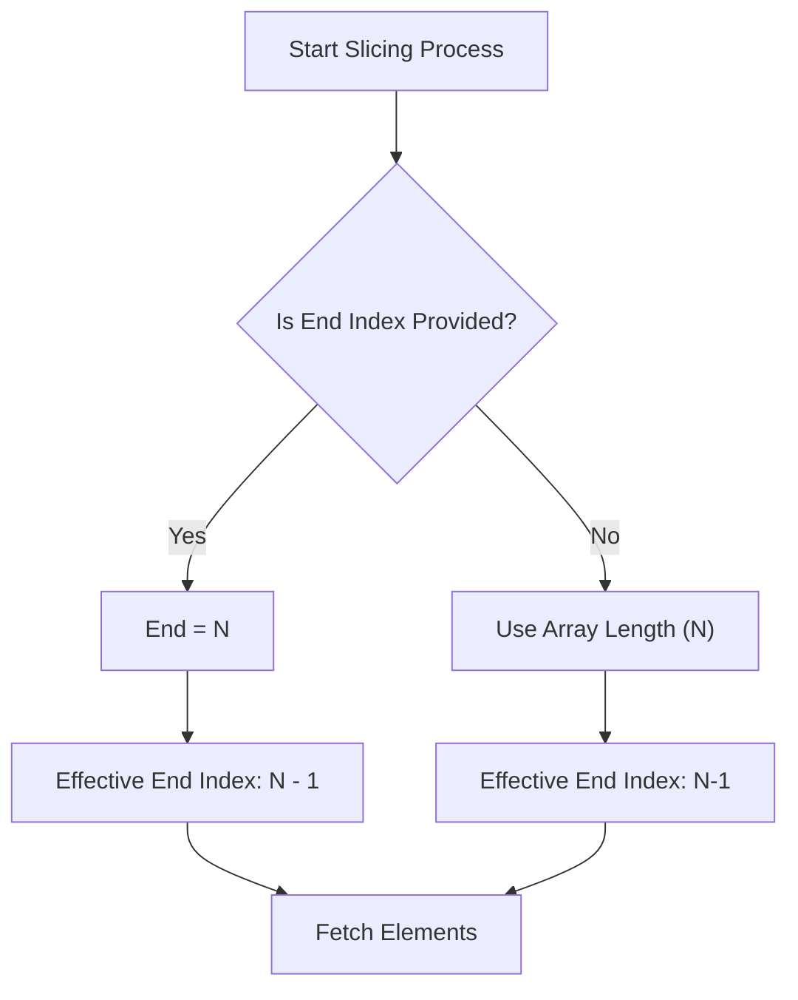
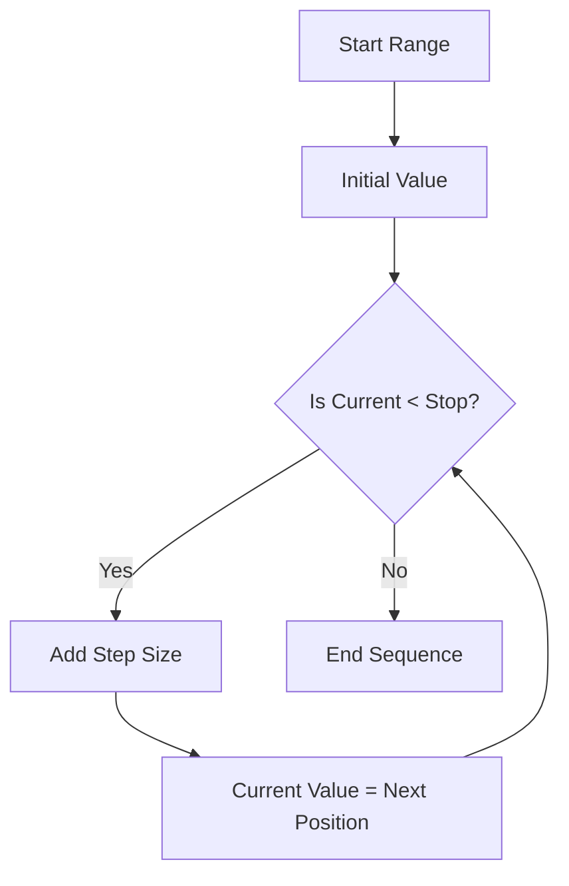
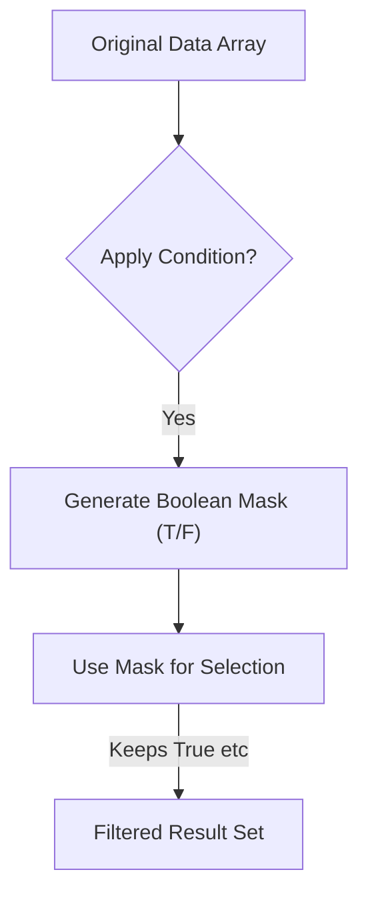
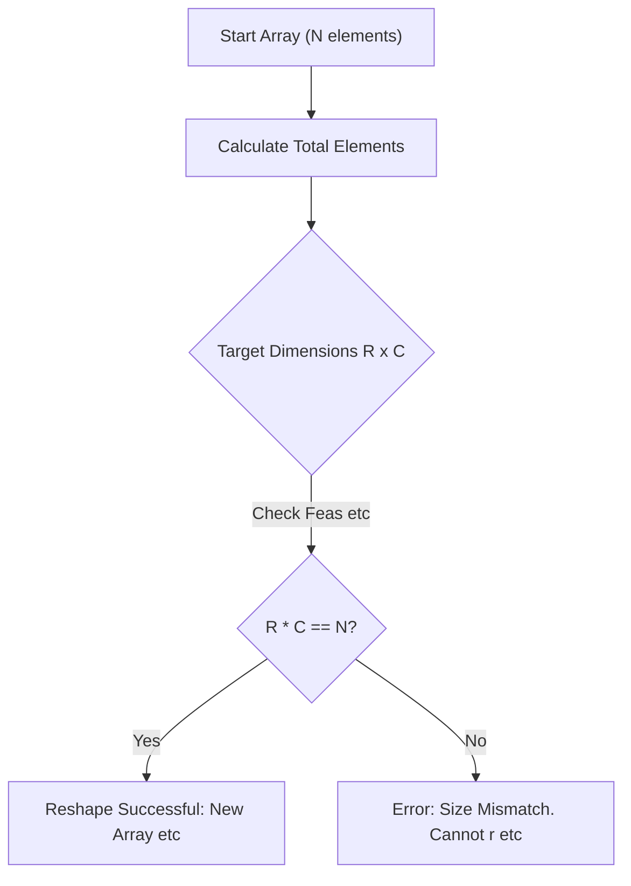
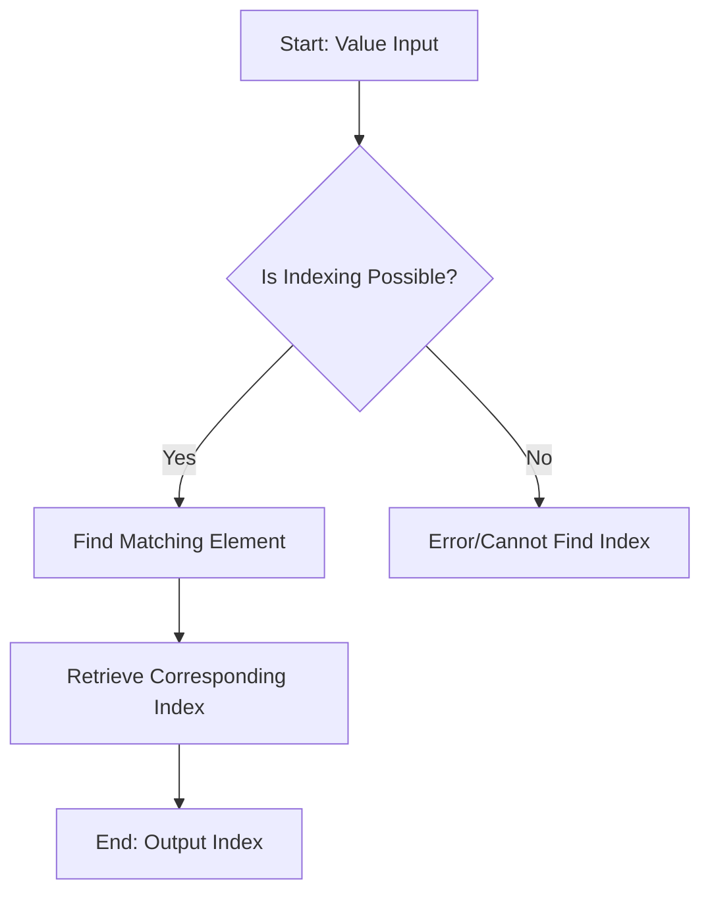
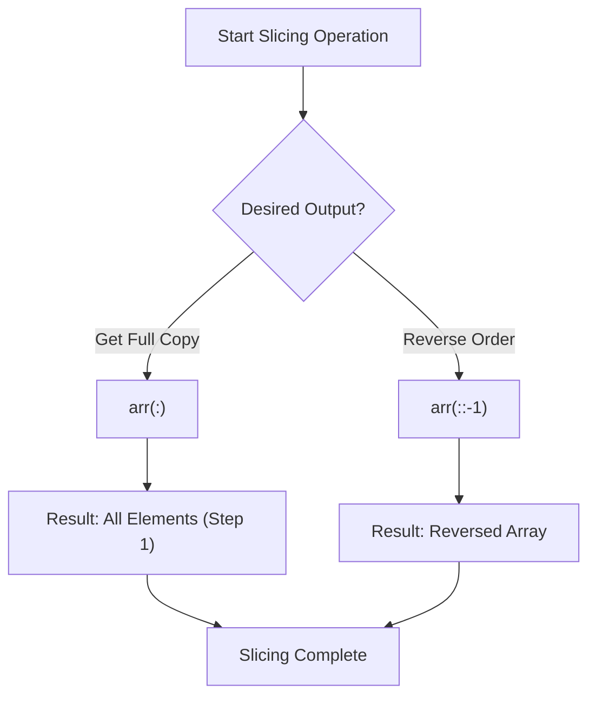

# live captions 20260623 204143

## AI Models and Data Handling Concepts

*   **NumPy Indexing:** To find the index position of a specific value within an array, utilize the `np.where()` function with a boolean mask (e.g., `np.where(array == value)`).
*   **Open Source LLMs:** These large language models are characterized by their ability to be downloaded and run entirely on local hardware, promoting privacy and control.
*   **Market Positioning:** Open source LLMs represent a direct effort to compete with established proprietary cloud services (e.g., Codex, Cloud APIs).
*   **Resource Demands:** Due to their size, running these models locally requires substantial computational resources, often demanding high amounts of RAM (e.g., 20 GB).

## Python Indexing: Errors and Negative Indexing Techniques

*   **IndexError:** This is a common runtime error that occurs when attempting to access an index position (e.g., `W[i]`) that falls outside the valid bounds of the array or list.
*   **Common Pitfall:** Programmers frequently encounter this error by assuming an index exists without first verifying its presence, making boundary checking crucial.
*   **Negative Indexing:** Python supports negative indexing, which allows elements to be accessed relative to the end of the sequence. For example, `W[-1]` always refers to the last element, and `W[-2]` refers to the second-to-last element.
*   **Efficiency:** Using negative indexing (e.g., `W[-1]`) is significantly cleaner and more robust than calculating offsets using positive indices (e.g., `W[len(W) - 1]`).

## Understanding Array Slicing Parameters

*   **End Index Definition:** When defining a slice using `[start:end]`, the system is exclusive of the `end` index. Therefore, if an end value $N$ is provided, the last included element will be at position $N-1$.
*   **Default Behavior (Open Ends):** If the start or end parameters are omitted (e.g., `[:6]` or `[start:]`), the system automatically computes the full length of the array ($N$) to determine the boundary, ensuring all available elements up to that point are included.
*   **Slicing Range:** The process determines a range by checking for explicit boundaries; if no end is given, it defaults to the maximum index (length $N$).

## Python Ranges and NumPy Efficiency

*   **`range()` Function Purpose:** The `range()` function is designed to generate index positions or sequences of numbers efficiently, especially for large datasets (e.g., 1 to 10,000). It does not create a full array in memory, saving significant resources compared to manually creating an array.
*   **Step Size Mechanics:** The step size dictates the increment between generated numbers. A sequence will increase by this step and will *never* reach or exceed the specified stop value (unless the start/stop values are adjusted).
*   **NumPy's Core Advantage:** NumPy is crucial for scientific computing due to its speed, particularly when performing array operations on large datasets. This efficiency makes it faster than standard Python list manipulations.
*   **Random Data Generation:** For scenarios requiring non-sequential data (e.g., simulating random events), the `numpy.random` module should be used as an alternative to sequential range generation.

## Data Filtering and Boolean Masking in Indexing

*   **Boolean Data Type:** This fundamental data type represents logical states, restricted to `True` or `False`. It is essential for creating conditions used in filtering datasets.
*   **Filtering Mechanism:** To filter a dataset (e.g., selecting votes greater than 500), a boolean mask is created by applying a condition across the entire array/column.
*   **Index Positioning:** When a boolean mask is applied, the system does not return all indices; it only returns the index positions corresponding to `True` values in the mask (e.g., if the mask is `[T, F, T]`, it keeps indices 0 and 2).
*   **Masking/Fancy Indexing:** This technique uses the generated boolean mask to select specific elements from a dataset. It is called "masking" because it effectively hides or filters out all data points where the condition evaluates to `False`.

## Array Reshaping Concept

*   **Importance:** The `reshape` operation is a critical concept encountered across various advanced fields like NLP, Computer Vision, and Deep Neural Networks (DNNs).
*   **Function:** It changes the dimensions of an array (e.g., from 1D to 2D) without altering the underlying data elements.
*   **Constraint:** The most crucial rule is that the total number of elements must remain constant before and after reshaping. If $N$ is the initial size, then $R \times C = N$.
*   **Syntax Example:** To reshape an array `Y` into a 2D structure with two rows and five columns: `Y.reshape(2, 5)`.

## Data Representation and Array Indexing Concepts

*   **Data Type Display vs. Value:** When working with NumPy data types (e.g., `np.int64`), displaying values like `0, 0` is purely a representation issue. The actual stored value can change when the data is manipulated or displayed in different contexts (e.g., showing 'O' might result in the value 1).
*   **Output vs. Value Retrieval:** A common question raised concerns how to retrieve the actual *output* value rather than just getting the underlying data type, particularly within environments like Jupyter Notebook.
*   **Index from Values:** The possibility of retrieving an index given a specific value within an array or list was repeatedly confirmed as possible, emphasizing that this requires good understanding and will be covered in subsequent lectures.

## Advanced Array Slicing Techniques

*   **Slicing Safety Checks:** When performing array slicing (`arr[start:stop:step]`), it is crucial to verify the intended slice range and direction. If traversing in an opposite direction, ensure that the starting index is numerically greater than or equal to the stopping index.
*   **Full Array Copy (`arr[:]`):** Using `arr[:]` is a standard method to retrieve a shallow copy of all elements within an array, regardless of its initial size. This syntax effectively sets the step size to 1 and omits explicit start/stop indices.
*   **Reversing Arrays:** To efficiently reverse the order of elements in an array, use negative slicing notation: `arr[::-1]`. This is a concise way to achieve reversal without manual iteration.

---

## Slide captures

---

## Backlinks
- [[live_captions_20260623_204143_20260625_153129]] → AI Models and Data Handling Concepts
