# live captions 20260623 204143


TOPICS: llms/open-source, ai/deployment

## [[Open Source Large Language Models (LLMs)]] and Deployment

*   **Definition:** An open source LLM aims to compete with proprietary models, such as Codex and Cloud, by providing accessible architecture for research and development.
*   **Local Deployment:** The "open source" nature allows users to download the model weights and run the entire system locally, ensuring privacy and control over data.
*   **Resource Requirements:** Running these advanced models demands significant computational resources; examples cited include needing substantial RAM (e.g., 20 GB).
*   **Study Focus:** While high-level theory is discussed, a deep understanding requires dedicated study of the model's architecture and underlying principles.

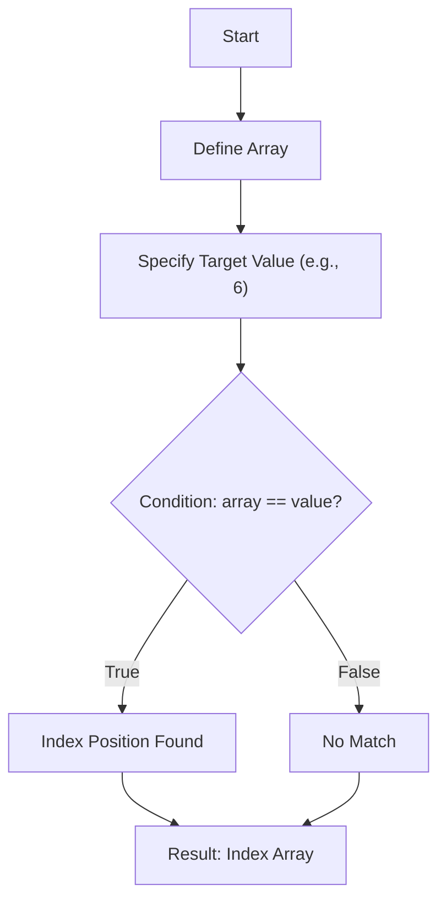

TOPICS: numpy/indexing/fancy_indexing, python/multithreading/practical_implementation

## NumPy Operations and Array Manipulation

*   **Lecture Focus:** The module aims to cover advanced operations related to NumPy arrays, including general array manipulation and specific indexing techniques.
*   **Learning Structure:** Each lecture maintains a consistent agenda, beginning with a 5-6 minute recap session to ensure all students remain synchronized with the material covered in the previous class.
*   **Core Topic:** The main subject for this segment is **Indexing**, specifically introducing concepts like "Fancy indexing" within NumPy arrays.
*   **Conceptual Note (Multithreading):** When covering advanced topics like multithreading, the approach will be to bypass the theoretical concept directly and instead utilize specialized Python libraries for practical implementation.

TOPICS: numpy/indexing, numpy/reshaping

## NumPy Operations and Array Manipulation

*   The lecture will cover core NumPy operations, focusing on efficient array manipulation techniques.
*   A portion of the time (5-6 minutes) is dedicated to a quick recap of material covered in the previous class to ensure all students are synchronized.
*   Key topics for today include:
    *   **Indexing:** Basic methods for accessing specific elements within NumPy arrays.
    *   **Fancy Indexing:** Advanced techniques allowing indexing using arrays of indices, enabling non-contiguous selection.
    *   **Reshaping:** Methods used to change the dimensions (shape) of an existing array without altering its underlying data.

TOPICS: numpy/indexing, numpy/reshaping, data_analysis/array_operations

## NumPy Operations and Data Analysis Recap

*   The lecture agenda covers advanced array manipulation techniques essential for data science using NumPy.
*   Key topics include **Indexing**, specialized methods like **Fancy Indexing**, and **Reshaping** arrays into 2D structures.
*   Aggregate functions are introduced, such as `np.all()`, `np.any()`, and `np.well()`, which perform checks across array dimensions.
*   Array operations covered include sorting a 2D array and performing matrix multiplication.

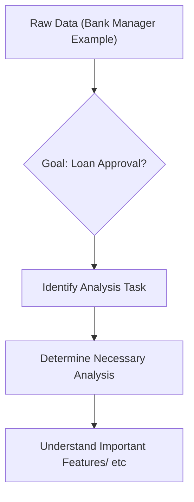

TOPICS: eda/overview, data_analysis/visualization, python/numpy

## Exploratory Data Analysis (EDA)

*   **Definition:** EDA stands for Exploratory Data Analysis. It is a crucial initial phase of data analysis used when we do not know what specific patterns or features we are looking for in the dataset.
*   **Goal:** The primary goal is to gain an understanding of the important features and underlying patterns within the data, which helps inform subsequent modeling steps (e.g., determining if loan approval is possible).
*   **Core Process Steps:** Performing EDA typically involves a sequence of actions:
    1.  Handling numerical operations (using libraries like NumPy).
    2.  Data manipulation and transformation (cleaning or restructuring the data).
    3.  Visualization to interpret patterns (using Matplotlib/Seaborn).
*   **Essential Tools:** Data analysis in Python relies on several core libraries, including:
    *   NumPy: For efficient numerical operations on arrays of numbers.
    *   Matplotlib & Seaborn: Libraries used for creating visualizations and interpreting data visually.

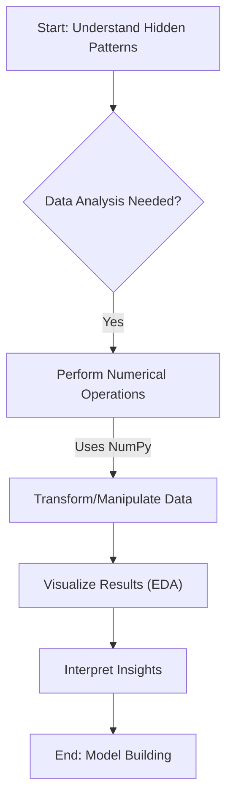

TOPICS: python/data-structures, numpy/basics/arrays

## [[Introduction to NumPy]]

*   NumPy is a fundamental library in Python designed specifically for high-performance numerical operations.
*   Its full form stands for "Numeric Python."
*   When learning NumPy, the primary conceptual comparison involves contrasting standard Python lists with specialized NumPy arrays.
*   The core focus of understanding NumPy's utility is determining the specific advantages that NumPy arrays offer over native Python data structures.

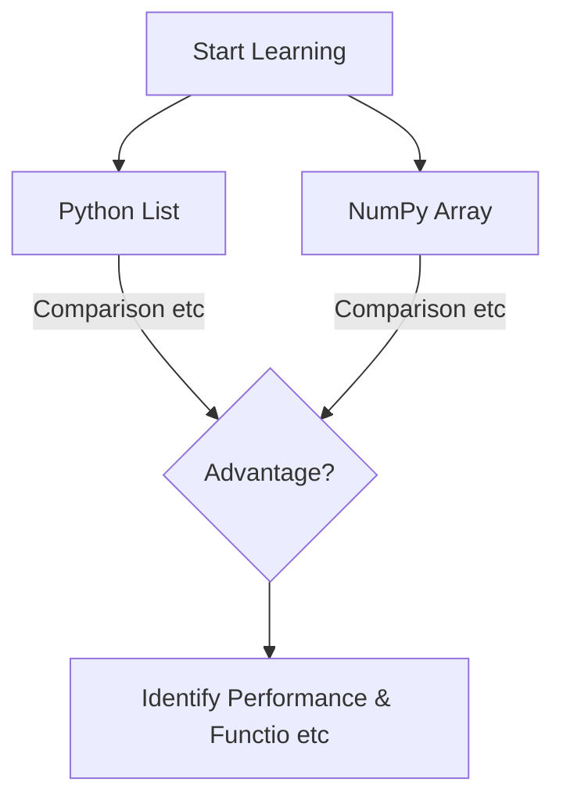

TOPICS: numpy/arrays/fundamentals, numpy/efficiency/vectorization

## NumPy Fundamentals: Efficiency and Usage

*   NumPy (Numerical Python) is a fundamental library designed for efficient numerical operations in Python, providing specialized array structures.
*   The primary advantage of using NumPy arrays over standard Python lists is **speed**, which allows for complex mathematical and data manipulations much faster.
*   This speed is achieved through underlying mechanisms like homogeneous memory allocation and contiguous memory storage, optimizing retrieval and processing.
*   To begin working with NumPy, the library must first be imported into the session using the convention: `import numpy as np`.
*   NumPy arrays enable vectorized operations, allowing multiple calculations to be performed on entire datasets simultaneously without explicit loops.

```python
```
# Importing the library
import numpy as np

# Creating an array from a standard Python list
data_list = [1, 2, 3]
np_array = np.array(data_list)
```

```
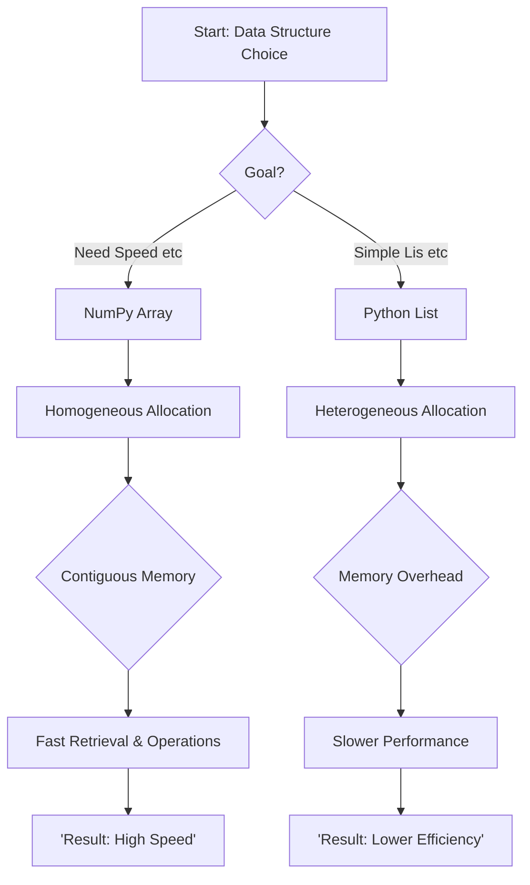
```

TOPICS: numpy/arrays, numpy/indexing/basics

```
## NumPy Array Indexing

*   **Definition of an Array:** An array is fundamentally a collection of elements. When using NumPy, these arrays are inherently **homogeneous**, meaning all elements must be of the same data type.
*   **Purpose of Indexing:** Indexing is the method used to access or retrieve specific values from a NumPy array based on their positional location.
*   **Indexing Mechanics:** Array indexing in Python (and NumPy) uses a zero-based system, meaning the first element is at index 0, the second at index 1, and so on.
*   **Syntax:** To access an element, the syntax used is `array_name[index]`.

```python
import numpy as np

```
# Example array creation (W)
W = np.array([9, 5, 4, 3, 2])

# Accessing specific elements by position:
first_element = W[0]  # Retrieves 9
third_element = W[2] # Retrieves 4
```

```
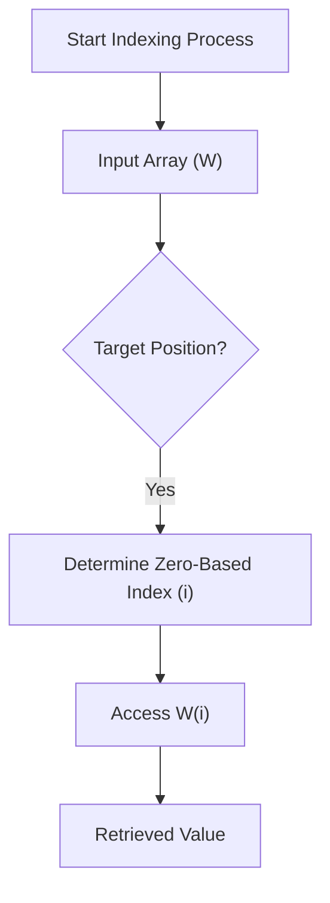
```

TOPICS: data_structures/arrays/dynamic_sizing, programming/algorithms/indexing

```
## Dynamic Array Sizing and Pattern Recognition

*   Programming proficiency hinges on understanding underlying patterns rather than memorizing specific syntax or values.
*   Hardcoding array sizes or indices (e.g., assuming a fixed size of 4) creates inflexible code that fails when data structure requirements change.
*   The core challenge is developing dynamic formulas to calculate necessary dimensions based on the actual input data length.
*   A common pattern for determining the maximum valid index in an array is calculating its total length minus one ($L - 1$).

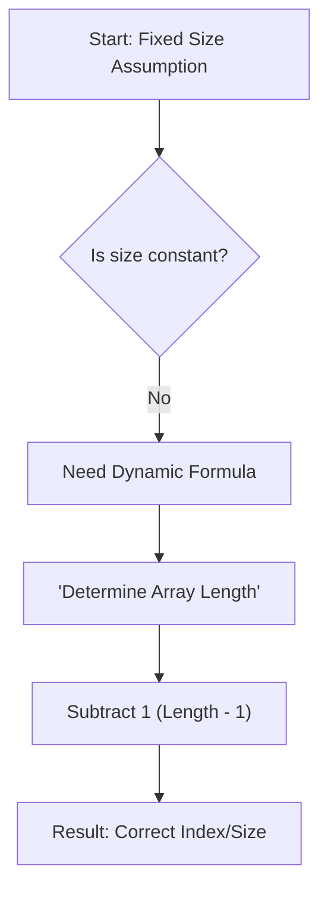

TOPICS: programming/data_structures/array_indexing, python/errors/indexerror

## Array Indexing and Dynamic Length Calculation

*   **Pattern Recognition:** Programming relies on understanding patterns; hardcoding indices (e.g., `W[4]`) is fragile because it fails if the array size changes.
*   **Dynamic Formula:** To reliably access elements, especially the last one, a dynamic formula must be used based on the array's length.
*   **Calculating Last Index:** The index of the last element in an array (or list) is always calculated by: `len(array) - 1`.
*   **Python Implementation:** In Python, this can be achieved using the built-in function `len()`: `len(W) - 1`.
*   **Common Error Handling:** A frequent programming error is attempting to access an index that does not exist (out of bounds), which results in an `IndexError`.

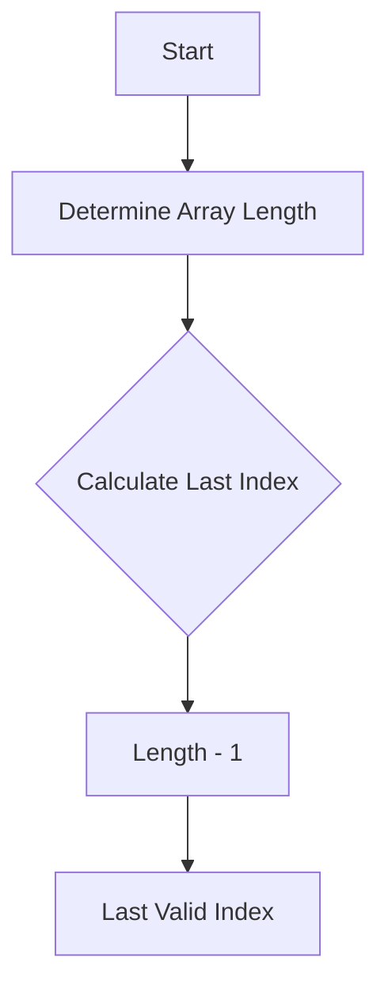

TOPICS: python/indexing, python/slicing

## Python Indexing and Slicing

*   **IndexError:** A common error occurs when attempting to access an index that is out of bounds (e.g., accessing `list[5]` when the list only has 4 elements).
*   **Two Types of Indexing:**
    1.  **Positive Indexing:** Standard counting from left-to-right, starting at 0 (`0, 1, 2...`).
    2.  **Negative Indexing:** Counting from right-to-left, which is often simpler for accessing elements near the end (e.g., `-1` is the last element, `-2` is the second to last).
*   **Limitation of Single Retrieval:** Retrieving data one element at a time (`list[i]`) is inefficient if the goal is to obtain a collection or segment of multiple values.
*   **Slicing Solution:** To efficiently retrieve a *collection* (a set/segment) of elements, Python uses **slicing**, which allows defining a range using syntax like `[start:end]`.

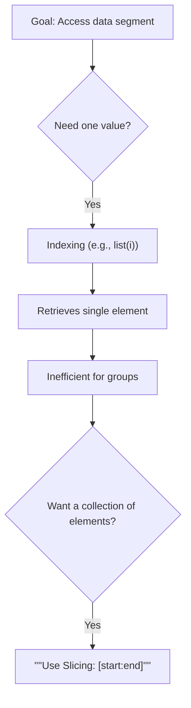

TOPICS: data_structures/arrays/indexing, data_analysis/segment_extraction

## Array Indexing and Segment Extraction

*   Extracting a segment of data requires defining specific boundaries within the dataset.
*   The fundamental parameters needed for extraction include the starting value, the starting index, and the desired endpoint or length.
*   Indexing in these contexts is zero-based, meaning the first element is at index 0, the second at 1, and so on.
*   When defining a range (e.g., needing elements corresponding to values 2, 3, and 4), one must correctly map those values back to their numerical indices.

TOPICS: arrays/indexing, data_selection/subset_retrieval

## Array Indexing and Subset Selection Concepts

*   **Zero-Based Indexing:** Arrays use zero as the starting index position (0, 1, 2, etc.).
*   **Indexing Errors:** Attempting to access a one-dimensional array using multiple indices (e.g., `arr[i, j]`) will result in an `IndexError` because the array is not structured for that dimensionality.
*   **Selection vs. Range:** It is crucial to distinguish between selecting elements by their specific index list and defining a continuous range of elements.
*   **Subset Retrieval:** When retrieving a subset of desired values, you are generally *not* mandatory required to write out every single index if the selection logic can define the group (e.g., using boolean indexing or advanced slicing).

```mermaid
flowchart TD
    A["Goal: Select Data Subset?"] --> B{Method Used?}
    B -->|Specific I etc| C["Provide list of indices"]
    B -->|Continuous etc| D["Define start and end points"]
    C --> E{Must I list all indices?}
    D --> E
    E -->|No (If sel etc| F["The answer is No"]
    F --> G["Focus on the desired elements etc"]
```

TOPICS: data_structures/arrays/indexing, indexing/slicing, advanced_indexing

## Advanced Indexing and Slicing

*   **Non-Contiguous Selection:** To retrieve a specific subset of elements without listing every index, you can pass an explicit list of indices inside the indexing brackets (e.g., `arr[[2, 4, 6]]`).
*   **Slicing Syntax (`[start:end]`):** Standard slicing selects a range of values. Crucially, the `end` index is always **exclusive**, meaning the element at that index is not included in the resulting slice.
*   **Boundary Safety:** To prevent "out of bound" errors when calculating indices (especially when using length $N$), it is common practice to safeguard calculations by using $N-1$.
*   **List Indexing vs. Range Slicing:** While `[start:end]` handles continuous ranges, passing a list like `[[2, 4, 6]]` allows for selecting specific, non-sequential indices directly.

```mermaid
flowchart TD
    A["Data Array"] --> B{Goal: Select Subset?}
    B -->|Yes| C["Use Indexing/Slicing"]
    C --> D["'''Syntax["'''start:end'''"]'''"]
    D -->|End is Exc etc| E["Selects elements up to, but no etc"]
    E --> F["Resulting Sublist"]
```

TOPICS: programming/data_structures/indexing, python/list_manipulation/selection_methods

## List Indexing and Selection Methods

*   Indexing utilizes integer positions to access specific elements within a sequence or list.
*   When defining what to select, you can either specify a continuous range using `range()` or provide an explicit, ordered subset list of indices.
*   Using single brackets (e.g., `list[single_bracket]`) is highly restrictive; it will only retrieve one collection or value, even if the underlying data structure could support multiple values.

```mermaid
flowchart TD
A["Start Indexing"] --> B{What to Select?}
B -->|Use range()| C["Select by Range"]
B -->|Specific I etc| D["List of indices (subset)"]
B -->|Single Bra etc| E["One Collection/Value Only"]
C --> F["Result: Sequence"]
D --> F
E --> G["Result: Single Value"]
```

TOPICS: data_manipulation/advanced_indexing/multi_selection

## Advanced Data Indexing and Output Customization

*   **List of Indices:** When selecting multiple indices in a single dimension (e.g., 1D array), passing them as a list within square brackets (`arr[[i, j, k]]`) is crucial. This tells the system you are providing a *collection* of indices for that axis.
*   **Interpretation Error:** If the indices are passed incorrectly or if the function expects separate arguments, the system may misinterpret the input (e.g., treating `[i, j, k]` as three separate positional arguments), leading to errors like "array is one dimensional but you have given three indices."
*   **Custom Order Utility:** A key feature discussed is the ability to customize or shuffle the output order of data points (e.g., forcing a sequence like 4, 3, 2). This capability is highly efficient because it allows users to define any desired custom order regardless of default settings.

```mermaid
flowchart TD
    A["Input: Indices"] --> B{Is input wrapped in []?}
    B -->|No (Separa etc| C["System interprets as separate etc"]
    C --> D["Error: Dimensional mismatch"]
    D --> E["Failure"]
    B -->|Yes (Colle etc| F["System interprets as a single etc"]
    F --> G["Correctly selects multiple values"]
    G --> H["Success"]
```

TOPICS: numpy/indexing, numpy/error-handling

## NumPy Indexing and Error Handling

*   **Custom Ordering/Indexing:** NumPy allows users to customize the order of elements or select specific indices, which is highly efficient for targeted data retrieval.
*   **Out-of-Bounds Robustness:** Unlike standard programming practices that might throw an error when accessing an index beyond the array's length (e.g., passing 11 to a 10-element array), NumPy is designed to handle these situations gracefully.
*   **Exceptional Exception Handling:** This built-in feature allows NumPy arrays to process requests for indices outside their defined scope without crashing, instead returning the remaining elements up until the end of the list.

```mermaid
flowchart TD
    A["Start: Attempting Index Access"] --> B{Is Index within Array Bounds?}
    B -->|Yes| C["Return Value at Specified Index"]
    B -->|No (Out of etc| D["NumPy handles error gracefully"]
    D --> E["Returns remaining elements up etc"]
```

TOPICS: python/numpy/array_bounds, programming/syntax_variations

## Array Outer Bound Handling Syntax Variations

*   The lecture segment reviews various methods for ensuring proper management of array outer bounds in programming contexts.
*   Multiple "cute ways" are demonstrated to write this boundary handling logic, highlighting syntactic flexibility within the language (e.g., Python/NumPy).
*   One alternative syntax discussed involves using simple dot (`.`) notation for concise implementation.
*   Another method shown is structuring the code with `both two`, presented as an aesthetically pleasing and functional alternative.

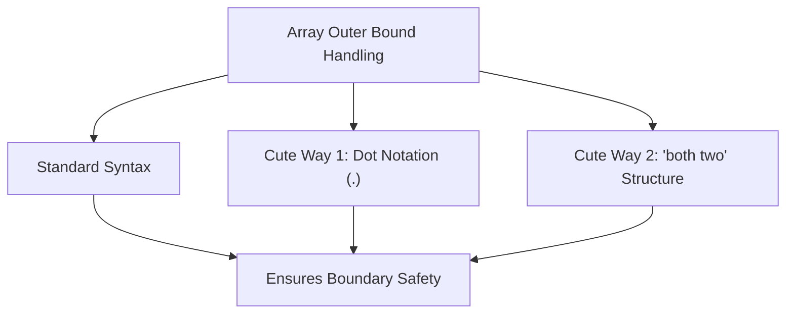

TOPICS: python/numpy/slicing, numpy/arrays/indexing

## NumPy Array Slicing Syntax

*   **Flexible Indexing:** Python/NumPy allows multiple syntaxes (e.g., using commas, colons, or omitting values) to achieve the same array slice result; these methods are functionally equivalent.
*   **Default Start Behavior:** If the starting index is omitted or set to `None`, NumPy automatically defaults the start point to the beginning of the array (index 0).
*   **Default End Behavior:** Similarly, if the ending index is omitted or set to `None`, NumPy defaults the end point to the last element of the array.
*   **Consistency:** The final slice result remains consistent whether explicit indices are provided or if the boundaries rely on NumPy's default behavior.

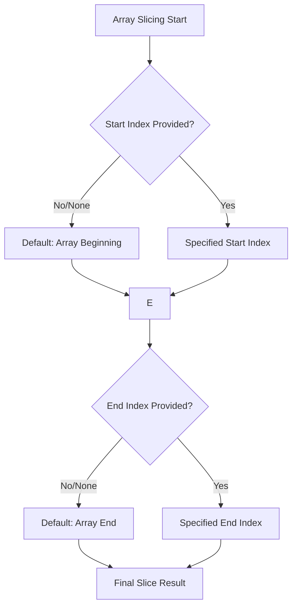

TOPICS: python/data-structures/slicing, python/arrays/indexing

## Array Indexing and Slicing Principles

*   **Slicing Syntax:** Python uses the format `[start:end]` to extract a subsequence from an array or list.
*   **Default Start Behavior:** If the starting index is omitted, the slice automatically begins at index 0 (the beginning of the sequence).
*   **Default End Behavior:** If the ending index is omitted, the slice extends all the way to the end of the array (index N-1).
*   **Full Array Retrieval:** When both `start` and `end` indices are omitted (`[:]`), the entire contents of the array are retrieved.

```mermaid
flowchart TD
    A["Start Slicing Operation"] --> B{Is Start Index Provided?}
    B -->|Yes| C["Use Specified Start"]
    B -->|No (Omitted)| D["Default Start = 0"]
    C --> E{Is End Index Provided?}
    D --> E
    E -->|Yes| F["Use Specified End"]
    E -->|No (Omitted)| G["Default End = N (Length)"]
    F --> H["Result: Extracted Slice"]
    G --> H
```

TOPICS: programming/indexing, data_structures/arrays

## Zero-Based Indexing and Element Counting

*   **Indexing starts at zero:** In most programming contexts, the first element of a sequence or array is assigned index 0, not 1.
*   **Elements vs. Indices:** The number of elements (the count) is always one greater than the highest index used.
*   **Determining Index Range:** If you need to access $N$ total elements, the indices will span from 0 up to $N-1$.
*   **Example:** To read the first six elements, the indices required are 0, 1, 2, 3, 4, and 5.

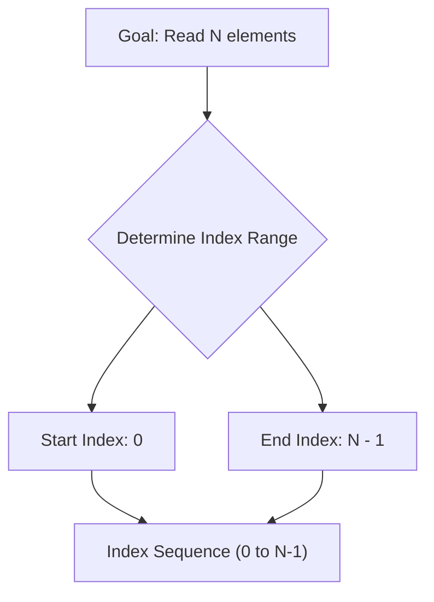

TOPICS: numpy/arrays/indexing, numpy/dimensionality/slicing

## NumPy Array Indexing and Dimensionality

*   **Basic Slicing Syntax:** When slicing an array to retrieve a range of elements, the syntax typically uses `start:stop` (e.g., retrieving the first six elements).
*   **Dimensionality Check:** It is crucial to distinguish between 1D arrays (which use single brackets) and 2D arrays (which require double square brackets `[[...]]`).
*   **2D Array Creation:** To correctly initialize a two-dimensional array in NumPy, the syntax must include nested lists or double square brackets.
*   **Subsetting Data:** Subsetting an existing 2D array is entirely possible using slicing, but it requires defining separate ranges for both the rows and the columns (e.g., `[row_range, col_range]`).

```mermaid
flowchart TD
    A["Start: Array Handling"] --> B{Check Dimension}
    B -->|Is 2D?| C["''''Use["'''[ etc'''"]'''"] Syntax"]
    C --> D["Create 2D Array"]
    D --> E["Subset Data using Slicing"]
    E --> F["'Define Row Range'"]
    E --> G["'Define Column Range'"]
    F --> H["Result: Subsetted View"]
    G --> H["Result: Subsetted View"]
```

TOPICS: numpy/arrays, indexing/slicing, dimensionality/ndim

## Advanced Array Indexing and Dimensionality

*   Arrays are fundamentally structured as a rows and columns format, requiring indexing to specify both row ranges and column ranges simultaneously.
*   To select specific subsets of data (slicing), you must provide index ranges for all dimensions (e.g., `[row_range, column_range]`).
*   When creating 2D NumPy arrays, ensure the use of double square brackets (`[[...], [...]]`) to define nested structures correctly.
*   The dimensionality of an array can be programmatically checked using the `.ndim` attribute (e.g., `array.ndim == 2`).

```mermaid
flowchart TD
A["Start Array Creation"] --> B{Desired Dimension?}
B -->|1D Array| C["''''np.array([a, b, c])''''"]
C --> D["Shape: (3,)"]
D --> E{Check Dim: arr.ndim == 1}
B -->|2D Array| F["''''np.array([[a, b], [c, d'''"]])"]
F --> G["Shape: (2, 2)"]
G --> H{Check Dim: arr.ndim == 2}
```

TOPICS: numpy/indexing/selection, arrays/1d_arrays/basics

## Array Indexing and Data Selection

*   **Data Extraction Objective:** The primary goal discussed is efficiently selecting specific columns or elements ("getting this guy") from a dataset, often by passing the column index or name directly.
*   **1D Arrays:** Understanding 1D arrays is emphasized as a fundamental concept (and was noted as an assignment topic), suggesting mastery of basic array structures is prerequisite for advanced selection techniques.
*   **Coordinate Syntax:** When specifying coordinates (e.g., row and column indices), the use of commas is standard, but the speaker explicitly notes that colons are generally *not* required (e.g., "2 comma 2" vs. "2:2").
*   **Selection Mechanism:** Data selection often involves passing multiple columns or specifying a single index value to isolate desired data subsets.

TOPICS: numpy/advanced_indexing/slicing, numpy/arrays/dimensionality

## Advanced NumPy Array Slicing and Indexing

*   **Row and Column Selection:** To select a specific row or column, use slicing notation. For example, `arr[2, :]` selects the second row entirely, while `arr[:, 2]` selects the third column entirely.
*   **Comma Requirement:** When indexing multiple dimensions (rows and columns), a comma is mandatory to separate the indices: `arr[row_slice, col_slice]`. Omitting it changes the meaning of the operation.
*   **Dimensionality Preservation:** Simple slicing can sometimes collapse or alter the expected shape. To ensure that an array subset retains its original structural dimensions (e.g., when selecting a range), careful use of brackets and indexing is required.

```mermaid
flowchart TD
    A["Original 2D Array Y"] --> B{Goal: Select Subset}
    subgraph Simple Slicing (Subset Selection)
        B --> C1["'''Y["''':, 2:'''"]'''"]
        C1 --> D1["Result: All rows, columns from etc"]
    end
    subgraph Structured Slicing (Preserving Shape)
        B --> C2["'''Y["''': , :'''"]'''"]
        C2 --> D2["Result: Full array structure p etc"]
    end
    D1 -->|Focuses on etc| E["Subset"]
    D2 -->|Maintains etc| F["Shape Preservation"]
```

TOPICS: numpy/arrays/slicing, numpy/shape_preservation

## NumPy Array Slicing and Shape Preservation

*   **Dimensionality vs. Structure:** When slicing a multi-dimensional array (e.g., 2D), simple indexing like `Y[i]` only extracts a single dimension (e.g., a row or column) and collapses the structure, potentially losing the original shape information.
*   **Preserving Shape:** To ensure that the resulting slice maintains the full dimensionality of the original array, use the colon `:` notation for all axes you wish to keep (`Y[:, :]`). This explicitly tells NumPy to select all elements along those dimensions.
*   **Advanced Slicing Syntax:** For precise segment extraction in a 2D array `W`, the syntax is `W[row_start:row_end, col_start:col_end]`. Both row and column selections must be defined using ranges or indices.
*   **Range Behavior:** Remember that slicing defines an *exclusive* range; if you specify a slice from index $A$ to $B$, the element at index $B$ is not included in the resulting segment.

```mermaid
flowchart TD
    subgraph Array Slicing Rules
        Start["Original 2D Array Y"] --> A{Slicing Method?}
        A -->|Simple Ind etc| B["Result: Single Dimension Slice"]
        B --> C["Shape Change"]
        A -->|Full Range etc| D["Result: Full Structure Preserved"]
        D --> E["Original Shape Maintained"]
    end
```

TOPICS: data_manipulation/indexing, data_structures/ranges

## Defining Data Ranges and Slicing Boundaries

*   **Range Definition:** When calculating or selecting data, the goal is often to capture everything from "one onwards" (index 1) up to the maximum available index.
*   **Boundary Constraint:** The desired range must always be constrained by the physical dimensions of the data structure—specifically, thinking in terms of rows and columns.
*   **Focus on Inclusion:** The process emphasizes that the goal is to include all elements from the starting point (1) up to the end, rather than excluding specific indices like '7'.

```mermaid
flowchart TD
    A["Start: Need Data Range"] --> B["Define Start Point: 1 onwards"]
    B --> C{Apply Constraints?}
    C -->|Yes| D["Row/Column Boundaries"]
    D --> E["Result: Desired Data Set"]
    C -->|No| F["Incomplete Selection"]
```

TOPICS: numpy/arrays/arange, python/basics/range_comparison

## Understanding np.arange()

*   **Purpose:** `np.arange()` is used to create NumPy arrays containing evenly spaced values, serving as a powerful alternative to Python's built-in `range()` function.
*   **Syntax and Range:** The basic syntax is `np.arange(start, stop)`, where the array includes elements starting at `start` but stops *before* reaching `stop` (the stopping value is exclusive).
*   **Step Size Control:** An optional third argument allows defining a specific step size: `np.arange(start, stop, step)`. This controls the interval between generated numbers.
*   **Advanced Functionality:** A key benefit of NumPy's implementation is its ability to handle floating-point (decimal) values for both the step size and the range limits (e.g., using a step size of `0.2`).

```mermaid
flowchart TD
A["np.arange()"] -->|Input 1: Start| B["Starting Value"]
A -->|Input 2: Stop| C["Stopping Value (Exclusive)"]
A -->|Input 3: S etc| D["Step Interval (Optional)"]
B --> E{Generate Array Elements?}
    C --> E{Generate Array Elements?}
    D --> E{Generate Array Elements?}
E -->|Yes| F["NumPy Array"]
E -->|No| G["Error/Empty Array"]
```

TOPICS: python/basics, python/ranges

## The Python Range Function

*   **Purpose:** `range()` is a highly efficient number function used to generate sequences of index positions or elements, particularly useful when dealing with large datasets where creating an explicit array would consume excessive memory.
*   **Flexibility in Steps:** Unlike basic integer ranges, the function can accept decimal step sizes (e.g., 0.2), allowing for fine-grained numerical indexing and sequence generation.
*   **Nature of Object:** The `range` object itself is a representation, not an actual list or array. This explains why printing it does not display every number in the sequence; it only shows its type and limits.
*   **Boundary Conditions:** The function's output is strictly governed by the step size relative to the stop value. If the step size is too large, the sequence may never reach the specified endpoint.

```mermaid
flowchart TD
    A["Start Range Generation"] --> B{Current Value + Step > Stop?}
    B -->|Yes| F["End of Sequence"]
    B -->|No| C["Add Current Index"]
    C --> D["Increment by Step Size"]
    D --> E{Check Boundary Conditions}
    E -->|Continue| B
    E -->|Stop| F
```

TOPICS: python/data_types/number_representation, numpy/random_generation

## Number Generation in Python

*   **Number Representation:** When dealing with whole numbers or ranges in Python, the output representation might suppress trailing zeros (e.g., printing `1` instead of `1.0`), which is a display/representation issue rather than an underlying mathematical error.
*   **Deterministic vs. Random:** Standard methods like `range()` generate predictable, sequential numbers. However, sometimes random number generation is required for simulation or sampling.
*   **Random Generation Tool:** The primary method discussed for generating random numbers in Python is using the `numpy` library's module, specifically `np.random`.
*   **Concept Shift:** This concept moves the focus from defining a sequence (start, stop, step) to defining a distribution or probability space.

```mermaid
flowchart TD
    A["Need Numbers"] --> B{How to generate?}
    B -->|Sequence| C["Use range() function"]
    C --> D["Output: Predictable Sequence"]
    B -->|Randomly| E["Use np.random module"]
    E --> F["Output: Random Sample from Dis etc"]
```

TOPICS: numpy/arange, numpy/random_generation, numpy/performance

## NumPy Array Generation and Indexing Rules

*   **Efficiency:** NumPy is significantly faster than native Python sequences or standard `range()` functions because it performs operations on optimized, underlying C-based arrays.
*   **Random Number Generation:** For generating random numbers, use dedicated methods like `np.random` rather than relying on sequential generation techniques.
*   **`np.arange(start, stop, step)` Syntax:** This function generates a sequence of values. The `step` parameter defaults to 1 if omitted.
*   **Directional Control (Negative Step):** To generate sequences in reverse order (from high numbers to low numbers), the `step` value must be negative.

```mermaid
flowchart TD
    A["Start: Define np.arange"] --> B{Is step positive?}
    B -->|Yes| C{Is start <= stop?}
    C -->|Yes| D["Generates sequence (start to stop)"]
    C -->|No (e.g. etc| E["Returns blank array [] (No Error!)"]
    B -->|No (Negati etc| F["Generates reverse sequence"]
```

TOPICS: numpy/arange/negative_steps, numpy/basics/range_generation

## NumPy Range Generation with Negative Step Sizes

*   **Positive Steps:** When `step > 0`, the sequence counts up from the start value towards the end value, moving conceptually from left to right across indices.
*   **Negative Steps:** When `step < 0`, the sequence counts down (decreasing values), moving conceptually from right to left across indices.
*   **Parameter Requirement:** For a negative step size (`np.arange(start, end, -1)`), the `end` parameter must be numerically smaller than the `start` parameter for the function to generate any results.
*   The underlying mechanism ensures that regardless of direction (up or down), NumPy's length calculation always accounts for $N-1$ relative to the boundaries provided.

```mermaid
flowchart TD
    A["Call np.arange(start, end, step)"] --> B{Is Step Positive?}
    B -- Yes |step > 0| C["Direction: Left to Right"]
    C --> D["Requires: End > Start"]
    D --> E["Sequence increases"]
    B -- No |step < 0| F["Direction: Right to Left"]
    F --> G["Requires: End < Start"]
    G --> H["Sequence decreases"]
```

TOPICS: programming/indexing/off-by-one-errors

## Indexing Boundaries and Range Adjustment

*   The concept of `N - 1` is critical when defining iteration boundaries or calculating indices, particularly in zero-based indexing systems.
*   Using `N - 1` ensures that the loop correctly accounts for the offset inherent in array/list structures, preventing common "off-by-one" errors.
*   When negative indexing is involved, applying the adjustment (like subtracting one) modifies the effective range endpoint, ensuring the iteration reaches the intended upper limit.
*   This boundary adjustment mechanism allows developers to summarize complex ranging logic into a consistent pattern, regardless of whether positive or negative indices are used.

TOPICS: python/numpy/slicing, python/indexing

## Advanced Array Indexing and Slicing in Python/NumPy

*   **Negative Indexing:** When dealing with indexing up to $N-1$, the calculation often involves adjusting the start or end values, which can be conceptually simplified by understanding that `N-1` is equivalent to a positive adjustment when calculating bounds.
*   **Default Slicing Behavior:** If arguments are omitted in slicing (e.g., `arr[:]`), Python/NumPy defaults the start value to 0 and the step size to 1, ensuring the sequence runs from the beginning to the end.
*   **Slicing Syntax:** The general syntax is `array[start:stop:step]`. This allows precise control over which elements are selected.
*   **Reversing Arrays:** A common technique to reverse an array or list is by using a negative step size (e.g., `[::-1]` in Python), causing the traversal to move backward through the indices.

```mermaid
flowchart TD
    A["'''Array Slicing: arr["'''start:stop:step'''"]'''"] --> B{Define Parameters?}
    B -->|No Step Sp etc| C["Default step = 1"]
    C --> D["Start defaults to 0"]
    D --> E["Stop defaults to end of array"]
    B -->|Negative S etc| F["Step size < 0 (e.g., -2)"]
    F --> G{Direction?}
    G -->|Reverse Order| H["Traverse from end to start"]
    H --> I["Select elements by step size"]
    I --> J["Result: Reversed Array"]
    B -->|Positive S etc| K["Step size > 0 (e.g., 2)"]
    K --> L{Direction?}
    L -->|Forward Order| M["Traverse from start to end"]
    M --> N["Select elements by step size"]
    N --> O["Result: Sub-sequence"]
```

TOPICS: python/slicing, numpy/advanced_indexing

## Advanced Array Slicing Syntax (`[start:stop:step]`)

*   The general syntax for slicing is `array[start:stop:step]`. This structure is a fundamental Python concept, not exclusive to NumPy.
*   When using negative step values (e.g., `-2`), the indexing direction reverses; the traversal flow moves from **right to left**.
*   A double colon (`::`) in slicing indicates that all elements are included by default if `start` or `stop` are omitted, but the `step` value dictates the jump size and direction.
*   If a negative step is used, the slice will traverse backward through the array indices (e.g., getting 9, 7, 5, 3, 1).

```mermaid
flowchart TD
    A["Slicing Syntax: arr(start:stop etc"] --> B{Step Value?}
    B -->|Positive S etc| C["Traversal Direction"]
    C --> D["L to R"]
    B -->|Negative S etc| E["Traversal Direction"]
    E --> F["R to L"]
```

TOPICS: python/data_structures/list_slicing, python/indexing/negative_indices

## Python List Slicing and Indexing

*   Python slicing uses the syntax `[start:stop]` to extract a subset of elements from a sequence (like a list or array).
*   The `start` index is **inclusive**, meaning the element at this index is included in the slice.
*   The `stop` index is **exclusive**, meaning the slice goes up to, but does not include, the element at this index.
*   Negative indices (e.g., `-1`) count backward from the end of the sequence.

```mermaid
flowchart TD
    A["List/Array"] --> B{Define Start Index}
    B -->|Inclusive| C["Start Element"]
    C --> D{Define Stop Index}
    D -->|Exclusive| E["End Before This"]
    E --> F["Slice Result"]
```

TOPICS: python/slicing, python/fancy_indexing

## Advanced Python Indexing: Slicing and Fancy Indexing

*   **Slicing Syntax:** Data slicing uses a colon-separated format `[start:stop:step]`. The colons act as segregators for the three potential parameters (Start, Stop, Step).
*   **Indexing Rules:**
    *   `start`: The beginning index (inclusive).
    *   `stop`: The ending index (exclusive—the element at this index is *not* included).
    *   `step`: Determines the increment between selected elements.
*   **Negative Indexing:** Negative indices allow counting from the end of an array; for example, `-1` refers to the last element.
*   **Fancy Indexing:** This technique involves selecting data not by continuous ranges, but by providing specific lists or arrays of row and column indices (e.g., selecting multiple non-consecutive columns in a Zomato dataset).

```mermaid
flowchart TD
    A["Slice Operation"] --> B{Syntax?}
    B -->|Yes| C["Start:Stop:Step"]
    C --> D["Start Index (Inclusive)"]
    D --> E["Stop Index (Exclusive)"]
    E --> F["Step Size"]
```

TOPICS: numpy/indexing/boolean_mask, numpy/data_manipulation/fancy_indexing

## [[Data Filtering and Boolean Indexing in NumPy]]

*   **Data Context:** The process of filtering data can be illustrated using real-world datasets, such as Zomato restaurant analytics, which contain items, prices, ratings, and vote counts.
*   **Boolean Mask Creation:** To filter a dataset, one must first apply a logical condition (e.g., `votes >= 500`) to the relevant column. This comparison does not return filtered data but rather a boolean array (or mask) of `True` and `False` values.
*   **Fancy Indexing:** The resulting boolean mask is then used for "fancy indexing," allowing the user to select only those positions in the original dataset where the corresponding value in the mask was `True`.
*   The process ensures that data selection is precise, isolating records that meet specific criteria while ignoring others.

```mermaid
flowchart TD
    A["Original Data Column (e.g., Votes)"] --> B{Apply Condition?}
    B -->|Condition etc| C["Boolean Mask (True/False Array)"]
    C --> D["Fancy Indexing"]
    D --> E["Filtered Subset of Data"]
```

TOPICS: data_structures/sequences, algorithms/indexing, type_handling/boolean_logic

## Index Positioning and Boolean Handling in Sequences

*   The core concept discussed is determining the correct index position when iterating through a sequence containing mixed data types, specifically booleans.
*   When a boolean value is encountered, the indexing process must reset or start counting from zero (0).
*   The index count proceeds sequentially only for the boolean values found (e.g., 0, 1, 2), regardless of how many subsequent non-boolean elements exist.
*   It is critical to note that indices following the processed booleans are not considered part of the current calculated sequence length or position set.

```mermaid
flowchart TD
A["Start Index Check"] --> B["Encounter Boolean?"]
B -->|Yes (Boolean)| C["Calculate Index Position"]
C --> D["Index = 0, 1, 2 etc"]
D --> E["End Calculation"]
B -->|No (Other etc| F["Continue Normal Indexing"]
F --> E
```

TOPICS: numpy/advanced_indexing, numpy/boolean_masking

## Boolean Masking and Advanced Indexing

*   Boolean masking is a powerful NumPy technique used to filter arrays by generating a boolean array (mask) that indicates which elements meet specific criteria (`True` or `False`).
*   The index position of the filtered data corresponds only to the positions where the mask evaluates to `True`.
*   This method allows for highly efficient selection of subsets of values, such as finding all items where a variable (e.g., 'vote') exceeds a threshold (e.g., 500).
*   The technique can be extended to filter related metrics; for instance, calculating the cost only for those votes that meet the specified criteria.

```mermaid
flowchart TD
    A["Original Data Array"] --> B{Apply Condition?}
    B -->|Check: A > 500| C["Boolean Mask (True/False)"]
    C --> D["Filter Original Data"]
    D --> E["Filtered Values"]
```

TOPICS: data_arrays/filtering, multi_array_processing, index_alignment

## Data Filtering and Array Independence in Cost Calculation

*   The system calculates cost values based on specific criteria applied to data arrays (e.g., finding costs for votes $\ge 500$).
*   Filtering can produce various output types, including continuous cost values or boolean (`true`/`false`) indicators.
*   A critical concept is the handling of multiple independent input arrays (like `Costs` and `Votes`). Although these arrays are mathematically independent, they must be processed together based on their shared index position to maintain data integrity during filtering.

```mermaid
flowchart TD
    subgraph Input Data Arrays
        C["Cost Array"] -->|Index i| I["Shared Position Index"]
        V["Vote Array"] -->|Index i| I
    end
    I --> Condition{Apply Filter?}
    Condition -->|e.g., V > 500| FilteredData["Filtered Data Set"]
    FilteredData --> Output["Result: Cost & Vote Pair"]
```

TOPICS: data_analysis/position_finding, cost_calculation/structured_output

## Position Finding and Cost Calculation

*   The process involves identifying specific positions within a dataset that satisfy defined criteria or conditions.
*   Once qualifying positions are found, an associated "cost" must be calculated for each position.
*   Conceptually, the results should be visualized in a structured table format containing at least two main columns: the calculated cost and the corresponding position/value.

```mermaid
flowchart TD
    A["Input Data Set"] --> B{Meet Condition?}
    B -->|Yes| C["Identify Position"]
    C --> D["Calculate Cost"]
    D --> E["Result Table"]
    E --> F["Cost Column"]
    E --> G["Position/Value Column"]
```

TOPICS: data_analysis/indexing, data_analysis/fancy_indexing, data_analysis/boolean_masking

## Advanced Indexing Techniques: Fancy Indexing & Masking

*   **Conceptual Data Structure:** Many data filtering operations involve visualizing results in a table format, typically requiring two corresponding columns, such as `cost` and `votes`, which must be analyzed together.
*   **Fancy Indexing Definition:** This technique allows for selecting non-contiguous or complex subsets of data within an array (e.g., selecting elements at indices 1, 3, and 5) without relying on simple slicing.
*   **Dimensionality Constraint:** For advanced indexing to work correctly in libraries like NumPy/Pandas, the dimensions (shape/length) of all index arrays used must be consistent. Providing a subset for an index array will generally cause an error; the full dimension must be passed.
*   **Boolean Masking:** This is a powerful filtering method where data selection relies on a boolean array (the mask). Only elements whose corresponding position in the mask evaluates to `True` are retained in the final output.

```mermaid
flowchart TD
    A["Input Data Array"] --> B{Check Condition?}
    B -->|True| C["Keep Index"]
    B -->|False| D["Discard Element"]
    C --> E["Filtered Output"]
    D --> E
```

TOPICS: data_filtering/masking, arrays/two-dimensional, data_analysis/aggregation

## Data Filtering and Two-Dimensional Arrays

*   **Masking/Filtering:** Masking techniques are crucial for data selection in analytics, allowing users to isolate specific indices or values where a defined condition is met (e.g., `position is true`).
*   **Analytical Use Case:** A primary use case involves calculating aggregate metrics, such as determining the count and percentage of items that meet a certain threshold (e.g., finding items with votes greater than 500).
*   **Data Structuring:** When analyzing multiple related variables (like Votes and Costs), data must often be combined from separate one-dimensional arrays into a single two-dimensional structure (a table or matrix) for comprehensive analysis.

```mermaid
flowchart LR
A["Sample Array A (e.g., Votes)"] -->|Index Pairing| C["Combined Data Table"]
B["Sample Array B (e.g., Costs)"] -->|Index Pairing| C
C --> D["Analysis: 2D Structure"]
D --> E{Calculate Metrics?}
E -->|Yes| F["Count & Percentage"]
E -->|No| G["Keep Separate Arrays"]
```

TOPICS: data_structures/arrays, data_structures/matrices

## Combining Arrays into a 2D Structure

*   The core concept involves combining two or more independent arrays of data.
*   This process requires visualizing how separate linear structures interact when placed together in a single format.
*   The resulting combined structure is fundamentally a two-dimensional array (a matrix, or table).
*   Understanding this visualization step is crucial before implementing the actual data combination logic.

```mermaid
flowchart TD
A["Input Array 1"] --> B{Form Table Structure}
C["Input Array 2"] --> B
B --> D["Combined Data Set"]
D --> E["Two-Dimensional Array (Matrix)"]
```

TOPICS: numpy/arrays, data_structures/structured_data

## Array Manipulation and Data Structure Concepts

*   **Creating 2D Arrays:** A common technique for combining multiple arrays (e.g., features like 'sample boats', 'sample costs') into a single two-dimensional array is using NumPy's `np.column_stack()` function.
*   **Data Consistency in Real Problems:** When working with real business data, it is generally required that the input arrays maintain a consistent shape (same number of rows/columns) to ensure proper processing and integration.
*   **Structured Data Concept:** The need for uniform array shapes leads to the concept of "structured data," which implies predictable organization and relationships between variables.
*   **Data Types:** Data is broadly categorized into two types: **Structured Data** (data that resides in a fixed field within a record or file, like tables) and **Unstructured Data** (data without a predefined format).

```mermaid
flowchart TD
    A["Input Data Sources"] --> B{Are Shapes Consistent?}
    B -->|Yes| C["Structured Data"]
    C --> D["Form 2D Array"]
    B -->|No| E["Shape Mismatch Detected"]
    E --> F["Force Same Shape / Reshape"]
    F --> G["Processed Structured Dataset"]
    D --> G
```

TOPICS: data_structures/schema, data_manipulation/indexing

## Data Structures and Array Indexing Concepts

*   **Data Classification:** Data is broadly categorized into structured data (tabular, organized in rows/columns) and unstructured data (non-tabular text, images).
*   **Structured Data Principle:** For most real-world business problems, the underlying array or dataset must maintain a consistent shape and schema. If raw input data lacks this uniformity, it must be processed and reshaped to conform to a structured format.
*   **Indexing Fundamentals:** When accessing elements in an array or list (e.g., using pandas), indexing always begins at zero (0). To select the first $N$ rows, the index range used is typically 0 up to $N-1$.
*   **Data Selection Methods:** Common methods for data subsetting include:
    *   Using dedicated functions (e.g., `head(5)` to get the first five rows).
    *   Slicing using bracket notation (`[start:end]`).

```mermaid
flowchart TD
    A["Start Data Array"] --> B{Select Range?}
    B -->|"First N Rows"| C["Index Start = 0"]
    C --> D["End Index = N-1"]
    D --> E["Extract Subset"]
    E --> F["Resulting Data Slice"]
```

TOPICS: linguistics/punctuation/commas, speech/writing_habits

## Punctuation and Conversational Flow

*   The speaker discusses personal habits regarding punctuation, specifically focusing on the use of commas in speech and writing.
*   Commas are often used conversationally to create natural pauses or emphasize introductory phrases (e.g., "I would say,").
*   This meta-discussion highlights that written rules sometimes differ from natural spoken cadence, leading to self-correction regarding punctuation placement.

TOPICS: numpy/array_manipulation/reshape, machine_learning/data_preprocessing

## Array Reshaping using .reshape()

*   **Importance:** Understanding array reshaping is crucial for advanced topics in Machine Learning (ML), Natural Language Processing (NLP), Computer Vision, and Deep Neural Networks, as data often needs to be presented in specific dimensions.
*   **Functionality:** The `.reshape()` method changes the dimensions (shape) of an existing array without altering the underlying elements or total count of data points.
*   **Syntax:** To reshape an array `Y` into a new shape, use the syntax: `Y.reshape(rows, columns)`.
*   **Constraint:** The primary rule is that the product of the new dimensions (Rows $\times$ Columns) must exactly equal the total number of elements in the original array.

```mermaid
flowchart TD
    A["Original Array Data"] --> B["Call Y.reshape(R, C)"]
    B --> C{Total Elements Match?}
    C -->|Yes| D["New Reshaped Array"]
    D --> E["Success: New Dimensions (R x C)"]
    C -->|No| F["Error: Size Mismatch"]
```

TOPICS: numpy/arrays/reshaping

## NumPy [[Array Reshaping Concept]]s

*   **Dimensional Consistency:** When reshaping an array, the product of the new dimensions must exactly equal the total number of elements in the original array. Mismatching these values results in a runtime error.
*   **Reshape Flexibility (Shaunic's Question):** For an array of size $N$, it can be reshaped into dimensions $D_1 \times D_2 \times ...$ if and only if $D_1 \cdot D_2 \cdot ... = N$.
*   **Advanced Reshaping:** NumPy allows reshaping arrays across multiple dimensions (e.g., 1D $\rightarrow$ 2D, or 2D $\rightarrow$ 3D). The total element count must always be preserved.
*   **Using -1 for Automatic Calculation:** When using `np.reshape()`, specifying `-1` in a dimension slot instructs NumPy to automatically calculate the required size for that dimension based on the array's total size, simplifying complex reshaping tasks.

```mermaid
flowchart TD
    A["Start Reshape Process"] --> B{Input Array Size N}
    B --> C["Target Dimensions: D1 x D2 x  etc"]
    C --> D{Calculate Product P = D1 * D2 * ...}
    D --> E{Is P == N?}
    E -->|Yes| F["Reshape Successful"]
    E -->|No| G["Error: Dimension Mismatch"]
```

TOPICS: mathematics/data_estimation, computational_principles/input_output

## Computational Principles / Data Estimation

*   The discussion centers on determining an unknown value by utilizing two known input variables.
*   A relationship is established where combining a value of 14 and a value of 2 allows for the computation of a third, previously unknown result (-1).
*   This demonstrates the principle that sufficient data points (known inputs) can be used to solve for an unknown variable within a defined mathematical system.

```mermaid
flowchart TD
    A["Known Value A (e.g., 14)"] -->|Input Data| C["Calculation Process"]
    B["Known Value B (e.g., 2)"] -->|Input Data| C
    C -->|Computes R etc| D["Unknown Value (-1)"]
```

TOPICS: numpy/arrays, data_handling/reshaping

## NumPy Array Handling and Dimensionality

*   **Variable Interpretation:** Libraries like NumPy automatically interpret mathematical operations involving unknown variables ($X$), allowing complex calculations even when explicit dimensions are not given in simple arithmetic expressions.
*   **Dimensional Constraint:** When an operation results in ambiguity (e.g., two unknowns), the system cannot calculate a unique answer because the possibility space is infinite, leading to specific errors that require dimension specification.
*   **Reshaping Arrays:** The `reshape()` function is essential for transforming arrays of a fixed size (e.g., 14 elements) into structured dimensions (e.g., $2 \times 7$), which is necessary for advanced computation.

```mermaid
flowchart TD
    A["Start: Data Array"] --> B{Attempt Calculation?}
    B -->|Yes| C["Operation with Unknowns X"]
    C --> D{Is Solution Unique?}
    D -->|No (Infini etc| E["Error: Specify Dimensions"]
    E --> F["Reshape Array"]
    F --> G["Target Shape (e.g., 2x7)"]
```

TOPICS: numpy/array_manipulation/reshaping, numpy/efficiency/placeholders

## Array Reshaping and Dimension Handling

*   **Reshaping Arrays:** NumPy allows reshaping an array of a fixed size (e.g., 14 elements) into different dimensions (e.g., 2 rows $\times$ 7 columns), maintaining the total number of elements.
*   **Efficiency Concern:** Relying on dynamic length calculations, such as using `len()` or similar operations, can be computationally costly and inefficient for large arrays.
*   **Using Placeholders (`-1`):** To avoid expensive calculations, it is best practice to specify known dimensions and use the placeholder `-1` for any dimension that NumPy should automatically calculate based on the total size.
*   **Dimension Calculation:** When reshaping an array of size $S$ into $D_1 \times D_2$, if $D_1$ is specified, setting $D_2 = -1$ forces NumPy to calculate $D_2 = S / D_1$.

```mermaid
flowchart TD
    A["Start: Array Size (S)"] --> B["Reshape Operation"]
    B --> C["Specify Known Dim 1 (D1)"]
    C --> D{Is another dimension needed?}
    D -->|Yes| E["Use Placeholder (-1) for D2"]
    E --> F["NumPy Calculates D2 = S / D1"]
    F --> G["Result: New Shape (D1 x Calcul etc"]
```

TOPICS: mathematics/constraints, algebra/negative_numbers

## Constraints of Negative Placeholders

*   A negative number in this context functions as a placeholder, representing a value that must be less than zero, rather than having an intrinsic mathematical meaning itself.
*   A critical constraint is established regarding parameters: if the overall calculation or result *must* be negative, zero cannot serve as a parameter or multiplier.
*   If zero were used as a parameter (P), the product would be zero ($X \times 0 = 0$), which violates the requirement that the final value must be strictly negative.
*   Therefore, logically, the placeholder can represent any real number $x$ such that $x < 0$.

```mermaid
flowchart TD
    A["Required Result: Negative"] --> B{Is Parameter P zero?}
    B -->|"Yes"| C["Result = 0"]
    C --> D{Does 0 satisfy negative constraint?}
    D -->|"No"| E["Constraint Violation"]
    B -->|"No (P < 0)"| F["Valid Negative Result"]
```

TOPICS: linear_algebra/matrices, matrix/transpose, matrix/reshape

## Matrix Manipulation: Reshape vs. Transpose

*   **Placeholder Values:** In certain contexts (like calculating length or dimensions), a negative number can serve as a placeholder value when zero is logically impossible for the parameter.
*   **Data Preprocessing Requirement:** Before converting raw data into a matrix, it often requires transformation (e.g., padding) to ensure its dimensions meet mathematical requirements (such as having an even number of elements).
*   **Transpose ($\mathbf{A}^T$):** This is a core linear algebra operation that swaps the axes of a matrix, effectively converting rows into columns and columns into rows.
*   **Reshape vs. Transpose:** While both modify dimensions, Reshaping changes the structure while keeping all elements intact; Transposing specifically flips the row/column orientation.

```mermaid
flowchart TD
    subgraph Initial Dimensions
        A["Matrix A: 2 rows, 7 columns"]
    end
    subgraph Transpose Operation (A^T)
        A -->|Transpose (.T)| B["Matrix A^T: 7 rows, 2 columns"]
    end
    subgraph Multi-Step Transformation (A * I * A^T)
        C["Start"] --> D{Operation}
        D -->|1. A*I (No etc| E["Result: 2 rows, 7 columns"]
        E -->|2. * A^T| F["Final Result: 7 rows, 2 columns"]
    end
    B --> G["Transposed Shape"]
    F --> G
```

TOPICS: numpy/arrays/transposition, numpy/advanced/tensors

## [[Array Transposition in NumPy]]

*   **Methods:** NumPy offers multiple ways to transpose an array, including using the `.T` attribute or the `np.transpose()` function.
*   **2D Data Equivalence:** For two-dimensional (2D) data, there is absolutely no difference in performance or outcome between using `.T` and `np.transpose()`.
*   **High Dimensionality:** While standard NumPy methods work for higher dimensional data, specialized "tensor" functionality should be used when dealing with complex N-D structures or sparse arrays.
*   **Performance:** In most contexts discussed, all standard transposition methods are equally performant.

```mermaid
flowchart TD
    A["Start Transposition"] --> B{Is Data 2D?}
    B -->|Yes| C["Use .T or np.transpose()"]
    B -->|No| D{Dimension > 3?}
    D -->|No| E["Standard Transpose Works"]
    D -->|Yes| F["Requires Tensor Functionality"]
```

TOPICS: data_structures/arrays, transposition, dimensionality

## Data Transposition Methods by Dimension

*   **Dimensionality Dependence:** The method used for transposing data depends heavily on the dimensionality of the input array.
*   **2D Data:** For two-dimensional arrays, standard methods like `.T` and `.transpose()` function similarly and are typically efficient.
*   **High Dimensions (Tensor):** When dealing with dimensions beyond 3D, a specialized "tensor transpose" operation is required.
*   **Performance Consideration:** Tensor transposition is noted to be computationally slower than standard methods, suggesting its use should be minimized.
*   **Contextual Use:** In the specific context of the framework being discussed, both standard transposition approaches are sufficient and perform adequately.

```mermaid
flowchart TD
    A["Start Transposition"] --> B{Data Dimension}
    B -->|2D Data| C["Use .T or .transpose()"]
    B -->|>3D Data| D["Requires Tensor Transpose"]
    D -->|Slower, Us etc| E["Performance Warning"]
    C --> F["Standard Method"]
    E --> G{Current Context?}
    F --> G{Current Context?}
    G -->|Yes (Frame etc| H["Both standard methods work fine"]
```

TOPICS: data_manipulation/transposition, dimensionality/tensor_operations

## Data Transposition and Dimensionality

*   For two-dimensional data, standard methods like `.T` and `np.transpose()` generally function identically.
*   When dealing with higher dimensional data (beyond 3D), a specialized **tensor transpose** operation is required.
*   While tensor transposition exists, it can be computationally slower; however, in many practical contexts, the performance difference between methods may be negligible.
*   In 3D image transformation tasks (e.g., rotation), standard transposing techniques are typically sufficient and preferred over complex tensor operations.

```mermaid
flowchart TD
    A["Start: Data Dimension"] --> B{Is dimension > 2?}
    B -->|No (2D)| C["Use .T or np.transpose()"]
    C --> D["Standard Transpose"]
    B -->|Yes (>2D)| E{Need Tensor Transpose?}
    E -->|Yes| F["Use Tensor Transpose"]
    F --> G["Slower Performance"]
    E -->|No (3D/etc.)| H["Check Use Case"]
    H --> I["Image Transformation Only"]
```

TOPICS: numpy/indexing/where, numpy/data_types/caveats

## NumPy Indexing and Value Retrieval

*   **Data Representation Caveat:** Be aware that data type representations (e.g., `np.int64`) in environments like Jupyter Notebooks might show values (like zero) as a representation (`0, 0`) rather than reflecting the exact underlying stored value or mathematical operation result.
*   **Finding Indices with `np.where()`:** The primary method for determining the index position of specific values within a NumPy array is using the `np.where()` function.
*   `np.where(array == target_value)` returns the coordinates (indices) where the specified condition (`target_value`) is met in the array.
*   The indices obtained from `np.where()` must then be used with standard NumPy indexing to extract the actual value corresponding to that position.

```mermaid
flowchart TD
    A["Input Array"] -->|Condition: etc| B{Find Indices}
    B --> C["Index Position Coordinates"]
    C -->|Use indice etc| D["Original Array"]
    D -->|Indexing u etc| E["Desired Value"]
```

TOPICS: numpy/indexing, numpy/boolean_masking

## Array Indexing and Value Retrieval using NumPy

*   **Basic Indexing:** Values can be accessed directly by knowing their index position within an array (`array[index]`).
*   **Conditional Indexing (NumPy):** To find indices or values based on a condition (e.g., finding all elements equal to 6), specialized techniques are used, often involving boolean masking.
*   **Two Retrieval Methods:** The process of extracting the index position or value when filtering by a specific criterion can be achieved through two distinct NumPy approaches, both aiming for reliable data extraction.

```mermaid
flowchart TD
    A["Start: Array Data"] --> B{Condition Check?}
    B -->|Yes (Value etc| C["Boolean Mask"]
    C --> D["Get Index Position"]
    D --> E{Extract Value or Index?}
    E -->|Get Indices| F["Index Array/List"]
    F --> G["Target Values"]
    E -->|Get Values| H["Filtered Array View"]
```

TOPICS: python/data_structures, numpy/indexing/search

## Array Indexing and Search Methods (Python vs. NumPy)

*   **Indexing Basics:** Retrieving elements can be done via direct indexing (`arr[i]`) if the index is known, or by searching for an index if a specific value is desired.
*   **Data Type Differences:** Python lists and NumPy arrays handle indexing differently. While both support basic positional access, NumPy provides specialized functions (like `np.where`) optimized for array operations.
*   **The Problem of Repeated Values:** When values are repeated in the dataset, standard list methods like `list.index()` will only return the index of the *first* occurrence found.
*   **Performance and Scalability:** For searching or finding indices based on a value, NumPy's approach (`np.where`) is significantly faster and more scalable than basic Python list searches because it utilizes C implementation and operates on contiguous memory locations.

```mermaid
flowchart TD
    A["Start Search Process"] --> B{Find Index for Value V?}
    B -->|Use Python etc| C["list.index(V)"]
    C --> D["Returns only the first index f etc"]
    D --> E["Limited Scalability"]
    B -->|Use NumPy etc| F["np.where(arr == V)"]
    F --> G["Finds all indices where condit etc"]
    G --> H["High Scalability & Speed (C/Co etc"]
```

TOPICS: numpy/arrays, numpy/arange, numpy/indexing

## NumPy Arrays and Advanced Indexing with `np.arange`

*   **Array Type Distinction:** When using square brackets (`[]`) to define a sequence, the resulting object is an immutable NumPy `ndarray`, not a standard Python list. This distinction is crucial for array-specific operations.
*   **`np.arange()` Arguments:** The function accepts up to three arguments: `start` (inclusive), `stop` (exclusive), and `step`. If only two arguments are provided, the default step size is 1.
*   **Positive Indexing Flow:** When the step size is positive, the sequence progresses from left to right (increasing values). For this flow to work correctly, the `start` value must be less than the `stop` value.
*   **Negative Indexing Flow:** When a negative step size is used, the sequence reverses direction. The process starts at a higher number and counts down toward the specified end point.

```mermaid
flowchart TD
    A["Start np.arange()"] --> B{Check Step Sign?}
    B -->|"Step > 0"| C["Positive Indexing Flow"]
    C --> |Condition: Start < Stop| D["Increases Left to Right"]
    D --> E["End"]
    B -->|"Step < 0"| F["Negative Indexing Flow"]
    F --> |Condition: Start > Stop| G["Decreases Right to Left"]
    G --> E
```

TOPICS: numpy/negative_indexing, numpy/slicing/ranges

## NumPy Negative Indexing for Ranges

*   **Purpose of Negative Indexing:** Used in array operations (like `np.dot` or slicing) to reference elements relative to the end of an array.
*   **Range Definition:** When defining a range using start and end points, these values establish boundaries for the sequence being processed.
*   **Impact of Dual Negative Indices:** Specifying negative indices for both the starting point and the ending point significantly alters how NumPy interprets the desired output.
*   **Boundary Interpretation:** If only two specific indexed values are provided (start and end) without a clear step or range definition, the function may treat them merely as boundary markers rather than implying a continuous sequence of intermediate values.

```mermaid
flowchart TD
    A["Define Range"] -->|Standard I etc| B["Continuous Sequence"]
    C["Negative Indexing Start & End"] -->|Treat as B etc| D["No Defined Range of Values"]
```

TOPICS: python/range, python/sequences

## Python `range()` Function Behavior

*   The `range(start, stop, step)` function generates a sequence of numbers. The values are inclusive of `start` but exclusive of `stop`.
*   For counting down (decreasing sequences), the `step` value must be negative, and the `start` value must be greater than or equal to the `stop` value.
*   If the direction implied by `start` and `stop` contradicts the sign of `step`, an empty array is returned (e.g., positive step but start > stop).
*   Negative indexing requires careful parameter setting; the range must correctly define both a starting point and an ending point that aligns with the negative step size to function properly.

```mermaid
flowchart TD
    A["Define parameters: start, stop etc"] --> B{Is step positive?}
    B -->|Yes| C{Is start <= stop?}
    C -->|Yes| D["Range is valid (counting up)"]
    C -->|No| E["Empty array"]
    B -->|No| F{Is start >= stop?}
    F -->|Yes| G["Range is valid (counting down)"]
    F -->|No| H["Empty array"]
```

TOPICS: python/ranges, python/negative_indexing

## Python Range Function Boundaries and Negative Indexing

*   The `range()` function determines values based on a starting point, an ending stop value, and a step size.
*   When dealing with negative indexing or counting backward, the standard stopping condition must be adjusted.
*   For negative indexing, the range boundary needs to be considered as going up to $N+1$ (where N is related to the length), rather than simply stopping at 0 or -1.
*   A key memory technique for using `range()` is remembering that the starting and ending positions remain constant regardless of whether positive or negative indexing is applied.

```mermaid
flowchart TD
    A["Start Range Check"] --> B{Is Indexing Negative?}
    B -->|Yes| C["Boundary must go up to N+1"]
    B -->|No| D["Standard Stop Condition Applies"]
    C --> E["Range Stops at Adjusted Boundary"]
    D --> F["Range Stops at Standard Limit"]
```

TOPICS: python/iteration_control, negative_indexing, looping

## Advanced Indexing and Iteration Control

*   **Negative Indexing:** This technique allows accessing elements from the end of a sequence (e.g., index -1 refers to the last element).
*   **Iteration Direction:** When using negative indexing in loops (like `range`), the step value must be negative to move backward through the indices.
*   **Stop Condition Logic:** The stop condition dictates where the iteration *stops*. If iterating down, the loop will continue until it reaches or passes the specified stop point.
*   The process of controlled backward iteration can be visualized as follows:

```mermaid
flowchart TD
    A["Start Index (e.g., 4)"] --> B{Is current index >= Stop?}
    B -->|Yes| C["Process Element"]
    C --> D["Decrement Index by Step"]
    D --> E{Index < Stop?}
    E -->|No| F["Continue Loop"]
    E -->|Yes| G["Stop Iteration"]
```

TOPICS: python/basics/range_boundaries, python/indexing/negative_steps

## Understanding Python Range Boundaries and Negative Indexing

*   The `range(start, stop)` function is exclusive of the `stop` value, meaning iteration stops *before* reaching that index.
*   When performing reverse iteration (using a negative step), the relationship between the starting index (`start`) and the stopping index (`stop`) must be correctly ordered to prevent errors or empty sequences.
*   If the specified range boundaries are inconsistent with the direction of travel, Python will raise an error or return an empty sequence.

```mermaid
flowchart TD
    A["Start Range Iteration"] --> B{Is step negative?}
    B -->|Yes| C["Check Index Boundaries"]
    C --> D{Is start index > stop index?}
    D -->|Yes (Valid)| E["Successful Reverse Iteration"]
    E --> F["Yields sequence from Start dow etc"]
    D -->|No (Invalid)| G["Error or Empty Sequence"]
```

TOPICS: python/arrays/slicing, python/indexing/advanced_slicing

## Advanced Array Slicing in Python

*   **Index Validation:** When slicing an array (`arr[start:stop:step]`), two primary checks must be performed:
    1.  What segment of the array is being targeted for slicing?
    2.  If the step direction is opposite (e.g., counting backward), the starting index must be numerically higher than the stopping index to ensure valid traversal.
*   **Full Extraction:** To retrieve all elements of an array, regardless of its size or content, use the syntax `arr[: : 1]` or simply `arr[:]`.
*   **Reversing Arrays (Negative Indexing):** The standard method for reversing an entire array is using a step value of -1: `arr[::-1]`. This utilizes negative indexing to achieve reversal.
*   **Slicing Equivalence:** Different slice notations can be equivalent; understanding the underlying logic (start, stop, step) allows for flexible and efficient code writing.

```mermaid
flowchart TD
    A[Start] --> B{Direction}
    B -->|L to R| C[Positive indices]
    B -->|R to L| D[Negative indices]
    D --> E["Last at index minus one"]
    C --> F[Length minus one]
```

TOPICS: arrays/indexing/max_index, data_structures/arrays/length_calculation

## Array Indexing and Length Calculation

*   The expression `len(arr) - 1` is used to determine the maximum valid positive index for an array or list `arr`.
*   This calculation provides a method of finding the index corresponding to the last element.
*   Conceptually, calculating `len(arr) - 1` is equivalent to using negative indexing (`-1`), which universally refers to the final element in the sequence.
*   The use of `len(arr) - 1` serves as a verbose or explicit way of defining the upper boundary index (N-1).

```mermaid
flowchart TD
    A["Array: Size N"] --> B{Index Range}
    B --> C["0 to N-1"]
    C --> D{Max Index}
    D --> E["Calculated as len(arr) - 1"]
    E --> F["Equivalent to negative index -1"]
```

TOPICS: python/arrays/indexing, python/arrays/slicing

## Python Array Slicing and Indexing

*   **Array Length and Indices:** The length of an array (`len(arr)`) determines the number of elements, while the last index is always `length - 1`.
*   **Reversing Arrays:** A common shorthand for reversing an entire array or sequence is using a slice step of `-1` (e.g., `arr[::-1]`).
*   **Slicing Mechanism:** Python handles start and stop defaults internally, abstracting away the need to manually manage index boundaries when slicing arrays.
*   **Indexing Convention:** Array indexing in Python is zero-based; the first element is at index 0, not 1.

```mermaid
flowchart TD
    A["Input Array arr"] --> B{Slicing Operation}
    B -->|Standard S etc| C["Extracts elements sequentially"]
    B -->|Reversed S etc| D["Extracts elements in reverse order"]
    C --> E["Result Array"]
    D --> F["Reversed Result Array"]
```

TOPICS: data_filtering/masking, data_analysis/boolean_operations

## Data Filtering: Multiple Masking and Intersection Operators

*   **Purpose of Multiple Masking:** Used in data filtering to apply multiple criteria simultaneously, ensuring that a record must satisfy all specified conditions to be included in the result set.
*   **Intersection Operator (`&`):** This operator is crucial for combining masking conditions. It acts as a logical AND operation (or bitwise AND) and requires both sides of the comparison to be true for the overall condition to pass.
*   **Defining Ranges:** To filter data within a specific range (e.g., 100 to 500), you must combine two separate conditions: one checking the lower bound (`>= Min`) and one checking the upper bound (`<= Max`).
*   The syntax requires explicitly linking these two boundary checks using the intersection operator, such as `(votes >= 100) & (votes <= 500)`.

```mermaid
flowchart TD
    A["Start Filtering Data"] --> B["Condition 1: votes >= Min"]
    A --> C["Condition 2: votes <= Max"]
    B --> D{Combine Conditions}
    C --> D
    D -->|Apply Inte etc| E["Filtered Result Set"]
```

TOPICS: bitwise_operations/masking, programming/data_manipulation/bitwise_and

## Bitwise Intersection Operator (AND)

*   The intersection operator is synonymous with the bitwise AND operator (`&`), which performs a logical AND operation on corresponding bits of two numbers.
*   This operator is fundamentally used for performing multiple masking operations within data manipulation.
*   Masking involves using the result of the bitwise AND to isolate or filter specific bits (or fields) of a larger integer value.
*   The process allows developers to check if certain flags or characteristics are simultaneously set across different parts of the data structure.

TOPICS: pandas/data_types/coercion, data_manipulation/bitwise_operations

## Data Manipulation: Bitwise Operations and Type Coercion

*   **Bitwise AND Operator (`&`):** This operator is an intersection bitwise operator used in data masking. It allows for performing multiple, specific masks on a dataset simultaneously.
*   **Data Type Coercion:** When performing certain operations (e.g., using `np.columnstar`), Python/Pandas may automatically coerce integer columns into floating-point numbers (`float`) due to internal mathematical rules or higher data type precedence.
*   **Maintaining Data Integrity:** To prevent unintended conversion from integers to floats, it is crucial to explicitly cast the column's data type back to `integer` after the operation.
*   **Type Precedence:** Python/Pandas follows a strict type precedence hierarchy: `float` has higher precedence than `integer`, which in turn has higher precedence than `string`. This dictates how mixed-type operations are resolved (e.g., mixing int and float results in float).

```mermaid
flowchart TD
    A["Source Data"] --> B["Operation Triggered?"]
    B -->|Yes| C{Data Type Check}
    C -->|Mixed Type etc| D["Automatic Coercion to Float"]
    D --> E["Loss of Integer Precision"]
    C -->|Int Only & etc| F["Keep as Original Type"]
    F --> G["Desired State: Integer"]
    E --> H{Need Integer?}
    H -->|Yes| I["Explicit Casting (e.g.,astype( etc"]
    I --> J["Final Data Type: Integer"]
```

---

## [[Slide captures]]


