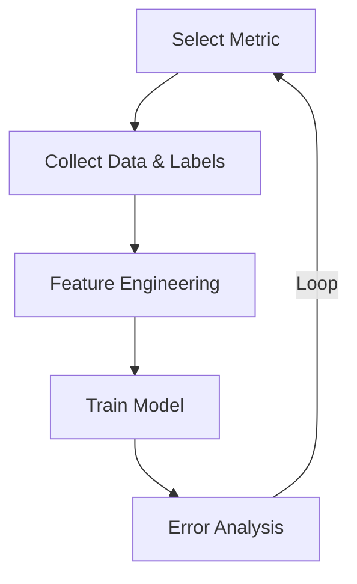

# Module Overview and Foundational Concepts

## Lecture Methodology and Module Overview

The instructional approach for this module prioritizes structured pacing and clear communication. To ensure all participants remain aligned, a brief pause is taken after every subtopic to assess the pace of the lecture and address any student doubts. The learning materials provided include code files, Scalar-specific resources, and handwritten notes, which primarily contain PowerPoint presentation slide information.

This module is structured across eight lectures, focusing on three broad foundational categories:
1. **Numerical operations**
2. **Data processing** (also referred to as data preprocessing)
3. **Data visualization**

Mastering these three areas is essential for anyone aiming to become a data scientist, machine learning engineer, MLOps engineer, or AI engineer. The module introduces Python libraries from the very beginning. A basic understanding of programming or Python is sufficient to proceed without hindrance.

## Python and Python Libraries

Python is the most popular programming language in the fields of artificial intelligence (AI) and machine learning (ML). In these domains, practitioners rely heavily on Python libraries. 

A **library** is defined as a collection of pre-written code that can be integrated into a program. By importing or downloading these libraries, developers can directly use their built-in functions instead of writing code from scratch. Each library is designed to serve a highly specific task. Key libraries introduced in this module include Pandas, Numpy, and Matplotlib.

---

# Data-Driven Decision Making and Machine Learning Pipelines

## Data-Driven Decision Making: The Bank Loan Analogy

To understand the necessity of data analysis, consider the scenario of a bank manager responsible for approving customer loans. Imagine two customers, C1 and C2, with the following profiles:
*   **Customer 1 (C1):** Earns a monthly salary of 500,000 (five lakhs), is married, is male, and has three ongoing loans.
*   **Customer 2 (C2):** Earns a monthly salary of 50,000, is married, is male, and has zero ongoing loans.

Based on personal experience, a bank manager might approve the loan for C2 and deny C1. The manager's underlying assumption is that individuals who already carry multiple ongoing loans are highly likely to default. While human experience and assumptions can be incorrect, data represents the absolute ground truth. 

When dealing with millions of customers, manual evaluation becomes impossible, necessitating an automated process. Automation requires a deep dive into the data to uncover hidden patterns and determine which variables are important. In a machine learning context, a column in a dataset is referred to as a **feature**. Analyzing the entire dataset to identify these critical features is known as data analysis.

## Mathematical Modeling and Automation

To illustrate how patterns are extracted from historical data, consider a simple dataset mapping years of experience to salary:
*   1 year of experience yields a salary of 10K.
*   2 years of experience yields a salary of 20K.
*   3 years of experience yields a salary of 30K.

A human can easily analyze this small dataset and determine that an individual with 6 years of experience should earn a salary of 60K. This relationship can be expressed as a mathematical equation:

$$\text{{Salary}} = \text{{years of experience}} \times 10\text{{K}}$$

While humans can easily identify patterns in small datasets, they cannot manually process massive Excel sheets or millions of data points. Consequently, machines are deployed to automate this analytical work.

## The Iterative Nature of ML System Development

Developing a machine learning system is fundamentally an iterative and continuous process. Contrary to the initial assumption that building a model requires only collecting data, training, and deployment in a linear sequence, the reality involves numerous back-and-forth cycles between steps. 

```
[Select Metric] ➔ [Collect Data & Labels] ➔ [Feature Engineering] ➔ [Train Model] ➔ [Error Analysis]
       ▲                                                                                   │
       └─────────────────────────── (Re-evaluate & Loop) ──────────────────────────────────┘
```



For instance, when building a predictive model, the workflow might involve:
1. Selecting a metric for optimization.
2. Collecting data and obtaining labels.
3. Engineering features.
4. Training models.
5. Analyzing errors (which may reveal that the error source was incorrect labeling, necessitating relabeling of the data before retraining).
6. Updating the model using more contemporary information if it becomes stale.

Even after a model appears stable, external business changes can force a reassessment, leading back to step one to optimize for a different metric entirely (such as shifting focus from maximizing impressions to optimizing ad click-through rate).

## The ML Model Building Pipeline Overview

The typical journey for building an ML model follows a general pipeline:
1. **Data Acquisition:** Gather raw historical data.
2. **Data Preparation & Transformation:** Clean and transform raw data into a machine-readable format.
3. **Model Training:** Feed the processed data into machine learning algorithms.
4. **Prediction & Evaluation:** Execute predictions and evaluate performance against defined metrics.

---

# Exploratory Data Analysis (EDA) and Visualization

## DAV vs. EDA

There is a distinction between the terms **DAV** and **EDA**:
*   **DAV (Data Analytics and Visualization):** The specific terminology used at Scalar to refer to Data Analytics and Visualization.
*   **EDA (Exploratory Data Analysis):** The industry-standard term for the process of exploring every feature in your dataset before making a decision. 

The process of data analysis often begins when the analyst is exploring options without knowing precisely what pattern they are searching for. If one has no prior idea about a hidden pattern within the data, the objective is to find anything relevant to the context. 

To understand EDA, consider an analogy of visiting a new city. If a person who is not from Bangalore is advised by a friend to visit Koramangala because of its nice cafes, they will not know where to go initially. To find what they are looking for, they must first explore the streets and investigate different options. *(Note: The original lecture transcript cuts off at this point, leaving the analogy incomplete).*

## Data Preparation and Transformation

The stages of building a model involve transforming raw data into a format computers can process. This entire procedure falls under the umbrella of data cleaning and data transformation, which are essential parts of EDA:
*   **Handling Categorical Data:** Converting human-readable attributes, such as names or genders, into binary numbers (zeros and ones), since computers do not understand natural language.
*   **Data Cleaning:** Removing unnecessary features (like row numbers), performing interpolation for missing values, or dropping irrelevant data.
*   **Visualization:** Plays an extremely important role in EDA because visual retention memory is notably higher than other forms of recall. Visualization helps interpret patterns and allows immediate detection of anomalies or odd differences in the data.

The primary Python libraries used for these tasks are:
*   **Pandas:** Used for data manipulation, cleaning, and transformation.
*   **Numpy:** Handles numerical operations such as addition, subtraction, multiplication, and matrix calculations.
*   **Matplotlib:** Employed for data visualization and plotting.

## Working Environment Setup and Practical Execution

For development, an **IDE** (Integrated Development Environment) is required, such as VS Code, PyCharm, or Jupyter Notebook. The current workflow utilizes **Google Colab Notebooks** because they allow for running code cell by cell and immediately viewing the output.

### Notebook Mechanics
*   **Cell Types:** Notebooks contain **text blocks** (for writing explanatory text/markdown) and **code blocks** (where executable code resides).
*   **Execution Shortcut:** To execute code in a cell, click the run button or use the keyboard shortcut **Shift + Enter**.
*   **Shell Commands:** An exclamation mark (`!`) at the beginning of a command indicates to the notebook that it should run a shell command (e.g., installing packages).
*   **Comments:** A hash symbol (`#`) is used to comment out code, meaning that the line is ignored by the compiler.
*   **Implicit Printing:** Jupyter notebooks simplify variable printing. If a user defines variables, the notebook automatically prints the value of the last variable in the cell even without an explicit `print()` statement.
*   **Dynamic Sizing:** Unlike lower-level programming languages, there is no need to declare the size of an array when creating it.

---

# Numerical Operations with Numpy

## Introduction to Numpy

Because machines ultimately only understand numbers, any function we want to perform or system we want to build requires mathematical operations between numbers. **Numpy** (Numeric Python) is designed specifically to facilitate these high-performance numerical operations.

### Importing and Installing Numpy

To work with Numpy, it must first be imported into the environment. This is done using the following command:

```python
import numpy as np
```

In this command, the library is imported and assigned the alias `np`. This alias allows us to refer to functions within the library using the prefix `np.` instead of typing the full name every time.

If you are working in a Google Colab notebook, the library is already pre-installed. However, if you are using a local IDE, you may need to install it first by running a shell command directly in a cell:

```bash
!pip install numpy
```

## Creating Numpy Arrays

An array is a collection of elements. To create a Numpy array, we use the `np.array()` function, passing the elements inside a set of parentheses containing square brackets:

```python
votes = np.array(["element1", "element2"])
```

When printing these arrays using the Python `print()` command, the output displays the collection of elements. The visual representation may display double quotes as single quotes, and commas between elements may not appear in the printed output. This is simply a user interface representation of how Python prints arrays and does not alter the underlying data.

## Numpy Arrays vs. Python Lists

The primary distinction between a standard Python list and a Numpy array lies in how they handle different data types and manage memory.

### Heterogeneous vs. Homogeneous Data
*   **Python Lists:** Can store **heterogeneous** values, meaning a single list can hold elements of entirely different data types simultaneously (e.g., strings, integers, floats, and booleans together).
    ```python
    a = ["Aryan", 1, 1.34, True]
    ```
    Checking the type of this object using `type(a)` confirms it is a standard Python list.
*   **Numpy Arrays:** Only allow **homogeneous** values; all elements within the array must share the exact same data type. Checking the type of a Numpy array (e.g., `type(votes)`) reveals the type `numpy.ndarray` (N-Dimensional array).

### Data Type Coercion Priority
If you attempt to pass a heterogeneous list into a Numpy array, the array will automatically convert all the elements into a single, uniform data type. This conversion follows a strict priority order:

1. **String** (highest priority)
2. **Float**
3. **Integer**
4. **Boolean** (lowest priority)

*   **Example 1 (String Dominance):** Passing the list `["Aryan", 1, 1.34, True]` into `np.array()` forces all elements to convert to strings. The resulting array elements are represented in a Unicode 32-bit string format, denoted as `U32` (where `U` stands for Unicode and `32` represents the maximum character length).
*   **Example 2 (Float Dominance):** If an array contains the integer `1`, the float `1.34`, and the boolean `True`, the presence of the float forces the other elements to convert. The integer `1` becomes the float `1.0`, and the boolean `True` (which represents `1` in boolean terms) is converted to the float `1.0`.

### Memory Allocation and Performance
The architectural differences in memory allocation explain why Python lists are slower and Numpy arrays are significantly faster:

| Feature | Python Lists | Numpy Arrays |
| :--- | :--- | :--- |
| **Allocation Type** | Non-contiguous (scattered memory addresses) | Contiguous (neighboring memory addresses) |
| **Data Homogeneity**| Heterogeneous (allows mixed types) | Homogeneous (strictly single type) |
| **Retrieval Speed** | Slower (must look up individual pointers) | Fast (calculated offset retrieval) |
| **Use Case** | General-purpose programming, structured records | Numerical operations, big data, matrix math |

*   **Python List Memory:** Elements are stored in RAM as separate memory allocations. For a list containing a string, an integer, and a float, each element has a different size and is allocated far apart from the others. To retrieve this information, the system must search for their individual addresses throughout the entire memory, which becomes highly time-consuming as the list grows.
*   **Numpy Array Memory:** Utilizes **contiguous allocation**, meaning the elements are stored right next to each other. Because all elements are of the exact same data type and size, Numpy converts them into the same byte format and stores them side-by-side. This neighboring structure enables fast fetching and lightning-fast retrieval of information.

## The Architecture and History of Numpy

Although Numpy is referred to as a Python library, it is actually written in **C**. A Python wrapper is built on top of this C foundation, allowing users to write code in Python while the underlying execution happens in C. This architecture makes Numpy extremely fast by default.

Python was developed as a general-purpose programming language in the late 1980s and early 1990s, a time when the concept of big data analysis did not exist. As data processing demands grew, developers realized that the standard Python list was not suitable for fast processing, which led to the creation of Numpy. Even though Python itself is relatively slow, it remains the dominant language for data analytics because its syntax is highly user-friendly, easy to read, and easy to interpret. By using Numpy, developers can leverage Python's simplicity while scaling up operations quickly.

---

# Array Dimensions, Shapes, and N-Dimensional Space

## Array Dimensions and N-Dimensional Space

Arrays can be structured into different dimensions depending on the complexity of the data:
*   **1D Array (One-Dimensional):** A single row of elements.
*   **2D Array (Two-Dimensional):** Mathematically known as a **matrix**. It is defined by its shape, which represents its rows and columns (e.g., a shape of 2 rows and 3 columns).
*   **3D Array (Three-Dimensional):** Incorporates three axes: axis 0, axis 1, and axis 2 (e.g., a shape of 4 × 3 × 2).
*   **N-Dimensional Array (ND Array):** Multi-dimensional structures where $N$ represents the number of dimensions. 

In modern data workflows, every machine learning algorithm, table, and model computation is represented as an array. While humans cannot physically visualize dimensions beyond 3D (such as 4D, 5D, or 67D arrays), these spaces are easily represented and computed mathematically.

## Determining Array Dimensions and Shapes

To programmatically inspect the structure of an array, Numpy provides the `ndim` and `shape` attributes:

### 1. Dimension (`ndim`)
The `ndim` attribute returns the number of dimensions of the array.
*   **Syntax:** `array_name.ndim`
*   **Visual Check:** A human observer can easily identify the dimensions of an array by looking at its enclosing square brackets. The number of nested opening brackets at the start of the array matches its dimension (e.g., `[` indicates 1D, `[[` indicates 2D).

### 2. Shape (`shape`)
The `shape` attribute returns a tuple of integers indicating the size of the array along each dimension.
*   **Syntax:** `array_name.shape`
*   **1D Arrays:** For a 1D array (such as a `goats` array containing 10 elements), checking its shape yields a tuple with a single value: `(10,)`.

```python
import numpy as np

```
# Example of checking dimensions and shape
arr_1d = np.array([1, 2, 3, 4, 5])
print(arr_1d.ndim)

# Output: 1
print(arr_1d.shape)

# Output: (5,)

arr_2d = np.array([[1, 2, 3], [4, 5, 6]])
print(arr_2d.ndim)

# Output: 2
print(arr_2d.shape)

# Output: (2, 3)
```

---

```
# Semantic Glossary

*   **Library**: A collection of pre-written code that can be imported or downloaded to use specific functions directly without writing them from scratch.
*   **Numpy**: A specific Python library written in C, used for high-performance numerical and matrix operations.
*   **Pandas**: A specific Python library used for data manipulation, cleaning, and transformation tasks.
*   **Matplotlib**: A standard Python library used for data visualization and plotting.
*   **Feature**: The machine learning term used interchangeably with a dataset column.
*   **Data Analysis**: The process of analyzing an entire dataset to identify hidden patterns and automate decision-making.
*   **DAV**: Data Analytics and Visualization; the terminology used at Scalar.
*   **EDA**: Exploratory Data Analysis; the industry-standard process of exploring every feature in a dataset to understand its characteristics before making decisions or building models.
*   **Contiguous Allocation**: A memory storage method where elements are stored in adjacent memory locations, enabling rapid data retrieval.
*   **Heterogeneous Data**: Data structures (like Python lists) that can store elements of multiple, differing data types.
*   **Homogeneous Data**: Data structures (like Numpy arrays) where all elements must share the exact same data type.
*   **Salary Equation**: $$\text{{Salary}} = \text{{years of experience}} \times 10\text{{K}}$$