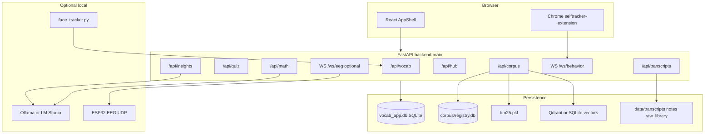
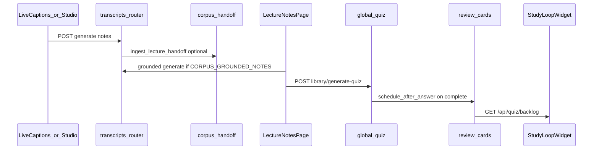

# High-Level Design (HLD)

**Last updated:** 2026-06-26  
**Audience:** Developers, Cursor agents, future contributors  
**Companion:** [LLD.md](./LLD.md) (algorithms, file paths, config) · [CURRENT_ARCHITECTURE.md](./CURRENT_ARCHITECTURE.md) (short summary)

This document describes the **actual** Cognitive-Aware Learning Tutor architecture as implemented in the repository. It is code-grounded — not an aspirational enterprise ITS blueprint.

---

## 1. Executive summary

| Aspect | Value |
|--------|--------|
| **Product** | Local-first study platform: hub dashboard + pluggable study modules (GRE vocab, math tutor, lecture second-brain, global quiz/SRS, life tracker, optional EEG/face/nutrition) |
| **Frontend** | Vite 6, React 18, TypeScript, React Router 7, Tailwind 4 |
| **Backend** | FastAPI modular monolith (`backend/main.py`) |
| **Primary DB** | SQLite (`data/vocab_app.db`) via SQLAlchemy + Alembic |
| **Corpus** | Separate SQLite registry + BM25 pickle + local vector store (Qdrant or SQLite fallback) |
| **Entry** | `run.bat` → migrations + API on `:8000` + Vite on `:5173` |
| **Auth** | JWT bearer; default admin seeded at startup |

**Philosophy** (from [ROADMAP.md](./ROADMAP.md)): ship useful study software on any PC without GPU or ESP32. Hardware and local LLMs are **opt-in upgrades**, not blockers.

---

## 2. Design principles

1. **Local-first** — Single-machine deploy; data stays on disk under `data/`.
2. **Modular monolith** — One FastAPI process, domain routers (`/api/vocab`, `/api/quiz`, `/api/corpus`, …), not microservices.
3. **Plugin shell** — Frontend features register routes/widgets via `src/plugins/`; hub syncs enabled plugins per user.
4. **Graceful degradation** — Rule-based math tutor when `OLLAMA_ENABLED=0`; simulated EEG by default; legacy note generation when corpus/LLM unavailable.
5. **API over localStorage** — Authenticated progress via `/api/vocab` and `/api/quiz`; guest vocab falls back to `words.json` + `localStorage`.
6. **Document the loop** — Highest user value is closing study loops (read → assess → review), not adding isolated features.

---

## 3. System context



### Request flow (typical)

```text
Browser (localhost:5173)
  → REST /api/* or WebSocket /ws/*
  → FastAPI router (domain module)
  → Service layer (SQLAlchemy Session, file I/O, corpus indexes)
  → SQLite / files / registry
```

---

## 4. Subsystem boundaries

| Subsystem | Responsibility | API prefix | Primary code |
|-----------|----------------|------------|--------------|
| **Hub** | Metric catalog, readings, sessions, daily rollups, plugin toggles, export | `/api/hub` | `backend/hub/` |
| **GRE Vocab** | Words, per-user progress, adaptive quiz (cycle path) | `/api/vocab` | `backend/vocab/`, `src/features/vocab/` |
| **Global Quiz + SRS** | Cross-domain quiz, review cards, custom decks, backlog | `/api/quiz` | `backend/quiz/` |
| **Corpus / RAG** | Book/transcript ingest, hybrid retrieve, grounded notes, KB UI | `/api/corpus` | `backend/corpus/` |
| **Transcripts / Notes** | Note generation, library tree, study intel, quiz-from-notes | `/api/transcripts` | `backend/transcripts/` |
| **Math** | Question bank, rule/LLM tutor, OCR, stuckness intervention | `/api/math` | `backend/math/` |
| **Insights / Coach** | Daily stats, AI review, RAG-backed chat | `/api/insights` | `backend/insights/`, `backend/hub/services/coach_knowledge.py` |
| **Life** | Daily sleep/study log → life score | `/api/life` | `backend/life/` |
| **Behavior** | Chrome extension stream → hub readings | `WS /ws/behavior`, `GET /api/behavior/stats` | `backend/behavior/` |
| **Account** | GDPR-style export | `/api/account` | `backend/account/` |
| **EEG** (optional) | UDP ingest + WebSocket broadcast | `WS /ws/eeg` | `backend/eeg/` |
| **NutriNode** (optional) | Meals, live nutrition WS | `/api/nutrition/*` | `backend/plugins/nutrinode_plugin.py` |
| **Frontend plugins** | Routes, widgets, providers | — | `src/plugins/` |

**Production entry:** `backend/main.py` (not `backend/vocab_backend.py`, which is a legacy shim).

---

## 5. Frontend architecture (HLD)

### Bootstrap

```text
src/main.tsx → src/app/App.tsx → AppShell (sidebar, topbar, docks)
```

### Provider chain (outer → inner)

```text
ThemeProvider → AuthProvider → PluginRegistryProvider → PomodoroProvider
  → StudySessionProvider → BrowserRouter → DynamicProviders (plugin contexts) → Routes
```

### Route sources

1. **Static routes** in `src/app/App.tsx` — `/`, `/login`, `/admin`, `/settings/*`, `/ai-coach`, …
2. **Plugin routes** — registered in `src/plugins/*_plugin.tsx`, mounted when plugin enabled
3. **Feature Studio routes** — `/features/{feature_id}` from hub custom features

### Core study pages

| Goal | Route | Page |
|------|-------|------|
| Dashboard | `/` | `HomePage.tsx` + `StudyLoopWidget` |
| GRE hub / read / cycle | `/gre-vocab`, `/gre-vocab/read/:mode`, `/gre-vocab/cycle` | `GreVocabPage`, `VocabReadPage`, `VocabCyclePage` |
| Review / global quiz | `/review` | `ReviewHubPage.tsx` |
| Lecture notes | `/lecture-notes` | `LectureNotesPage.tsx` |
| Knowledge base | `/knowledge-base` | `LibrarySetupPage.tsx` |
| Math practice | `/math-tutor/practice/:topicId` | `MathPracticePage.tsx` |
| Life tracker | `/life-tracker` | `LifeTrackerPage.tsx` |

Plugin list: `core`, `gre-vocab`, `math-tutor`, `study-room`, `life-tracker`, `eeg`, `focus-mirror`, `nutrinode`.

---

## 6. Canonical study loops

### Loop A — GRE vocabulary (Phase 1 complete)

```text
ReadMode → adaptive quiz (/api/vocab/quiz/adaptive/*) → report → low-mastery prompt → read again
```

- UI: `src/features/vocab/cycle/components/CycleManager.tsx`
- Docs: [GRE_VOCAB_PHASE1.md](./GRE_VOCAB_PHASE1.md)

### Loop B — Lecture second brain (built; activation uneven)



**Intended path:** capture → notes → corpus index → quiz → spaced review → dashboard nudge.

**Friction today:** Studio may still use legacy summarization; grounded mode requires `CORPUS_GROUNDED_NOTES=1` and populated corpus. See [Known integration gaps](#8-known-integration-gaps).

### Loop C — Math practice (partial cognitive pipeline)

```text
Whiteboard (exportPng) → POST /api/math/tutor/hint (rule-based default)
  → hub math_attempt reading
  → (planned) stuckness + OCR + Socratic intervention
```

- Vision doc: [MATH_TUTOR_VISION_PIPELINE.md](./MATH_TUTOR_VISION_PIPELINE.md)

### Loop D — Daily hub picture

```text
Life log + behavior extension + quiz/vocab events → hub readings → daily rollup → Life Clock + AI review widgets
```

- Hub detail: [CENTRAL_HUB.md](./CENTRAL_HUB.md)

---

## 7. Deployment topology

| Component | Default | Notes |
|-----------|---------|-------|
| Frontend | `http://localhost:5173` | `npm run dev` or via `run.bat` |
| API | `http://localhost:8000` | `uvicorn backend.main:app` |
| Health | `GET /health` | `schema_ok`, feature flags |
| OpenAPI | `/openapi.json` | Full route list |

**Single machine.** No message bus, no separate database services, no container requirement (optional: [DOCKER.md](./DOCKER.md)).

**Optional corpus deps:** `pip install -r backend/requirements-corpus.txt`

**Optional hardware:** ESP32 EEG → UDP `:5005`; Python face tracker via `scripts/run_face_tracker.bat`

---

## 8. Known integration gaps

Honest gaps as of 2026-06 — not bugs, but architectural debt:

| Gap | Description |
|-----|-------------|
| **Dual note paths** | Legacy transcript summarization vs corpus-grounded generation (`CORPUS_GROUNDED_NOTES=1` in `.env`) |
| **Dual quiz APIs** | GRE cycle uses `/api/vocab/quiz/adaptive/*`; cross-domain flow uses `/api/quiz/*` |
| **Guest vs API progress** | Unsigned users: `vocabStore` + `localStorage`; signed-in: SQLite — no merge |
| **Corpus search not public** | `hybrid_retrieve()` is internal (coach, grounded notes, study_intel); no `GET /api/corpus/search` |
| **Cognitive intervention** | EEG sim + config exist; auto-intervention loop not fully closed on math practice |
| **Loop activation** | Pipeline runs (notes generated); quiz/SRS review often skipped in practice |

**Recommended unification target** (future work, not implemented):

```text
TranscriptSaved → corpus ingest → grounded note → quiz from note → SRS cards → dashboard "N due"
```

---

## 9. Implemented vs aspirational

External analyses sometimes describe enterprise ITS features this repo **does not** implement. Use this table to avoid confusion.

| Feature | In this repo? | What we have instead |
|---------|---------------|----------------------|
| Bayesian Knowledge Tracing (BKT) | No | Integer vocab mastery + FSRS-inspired SRS |
| Deep Knowledge Tracing (DKT) | No | — |
| IRT diagnostic onboarding | No | — |
| Neo4j knowledge graph | No | SQLite `kg_*` tables |
| Kafka / RabbitMQ / Celery | No | In-process FastAPI; Huey SqliteHuey only for LLM profile probes |
| Redis cache | No | SQLite + in-memory session state |
| Next.js | No | Vite + React |
| EduNER / custom NER curriculum | No | Markdown chunking + hybrid RAG |
| Microservices | No | Modular monolith |
| Keystroke / affective telemetry | Minimal | EEG gamma thresholds (sim default), face attention optional |
| Multi-LLM orchestration (Fast/Learn modes) | No | Single optional Ollama/LM Studio; rule fallback |
| LangChain / LlamaIndex | No | Direct Python service calls |

---

## 10. Explicit non-goals (today)

- Cloud-native multi-tenant SaaS
- Production PostgreSQL (supported later via `DATABASE_URL`; SQLite is default)
- Real-time collaborative editing
- Automated curriculum extraction from arbitrary syllabi via NER
- Full multimodal affective computing pipeline
- **AST-stable block IDs** for note sections (defer — markdown remains source of truth; repair is sanitize-then-LLM)
- **Server-side MathML** rendering (client KaTeX/MathJax only; informational defer)
- Async note generation (user waits for the file; Huey is only for long LLM chain probes)

**Validated (keep):** quiz citation check via chunk-ID whitelist (`verify_quiz_citations`); mermaid sanitize-then-LLM repair path.

Future phases: [ROADMAP.md](./ROADMAP.md) (hardware EEG, math vision OCR, platform).

---

## 11. Related documentation

| Doc | Use |
|-----|-----|
| [LLD.md](./LLD.md) | Algorithms, schemas, config catalog, file-level detail |
| [TASK_COMPLETION.md](./TASK_COMPLETION.md) | Master checklist for loop closure and final build |
| [API_CONTRACT.md](./API_CONTRACT.md) | HTTP endpoint reference |
| [DATABASE.md](./DATABASE.md) | Migrations, env vars |
| [CORPUS_STATUS.md](./CORPUS_STATUS.md) | Corpus implementation status |
| [FILE_MAP.md](./FILE_MAP.md) | GRE vocab file map |
| [PROJECT_LAYOUT.md](./PROJECT_LAYOUT.md) | Full repo layout |
| [WORKING_PRODUCT.md](./WORKING_PRODUCT.md) | Daily-use checklist |
