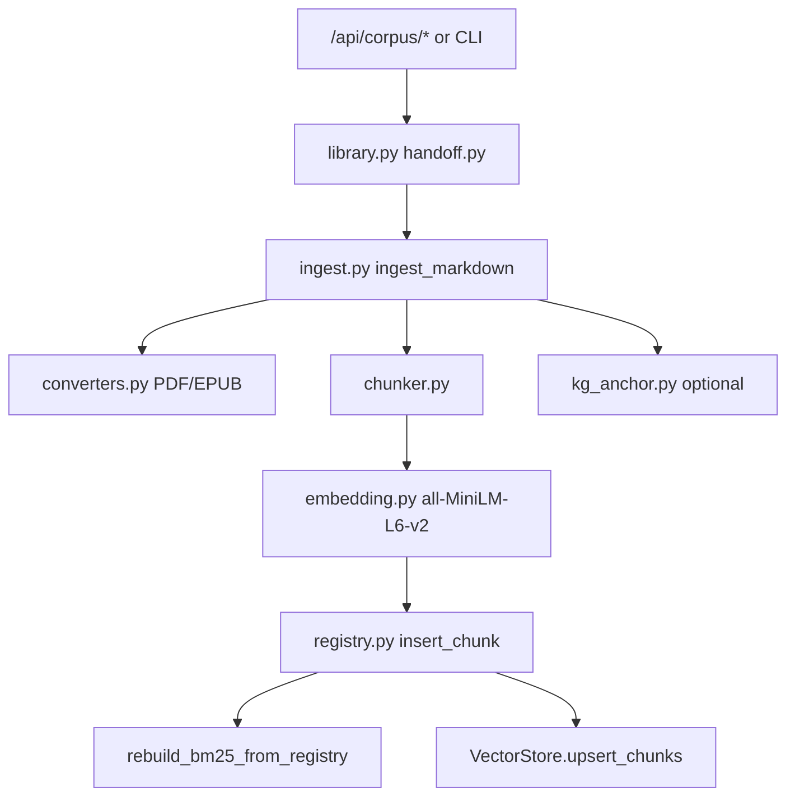

# Low-Level Design (LLD)

**Last updated:** 2026-06-26  
**Companion:** [HLD.md](./HLD.md) (system context, loops, gaps) · [API_CONTRACT.md](./API_CONTRACT.md) (full HTTP reference) · [DATABASE.md](./DATABASE.md) (migrations)

File-level detail for the Cognitive-Aware Learning Tutor. Every major claim below maps to a path in the repo.

---

## 1. Application bootstrap

### Backend lifespan (`backend/main.py`)

On startup:

1. `ensure_at_head()` — Alembic migrations must match head (production raises if behind)
2. `seed_reading_definitions()` — hub metric catalog
3. `ensure_default_admin()` — seeds `admin` / `admin123`
4. `_seed_math_templates()` — default math drill templates if empty
5. `seed_user_plugins()` — default plugins for admin/demo users
6. `seed_words_from_json_if_empty()` — when `SEED_WORDS_ON_STARTUP=true`
7. Optional: EEG UDP server + broadcast loop when `EEG_ENABLED=1`

Routers mounted (order):

```text
vocab · quiz · transcripts · corpus · math · hub · life · insights · behavior · account
(+ eeg, nutrinode if import succeeds)
```

### Frontend bootstrap (`src/app/App.tsx`)

```text
ThemeProvider
  → AuthProvider
    → PluginRegistryProvider
      → PomodoroProvider
        → StudySessionProvider
          → BrowserRouter
            → DynamicProviders (plugin-specific contexts)
              → AppRoutes
```

---

## 2. Authentication

| Item | Implementation |
|------|----------------|
| Module | `backend/core/auth.py` |
| Scheme | JWT bearer (`Authorization: Bearer …`) |
| Password hash | `pbkdf2_sha256` (not bcrypt) |
| Token TTL | `JWT_EXPIRE_MINUTES` (default 10080 = 7 days) |
| Frontend storage | `localStorage` key `vocab:auth-token` |
| Login/register | `POST /api/vocab/auth/login`, `POST /api/vocab/auth/register` |
| Current user | `GET /api/vocab/auth/me` |

Protected routes use `Depends(get_current_user)`. Admin routes check `is_admin` or username `admin`.

---

## 3. Data stores

### 3.1 Main SQLite (`data/vocab_app.db`)

**Engine:** `backend/db/base.py` · **URL:** `DATABASE_URL` env (default from `backend/paths.py`)

| Model | Table | Purpose |
|-------|-------|---------|
| `User` | `users` | Accounts |
| `Word` | `words` | Word bank (`content_json`) |
| `WordProgress` | `word_progress` | Per-user vocab mastery |
| `QuizSession` | `quiz_sessions` | Vocab adaptive + global quiz sessions |
| `ReviewCard` | `review_cards` | SRS cards (all domains) |
| `QuizDeck` | `quiz_decks` | User-created decks |
| `MathQuestionTemplate` | `math_question_templates` | Template drills |
| `MathQuestion` | `math_questions` | Imported question bank |
| `MathAttempt` | `math_attempts` | Practice attempts |
| `ReadingDefinition` | `reading_definitions` | Hub metric slugs |
| `Reading` | `readings` | Time-series metric facts |
| `ActivitySession` | `sessions` | Bounded activities |
| `DailyRollup` | `daily_rollups` | Cached Life Clock segments |
| `UserPlugin` | `user_plugins` | Enabled plugins per user |
| `UserFeature` | `user_features` | Feature Studio modules |
| `LifeDailyLog` | `life_daily_log` | Sleep/study daily log |
| `FocusEvent` | `focus_events` | Focus tracking |
| `LectureNote` | `lecture_notes` | Note metadata in DB |
| `KgNode` | `kg_nodes` | Knowledge graph nodes |
| `KgEdge` | `kg_edges` | Graph edges |
| `KgEmbedding` | `kg_embeddings` | Node embeddings (float32 blob) |
| `KgObservation` | `kg_observations` | Observed mastery links |

Registry: `backend/models/__init__.py` · Migrations: `alembic/versions/` (see [DATABASE.md](./DATABASE.md)).

### 3.2 Corpus registry (`data/corpus/registry.db`)

Separate SQLite managed by `backend/corpus/registry.py` (override: `CORPUS_REGISTRY_DB`).

| Table | Columns (conceptual) |
|-------|----------------------|
| `documents` | `document_id`, title, source_type, category, subject_tags, source_path |
| `chunks` | `chunk_id`, document_id, breadcrumb, raw_payload, embedding_blob, modality_type |

### 3.3 Corpus indexes

| Asset | Path | Module |
|-------|------|--------|
| BM25 pickle | `data/corpus/bm25.pkl` | `backend/corpus/bm25_index.py` |
| Vector store | `data/corpus/qdrant/` or SQLite fallback | `backend/corpus/vector_store.py` |
| Constants | `HYBRID_POOL=20`, `RERANK_TOP=5` | `backend/corpus/paths.py` |

### 3.4 File-based data

| Path | Content |
|------|---------|
| `public/data/words.json` | GRE word bootstrap + admin mirror |
| `data/transcripts/` | Raw lecture transcripts |
| `data/notes/` | Generated markdown notes (library tree) |
| `data/raw_library/{subject}/` | PDF/EPUB textbooks + `metadata.json` |
| `data_logs/DSC_browser_behavior_*.csv` | Browser extension logs |
| `data/logs/corpus_setup_latest.log` | Corpus auto-setup log |

---

## 4. Student modeling algorithms

### 4.1 Vocab mastery (NOT BKT)

**File:** `backend/vocab/routes.py`

Per-word integer `mastery` on `word_progress`:

- Correct answer: `mastery += 1`
- Wrong answer: `mastery -= 2`
- Mastered threshold: `MASTERY_MASTERED = 6` (config: `mastery_mastered`)

Due scheduling (`_calc_next_due`):

| Mastery range | Interval (days) |
|---------------|-----------------|
| `< 0` | 1 |
| `0–2` | 2 |
| `3–5` | 7 |
| `6–8` | 21 |
| `≥ 9` | 60 |

### 4.2 Global SRS (FSRS-inspired, NOT SM-2)

**File:** `backend/quiz/srs.py`

`SrsState` fields: `mastery`, `ease`, `stability`, `difficulty`, `interval_days`, `due_date`, `times_asked`, `times_correct`, `consecutive_correct`, `lapses`.

`schedule_after_answer(state, correct, elapsed_ms)`:

- **Correct:** increment mastery (cap 10), ease up, difficulty down, grow stability (log-scaled); if `elapsed_ms > 45000`, growth × 0.92
- **Wrong:** reset consecutive streak, mastery −2 (floor −2), lapse count up, ease down, difficulty up, stability × 0.35
- Recompute `interval_days` via `calc_interval_days()` → set `due_date`

Persisted as JSON in `review_cards.srs_json`.

### 4.3 BKT comparison (not implemented)

| BKT concept | This repo |
|-------------|-----------|
| Latent knowledge state (HMM) | Integer mastery + SRS stability |
| P(L0), P(T), P(G), P(S) per KC | Not used |
| Per-skill Bayesian update | Rule-based increments |
| pyBKT / DKT | Absent |

---

## 5. Corpus pipeline

### 5.1 Ingest flow



**Core function:** `ingest_markdown()` in `backend/corpus/ingest.py`

1. Optional `delete_document_chunks` if `replace=True`
2. `upsert_document()` in registry
3. `chunk_markdown()` — breadcrumbs, modality types
4. `encode_texts()` for embeddings
5. `insert_chunk()` per chunk
6. `rebuild_bm25_from_registry()`
7. `VectorStore().upsert_chunks()`

**Source types:** `textbook`, `transcript`, `note`

### 5.2 HTTP corpus endpoints (`backend/corpus/router.py`)

| Method | Path | Purpose |
|--------|------|---------|
| GET | `/api/corpus/overview` | Books on disk, ingest status |
| GET | `/api/corpus/log` | Setup log tail |
| GET | `/api/corpus/job` | Background job status |
| POST | `/api/corpus/run-setup` | Full auto-setup (MML, transcripts, books) |
| POST | `/api/corpus/ingest-book` | Ingest one subject folder |
| POST | `/api/corpus/ingest-all-books` | Ingest all full PDFs |
| POST | `/api/corpus/ingest-transcripts` | Latest transcripts |
| POST | `/api/corpus/upload/{subject_id}` | Upload to raw library |
| POST | `/api/corpus/generate-notes-grounded` | RAG-grounded notes from transcript |
| POST | `/api/corpus/ingest-lecture` | Transcript + note handoff |

CLI mirror: `python -m backend.corpus.cli` — see [CORPUS_RAG.md](./CORPUS_RAG.md).

### 5.3 Retrieve flow (`hybrid_retrieve`)

**File:** `backend/corpus/retrieve.py`

1. Load BM25; rebuild from registry if chunks exist but index empty
2. **Sparse:** `bm25.search(query, top_k=HYBRID_POOL)` (20)
3. **Dense:** `VectorStore.search()` if `encode_texts` available
4. **RRF merge** (`_rrf_merge`, k=60)
5. Filter by `source_types` / `subject_tags` into candidate pool
6. **Graph expansion** (if `use_graph`): add 1-hop KG-linked chunk IDs into the candidate pool (still filtered)
7. **Rerank:** FlashRank if installed, else RRF order → `RERANK_TOP` (5) — scores original + graph-expanded together
8. Return hit dicts; `format_hits_for_prompt()` for LLM context

**Ordering note (v2):** rerank must run *after* graph expansion so expanded neighbors are not dumped unscored into the LLM context.

**Consumers (no public search API):**

- `backend/hub/services/coach_knowledge.py`
- `backend/corpus/grounded_notes.py`
- `backend/transcripts/study_intel.py`
- `backend/corpus/library.py` (setup verify query)

**Transparency:** `GET /api/insights/knowledge?q=…` previews coach retrieval.

**Citation verification (quiz):** `backend/corpus/citation_check.verify_quiz_citations` uses deterministic chunk-ID whitelist intersection — preferred over embedding similarity (validated design).

**SQLite (main app DB):** `backend/db/sqlite_utils.configure_sqlite_engine` sets `PRAGMA journal_mode=WAL`, `busy_timeout`, and `synchronous=NORMAL` on connect.

**Note file optimistic lock:** `GET .../content` returns `mtime`; `PUT .../content` accepts optional `expected_mtime` and returns `409 Conflict` if the on-disk mtime differs (two-tab save safety).

**Mermaid repair:** `backend/transcripts/note_block_repair.py` runs local sanitize first, then per-block LLM repair (confirmed v2 design).

**Huey (LLM probe jobs only):** `POST /api/system/llm/test-all-profiles` enqueues to SqliteHuey (`data/huey.db`) and returns `202 { job_id }`. Poll `GET /api/system/llm/jobs/{id}`. Worker: `python -m backend.core.llm_jobs_worker`. Single-tier `test-chain` stays synchronous. Note generation stays synchronous.

### 5.4 Grounded notes modes (`backend/corpus/grounded_notes.py`)

| Mode | When |
|------|------|
| `legacy` | Corpus not available |
| `legacy_llm_off` | Corpus available but Ollama off |
| `grounded` | Corpus + LLM available; uses `hybrid_retrieve` context |

Gated by `CORPUS_GROUNDED_NOTES=1` in backend settings.

---

## 6. Knowledge graph (SQLite)

**Service:** `backend/hub/services/knowledge_graph.py`

- Embedding model: `all-MiniLM-L6-v2` on CPU (`sentence_transformers`)
- Vectors stored as float32 blobs in `kg_embeddings`
- Cosine similarity for `find_nodes_by_query()`
- Graph traversal: `backend/corpus/graph_retrieve.py` → `graph_chunk_ids_for_query()` maps concept nodes to corpus chunk IDs

**Not Neo4j.** All graph ops are SQLAlchemy queries on `kg_*` tables.

---

## 7. Global quiz handler

### 7.1 API (`backend/quiz/router.py`)

| Method | Path | Purpose |
|--------|------|---------|
| GET | `/api/quiz/backlog` | Due count, recommended action |
| GET | `/api/quiz/review/due` | Due review items |
| GET | `/api/quiz/decks` | List custom decks |
| POST | `/api/quiz/decks` | Create/update deck |
| DELETE | `/api/quiz/decks/{id}` | Delete deck |
| GET | `/api/quiz/results/recent` | Recent session results |
| POST | `/api/quiz/start` | Start session (`domain` in body) |
| GET | `/api/quiz/{session_id}/question` | Next question |
| POST | `/api/quiz/{session_id}/answer` | Submit answer |
| POST | `/api/quiz/{session_id}/complete` | Finish session |

### 7.2 Domains (`backend/quiz/handler.py`)

`domain` values: `vocab`, `math`, `study`, `code`, `mixed`, `review`, `deck`

On answer completion:

- Updates `ReviewCard` + `srs_json` via `schedule_after_answer()`
- May log KG observations via `hub/services/knowledge_graph.log_observation`
- Vocab path may also update `word_progress`

### 7.3 Backlog logic (`backend/quiz/review_cards.py`)

`backlog_summary()` returns:

- `total_cards`, `due_count`, `by_domain`, `deck_count`, `next_due`, `weak_topics`
- `recommended_action`: `review_due` | `start_vocab` | `lecture_notes` | `sign_in`

**Frontend:** `src/components/dashboard/StudyLoopWidget.tsx` → `src/api/globalQuizClient.ts`

---

## 8. GRE vocab (dual quiz path)

### Adaptive quiz (cycle)

**Prefix:** `/api/vocab/quiz/adaptive/*`  
**Store:** `backend/vocab/quiz_store.py`  
**UI:** `src/features/vocab/cycle/`

| Step | Endpoint |
|------|----------|
| Start | `POST /api/vocab/quiz/adaptive/start/` |
| Question | `GET /api/vocab/quiz/adaptive/{id}/question/` |
| Answer | `POST /api/vocab/quiz/adaptive/{id}/answer/` |
| Complete | `POST /api/vocab/quiz/adaptive/{id}/complete/` |

### Guest fallback

- `src/features/vocab/store/vocabStore.ts` — `localStorage`
- `public/data/words.json` — static word list

---

## 9. Transcripts and notes

### Key modules

| File | Role |
|------|------|
| `backend/transcripts/router.py` | HTTP API |
| `backend/transcripts/notes_generator.py` | Transcript → markdown |
| `backend/transcripts/library.py` | Note folder tree on disk |
| `backend/transcripts/study_intel.py` | Gap analysis, quiz generation, `hybrid_retrieve` |
| `backend/transcripts/kb.py` | `lecture_notes` DB metadata |
| `backend/transcripts/note_block_repair.py` | Markdown/code block repair |
| `backend/transcripts/mermaid/pipeline.py` | Mermaid in notes |

### Post-generate corpus handoff

`_corpus_handoff_after_generate()` in `router.py` calls `backend/corpus/handoff.ingest_lecture_handoff()` after note save.

### Quiz from notes

`POST /api/transcripts/library/generate-quiz` → `study_intel.generate_quiz_items()` — may boost retrieval with `weak_concepts_for_retrieval()` from recent quiz failures.

### Frontend

- Page: `src/pages/study/LectureNotesPage.tsx`
- Client: `src/api/transcriptsClient.ts`

---

## 10. Math and cognitive intervention

| Component | File | Notes |
|-----------|------|-------|
| Rule tutor (default) | `backend/math/rule_tutor.py` | No GPU |
| LLM tutor | `backend/math/ollama_tutor.py` | `ollama_enabled=True` |
| Router | `backend/math/router.py` | `POST /api/math/tutor/hint` |
| OCR | `backend/math/ocr_service.py` | TexTeller |
| Stuckness + Socratic guard | `backend/math/intervention_handler.py` | `_hint_passes_socratic_check()` |
| Intervention log | `backend/math/intervention_log.py` | DSC CSV |
| Practice UI | `src/pages/math/MathPracticePage.tsx` | Whiteboard `exportPng` |

### Frontend cognitive load

**Config:** `src/config.ts`

| Key | Default | Meaning |
|-----|---------|---------|
| `cognitiveLoad.highThreshold` | 60 | Gamma above → high load |
| `cognitiveLoad.mediumThreshold` | 35 | Medium load |
| `dev.useSimulatedData` | `true` | Simulated EEG |
| `intervention.enabled` | `true` | Intervention UI gate |
| `intervention.autoTrigger` | `true` | Auto vs manual |

**Context:** `src/context/StudySessionContext.tsx` — biometric stream, cognitive load badge, canvas state.

**EEG backend:** `backend/eeg/service.py` (UDP `:5005`), `backend/eeg/router.py` (`WS /ws/eeg`) when `EEG_ENABLED=1`.

### Face attention (Python, not browser)

- `backend/face_tracker.py` — OpenCV + MediaPipe
- `POST /api/vocab/face/status` → hub `face_attention` reading
- Calibrate: `/focus/calibrate` (`src/plugins/focus_mirror_plugin.tsx`)

---

## 11. Hub telemetry

### Writers

See [CENTRAL_HUB.md](./CENTRAL_HUB.md) for slug → source mapping (`vocab_quiz_complete`, `math_attempt`, `face_attention`, `browser_event`, etc.).

### Rollup

`backend/hub/services/rollup.py` — rebuilds `daily_rollups` on life daily save.

### Coach knowledge assembly

`backend/hub/services/coach_knowledge.py` → `retrieve_coach_knowledge()`:

- Vocab entries, lecture notes, math recent, transcript snippets
- Browser activity (`behavior/coach_activity.py`)
- Optional `graph_context` from KG
- Optional `corpus_chunks` from `hybrid_retrieve()`

Insights router delegates chat/review to `local_coach.py` / `gemma_review.py` (NIM when `NIM_API_KEY` set).

---

## 12. Frontend API clients

| Client | Base | Prefix |
|--------|------|--------|
| `authClient.ts` / `vocabClient.ts` | `resolveVocabApiUrl()` | `/api/vocab` |
| `globalQuizClient.ts` | `resolveApiUrl()` | `/api/quiz` |
| `transcriptsClient.ts` | `config.backend.apiUrl` | `/api/transcripts` |
| `corpusClient.ts` | `config.backend.apiUrl` | `/api/corpus` |
| `hubClient.ts` | `resolveApiUrl()` | `/api/hub`, `/api/insights`, `/api/life` |
| `mathClient.ts` | `config.backend.apiUrl` | `/api/math` |

URL resolution: `src/utils/resolveBackendUrl.ts`

---

## 13. Frontend route map

### Static (`src/app/App.tsx`)

`/`, `/login`, `/admin`, `/profile`, `/settings/*`, `/gre-vocab/add-words`, `/ai-coach`, `/project-agent`

### Core plugin (`src/plugins/core_plugins.tsx`)

`/lecture-notes`, `/knowledge-base`, `/review`

### GRE (`src/plugins/gre_vocab_plugin.tsx`)

`/gre-vocab`, `/gre-vocab/read`, `/gre-vocab/read/:mode`, `/gre-vocab/cycle`

### Math (`src/plugins/math_tutor_plugin.tsx`)

`/math-tutor`, `/math-tutor/topic/:topicId`, `/math-tutor/practice/:topicId`, `/math-tutor/reports`, `/math-tutor/recognize-test`, `/math-tutor/train`

### Other plugins

- `study-room` → `/study-room`
- `life-tracker` → `/life-tracker`
- `focus-mirror` → `/focus/calibrate`
- `nutrinode` → `/nutrition`

---

## 14. Configuration catalog

### Backend (`backend/config.py` → `.env`)

| Env var | Default | Purpose |
|---------|---------|---------|
| `DATABASE_URL` | `sqlite:///…/data/vocab_app.db` | Main DB |
| `JWT_SECRET` | `change-this-in-production` | Token signing |
| `JWT_EXPIRE_MINUTES` | `10080` | Token TTL |
| `DEV_MODE` | `true` | Dev behaviors |
| `APP_ENV` | `development` | Environment label |
| `CORS_ORIGINS` | `*` | CORS |
| `GROUP_SIZE` | `30` | Vocab group size |
| `MASTERY_MASTERED` | `6` | Mastered threshold |
| `WORDS_SOURCE` | `auto` | `auto` / `db` / `json` |
| `SEED_WORDS_ON_STARTUP` | `true` | Seed words table |
| `EEG_ENABLED` | `false` | EEG UDP + WS |
| `EEG_UDP_PORT` | `5005` | EEG UDP port |
| `OLLAMA_ENABLED` | `false` | LLM features |
| `LLM_PROVIDER` | `lmstudio` | Provider id |
| `OLLAMA_URL` | `http://127.0.0.1:1234` | Local LLM URL |
| `OLLAMA_MODEL` | `google/gemma-4-e4b` | Model name |
| `LLM_MAX_TOKENS` | `8192` | Max tokens |
| `CORPUS_GROUNDED_NOTES` | `false` | RAG note generation |
| `LLM_API_KEY` | `lm-studio` | Local API key |
| `NIM_API_KEY` | `""` | NVIDIA NIM |
| `NIM_MODEL` | `google/gemma-4-31b-it` | NIM text model |
| `NIM_VISION_MODEL` | `nvidia/nemotron-nano-vl-8b-v1` | NIM vision |
| `NIM_BASE_URL` | `https://integrate.api.nvidia.com/v1` | NIM API |

### Corpus paths (not in Settings class)

| Env var | Default | Purpose |
|---------|---------|---------|
| `CORPUS_REGISTRY_DB` | `data/corpus/registry.db` | Registry override |
| `CORPUS_BM25_PATH` | `data/corpus/bm25.pkl` | BM25 override |

### Frontend (`import.meta.env`)

| Var | Purpose |
|-----|---------|
| `VITE_API_URL` | API host (LAN-friendly) |
| `VITE_API_BASE` | Legacy alias for API URL |
| `VITE_VOCAB_API_BASE` | Vocab API override |
| `VITE_WS_URL` | EEG WebSocket override |

### Health check (`GET /health`)

Returns: `status`, `database`, `schema_revision`, `schema_head`, `schema_ok`, `app_env`, `eeg_enabled`, `ollama_enabled`, `dev_mode`.

---

## 15. Legacy and dual-path registry

**Do not extend:**

| Path | Reason |
|------|--------|
| `backend/vocab_backend.py` | Legacy uvicorn shim; use `backend/main.py` |
| `backend/backend_example.py` | EEG prototype only |
| `src/features/vocab/components/UniversalReadMode.jsx` | Superseded by `ReadMode.tsx` |
| `grounded_notes.py` modes `legacy`, `legacy_llm_off` | Fallback paths; prefer grounded when corpus ready |

**Dual paths to be aware of:**

| Concern | Path A | Path B |
|---------|--------|--------|
| Vocab quiz | `/api/vocab/quiz/adaptive/*` | `/api/quiz` domain `vocab` |
| Vocab progress | API + SQLite | Guest `vocabStore` + localStorage |
| Note generation | Studio summarization | `CORPUS_GROUNDED_NOTES` + corpus |
| Word source | `words` table | `public/data/words.json` |

---

## 16. Behavior extension

**Package:** `selftracker-extension/`  
**Backend:** `backend/behavior/router.py` — `WS /ws/behavior`, `GET /api/behavior/stats`  
**Flow:** Extension → WebSocket → hub readings (`browser_event`) + CSV in `data_logs/`

---

## 17. Future extensions

See [ROADMAP.md](./ROADMAP.md):

- Phase 2: Real ESP32 EEG / NutriNode firmware
- Phase 3: Math stuckness, OCR pipeline, structured Socratic JSON
- Phase 4: Platform (PostgreSQL, community, etc.)

No code changes are implied by this LLD document.

---

## 18. Related documentation

| Doc | Use |
|-----|-----|
| [HLD.md](./HLD.md) | System context, study loops, gaps |
| [API_CONTRACT.md](./API_CONTRACT.md) | Full HTTP reference |
| [DATABASE.md](./DATABASE.md) | Alembic chain |
| [CORPUS_STATUS.md](./CORPUS_STATUS.md) | Corpus benchmarks |
| [MATH_TUTOR_VISION_PIPELINE.md](./MATH_TUTOR_VISION_PIPELINE.md) | Math AI roadmap |
| [TRANSCRIPT_STUDIO_WORKFLOW.md](./TRANSCRIPT_STUDIO_WORKFLOW.md) | Studio capture workflow |
| [FILE_MAP.md](./FILE_MAP.md) | GRE vocab files |
