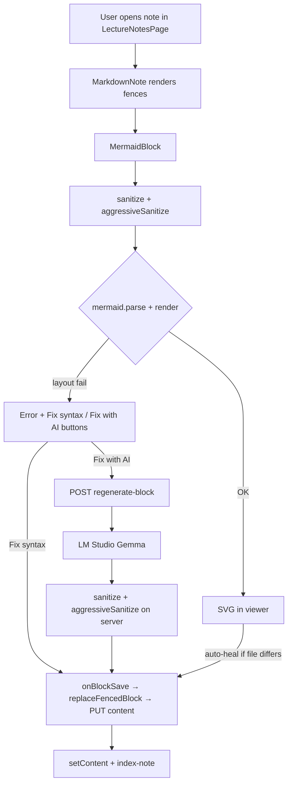
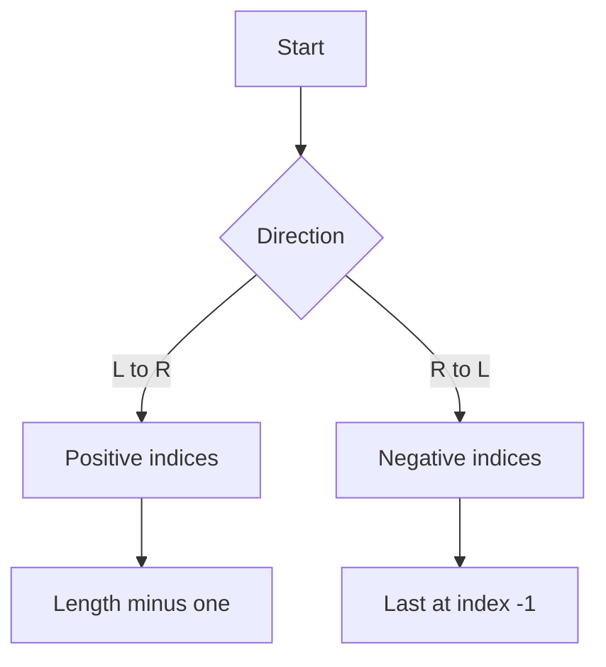

# Mermaid Render & Regen — Agent Handoff

**Project:** Cognitive-Aware Learning Tutor  
**Route:** `http://localhost:5173/lecture-notes`  
**Updated:** 2026-06-24  
**Companion:** [MERMAID_CODE_REFERENCE.md](./MERMAID_CODE_REFERENCE.md) (code excerpts) · [STUDY_LIBRARY_MERMAID_FILE_MAP.md](./STUDY_LIBRARY_MERMAID_FILE_MAP.md) (one-line file index)

---

## 1. What this system does

Study Library lecture notes contain fenced ` ```mermaid ` blocks. The pipeline has **three layers**:

| Layer | Tool | Needs LLM? |
|-------|------|------------|
| **Render** | Browser Mermaid.js + sanitizers | No |
| **Fix syntax** | `sanitizeMermaidSource` + `aggressiveSanitizeMermaidSource` | No |
| **Fix with AI** | `POST /api/transcripts/library/regenerate-block` → LM Studio / Gemma | Yes |

**Default local LLM:** LM Studio at `http://127.0.0.1:1234`, model `google/gemma-4-e4b`.

---

## 2. End-to-end flow (webpage + local LLM)



### User actions in UI

| Button | Location | What happens |
|--------|----------|--------------|
| **Fix syntax** | Mermaid block toolbar | Local sanitize only → save block |
| **Fix with AI** | Mermaid block toolbar | LLM fix → server sanitize → save block |
| **Edit** → **Regenerate diagram** | Block edit mode | LLM polish mode |
| **Fix syntax (no AI)** | Viewer header | `repair-all-blocks` with `use_llm: false` |
| **Fix all blocks** | Viewer header | Batch LLM repair per broken block |

Toolbar lives in `SectionBlockToolbar.tsx`, wired by `useSectionBlockEdit.tsx` on `MermaidBlock.tsx`.

---

## 3. Critical bug fixed — block save index mismatch

**Symptom:** Toast says "Block saved", PUT returns 200, but diagram text on disk **never changes**.

**Cause:** `MarkdownNote.tsx` incremented `blockIndex` for **inline** backticks (`` `W[-1]` ``, `` `np.where()` ``) as well as fenced blocks. Notes with many inline code spans assigned mermaid block index **10** while `replaceFencedBlock()` only counts **fenced** blocks (first mermaid = index **0**).

**Fix (2026-06-24):**

```tsx
// MarkdownNote.tsx — only fenced blocks get an index
code({ className, children, inline }) {
  if (inline) {
    return <code className="...">{children}</code>;
  }
  const blockIndex = blockCounter++;
  // ... MermaidBlock / CodeBlock
}
```

`replaceFencedBlock()` now **throws** if index is out of range instead of silently returning unchanged markdown.

---

## 4. Render pipeline (browser)

### 4.1 Entry

- `MarkdownNote.tsx` → lazy `MermaidBlock.tsx` with `code={fence body}` and `sectionHandlers.blockIndex`.

### 4.2 Sanitize before render

```ts
// MermaidBlock.tsx
function layoutSafeSource(source: string): string {
  return aggressiveSanitizeMermaidSource(sanitizeMermaidSource(source)).trim();
}
```

### 4.3 Mermaid init + render

`mermaidConfig.ts`:

- `ensureMermaidInitialized()` — `securityLevel: "strict"`, flowchart padding, `suppressErrorRendering: true`
- `validateMermaidSource()` — `mermaid.parse()` only
- `renderMermaidSvg()` — render; on failure retry with `aggressiveSanitizeMermaidSource`
- Layout errors surfaced as: *"Diagram layout failed — shorten labels or use Fix with AI"*

### 4.4 Auto-heal on successful preview

If sanitized source renders but differs from note file, `MermaidBlock` calls `onBlockSave` once to persist the healed diagram (no AI).

---

## 5. Regen / fix pipeline (local LLM)

### 5.1 Frontend API call

```ts
// transcriptsClient.ts
await fetch(`${BASE}/api/transcripts/library/regenerate-block`, {
  method: "POST",
  body: JSON.stringify({
    block_type: "mermaid",
    language: "mermaid",
    content: blockContent,
    error: renderError,
    mode: "fix", // or "polish" in edit mode
    note_context: "...",
    llm_provider: "lmstudio",
    llm_base_url: "http://127.0.0.1:1234",
    llm_model: "google/gemma-4-e4b",
  }),
});
```

LLM prefs stored in `localStorage` key `lecture-notes:llm` (`loadLlmPrefs` / `saveLlmPrefs`). One-time migration from `gemini` → `lmstudio` + Gemma model.

### 5.2 Backend handler

`backend/transcripts/router.py` → `regenerate_note_block()` → `block_regenerate.regenerate_block()`.

Logs example:

```
regenerate-block type=mermaid mode=fix provider=lmstudio model=google/gemma-4-e4b base=http://127.0.0.1:1234
```

### 5.3 LLM call (LM Studio)

`backend/core/ollama_client.py` → `_lmstudio_generate()`:

- POST `{base}/api/v1/chat`
- Payload: `{ model, input, system_prompt, reasoning: "off" }`
- Retries without `reasoning` if 400
- Parses `output[].content` from response

### 5.4 Post-LLM sanitize (always)

```python
# block_regenerate.py
cleaned = sanitize_mermaid_source(cleaned)
cleaned = aggressive_sanitize_mermaid_source(cleaned)
```

Even when Gemma returns `W[-1]` or long labels, the server rewrites to layout-safe form before the frontend saves.

### 5.5 Save block to disk

```tsx
// LectureNotesPage.tsx — handleBlockSave
const base = repairNoteMarkdown(content);
const blockBody = aggressiveSanitizeMermaidSource(sanitizeMermaidSource(newBlockContent));
const updated = replaceFencedBlock(base, blockIndex, blockBody);
await saveNoteContent(selectedNote, updated); // PUT .../library/files/{path}/content
setContent(updated);
void indexNote(selectedNote);
```

---

## 6. Sanitization rules (shared Python + TypeScript)

Both implementations must stay in sync:

| File | Role |
|------|------|
| `backend/transcripts/mermaid_strict.py` | Source of truth + `MERMAID_GENERATION_RULES` for LLM prompts |
| `backend/transcripts/cleanup.py` | Re-exports for notes pipeline |
| `src/components/study/mermaidSanitize.ts` | Browser mirror |

### Common fixes

- `B -- label --> C` → `B -->|label| C`
- `B(label)` stadium → `B["label"]`
- `F & G --> H` → two edges
- `W[-1]` in labels → `index -1`
- `...` in labels → `etc`
- `B{"Direction"}` → `B{Direction}`

### Aggressive pass (layout failures)

For Direction + Index diagrams, replaces entire source with canonical short form:



---

## 7. Environment setup

### `.env` (project root)

```env
OLLAMA_ENABLED=1
OLLAMA_URL=http://127.0.0.1:1234
OLLAMA_MODEL=google/gemma-4-e4b
LLM_PROVIDER=lmstudio
```

### Start stack

```bat
run.bat
rem or: scripts\run_backend.bat + scripts\run_frontend.bat
```

1. Load **google/gemma-4-e4b** in LM Studio; start server on port **1234**.
2. Open Study Library → header shows provider/model and reachability.
3. `GET /api/transcripts/llm-config?llm_provider=lmstudio&llm_base_url=http://127.0.0.1:1234&llm_model=google/gemma-4-e4b` → `"reachable": true`.

### UI LLM picker

`LectureNotesPage.tsx` header: Provider (lmstudio / gemini / ollama), Base URL, Model. Changes persist to localStorage and refresh `llmConfig`.

---

## 8. Known failure patterns

### Parse errors (syntax)

Stadium nodes, legacy `-- label -->` edges, unquoted `arr[i]` in labels. **Fix syntax** usually enough.

### Layout errors (parse OK, render fails)

Long comma lists, `...`, `W[-1]`, `|Left to Right|`. **Aggressive sanitize** or **Fix with AI** (server still runs aggressive pass).

### LM Studio returns 200 but diagram still broken in logs

LM Studio console shows **raw model output**. Sanitization runs **after** in `block_regenerate.py`. Check saved `.md` file, not LM Studio log.

### Fix with AI disabled

`SectionBlockToolbar` disables AI when `llmReachable === false`. **Fix syntax** still works. Set `OLLAMA_ENABLED=1` and start LM Studio.

---

## 9. Tests

```bat
npx vitest run tests/test_mermaid_sanitize.test.ts tests/test_note_block_utils.test.ts
python -m pytest tests/test_mermaid_strict.py tests/test_note_block_repair.py tests/test_block_regenerate.py -q
```

---

## 10. Manual QA checklist

1. Open `live_captions_20260623_204143_20260624_030551.md` (or any note with indexing mermaid).
2. Broken diagram shows error; error `<pre>` shows **sanitized** source (not raw file).
3. Click **Fix syntax** → diagram renders; file on disk has no `W[-1]` in that fence.
4. Click **Fix with AI** (LM Studio running) → same outcome; backend log shows regenerate-block 200.
5. Reload page → fix persists.
6. Note with inline `` `code` `` before mermaid → save still targets correct fence (block index 0 for first mermaid).

---

## 11. API quick reference

| Method | Path | Purpose |
|--------|------|---------|
| GET | `/api/transcripts/llm-config` | Reachability + defaults |
| PUT | `/api/transcripts/library/files/{path}/content` | Save note markdown |
| POST | `/api/transcripts/library/regenerate-block` | Single block LLM fix |
| POST | `/api/transcripts/library/repair-all-blocks` | Batch fix (`use_llm` true/false) |
| POST | `/api/transcripts/index-note` | Re-index KG after save |

---

## 12. Related docs

- [MERMAID_CODE_REFERENCE.md](./MERMAID_CODE_REFERENCE.md) — copy-paste code by layer
- [STUDY_LIBRARY_MERMAID_SAMPLE_BROKEN.md](./STUDY_LIBRARY_MERMAID_SAMPLE_BROKEN.md) — test fixtures
- [STUDY_LIBRARY_MERMAID_HANDOFF.md](./STUDY_LIBRARY_MERMAID_HANDOFF.md) — earlier report (partially superseded)

---

*Give the next agent this file + MERMAID_CODE_REFERENCE.md + the broken sample note path.*
