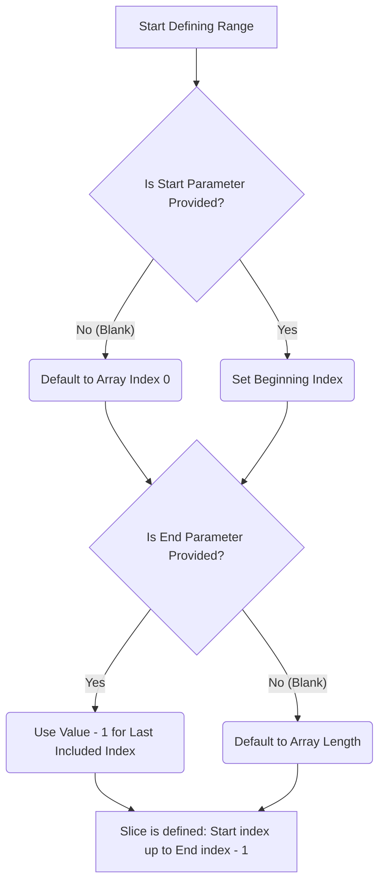

# Study Library — Mermaid / Code Block AI Fix — Handoff Report

**Project:** Cognitive-Aware Learning Tutor  
**Area:** Lecture Notes / Study Library (`/lecture-notes`)  
**Date:** 2026-06-24  
**Status:** Partially implemented locally; **many files uncommitted**; user reports **no visible “Fix with AI” button**

---

## 1. User problem (verbatim summary)

1. Mermaid diagrams in generated lecture notes fail to render with parse errors.
2. Python code blocks show `undefined` or fail in Pyodide (`numpy` not loaded).
3. User expects **“Fix with AI”** on each mermaid/code block and **automatic batch fix** via Gemma/Ollama.
4. User **cannot find Fix with AI** anywhere in the UI and wants this fixed or documented for another AI.

---

## 2. Where buttons are supposed to appear

| UI location | Button | When visible |
|-------------|--------|--------------|
| **Note viewer** (read mode, single note) | **Edit** + **Fix with AI** on each `mermaid` / `python` fenced block header | Only if `sectionEdit` is wired AND `canRegenerate === true` |
| **Note viewer header** | **Fix all blocks** | Only if `canRepairAllBlocks === true` AND note selected AND not in full-note edit mode |
| **Full note Edit mode** (split markdown editor) | **Fix mermaid** / **Fix python** after text selection | Only if `canRegenerateSelection === true` |
| **Mermaid block edit mode** | **Regenerate diagram** | Same as block toolbar when editing block |

**Route:** `http://localhost:5173/lecture-notes` (plugin path `lecture-notes` in `src/plugins/core_plugins.tsx`).

---

## 3. Root cause — why buttons disappear (CRITICAL)

In `src/pages/study/LectureNotesPage.tsx`:

```tsx
canRegenerate: Boolean(llmConfig?.reachable),
canRepairAllBlocks: Boolean(llmConfig?.reachable),
canRegenerateSelection: Boolean(llmConfig?.reachable),
```

`llmConfig.reachable` comes from `GET /api/transcripts/llm-config` → `backend/core/ollama_client.py` → `llm_reachable()`.

**`llm_reachable()` returns `false` when ANY of these is true:**

1. `OLLAMA_ENABLED` is not `1` in `.env` (default in `backend/config.py` is **`ollama_enabled: bool = False`**).
2. LM Studio / Ollama is not running at `OLLAMA_URL`.
3. Health check fails (`/api/v1/models` for lmstudio, `/api/tags` for ollama) within 4s.

When `reachable === false`:

- **`SectionBlockToolbar` does not render “Fix with AI” at all** (`canRegenerate && (...)` in `SectionBlockToolbar.tsx`).
- **“Fix all blocks” is not rendered** (`canRepairAllBlocks && ...` in `StudyLibraryViewer.tsx`).
- **Selection regenerate bar is hidden** in markdown editor.

**Edit** on blocks may still show (does not depend on `canRegenerate`).

### Recommended fix for next AI

1. **Always show** Fix with AI / Fix all blocks; **disable** with tooltip when LLM offline (don’t hide).
2. **Local sanitize** (`mermaidSanitize.ts`) should run **without LLM** — buttons for “Apply syntax fix” should not require `reachable`.
3. Set `OLLAMA_ENABLED=1` in `.env` and ensure LM Studio is running with model `google/gemma-4-e4b` (or user’s Gemma).

---

## 4. Architecture (data flow)

```
LectureNotesPage
  ├─ llmConfig from GET /api/transcripts/llm-config
  ├─ sectionEdit { onBlockSave, onBlockRegenerate, canRegenerate }
  └─ StudyLibraryViewer
        ├─ Header: Fix all blocks → POST /api/transcripts/library/repair-all-blocks
        └─ MarkdownNote (read) OR MarkdownNoteEditor (edit)
              └─ MermaidBlock / PythonCodeBlock / CodeBlock
                    └─ useSectionBlockEdit → SectionBlockToolbar (Edit, Fix with AI)
                          └─ POST /api/transcripts/library/regenerate-block
```

### Backend endpoints

| Method | Path | Purpose |
|--------|------|---------|
| GET | `/api/transcripts/llm-config` | `{ reachable, provider, base_url, model }` |
| POST | `/api/transcripts/library/regenerate-block` | Fix single fenced block |
| POST | `/api/transcripts/library/regenerate-selection` | Fix arbitrary markdown selection |
| POST | `/api/transcripts/library/repair-all-blocks` | Sanitize all mermaid + LLM fix broken/empty blocks one-by-one |

### LLM client

- `backend/transcripts/block_regenerate.py` — prompts + `regenerate_block()`, `regenerate_selection()`
- `backend/transcripts/note_block_repair.py` — `repair_all_blocks()` batch repair
- `backend/transcripts/cleanup.py` — `sanitize_mermaid_source()` server-side mirror of frontend sanitizer
- `backend/core/ollama_client.py` — Ollama/LM Studio HTTP client

---

## 5. File map (implementations)

### Frontend — rendering & tools

| File | Role |
|------|------|
| `src/pages/study/LectureNotesPage.tsx` | Wires `sectionEdit`, LLM gating, handlers |
| `src/components/study/StudyLibraryViewer.tsx` | Note viewer, Edit mode, **Fix all blocks** header button |
| `src/components/study/MarkdownNote.tsx` | Renders markdown; passes `sectionHandlers` to blocks |
| `src/components/study/MermaidBlock.tsx` | Mermaid render + block toolbar |
| `src/components/study/PythonCodeBlock.tsx` | Pyodide runner + toolbar |
| `src/components/study/CodeBlock.tsx` | Generic code + toolbar |
| `src/components/study/SectionBlockToolbar.tsx` | **Edit / Fix with AI / Save block** UI |
| `src/components/study/useSectionBlockEdit.tsx` | Edit/regenerate state; local sanitize before LLM |
| `src/components/study/mermaidSanitize.ts` | **Local syntax fix** (edge labels, stadium, arr[i]) |
| `src/components/study/markdownRepair.ts` | Fence repair, step-code wrap |
| `src/components/study/noteBlockUtils.ts` | Block index, context extraction, selection expand |
| `src/components/study/MarkdownNoteEditor.tsx` | Full-note edit + selection regenerate |
| `src/components/study/useSelectionRegenerate.tsx` | Selection bar + accept/rollback |
| `src/components/study/pyodideRunner.ts` | Auto-load numpy on Run |
| `src/api/transcriptsClient.ts` | API client for regenerate/repair |

### Backend

| File | Role |
|------|------|
| `backend/transcripts/router.py` | API routes (regenerate-block, regenerate-selection, repair-all-blocks) |
| `backend/transcripts/block_regenerate.py` | LLM prompts for mermaid/code (**untracked in git at handoff**) |
| `backend/transcripts/note_block_repair.py` | Batch repair (**untracked**) |
| `backend/transcripts/cleanup.py` | `sanitize_mermaid_source`, postprocess |
| `backend/core/ollama_client.py` | `llm_reachable()`, `ollama_generate()` |
| `backend/config.py` | `ollama_enabled` default **False** |

### Tests

| File | Covers |
|------|--------|
| `tests/test_mermaid_sanitize.test.ts` | Edge labels, stadium, arr[i] |
| `tests/test_note_block_utils.test.ts` | Block utils, selection context |
| `tests/test_note_block_repair.py` | Batch repair, edge sanitize |
| `tests/test_block_regenerate.py` | Regenerate LLM gate |
| `tests/test_notes_postprocess.py` | Backend mermaid sanitize |

---

## 6. Known Mermaid failure patterns (from user notes)

### Pattern A — Stadium nodes with parentheses

```mermaid
B(Use Python range() / np.arange())
```

**Fix:** `B["Use Python range() / np.arange()"]`

### Pattern B — Edge labels with old syntax

```mermaid
B -- No (Blank) --> D(Default to Array Index 0)
```

**Fix:**

```mermaid
B -->|No (Blank)| D["Default to Array Index 0"]
```

**Bug history:** Sanitizer ran stadium fix *before* edge-label fix and turned `No (Blank)` into `No["Blank"]` inside the edge → parse error `got 'STR'`.

### Pattern C — Ampersand merge

```mermaid
F & G --> H[...]
```

**Fix:** Two lines: `F --> H` and `G --> H`

### Pattern D — Nested brackets

```mermaid
C[Process: arr[i]]
```

**Fix:** `C["Process: arr[i]"]`

---

## 7. Example broken diagram (user’s slicing flow)

**Input (broken):**



**Expected after `sanitizeMermaidSource()`:**

```mermaid
flowchart TD
    A[Start Defining Range] --> B{Is Start Parameter Provided?}
    B -->|Yes| C["Set Beginning Index"]
    B -->|No (Blank)| D["Default to Array Index 0"]
    D --> E{Is End Parameter Provided?}
    C --> E
    E -->|Yes| F["Use Value - 1 for Last Included Index"]
    E -->|No (Blank)| G["Default to Array Length"]
    F --> H[Slice is defined: Start index up to End index - 1]
    G --> H[Slice is defined: Start index up to End index - 1]
```

---

## 8. Other issues in logs (not Mermaid UI)

```
Could not load embedding model for KG: Cannot copy out of meta tensor...
```

- From knowledge-graph indexing (`index-note` endpoint).
- Indexing still completes (`Indexed 11 nodes`).
- Separate from Mermaid toolbar; fix in embedding/torch setup if needed.

---

## 9. Environment checklist

```bat
# .env (project root)
OLLAMA_ENABLED=1
OLLAMA_URL=http://127.0.0.1:1234
OLLAMA_MODEL=google/gemma-4-e4b
LLM_PROVIDER=lmstudio
```

1. Start LM Studio (or Ollama) with Gemma loaded.
2. `run.bat` or `scripts\run_backend.bat` + frontend.
3. Open `http://localhost:5173/lecture-notes`.
4. Verify: `curl http://localhost:8000/api/transcripts/llm-config` → `"reachable": true` (with auth cookie or logged-in session).

---

## 10. Git status at handoff (IMPORTANT)

**Much of the Fix-with-AI work is local and uncommitted**, including:

- `?? backend/transcripts/block_regenerate.py`
- `?? backend/transcripts/note_block_repair.py`
- `?? src/components/study/SectionBlockToolbar.tsx`
- `?? src/components/study/mermaidSanitize.ts`
- `?? src/components/study/useSectionBlockEdit.tsx`
- Modified: `LectureNotesPage.tsx`, `StudyLibraryViewer.tsx`, `MermaidBlock.tsx`, `router.py`, etc.

If the user runs an **older build** or another machine without these files, **no Fix with AI UI exists**.

---

## 11. Suggested tasks for next AI (priority order)

### P0 — Make buttons visible

- [ ] Remove `canRegenerate: Boolean(llmConfig?.reachable)` gating for **showing** buttons; use `disabled` + tooltip instead.
- [ ] Show **“LLM offline — syntax-only fix available”** when `reachable === false`.
- [ ] Always show **Edit** on mermaid/python blocks when note is editable.

### P1 — Local fix without LLM

- [ ] On note open or “Fix syntax” click, run `sanitizeMermaidSource` on all mermaid blocks and save (no LLM).
- [ ] `repair_all_blocks(..., use_llm=False)` already sanitizes; expose as **“Fix syntax (no AI)”** button always visible.

### P2 — Batch AI fix

- [ ] **Fix all blocks** calls `POST /api/transcripts/library/repair-all-blocks` sequentially per block.
- [ ] Show progress toast: “Fixing block 2/5…”.

### P3 — LLM config UX

- [ ] Show LLM status in Study Library header (green/red dot).
- [ ] Link to Intelligence Hub LLM settings when offline.

### P4 — Note generation quality

- [ ] Update `backend/transcripts/notes_generator.py` CHUNK_PROMPT with mermaid rules (edge `-->|label|`, no stadium).
- [ ] Optional: import syntax cheatsheet from [mermaid-skill](https://github.com/WH-2099/mermaid-skill) into prompts.

---

## 12. Test commands

```bat
cd "Cognitive-Aware Learning Tutor"
npx vitest run tests/test_mermaid_sanitize.test.ts tests/test_note_block_utils.test.ts
.venv\Scripts\python.exe -m pytest tests/test_note_block_repair.py tests/test_block_regenerate.py tests/test_notes_postprocess.py -q
```

---

## 13. Manual QA script

1. Set `OLLAMA_ENABLED=1`, start LM Studio.
2. Open lecture note with broken mermaid.
3. Confirm block header shows: `mermaid` | **Edit** | **Fix with AI**.
4. Confirm viewer header shows **Fix all blocks**.
5. Click Fix with AI on broken block → diagram renders OR error shown.
6. Open **Edit** (full note) → select inside mermaid → **Fix mermaid** bar appears.
7. Set `OLLAMA_ENABLED=0` → buttons should still **appear** (after P0 fix) but AI actions disabled.

---

## 14. API examples (for debugging)

### Regenerate single block

```http
POST /api/transcripts/library/regenerate-block
Content-Type: application/json
Authorization: Bearer <token>

{
  "block_type": "mermaid",
  "language": "mermaid",
  "content": "flowchart TD\n    B -- No (Blank) --> D(x)",
  "error": "Parse error on line 4...",
  "note_context": "--- Context above ---\n...",
  "mode": "fix",
  "llm_provider": "lmstudio",
  "llm_base_url": "http://127.0.0.1:1234",
  "llm_model": "google/gemma-4-e4b"
}
```

### Repair all blocks

```http
POST /api/transcripts/library/repair-all-blocks
{
  "content": "<full markdown note>",
  "use_llm": true,
  "llm_provider": "lmstudio",
  "llm_base_url": "http://127.0.0.1:1234",
  "llm_model": "google/gemma-4-e4b"
}
```

---

## 15. Contact points in codebase (quick grep)

```bash
rg "Fix with AI" src/
rg "canRegenerate" src/pages/study/
rg "repair-all-blocks" backend/
rg "sanitizeMermaidSource" src/
rg "llm_reachable" backend/
```

---

*End of handoff — give this file + `docs/STUDY_LIBRARY_MERMAID_FILE_MAP.md` to the next AI agent.*
