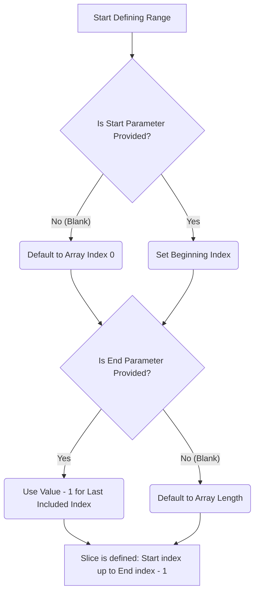

# Sample broken note content (for testing Mermaid/code repair)

Copy into a `.md` file under `data/notes/` or paste into the Lecture Notes editor.

## NumPy slicing flow (user-reported parse errors)

~~~markdown
## Array slicing parameters

When defining a slice, start and end parameters matter.



```python
undefined
```

```python
import numpy as np
W = np.array([1, 2, 3])
print(W)
```
~~~

## Expected failures

| Block | Error / symptom |
|-------|-----------------|
| Mermaid | `Parse error... got 'STR'` on edge `B -- No (Blank) -->` if sanitizer not applied |
| Python 1 | Shows "undefined" / empty block |
| Python 2 | Pyodide `ModuleNotFoundError: numpy` if package not loaded on Run |

## Expected after full repair pipeline

1. Local `sanitizeMermaidSource()` fixes edge labels and stadium nodes.
2. `repair_all_blocks` with LLM fixes anything still broken + empty python block.
3. Pyodide loads numpy on first Run.

## curl test (backend running, auth required)

Replace `<TOKEN>` and paste note body into `content`.

```bash
curl -X POST http://localhost:8000/api/transcripts/library/repair-all-blocks \
  -H "Content-Type: application/json" \
  -H "Authorization: Bearer <TOKEN>" \
  -d "{\"content\": \"...markdown...\", \"use_llm\": true, \"llm_provider\": \"lmstudio\", \"llm_base_url\": \"http://127.0.0.1:1234\", \"llm_model\": \"google/gemma-4-e4b\"}"
```
