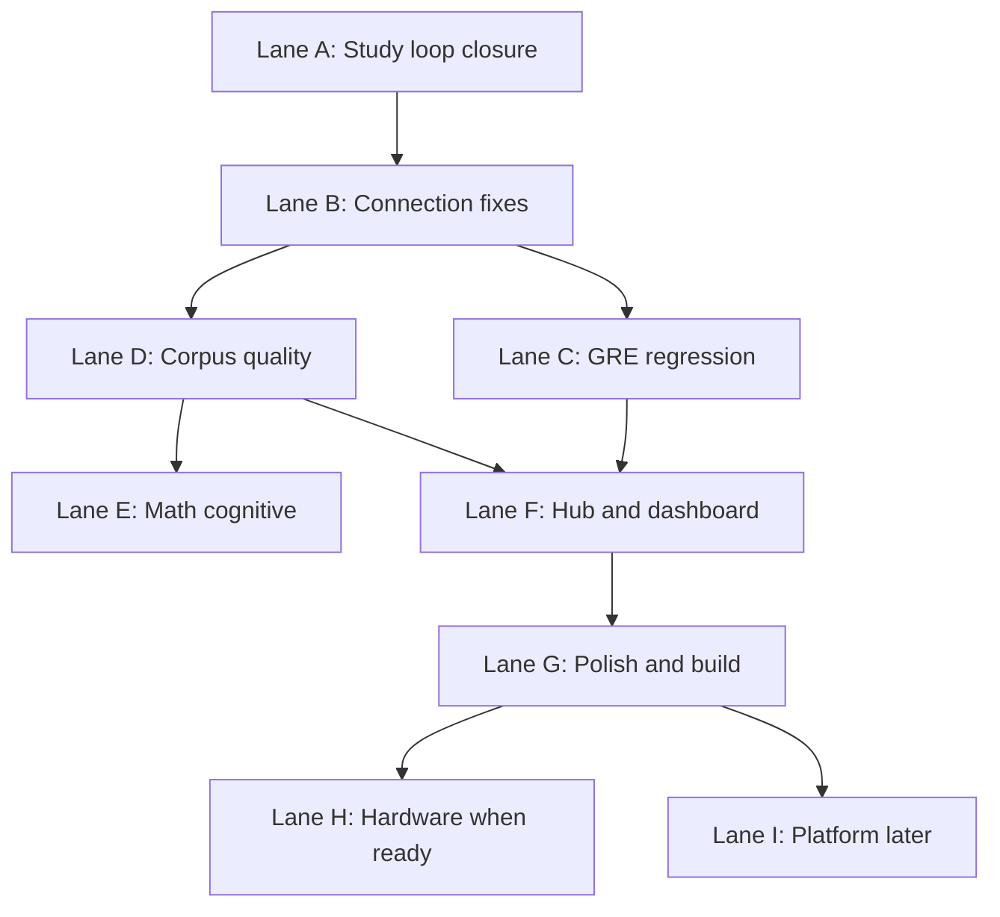

# Task Completion — Polish & Final Build

**Last updated:** 2026-07-19  
**Mode:** **Cape time** — study-loop build is largely shipped; finish verification + polish. See [COMPLETION_SPRINT.md](./COMPLETION_SPRINT.md).  
**Purpose:** Single checklist for finishing connections, closing study loops, verification, and production-ready polish.  
**Architecture context:** [HLD.md](./HLD.md) · [LLD.md](./LLD.md) · [ROADMAP.md](./ROADMAP.md) · [PROJECT_STATUS.md](./PROJECT_STATUS.md)

Use this as the master “what’s left” doc. Check items off as you **verify** them; move blockers to [SESSION_LOG.md](./SESSION_LOG.md).

---

## Cape-time status

| Area | Status |
|------|--------|
| Study Flow orchestrator + stepper UI | **Shipped** — still run A5 once |
| Quiz `next_step` + math Layer 0 | **Shipped** |
| Productivity policy + propose-plan | **Shipped** (bonus lane) |
| Wearables ingest | **Shipped** (bonus; don’t expand) |
| Sprint 4 verify (pytest / build / GRE / A5) | **Open — do next** |
| Sprint 5 polish + PROJECT_STATUS | PROJECT_STATUS refreshed; empty states TBD |

---

## Definition of done — “final build” (local product)

The app is **build-complete for daily personal use** when all of the following are true:

| # | Criterion | Verify |
|---|-----------|--------|
| 1 | `run.bat` starts frontend + backend with `schema_ok: true` | `GET /health` |
| 2 | `npm run build` succeeds | `npm run build` |
| 3 | One full **lecture loop** works without guessing which code path runs | [Lane A](#lane-a--close-the-study-loop-highest-priority) below |
| 4 | GRE cycle works signed-in via API | [Lane C](#lane-c--gre-vocab-regression) |
| 5 | Dashboard shows actionable next step (`StudyLoopWidget` backlog) | `/` with signed-in user |
| 6 | Corpus populated (~3500+ chunks) or documented skip reason | Knowledge Base status |
| 7 | No critical dual-path confusion in UI (one obvious “generate notes” / “start quiz” flow) | Manual walkthrough |
| 8 | Core pytest suite green | `python -m pytest tests/ -q` (integration corpus optional) |

---

## Priority map



---

## Lane A — Close the study loop (highest priority)

**Target contract** (from [HLD.md §8](./HLD.md#8-known-integration-gaps)):

```text
TranscriptSaved → corpus ingest → grounded note → quiz from note → SRS cards → dashboard "N due"
```

### A1. Environment and corpus baseline

- [ ] Set `CORPUS_GROUNDED_NOTES=1` in `.env`; restart backend
- [ ] Run Knowledge Base → **Build** (or `scripts\run_corpus_mml_setup.bat`)
- [ ] Confirm total chunks ≥ ~3500 (`python -m backend.corpus.cli status`)
- [ ] Confirm expected per-book counts match [CORPUS_STATUS.md](./CORPUS_STATUS.md)

### A2. Capture → notes (one canonical path)

- [ ] Pick **one** real lecture transcript for end-to-end QA
- [x] Studio Generate → Done dialog shows corpus handoff chunk counts + Study Library deep link
- [x] Studio overnight auto: Tune + generate + run log (`data/logs/auto_run_*.json`)
- [x] Single-file Studio generate routes through RAG-aware `generate_notes_from_file`
- [x] Web `POST /notes/generate` supports `enrich_visuals` toggle; corpus handoff after save
- [ ] Lecture Notes → **Generate grounded (RAG)** produces note with corpus citations
- [x] Include diagrams toggle (Studio + web); default OFF for overnight / fast mode
- [ ] Document chosen path in UI (tooltip or status line) so user knows which mode ran

**Files:** `backend/transcripts/router.py`, `backend/corpus/grounded_notes.py`, `src/pages/study/LectureNotesPage.tsx`

### A3. Notes → quiz → SRS

- [x] Study Flow / Lecture Notes can start global quiz sessions (`/api/quiz`)
- [ ] From Lecture Notes: **Generate quiz** → launches global quiz or review deck (confirm in A5)
- [ ] Complete quiz → `review_cards` updated (`schedule_after_answer` in `backend/quiz/srs.py`)
- [ ] Weak topics from failures appear in backlog (`weak_topics` in `backlog_summary`)
- [ ] `/review` shows due cards from lecture quiz
- [x] `GET /api/quiz/backlog` exposes `next_step` for `StudyLoopWidget`

**Files:** `backend/transcripts/study_intel.py`, `backend/quiz/handler.py`, `backend/quiz/next_step.py`, `src/components/dashboard/StudyLoopWidget.tsx`, `src/pages/quiz/ReviewHubPage.tsx`

### A4. Dashboard nudge

- [x] `StudyLoopWidget` renders backlog / `next_step` CTA
- [ ] Signed-in user with due cards sees **Review N due** on home dashboard (confirm in A5)
- [ ] User with notes but no quiz sees nudge toward lecture notes or quiz generation
- [ ] `recommended_action` / `next_step` matches real user state

### A5. Manual acceptance test (one lecture)

Run once and check all boxes:

- [ ] Capture or open existing transcript
- [ ] Generate grounded note
- [ ] Confirm corpus chunk count increased (optional: `ingest-lecture` in KB)
- [ ] Generate quiz from note (≥5 questions)
- [ ] Complete quiz (intentionally miss 1–2 for weak-topic boost)
- [ ] Open `/review` — due items present
- [ ] Return to `/` — backlog reflects due count

---

## Lane B — Connection & integration fixes

Architectural debt from [HLD.md](./HLD.md) and [LLD.md §15](./LLD.md#15-legacy-and-dual-path-registry).

### B1. Unify note generation paths

- [ ] When `CORPUS_GROUNDED_NOTES=1` and corpus available, Studio should prefer grounded path (or clear post-generate “ingested N chunks”)
- [ ] Remove or hide legacy summarization entry when grounded is configured (or label “Legacy / no RAG”)
- [ ] Single status API: `GET /api/transcripts/studio-status` already exposes `corpus_grounded_notes` + `corpus_available` — surface in Studio UI

### B2. Quiz API convergence

- [ ] Document when to use `/api/vocab/quiz/adaptive/*` (GRE cycle only) vs `/api/quiz/*` (everything else)
- [ ] Lecture quiz flow uses global quiz only (no accidental vocab adaptive session)
- [ ] Optional later: GRE cycle could call global quiz with `domain=vocab` for one engine

### B3. Guest vs signed-in progress

- [ ] Login prompt on GRE hub when guest has local progress worth migrating
- [ ] Optional: one-time merge guest `localStorage` → API on first login (low priority)
- [ ] Ensure Read Mode uses API when token present (no silent localStorage drift)

**Files:** `src/features/vocab/store/vocabStore.ts`, `src/context/AuthContext.tsx`

### B4. Corpus discoverability

- [ ] Optional: `GET /api/corpus/search?q=…` for debug/Knowledge Base preview (wraps `hybrid_retrieve`)
- [ ] Knowledge Base UI shows last setup log + job status clearly
- [ ] Link from Lecture Notes to Knowledge Base when corpus empty

### B5. Transcript scripts alignment

- [ ] `scripts/run_transcript_to_notes.bat` output lands where `transcripts/router` expects
- [ ] `scripts/run_live_captions_scraper.bat` → transcript folder → Studio or auto-ingest path documented
- [ ] No infinite test loops in transcript/studio automation (see prior session notes)

### B6. Markdown / code in notes

- [ ] Python `#` vs markdown heading conflict handled in render path (`MarkdownNote.tsx`, `note_block_repair.py`)
- [ ] Mermaid blocks render; Fix syntax / regen works per [MERMAID_RENDER_AND_REGEN_HANDOFF.md](./MERMAID_RENDER_AND_REGEN_HANDOFF.md)
- [ ] Code blocks lint on save (`corpus/code_lint.py`, `transcripts/note_lint.py`)

---

## Lane C — GRE vocab regression

Phase 1 marked complete — re-verify before calling build done.

- [ ] Admin login `admin` / `admin123`
- [ ] Admin users list, password reset, word import/export
- [ ] Read Mode: all words, low mastery, due reviews
- [ ] Cycle Mode: full group flow (read → quiz → report → low-mastery)
- [ ] `POST /progress/{id}/read` fires on read step when signed in
- [ ] Hub receives `vocab_quiz_complete` on session complete

**Docs:** [GRE_VOCAB_PHASE1.md](./GRE_VOCAB_PHASE1.md), [FILE_MAP.md](./FILE_MAP.md)

---

## Lane D — Corpus & RAG quality

- [ ] `python -m pytest tests/test_corpus.py -m integration` passes (recall ≥ 0.5 per session log)
- [ ] `python -m backend.corpus.cli build-golden` after full ingest
- [ ] `python -m backend.corpus.cli benchmark` within expected range
- [ ] Golden fixture `tests/fixtures/mml_golden_qa.json` not stale
- [ ] Quiz items cite `source_chunk_id` where applicable (KG observation on failure)
- [ ] Gap-driven lazy ingest (`gap_ingest.py`) tested on one weak topic

**Deferred (not blockers):** LightRAG package, EPUB/pandoc if all books are PDF — see [CORPUS_STATUS.md](./CORPUS_STATUS.md)

---

## Lane E — Math & cognitive pipeline

See [MATH_TUTOR_VISION_PIPELINE.md](./MATH_TUTOR_VISION_PIPELINE.md). Much of 3a is shipped; remaining:

### E1. Software path (no GPU)

- [x] Stuckness heuristic + debounced canvas crop (shipped)
- [x] `AITutorIntervention` on practice page (shipped — update stale [TASKS.md](./TASKS.md) item)
- [x] `POST /api/math/intervention` + DSC log (shipped)
- [ ] Verify intervention cooldown / gamma wiring matches `src/config.ts` in real session
- [ ] `DSC_Kinematics.csv` optional telemetry (not wired)
- [ ] SymPy incomplete-step branch (Phase 3c)

### E2. LLM path (opt-in)

- [ ] Set `OLLAMA_ENABLED=1` on machine with LM Studio/Ollama when ready
- [ ] `keep_alive` policy during math session (VRAM)
- [ ] Socratic guard rejects direct answers (`intervention_handler._hint_passes_socratic_check`)

### E3. Multimodal (later)

- [ ] Real EEG in stuckness weights (sim works today)
- [ ] WebGazer gaze on canvas
- [ ] Face calibration JSON consumed by `face_tracker.py`

---

## Lane F — Hub, dashboard & coach

- [ ] Life Tracker log → Life Clock segments update same day
- [ ] Chrome extension installed → `browser_event` readings → widget
- [ ] AI review card uses insights when `NIM_API_KEY` or local coach available
- [ ] `GET /api/insights/knowledge?q=…` preview matches coach retrieval
- [ ] Plugin toggles sync server ↔ `PluginRegistryProvider`
- [ ] Dashboard layout persists when signed in (`/api/hub/dashboard-layout`)
- [ ] Browser activity dashboard card (backlog item from [TASKS.md](./TASKS.md))

**Files:** `backend/hub/`, `backend/insights/`, `src/pages/HomePage.tsx`

---

## Lane G — Polish & final build

### G1. Build & CI hygiene

- [ ] `npm run build` — fix any TS errors; accept large chunk warning if unchanged
- [ ] `python -m pytest tests/ -q` — core tests green
- [ ] `GET /health` → `schema_ok: true` on fresh `alembic upgrade head`
- [ ] Fresh clone path: [DEPENDENCIES.md](./DEPENDENCIES.md) + `scripts/setup.bat`

### G2. Production-like local config

Create `.env` template or document recommended values:

```env
DEV_MODE=true
JWT_SECRET=<change-for-any-shared-machine>
CORPUS_GROUNDED_NOTES=1
OLLAMA_ENABLED=0
EEG_ENABLED=0
```

- [ ] `EXPOSE_PASSWORD_PLAIN=false` if sharing machine
- [ ] CORS narrowed if deploying beyond localhost (see [DOCKER.md](./DOCKER.md))

### G3. UX polish

- [ ] Empty states: Lecture Notes (no transcripts), Review Hub (no cards), Knowledge Base (no books)
- [ ] Loading/error toasts on corpus setup job polling
- [ ] Consistent glossy panel / navigation labels across study pages
- [ ] Mobile/LAN: `VITE_API_URL` documented for phone on same WiFi ([LLD.md §14](./LLD.md#14-configuration-catalog))

### G4. Documentation sync

- [x] HLD / LLD written ([HLD.md](./HLD.md), [LLD.md](./LLD.md))
- [x] Update [PROJECT_STATUS.md](./PROJECT_STATUS.md) date and “current focus” to cape time / daily use
- [x] [COMPLETION_SPRINT.md](./COMPLETION_SPRINT.md) + [AGENTS.md](../AGENTS.md) shifted to verify → polish
- [ ] Prune stale items in [TASKS.md](./TASKS.md) (intervention mount, etc.)
- [ ] Mark Phase 3a items done in [ROADMAP.md](./ROADMAP.md) where MATH doc says shipped

### G5. Legacy cleanup (low risk, do last)

- [ ] Do not delete `vocab_backend.py` until all scripts point to `backend.main`
- [ ] Keep `UniversalReadMode.jsx` until grep shows zero imports
- [ ] Archive or clearly mark `backend_example.py` in docs only

---

## Lane H — Hardware (when you buy boards)

App side ready; firmware execution only.

- [ ] Flash EEG firmware → UDP `:5005` → `/ws/eeg` → hub `eeg_attention`
- [ ] Flash NutriNode firmware → ingest / live WS
- [ ] Face tracker reads calibration JSON from hub
- [ ] Python UDP spoofer for mock EEG during dev ([TASKS.md](./TASKS.md))

**Docs:** `docs/firmware/`, [HARDWARE_AND_AI_LATER.md](./HARDWARE_AND_AI_LATER.md)

---

## Lane I — Platform (later, not required for personal final build)

- [ ] PostgreSQL + production Docker hardening
- [ ] Community plugin
- [ ] User webhooks / sandbox ingest scripts
- [ ] Cloud API option for hints (no local GPU)
- [ ] BKT / advanced learner modeling (only if product direction changes)

---

## Quick reference — files to touch for loop closure

| Step | Backend | Frontend |
|------|---------|----------|
| Corpus setup | `backend/corpus/library.py`, `router.py` | `LibrarySetupPage.tsx`, `corpusClient.ts` |
| Grounded notes | `backend/corpus/grounded_notes.py` | `LectureNotesPage.tsx` |
| Handoff | `backend/corpus/handoff.py` | Studio Done dialog |
| Quiz from notes | `backend/transcripts/study_intel.py` | `LectureNotesPage.tsx`, `GlobalQuizRunner.tsx` |
| SRS | `backend/quiz/srs.py`, `review_cards.py` | `ReviewHubPage.tsx` |
| Dashboard | `backend/quiz/review_cards.py` `backlog_summary` | `StudyLoopWidget.tsx` |

---

## Suggested work order (cape time)

1. **Today:** Lane A5 one-lecture acceptance + note transcript in SESSION_LOG  
2. **Same session:** Lane C GRE smoke + Lane G1 (`pytest` + `npm run build`)  
3. **Then:** Sprint 5 empty states / leftover G3 only if something feels unfinished  
4. **Hardware / platform / new specs:** parked — `docs/superpowers/plans/` is archive unless you reopen a lane  

---

## Related docs

| Doc | Use |
|-----|-----|
| [COMPLETION_SPRINT.md](./COMPLETION_SPRINT.md) | Cape-time sprint board |
| [SESSION_LOG.md](./SESSION_LOG.md) | Per-session checkoffs |
| [PROJECT_STATUS.md](./PROJECT_STATUS.md) | What’s working today |
| [TASKS.md](./TASKS.md) | Simple kanban (sync with this file periodically) |
| [WORKING_PRODUCT.md](./WORKING_PRODUCT.md) | Daily startup checklist |
| [CORPUS_STATUS.md](./CORPUS_STATUS.md) | Corpus benchmarks & chunk table |
| [TRANSCRIPT_STUDIO_WORKFLOW.md](./TRANSCRIPT_STUDIO_WORKFLOW.md) | Studio capture workflow |
