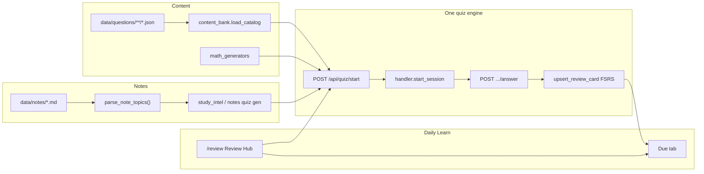
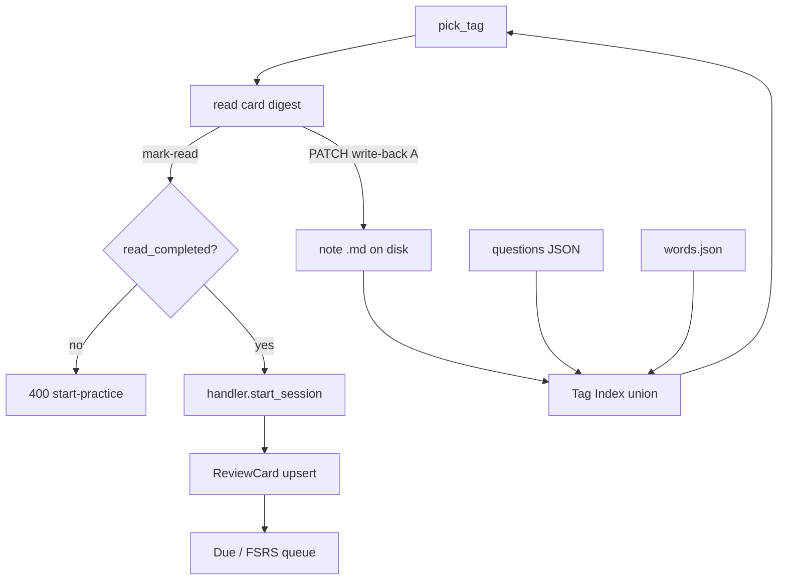

# CALT Study Core — Complete Overview (Claude)

**Export:** 2026-09-03 · **Audience:** Claude Projects / coding chats  
**Status:** Unified quiz + notes + FSRS **shipped**; Study Loop **designed + planned, not implemented**.

**Out of scope:** productivity tracker / distraction gate / wearables / bible ritual / planner hard-block.

---

## 1. Product purpose & stack

Local-first personal study platform. Core loop:

1. Capture / generate **lecture or math notes** as markdown under `data/notes/`.
2. Structure topics with stable IDs (`L{n}-Txx`, `MT{n}-Txx`).
3. **Practice** via one quiz engine (`/api/quiz`) — study MCQ, math, coding, vocab.
4. **Remember** via one SRS store: `ReviewCard` + FSRS.
5. **Daily Learn** at `/review` — today a quiz launcher + due queue; **Study Loop** evolves it into **pick tag → read → practice → due**.

```text
React 18 + Vite 6 + TypeScript + Tailwind 4
        │  HTTP (JWT)
        ▼
FastAPI  backend/main.py
        ▼
SQLite   data/vocab_app.db
+ disk   data/notes/**/*.md
+ disk   data/questions/**/*.json
+ disk   public/data/words.json   (GRE)
```

| Layer | Entry |
|-------|--------|
| Frontend | `src/main.tsx` → `App.tsx` → `AppShell.tsx` |
| Review Hub | `src/pages/quiz/ReviewHubPage.tsx`, `GlobalQuizRunner.tsx` |
| Quiz client | `src/api/globalQuizClient.ts` |
| API | `/api/quiz`, `/api/transcripts`, `/api/math`, `/api/vocab` |
| Paths | `backend/paths.py` → `NOTES_DIR`, `QUESTIONS_DIR`, `WORDS_PATH` |
| Dev | `run.bat` → API `:8000`, Vite `:5173`, `GET /health` |

---

## 2. How the study core works today

### Notes & topics

- Markdown under `data/notes/` (lecture) and `data/notes/math/` (MT tracks).
- Parse: `backend/transcripts/note_topics.py` → `parse_note_topics`, `canonicalize_topic_id` (`l5-t5` → `L5-T05`).
- Gen / lint / library: `notes_generator.py`, `note_lint.py`, `library.py`, `study_intel.py`.
- Heading shape: `## \`L5-T05\` — title` plus a Topic Index near the top of the file.

### Content bank

- Authored JSON: `data/questions/{math,coding}/**/*.json` (Study Loop will add `mcq`, `coding_mcq`).
- Loader: `backend/quiz/content_bank.py` (`load_catalog`, `list_topics`, `build_quiz_items`, `import_content`).
- Schemas: `backend/quiz/content_schemas.py` — topic-level **`note_topic_ids`** stitch to notes.
- Format doc: `docs/QUESTION_CONTENT_FORMAT.md`.

### Quiz handler & FSRS

- Router: `backend/quiz/router.py` prefix `/api/quiz`.
- Session: `handler.start_session` / answer / complete.
- FSRS: `review_cards.upsert_review_card`, `srs.py`, model `backend/models/review_card.py`.
- Orchestration: `GET /api/quiz/backlog` + `next_step` (ADR-001) — **not** `/api/home/summary`.

Domains for `POST /api/quiz/start`: `vocab` | `math` | `study` | `code` | `mixed` | `review` | `deck`.

### Vocab stitch (partial today; full in Study Loop Task 6)

- Prefer `domain=vocab` with `group_number` or `word_ids`.
- Bank: `public/data/words.json`.
- Planned tags: `vocab.group.N` + word `tags[]`.

### Math hybrid (inside `domain=math` only)

When a session is already routed to `domain=math` + `note_topic_id` / `topic_id`, `handler.start_session` prefers:

1. Adaptive aptitude generators (if flagged)  
2. Explicit generator / `math.gen.*`  
3. Curated `content_bank` filtered by `note_topic_id`  
4. Generator fill for the same MT tag  
5. Legacy skill nodes / DB bank  

**ADR-001 “three math lanes”** are product surfaces, not this numbered list:

| Lane | Meaning | Study Loop |
|------|---------|------------|
| SymPy generators | Live / recipe generation + SymPy grade | Used when route = `math` |
| Curated bank | `data/questions/math/**` | Used when route = `math` (or mixed with items) |
| OCR / whiteboard tutor | Future capture → same engine | **Out of Tasks 1–9** |

**Study Loop routing** (Task 5) chooses `vocab` | `math` | `study` | `code` | `mixed` by inspecting content under the tag — lecture `L*` with MCQs must **not** fall into this math chain.

SymPy grading: `backend/math/answer_grade.py`. Generators: `backend/quiz/math_generators.py`. Skill Layer 0: `backend/math/skills*`.

### Coding

- Packs: `data/questions/coding/**`  
- Harness: `backend/quiz/code_runner.py`  
- Browser free-run: `PythonCodeBlock` (Pyodide)  
- Planned: `POST /api/quiz/code/run` (Task 8)

---

## 3. Study Loop design + plan status

**Sources:** `docs/superpowers/specs/2026-09-03-study-loop-design.md`, `docs/superpowers/plans/2026-09-03-study-loop.md`.  
**Approach A:** notes on disk are canonical; read cards are ephemeral views (`{note_path}#{topic_id}`).

| Task | Deliverable | Status |
|------|-------------|--------|
| 1 | Read-card digester + GET APIs (`read_cards.py`) | **Planned** |
| 2 | Write-back PATCH (`note_writeback.py`) | **Planned** |
| 3 | Tag list / add / rename / merge (`tag_index.py`) | **Planned** |
| 4 | Question CRUD + import; `mcq` / `coding_mcq` kinds | **Planned** |
| 5 | Loop session gate → `resolve_practice_route` → `start_session` (`study_loop.py`) | **Planned** |
| 6 | Vocab stitch `vocab.group.N` | **Planned** |
| 7 | Frontend Loop tab (`src/features/quiz/studyLoop/*`) | **Planned** |
| 8 | `POST /code/run` + IDE Run tests | **Planned** |
| 9 | pytest + `npm run build` + SESSION_LOG | **Planned** |

UX states: `pick_tag` → `read` (editable) → `mark-read` → `practice` (`GlobalQuizRunner`) → `due` (FSRS). Vocab-only tags auto-set `read_completed=true`. Escape hatches: Due tab, decks, create deck.

Implement from attached `03-STUDY-LOOP-PLAN-FOR-CLAUDE.md`.

---

## 4. EdTech Implementation Strategy — mapped onto this repo

Source: user RTF *“EdTech App Implementation Strategy”* (cleaned appendix). It is a pedagogical/architectural blueprint **already centered on CALT** (cites our Study Loop exports, mental-math design, ADR paths). Themes → repo judgment:

| Theme from EdTech RTF | Already matches | Adopt / wire | Reject or defer |
|----------------------|-----------------|--------------|-----------------|
| Local-first notes + Study Loop (tag → read → practice → FSRS) | Spec/plan Approach A; ADR-001 one engine | **Ship Tasks 1–9** | — |
| Tag stitch `L*`/`MT*` + content bank + generators | `note_topic_ids`, hybrid math start | Tag index CRUD (Task 3); lecture MCQ packs under `data/questions/mcq/` | Second flashcard DB |
| Forced read-then-practice gate | Designed in spec | Task 5 `study_loop.py` | Gating Due/decks escape hatches |
| Write-back Approach A + mtime 409 | Spec | Task 2 | Parallel card store in SQLite |
| FSRS over SM-2 / “Ease Hell” | **Already** `ReviewCard` + FSRS | Keep tuning weights later if needed | Replacing FSRS with SM-2; second SRS |
| SymPy equivalence grading | `answer_grade.py` | Keep; expand edge cases | LLM-as-judge for closed-form math |
| Hybrid curated + procedural generators | `content_bank` + `math_generators` | Fill coverage gaps per MT/L tags | Exhaustive manual bank only |
| Open/proof self-check → still FSRS | Schema `answer_format=open` | Task 4 fill answers + runner UX | Forcing auto-grade on proofs |
| Python IDE + harness | `code_runner`, Pyodide | Wire `/code/run` (Task 8) | Multi-language IDE this epic |
| CAT QA pillars & weightages (Arithmetic → Modern Math) | MT aptitude notes + curriculum.json direction | Use as **content roadmap** for MT packs / skill nodes; weekly rhythm is owner preference | Hard-coding CAT mock product into quiz engine |
| Mental-math skill ladders (85% / last 20 / RT thresholds) | Layer 0 skills design exists | Content expansion on same checker pattern | New mastery engine / second SRS |
| Deep Knowledge Tracing (DKT/LSTM) student model | — | **Defer** — interesting research; not required for Study Loop MVP; conflicts with “wire don’t migrate” if it becomes a second brain | Shipping DKT as primary orchestrator instead of backlog/`next_step` |
| BKT skill HMM | Mentions as weaker baseline | Defer | Replacing FSRS item scheduling with BKT |
| Six-month CAT timeline / mock weekends | Pedagogy advice | Optional planner *content* later — **not** this pack | Building exam-calendar product in study-core |
| UX: reduce overload, single daily sequence | Motivates Loop tab | Task 7 Loop UI; empty states | Dashboard clutter / competing “home brains” |

**Alignment summary:** The RTF validates our locks (notes canonical, one FSRS, Study Loop gate, SymPy, hybrid math). Treat CAT pillars and spacing science as **curriculum + rationale**. Treat **DKT** as a future research lane, not a Study Loop dependency.

---

## 5. Architecture diagrams

### Shipped flow



### Study Loop target (Approach A)



---

## 6. Key APIs

### Shipped

| Method | Path | Role |
|--------|------|------|
| GET | `/api/quiz/backlog` | Due counts + `next_step` |
| GET | `/api/quiz/review/due` | Due cards |
| GET | `/api/quiz/content/catalog` | Content-bank topics |
| POST | `/api/quiz/content/import` | Seed ReviewCards from bank |
| POST | `/api/quiz/start` | `{ domain, config }` |
| GET/POST | `/api/quiz/{id}/question` / `answer` / `complete` | Session |
| CRUD | `/api/quiz/decks` | Custom decks |

### Planned (`/api/quiz/...`)

| Area | Paths |
|------|-------|
| Tags | `GET/POST /study-loop/tags`, `PATCH .../tags/{tag}`, `POST .../tags/merge` |
| Read cards | `GET /study-loop/read-cards`, `GET/PATCH .../read-cards/{card_id}` |
| Questions | `GET/POST /study-loop/questions`, `PATCH/DELETE .../{id}`, `POST .../import` |
| Loop session | `POST /study-loop/sessions`, `.../mark-read`, `.../start-practice`, `GET .../{id}` |
| Code | `POST /code/run` |

---

## 7. Code excerpts (anchors)

### Content bank filter + build

```python
# backend/quiz/content_bank.py — list_topics / build_quiz_items
# Filter catalog topics by note_topic_id ∈ topic.note_topic_ids
# build_quiz_items(...) → items ready for handler.start_session
```

### Math hybrid start (conceptual)

```python
# backend/quiz/handler.py — domain == "math"
# curated = content_bank.build_quiz_items(kind="math", note_topic_id=...)
# if short: extend with math_generators.generate_quiz_items(note_topic_id=...)
```

### FSRS upsert

```python
# backend/quiz/review_cards.py — upsert_review_card(...)
# find-or-create ReviewCard → srs.schedule_after_answer → commit
```

### Topic canonicalize

```python
# backend/transcripts/note_topics.py
# canonicalize_topic_id: l5-t5 / MT1-T7 → L5-T05 / MT1-T07
# parse_note_topics(material) → NoteTopic(topic_id, title, body, source)
```

### Schema stitch field

```python
# backend/quiz/content_schemas.py — ContentTopic.note_topic_ids: list[str]
# must look like L4-T02 or MT1-T02; empty math answer → answer_format=open
```

Full worked JSON + note sections: see `02-NOTES-QUESTIONS-AND-SCHEMAS.md`.

---

## 8. Improvement opportunities (after / with Study Loop)

1. Ship Tasks 1–2 — editable read cards without a second store.  
2. Tag rename/merge safety (reject automatic merge of two note topics).  
3. `mcq` / `coding_mcq` in `CONTENT_KINDS`; open-answer fill UX.  
4. Forced read→practice; **`resolve_practice_route`** (content-inspected domains — never hardcode non-vocab → math).  
5. Vocab groups as first-class tags.  
6. Loop tab empty states (notes but 0 questions → import/generate CTA); optional TagPicker sort `due_count × pillar_weight`.  
7. Wire `/code/run`; harness results beside Pyodide.  
8. Strengthen note→quiz grounding (`prefer_notes`, lint tests).  
9. Lecture coverage: prefer `data/questions/mcq/` packs tagged with `L*`.  
10. Tag rename/merge **rewrites question JSON on disk**; fence-aware write-back; atomic IO + `source_stamp`.  
11. **Do not** add DKT/BKT as a parallel orchestrator until Study Loop + FSRS UX are solid.  
12. **Do not** resurrect Study Flow RAG or `/api/home/summary`.

---

## 9. If changing X, open Y

| Change | Open |
|--------|------|
| Note topic parsing / IDs | `backend/transcripts/note_topics.py` |
| Note generate / lint / save | `notes_generator.py`, `note_lint.py`, `library.py` |
| Lecture quiz from notes | `study_intel.py` + generation rules |
| Content-bank load / filter / seed | `backend/quiz/content_bank.py` |
| Question JSON shape | `content_schemas.py`, `docs/QUESTION_CONTENT_FORMAT.md` |
| Start / grade session | `handler.py`, `router.py` |
| FSRS | `review_cards.py`, `srs.py` |
| Math generators | `math_generators.py` |
| SymPy grade | `backend/math/answer_grade.py` |
| Coding harness | `code_runner.py` |
| Study Loop (planned) | `read_cards.py`, `note_writeback.py`, `tag_index.py`, `question_crud.py`, `study_loop.py` |
| Review Hub UI | `ReviewHubPage.tsx`, `GlobalQuizRunner.tsx` |
| Study Loop UI (planned) | `src/features/quiz/studyLoop/*` |
| Architecture lock | `docs/decisions/ADR-001-quiz-practice-orchestration.md` |
| Spec / full plan (in-repo) | `docs/superpowers/specs/2026-09-03-study-loop-design.md`, `…/plans/2026-09-03-study-loop.md` |

---

## 10. ADR-001 locks (cite)

- Backlog-first `next_step` (not `/api/home/summary`).  
- One quiz session shape (`payload.items` for multi-Q math).  
- One FSRS for mastered/practiced items.  
- Three math **product** lanes: SymPy generators · curated bank · OCR/whiteboard tutor (OCR not in Study Loop MVP). The **5-step** order applies only after a session is already `domain=math`.  
- Study Loop inherits: wire don’t migrate; practice through `handler.start_session` after **content-inspected** domain resolution.

---

*Companion files: `00-CLAUDE-PROJECT-INSTRUCTIONS.md`, `02-…`, `03-…`, optional `appendix-edtech-strategy.md`.*
