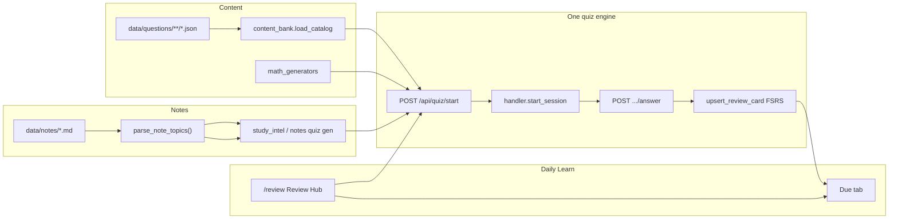
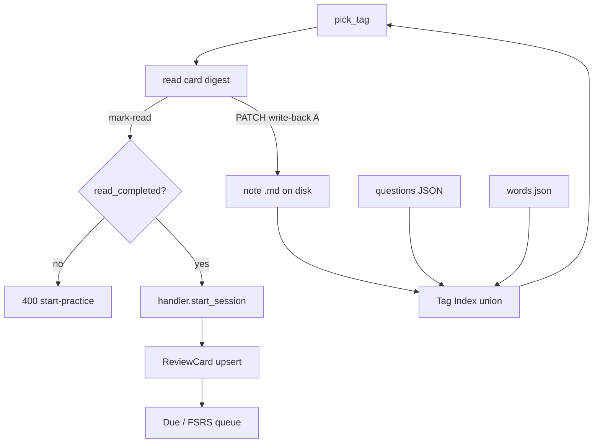

# Cognitive-Aware Learning Tutor — Study Core Architecture & Study Loop

**Export date:** 2026-09-03  
**Audience:** external engineers, product researchers, and research AIs  
**Scope:** lecture notes, math notes, question banks, unified quiz engine, ReviewCards / FSRS, and the approved **Study Loop / Daily Learn** design.  

**Out of scope for this export:** productivity desktop tracker, distraction gate/blocking, wearables, bible morning ritual, planner hard-block UX.

---

## 1. Product purpose

Local-first personal study platform. Core learning loop:

1. **Capture / generate lecture or math notes** as markdown under `data/notes/`.
2. **Structure topics** with stable IDs (`L{n}-Txx` lecture, `MT{n}-Txx` math).
3. **Practice** via one quiz engine (`/api/quiz`) across study MCQ, math, coding, vocab.
4. **Remember** via one spaced-repetition store: SQLAlchemy `ReviewCard` + FSRS.
5. **Daily Learn** surface at `/review` — today a quiz launcher + due queue; **Study Loop** evolves it into **pick tag → read → practice → due**.

Adjacent domains kept working but not expanded in this export: GRE Cycle adaptive shims (should prefer `/api/quiz` domain=`vocab`), math skill Layer 0 + SymPy grading, Lecture Notes Studio.

---

## 2. Stack map

```text
React 18 + Vite 6 + TypeScript + Tailwind 4
        │  HTTP (JWT)
        ▼
FastAPI  backend/main.py  (modular routers)
        │
        ▼
SQLite   data/vocab_app.db   (users, quiz sessions, ReviewCards, decks, …)
+ disk   data/notes/**/*.md
+ disk   data/questions/**/*.json
+ disk   public/data/words.json   (GRE bank)
```

| Layer | Path / entry |
|-------|----------------|
| Frontend entry | `src/main.tsx` → `src/app/App.tsx` → `src/layout/AppShell.tsx` |
| Review Hub UI | `src/pages/quiz/ReviewHubPage.tsx`, `src/features/quiz/GlobalQuizRunner.tsx` |
| Quiz API client | `src/api/globalQuizClient.ts` |
| Production API | `backend/main.py` mounts `/api/quiz`, `/api/transcripts`, `/api/math`, `/api/vocab`, … |
| Paths | `backend/paths.py` → `NOTES_DIR`, `QUESTIONS_DIR`, `WORDS_PATH` |
| Dev | `run.bat` → API `:8000`, Vite `:5173`, `GET /health` |

---

## 3. Domain map (exact paths)

### 3.1 Notes (lecture + math)

| Concern | Location |
|---------|----------|
| Markdown notes | `data/notes/` (e.g. `L05_pandas_operations_notes.md`, `math/MT1_aptitude_interview_notes.md`) |
| Generation / library / lint | `backend/transcripts/` (`notes_generator.py`, `library.py`, `note_lint.py`, `study_intel.py`) |
| Topic parse | `backend/transcripts/note_topics.py` → `parse_note_topics`, `canonicalize_topic_id` |
| Notes API | `/api/transcripts` (router: `backend/transcripts/router.py`) |
| Generation rules | `data/notes/rules/NOTES_GENERATION_RULES.md`, `backend/transcripts/generation_rules.py` |

### 3.2 Quiz / SRS

| Concern | Location |
|---------|----------|
| Router | `backend/quiz/router.py` prefix `/api/quiz` |
| Session start / answer / complete | `backend/quiz/handler.py` |
| FSRS ReviewCards | `backend/quiz/review_cards.py`, model `backend/models/review_card.py` |
| SRS math | `backend/quiz/srs.py` |
| Next-step / backlog | `backend/quiz/next_step.py`, `GET /api/quiz/backlog` |
| Frontend runner | `GlobalQuizRunner` + Review Hub tabs (Start / Due / Decks / Create / Results) |

### 3.3 Content bank

| Concern | Location |
|---------|----------|
| Authored JSON | `data/questions/{math,coding}/**/*.json` |
| Loader / catalog | `backend/quiz/content_bank.py` |
| Schemas | `backend/quiz/content_schemas.py` |
| Format doc | `docs/QUESTION_CONTENT_FORMAT.md` |
| Curriculum roadmap | `data/questions/math/curriculum.json` |

### 3.4 Math

| Concern | Location |
|---------|----------|
| Math tutor / skills | `backend/math/` (`skills.py`, `skills.json`, generators, SymPy `answer_grade.py`) |
| Hybrid generators | `backend/quiz/math_generators.py` (mathgenerator recipes tagged with `note_topic_ids`) |
| MT notes | `data/notes/math/` |
| DB bank sync | `content_bank.sync_curated_to_db` → math import services |

### 3.5 Vocab

| Concern | Location |
|---------|----------|
| Prefer for practice | `POST /api/quiz/start` with `domain=vocab` |
| GRE word bank | `public/data/words.json` (`WORDS_PATH`) |
| Legacy adaptive | `/api/vocab/quiz/adaptive/*` — may remain as shim; **must also write ReviewCards** |
| Groups | `group_number` on words; Study Loop will expose `vocab.group.{n}` |

### 3.6 Coding practice

| Concern | Location |
|---------|----------|
| Authored coding packs | `data/questions/coding/**` (folder may be empty until authored) |
| Subprocess harness | `backend/quiz/code_runner.py` |
| Browser free-run | `PythonCodeBlock` (Pyodide) in frontend |
| Planned API | `POST /api/quiz/code/run` (documented; wire in Study Loop Task 8) |

---

## 4. Topic ID conventions & tag stitch

### Canonical note topics

| Pattern | Example | Meaning |
|---------|---------|---------|
| `L{n}-Txx` | `L5-T05` | Lecture *n*, topic *xx* (zero-padded) |
| `MT{n}-Txx` | `MT1-T02` | Math notes track *n*, topic *xx* |

Normalization (`canonicalize_topic_id`): `l5-t5` / `L5-T5` → `L5-T05`.

Heading shape in notes:

```markdown
## `L5-T05` — Unique values: unique(), nunique(), value_counts()
## `MT1-T02` — LCM & HCF
```

Plus a **Topic Index** (table or bullets) near the top of the file for quiz-gen lookup.

### Tag stitch (Study Loop)

Tags are the **union key** across domains — not a second database in v1:

| Kind | ID shape | Source |
|------|----------|--------|
| `note_topic` | `L5-T05`, `MT1-T02` | Note headings via digester |
| `free` | lowercase `[a-z0-9._-]` | Question `tags[]`, vocab word `tags[]`, optional `<!-- tags: -->` |
| `vocab_group` | `vocab.group.N` | All words with `group_number=N` |

A Study Loop tag gathers:

- **Read cards** — note sections whose `topic_id` matches  
- **Questions** — content-bank items where `tag ∈ topic.note_topic_ids` **or** `tag ∈ item.tags`, plus hybrid generators / decks with that topic  
- **Vocab** — words in the group or with that free tag  
- **Due** — existing `ReviewCard` FSRS queue (optionally filter by topic later)

---

## 5. Data flow diagrams

### 5.1 End-to-end today (shipped)



### 5.2 Study Loop target (Approach A)



### 5.3 Practice item resolution (math hybrid)

When `domain=math` and `note_topic_id` / `topic_id` is set, `handler.start_session` prefers:

1. Adaptive aptitude generators (if flagged)  
2. Explicit generator / `math.gen.*` topic  
3. Curated `content_bank` packs filtered by `note_topic_id`  
4. Generator fill for the same MT tag  
5. Legacy skill nodes / DB bank  

---

## 6. Study Loop design (Approach A) — full summary

**Status:** Approved design + implementation plan (not required to be coded for this export).  
**Sources:** `docs/superpowers/specs/2026-09-03-study-loop-design.md`, `docs/superpowers/plans/2026-09-03-study-loop.md`.  
**Extends:** ADR-001 (one engine, one FSRS).

### Problem

`/review` is still a **quiz launcher + due queue**. Owner wants **read cards** digested from notes, **editable with write-back into markdown**, **forced practice after read**, **tag stitch** across lecture/math/vocab/questions, and **CRUD/import** for MCQ / coding / coding-MCQ / open math — without a second flashcard DB or second SRS.

### Principles

1. **Notes canonical** — `data/notes/` is source of truth for read content.  
2. **Tags = stitch** — `note_topic_ids` + free tags + `vocab.group.N`.  
3. **Wire, don’t migrate** — reuse `content_bank`, `note_topics`, `review_cards`, `code_runner`, `handler.start_session`, `library.save_note_content`, `GlobalQuizRunner`, `PythonCodeBlock`.  
4. **One engine** — practice always ends in start → answer → `upsert_review_card`.  
5. **Surface rename** — Daily Learn / Study Loop; evolve Review Hub in place.

### Read-card digest

- Scan `NOTES_DIR` for indexable `.md` (skip `rules/`).  
- `parse_note_topics(body)` → sections.  
- Ephemeral view (no new DB table):

```text
card_id = "{relative_path}::{topic_id}"
# e.g. L05_pandas_operations_notes.md::L5-T05
#      math/MT1_aptitude_interview_notes.md::MT1-T02
```

Fields: `card_id`, `tag`, `title`, `body_markdown`, `heading_markdown`, `note_path`, `mtime`, `source`, `char_count`.

### Write-back (Approach A)

`PATCH` read card with `expected_mtime` → locate section by topic id → preserve heading id → replace body until next ≤-level heading → sync Topic Index title → `sanitize_note_content` → write file → invalidate caches. Conflict → `409`.

### Forced gating

Loop session stores `read_completed`. `start-practice` returns `400` until mark-read **when a read card exists**. Vocab-only / question-only tags auto-set `read_completed=true`. Escape hatches: Due tab, flash decks, create deck (outside the loop).

### Question CRUD / import

Kinds: `mcq`, `math`, `coding`, `coding_mcq`. Write under `data/questions/<kind>/…`, validate with `content_schemas`, `load_catalog(refresh=True)`, optional `seed_content_cards`. Open/empty-answer math: editable to fill `answer`, `solution_steps`, `explanation`; runner uses self-check UX → still upserts FSRS.

### Nine-task plan (implementation map)

| Task | Deliverable | New / key files |
|------|-------------|-----------------|
| 1 | Read-card digester + GET APIs | `backend/quiz/read_cards.py` |
| 2 | Write-back PATCH | `backend/quiz/note_writeback.py` |
| 3 | Tag list / add / rename / merge | `backend/quiz/tag_index.py` |
| 4 | Question CRUD + import + schema kinds | `question_crud.py`, extend `content_schemas` / `content_bank` |
| 5 | Loop session gate → `start_session` | `backend/quiz/study_loop.py` |
| 6 | Vocab stitch `vocab.group.N` | tag_index + study_loop vocab branch |
| 7 | Frontend Loop tab | `src/features/quiz/studyLoop/*`, ReviewHubPage |
| 8 | `POST /code/run` + IDE Run tests | router + `code_runner` + GlobalQuizRunner |
| 9 | pytest + `npm run build` + SESSION_LOG | verification |

### Acceptance highlights

- Edit `L5-T05` read card → updates `L05_pandas_operations_notes.md` on disk.  
- `MT1-T02` lists bank + generator questions with that `note_topic_id`.  
- Practice blocked until mark-read when card exists.  
- Completing practice upserts ReviewCards; Due tab shows them.  
- No second SRS, no Study Flow / corpus RAG resurrection, no `/api/home/summary`.

---

## 7. ADR lock (cite ADR-001)

From `docs/decisions/ADR-001-quiz-practice-orchestration.md`:

| Locked choice | Implication |
|---------------|-------------|
| Backlog-first `next_step` (not `/api/home/summary`) | Orchestration stays on `GET /api/quiz/backlog` + `complete_session` |
| One quiz session shape | Math multi-Q uses `payload.items`; no parallel session table |
| One FSRS | Mastered / practiced items → existing `ReviewCard`; **no second SRS** |
| Three math content lanes | SymPy generators · curated bank · OCR/whiteboard tutor (not auto-scrape textbooks) |
| Start-from-content on Review Hub | Notes / math node → `POST /api/quiz/start` |
| Notes quiz cache | `QuizDeck` + `seed_deck_cards`, not a parallel store |

**Study Loop inherits:** wire don’t migrate; practice always through `handler.start_session`; seed via `seed_content_cards` / `upsert_review_card`.

---

## 8. API surface sketch

### Existing (shipped)

| Method | Path | Role |
|--------|------|------|
| GET | `/api/quiz/backlog` | Due counts + `next_step` |
| GET | `/api/quiz/review/due` | Due cards |
| GET | `/api/quiz/content/catalog` | Content-bank topics |
| POST | `/api/quiz/content/import` | Seed ReviewCards from bank |
| POST | `/api/quiz/content/sync-db` | Curated → math SQLite bank |
| POST | `/api/quiz/start` | `{ domain, config }` → session |
| GET | `/api/quiz/{id}/question` | Current item |
| POST | `/api/quiz/{id}/answer` | Grade + FSRS touch |
| POST | `/api/quiz/{id}/complete` | Finish + next_step |
| CRUD | `/api/quiz/decks` | Custom decks |

Domains for `start`: `vocab` \| `math` \| `study` \| `code` \| `mixed` \| `review` \| `deck`.

### Planned Study Loop (under `/api/quiz`)

| Area | Paths |
|------|-------|
| Tags | `GET/POST /study-loop/tags`, `PATCH /study-loop/tags/{tag}`, `POST /study-loop/tags/merge` |
| Read cards | `GET /study-loop/read-cards`, `GET/PATCH .../read-cards/{card_id}` |
| Questions | `GET/POST /study-loop/questions`, `PATCH/DELETE .../{id}`, `POST .../import` |
| Loop session | `POST /study-loop/sessions`, `.../mark-read`, `.../start-practice`, `GET .../{id}` |
| Code | `POST /code/run` |

---

## 9. Where to improve (concrete backlog)

Aligned with the 9-task plan + known quality gaps:

1. **Ship Tasks 1–2** — digester + Approach A write-back; unlock editable read cards without a second store.  
2. **Ship Task 3** — tag index with rename/merge rules (reject automatic merge of two note topics).  
3. **Ship Task 4** — add `mcq` / `coding_mcq` to `CONTENT_KINDS`; open-answer fill for `no-answer` olympiad/proof items.  
4. **Ship Task 5** — forced read→practice gate; ensure practice reuses hybrid math resolution.  
5. **Ship Task 6** — vocab groups as first-class tags; attach free tags to words.  
6. **Ship Task 7** — Loop tab UX; empty states when tag has notes but 0 questions (CTA import/generate).  
7. **Ship Task 8** — wire `/code/run`; show harness outcomes beside Pyodide free-run.  
8. **Note→quiz grounding** — strengthen `prefer_notes` / topic_loop generation so MCQs cite `L*` bodies (lint + tests in `tests/test_generation_rules.py`).  
9. **Coverage gaps** — many MT topics have generators; lecture topics often lack content-bank MCQ packs (prefer `data/questions/mcq/` over siloed decks).  
10. **Open-answer workflow** — self-check Confident / Still unsure → FSRS; reduce stuck empty-answer bank items.  
11. **Catalog quality** — keep `load_catalog` errors visible; fix duplicate `topic_id` / kind-folder mismatches.  
12. **Do not** resurrect Study Flow / live corpus RAG, second SRS, or `/api/home/summary` as competing brains.

---

## 10. File index — if you need to change X, open Y

| Change | Open |
|--------|------|
| Note topic parsing / IDs | `backend/transcripts/note_topics.py` |
| Note generate / lint / library save | `backend/transcripts/notes_generator.py`, `note_lint.py`, `library.py` |
| Lecture quiz from notes | `backend/transcripts/study_intel.py`, quiz generation rules |
| Content-bank load / filter / seed | `backend/quiz/content_bank.py` |
| Question JSON shape | `backend/quiz/content_schemas.py`, `docs/QUESTION_CONTENT_FORMAT.md` |
| Start / grade session | `backend/quiz/handler.py`, `backend/quiz/router.py` |
| FSRS schedule / due / seed | `backend/quiz/review_cards.py`, `backend/quiz/srs.py` |
| Math generators hybrid | `backend/quiz/math_generators.py` |
| SymPy grade | `backend/math/answer_grade.py` |
| Coding harness | `backend/quiz/code_runner.py` |
| Study Loop (planned) | `read_cards.py`, `note_writeback.py`, `tag_index.py`, `question_crud.py`, `study_loop.py` |
| Review Hub UI | `src/pages/quiz/ReviewHubPage.tsx`, `src/features/quiz/GlobalQuizRunner.tsx` |
| Study Loop UI (planned) | `src/features/quiz/studyLoop/*` |
| Paths | `backend/paths.py` |
| Architecture lock | `docs/decisions/ADR-001-quiz-practice-orchestration.md` |
| Study Loop spec / plan | `docs/superpowers/specs/2026-09-03-study-loop-design.md`, `…/plans/2026-09-03-study-loop.md` |

---

## 11. Representative code excerpts

### 11.1 Content bank — catalog load, filter, build items, seed path

```187:231:backend/quiz/content_bank.py
def load_catalog(*, root: Path | None = None, refresh: bool = False) -> Catalog:
    """Walk ``data/questions/**``. Cached until a file's mtime or the file set changes."""
    base = Path(root) if root else QUESTIONS_DIR
    stamp = (base.as_posix(), _dir_stamp(base))
    if not refresh and _cache["stamp"] == stamp and _cache["catalog"] is not None:
        return _cache["catalog"]

    catalog = Catalog()
    if base.is_dir():
        for kind in CONTENT_KINDS:
            kind_dir = base / kind
            if not kind_dir.is_dir():
                continue
            for path in sorted(kind_dir.rglob("*.json")):
                if not path.is_file() or path.name.startswith("."):
                    continue
                # Meta / roadmap files live beside content (e.g. math/curriculum.json).
                if path.name in {"curriculum.json"} or any(
                    part.startswith("_") for part in path.relative_to(kind_dir).parts
                ):
                    continue
                topic, err = _read_file(path, base)
                # ... validate kind, dedupe topic_id, append ...
    catalog.topics.sort(key=lambda t: (t.kind, t.stage, t.topic_id))
    _cache["stamp"] = stamp
    _cache["catalog"] = catalog
    return catalog
```

```234:310:backend/quiz/content_bank.py
def list_topics(
    *,
    kind: str | None = None,
    track: str | None = None,
    note_topic_id: str | None = None,
    root: Path | None = None,
) -> list[TopicEntry]:
    catalog = load_catalog(root=root)
    want_kind = normalize_kind(kind) if kind else None
    tag = (note_topic_id or "").strip().upper()
    out = []
    for topic in catalog.topics:
        if want_kind and topic.kind != want_kind:
            continue
        if track and topic.track.lower() != track.strip().lower():
            continue
        if tag and tag not in topic.note_topic_ids:
            continue
        out.append(topic)
    return out


def build_quiz_items(
    *,
    kind: str | None = None,
    topic_id: str | None = None,
    count: int | None = None,
    difficulty: str | None = None,
    note_topic_id: str | None = None,
    question_ids: list[str] | None = None,
    shuffle: bool = False,
    root: Path | None = None,
) -> list[dict[str, Any]]:
    """Items ready for ``handler.start_session`` payloads."""
    items = get_questions(...)
    if shuffle:
        items = random.sample(items, k=len(items))
    if count and count > 0:
        items = items[: int(count)]
    return items
```

```367:399:backend/quiz/content_bank.py
def import_content(
    db: Any,
    *,
    user_id: int,
    kind: str | None = None,
    topic_id: str | None = None,
    root: Path | None = None,
) -> dict[str, Any]:
    """Seed FSRS review cards for authored content, grouped by ``topic_id``."""
    from backend.quiz import review_cards as rc_mod
    # ... for each topic:
    #   seed_content_cards(db, domain="code"|"math", topic_id=..., items=topic.items)
```

Normalized math items carry `note_topic_ids` on the **topic**; item tags are separate (`_math_item` / `_coding_item`).

### 11.2 Handler — start session (vocab + math hybrid)

```346:393:backend/quiz/handler.py
def start_session(
    db: Session,
    *,
    user: User,
    domain: str,
    config: dict[str, Any],
) -> dict[str, Any]:
    domain = domain.strip().lower()
    # review / deck branches omitted ...
    if domain == "vocab":
        words = [w for w in load_words(db) if has_usable_meaning(w)]
        group_number = config.get("group_number")
        word_ids = config.get("word_ids") or []
        if word_ids:
            ids = {int(i) for i in word_ids}
            words = [w for w in words if int(w["id"]) in ids]
        elif group_number is not None:
            gn = int(group_number)
            words = [w for w in words if int(w.get("group_number", 0)) == gn]
        # ... create_quiz_session → first vocab question
```

```395:516:backend/quiz/handler.py
    if domain == "math":
        content_topic_id = str(config.get("topic_id") or "").strip() or None
        note_topic_id = str(config.get("note_topic_id") or "").strip() or None
        # Hybrid bank:
        # 0) adaptive core aptitude → mathgenerator only
        # 1) explicit generator / use_generator
        # 2) curated content_bank packs
        # 3) generator fill for MT tag
        # 4) legacy skill nodes / DB bank
        elif content_topic_id or note_topic_id or prefer_topic_ids:
            gathered = cb.build_quiz_items(
                kind="math",
                topic_id=content_topic_id,
                note_topic_id=note_topic_id,
                shuffle=True,
            )
            if len(gathered) < count and note_topic_id:
                extra_gen = mg.generate_quiz_items(
                    db, note_topic_id=note_topic_id, count=count - len(gathered)
                )
                gathered.extend(extra_gen)
            items = gathered[: max(1, count)]
```

Router entry:

```224:234:backend/quiz/router.py
@router.post("/start")
def post_quiz_start(...):
    # body: QuizStartBody { domain, config }
    # → handler.start_session(db, user=user, domain=body.domain, config=body.config)
```

### 11.3 ReviewCards — upsert + content seed

```22:71:backend/quiz/review_cards.py
def upsert_review_card(
    db: Session,
    *,
    user_id: int,
    domain: str,
    item_id: str,
    label: str,
    payload: dict[str, Any],
    correct: bool,
    elapsed_ms: int = 0,
    topic: str | None = None,
    note_path: str | None = None,
    fmt: str = "mcq",
    deck_id: int | None = None,
) -> ReviewCard:
    key = _item_key(domain, item_id, note_path or "")
    # find-or-create ReviewCard ...
    state = srs_mod.srs_from_metadata(json.loads(row.srs_json or "{}"))
    state = srs_mod.schedule_after_answer(state, correct=correct, elapsed_ms=elapsed_ms)
    row.srs_json = json.dumps(srs_mod.srs_to_metadata(state))
    db.commit()
    return row
```

```308:359:backend/quiz/review_cards.py
def seed_content_cards(
    db: Session,
    *,
    user_id: int,
    domain: str,
    topic_id: str,
    topic_title: str,
    items: list[dict[str, Any]],
) -> int:
    """Seed one FSRS topic-pack card for an authored content-bank topic."""
    key = _item_key(domain_s, f"content-{tid}", "")[:200]
    payload = {
        "kind": "topic_pack",
        "id": f"content-{tid}",
        "topic_id": tid,
        "title": topic_title or tid,
        "questions": list(items),
        "source": "content_bank",
    }
    # upsert by item_key; format mcq|code
```

### 11.4 Note topics — canonicalize + parse

```125:132:backend/transcripts/note_topics.py
def canonicalize_topic_id(raw: str) -> str | None:
    """Normalize ``l5-t5`` / ``mt1-t7`` → ``L5-T05`` / ``MT1-T07``."""
    text = (raw or "").strip().strip("`")
    m = re.fullmatch(r"(L|MT)\s*(\d+)\s*[-_]\s*T\s*(\d+)", text, re.IGNORECASE)
    if not m:
        return None
    prefix = "MT" if m.group(1).upper().startswith("MT") else "L"
    return f"{prefix}{int(m.group(2))}-T{int(m.group(3)):02d}"
```

```250:298:backend/transcripts/note_topics.py
def parse_note_topics(
    material: str,
    *,
    topic_ids: list[str] | None = None,
    max_topics: int = 40,
    min_body_chars: int = 40,
    max_body_chars: int = 5500,
) -> list[NoteTopic]:
    """Extract quiz-ready topics from a lecture note.

    Prefers ``L{n}-Txx`` sections. If none exist, falls back to decimal / generic H2+.
    """
    index_titles = parse_topic_index(material)
    sections = _split_markdown_sections(material)
    # ... _parse_heading_identity → NoteTopic(topic_id, title, body, source)
    topics = lid_topics if lid_topics else fallback
    return topics[:max_topics]
```

### 11.5 Code runner — grade submission

```291:311:backend/quiz/code_runner.py
def grade_submission(item: dict[str, Any], response: str) -> tuple[bool, str, dict[str, Any]]:
    """Grade one coding item. Returns ``(correct, feedback, run_payload)``.

    Items without test cases keep the legacy "did you make a real attempt" behaviour so
    LLM-generated code drills from lecture notes still work.
    """
    cases = [c for c in (item.get("test_cases") or []) if isinstance(c, dict)]
    if not cases:
        # substantive attempt vs starter ...
        return correct, feedback, {}
    result = run_test_cases(
        code=response or "",
        # entry_point, setup_code, test_cases from item ...
    )
```

`run_test_cases` runs an isolated Python harness via `subprocess` with timeout; returns per-case `TestOutcome`s.

### 11.6 Schema stitch field (note_topic_ids)

```34:67:backend/quiz/content_schemas.py
class ContentTopic(BaseModel):
    topic_id: str = Field(..., min_length=2, max_length=120)
    title: str = Field(..., min_length=1, max_length=200)
    # ...
    note_topic_ids: list[str] = Field(default_factory=list)

    @field_validator("note_topic_ids")
    @classmethod
    def _note_topics(cls, v: list[str]) -> list[str]:
        # must look like L4-T02 or MT1-T02
```

Empty math `answer` forces `answer_format=open` (self-check / no-answer lane).

---

## 12. How a human / AI should navigate this export

1. Read this file for architecture + Study Loop intent.  
2. Open `02-NOTES-QUESTIONS-EXAMPLE.md` for a concrete note↔question stitch.  
3. Paste `03-DEEP-RESEARCH-PROMPT.md` into Google Deep Research (optionally attach 01+02).  
4. Implement against the plan in-repo; do not invent a second quiz/SRS layer.

---

*End of architecture export.*
