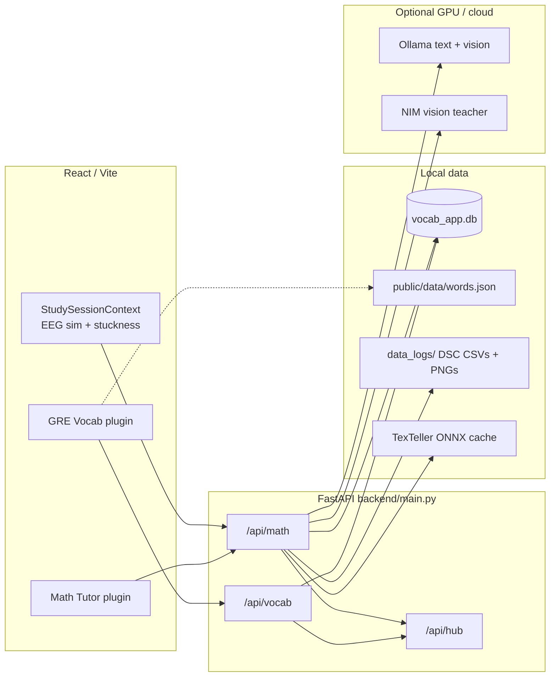

# HLD — GRE vocab + math practice + OCR

High-level design for the GRE prep lane. For full product context see `docs/HLD.md`.

---

## 1. Context



**Principles**

1. Local-first SQLite; JWT for server progress.
2. Graceful degradation: rule tutor without Ollama; guest vocab without auth.
3. Modular monolith — vocab and math are separate routers, shared DB.
4. OCR is CPU-friendly ONNX first; vision LLM only on incomplete / failed OCR.

---

## 2. Bounded contexts

| Context | Owns | Does not own |
|---------|------|--------------|
| **Vocab** | Words, groups, `word_progress`, adaptive quiz sessions, auth JWT | Global lecture quiz / SRS cards |
| **Math bank** | Templates, imported questions, attempts | Lecture corpus |
| **Math tutor** | Rule + Ollama hints, Socratic JSON shape | Notes generation |
| **Math OCR** | Image → LaTeX tiers, hallucination guards, train samples | Face tracker OpenCV GUI conflicts (separate process) |
| **Intervention** | Stuckness trigger, snapshot log, recover/correct | Real EEG hardware (sim only by default) |
| **Hub** | Readings / rollups from vocab + math events | Mastery algorithms |

---

## 3. Canonical loops

### Loop A — GRE vocabulary (complete)

```text
GRE hub → Cycle Manager
  → Read (group) → mark read progress
  → Adaptive quiz
  → Report
  → Low-mastery prompt → Read weak → Quiz again
```

Also: standalone Read modes (`all` / `low-mastery` / `due` / …) on same progress APIs when logged in.

### Loop B — Math practice

```text
Topic → Practice
  → Question from bank / randomizer
  → Whiteboard work
  → Manual Ask tutor (hint)
  → Eval / attempt (when used)
```

### Loop C — Cognitive OCR intervention (partial product polish)

```text
Canvas telemetry (idle, eraser, gamma sim)
  → stuckness score
  → debounced PNG + paths_json
  → OCR tiers → Socratic hint → DSC log
  → optional recover / human-correct LaTeX
```

---

## 4. Contracts designers must respect

### Auth

- Token: `localStorage` key `vocab:auth-token`
- Base: `/api/vocab` (or `VITE_VOCAB_API_BASE`)
- Guest and signed-in progress are **separate** — no automatic merge

### Vocab mastery

- Integer mastery + review scheduling (not BKT)
- Groups of `GROUP_SIZE` (30) words
- Cycle quiz sessions are server-side; invalid id → 404

### Math hint

- Default: `rule_tutor` (deterministic, no GPU)
- Opt-in: `ollama_tutor` when `OLLAMA_ENABLED=1`
- Intervention path must pass Socratic guard (`_hint_passes_socratic_check`)

### OCR

- Prefer ink-only PNG (grid is CSS overlay, not in export)
- Send `paths_json` so backend can `mask_from_paths()`
- Output: LaTeX + confidence + `incomplete_step` + tier used
- Train loop writes `DSC_handwriting_dataset.csv` + `DSC_Kinematics.csv`

### Plugins / routes

| Plugin | Routes |
|--------|--------|
| `gre-vocab` | `/gre-vocab`, `/gre-vocab/read`, `/gre-vocab/read/:mode`, `/gre-vocab/cycle` |
| `math-tutor` | `/math-tutor`, `/math-tutor/topic/:id`, `/math-tutor/practice/:id`, `/math-tutor/train`, `/math-tutor/recognize-test`, `/math-tutor/reports` |

---

## 5. Integration with hub (telemetry)

| Event | Typical source |
|-------|----------------|
| `vocab_quiz_complete` | Adaptive quiz complete |
| `math_attempt` | Practice / eval |
| `face_attention` | Optional `face_tracker` → `/api/vocab/face/status` |

Hub is observational — do not put mastery logic there.

---

## 6. Known gaps (designers)

| Gap | Implication |
|-----|-------------|
| Dual quiz APIs | Cycle ≠ global `/api/quiz` |
| Guest vs API progress | Two stores; document which UI path |
| OCR quality | Scaffold works; digits/equations still need Train tuning |
| Intervention closed-loop | Shipped endpoints; EEG is simulated by default |
| `UniversalReadMode.jsx` | Legacy — use `ReadMode.tsx` only |

---

## 7. Out of scope for this lane

- Corpus RAG lecture notes
- Study-flow orchestrator (`TopicStudyFlowPage`)
- Pomodoro / Life Tracker / NutriNode
- Production PostgreSQL (SQLite default; `DATABASE_URL` later)
